# Architecture · paketti

> Generated by `archof`. The repo's shape: what it's made of and how it's wired.

## Composition (tracked files by type)
```
   4358 wav
   1195 png
    701 xrnc
    248 lua
    210 gif
    133 txt
     49 xrni
     48 md
     20 xml
     15 py
     14 feature
     12 xrdp
```
## Top-level modules (file count · dir)
```
   4426 AKWF
   1337 manual
    701 Themes
     78 images
     55 Presets
     53 Research
     32 Sononymph
     27 ccizer
     18 features
     15 tunings
     15 DeviceChains
     13 rx2
     13 docs
     13 PakettiMCP
     11 .spine
```
## Entry points
```
PakettiMCP/server.lua
Sononymph/App.lua
main.lua
```
## Structural hubs (refs · module — the most-imported = wiring backbone)
```
   11  json
    3  cFilesystem
    2  slaxdom
    2  cValue
    2  cString
    2  cReflection
    1  slaxml
    1  process_slicer
    1  legacy_v2_8_tools
    1  hotelsinus_stepseq
    1  cTable
    1  cParseXML
    1  cNumber
    1  cLib
    1  cFileMonitor
```
## Module → module wiring (count · from → to)
```
3 cParseXML -> slaxdom
2 main -> hotelsinus_stepseq
1 AppMain -> App
1 AppMain -> AppUI
1 AppMain -> cDebug
1 AppMain -> cFileMonitor
1 AppMain -> cLib
1 batch_clean -> json
1 build -> json
1 cConfig -> cFilesystem
1 cConfig -> cParseXML
1 cDebug -> cFilesystem
1 cDocument -> cReflection
1 cFilesystem -> cString
1 cLib -> cNumber
1 cLib -> cValue
1 cNumber -> cValue
1 cParseXML -> slaxml
1 cPersistence -> cReflection
1 cPersistence -> cTable
1 cPreferences -> cFilesystem
1 cProcessSlicer -> main
1 cSandbox -> cString
1 changelog-manual -> json
1 check -> json
1 features -> json
1 functions -> json
1 loop-roundtrip -> json
1 main -> AppMain
1 main -> FormulaDeviceManual
1 main -> Paketti0G01_Loader
1 main -> Paketti35
1 main -> PakettiAKWF
1 main -> PakettiActionSelector
1 main -> PakettiAmigoInspect
1 main -> PakettiArpeggiator
1 main -> PakettiAudioProcessing
1 main -> PakettiAutoSamplify
1 main -> PakettiAutocomplete
1 main -> PakettiAutomateLastTouched
1 main -> PakettiAutomation
1 main -> PakettiAutomationCurves
1 main -> PakettiAutomationStack
1 main -> PakettiBPM
1 main -> PakettiBatchExport
1 main -> PakettiBeatDetect
1 main -> PakettiBeatstructureEditor
1 main -> PakettiBeatsyncSeamless
1 main -> PakettiCCizerLoader
1 main -> PakettiCalculator
1 main -> PakettiCanvasExperiments
1 main -> PakettiCanvasFont
1 main -> PakettiCanvasFontMono
1 main -> PakettiCanvasFontPreview
1 main -> PakettiCaptureLastTake
1 main -> PakettiChebyshevWaveshaper
1 main -> PakettiChords
1 main -> PakettiChordsPlus
1 main -> PakettiClaudeChat
1 main -> PakettiClaudeProbe
1 main -> PakettiClearance
1 main -> PakettiClipboard
1 main -> PakettiCommandWheel
1 main -> PakettiCompat
1 main -> PakettiControls
1 main -> PakettiDeviceChains
1 main -> PakettiDeviceValues
1 main -> PakettiDialogOfDialogsSmokeTest
1 main -> PakettiDigitakt
1 main -> PakettiDynamicMacroToolbar
1 main -> PakettiDynamicViews
1 main -> PakettiEQ30
1 main -> PakettiEXS24Loader
1 main -> PakettiEXS24Parser
1 main -> PakettiEightOneTwenty
1 main -> PakettiEquationCalculator
1 main -> PakettiExecute
1 main -> PakettiExperimental_BlockLoopFollow
1 main -> PakettiExperimental_Verify
1 main -> PakettiFSPath
1 main -> PakettiFileWarehouse
1 main -> PakettiFill
1 main -> PakettiFollowPagePattern
1 main -> PakettiForeignSnippets
1 main -> PakettiFrameCalculator
1 main -> PakettiFuzzySampleSearch
1 main -> PakettiFuzzySearchUtil
1 main -> PakettiGater
1 main -> PakettiGlider
1 main -> PakettiGlobalGrooveToDelayValues
1 main -> PakettiHack
1 main -> PakettiHexSliceLoop
1 main -> PakettiHoldToFill
1 main -> PakettiHyperEdit
1 main -> PakettiIFFLoader
1 main -> PakettiITIExport
1 main -> PakettiITIImport
1 main -> PakettiImageToSample
1 main -> PakettiImport
1 main -> PakettiImpulseTracker
1 main -> PakettiInstrumentBox
1 main -> PakettiInstrumentTranspose
1 main -> PakettiKeyBindings
1 main -> PakettiKeyzoneDistributor
1 main -> PakettiLaunchApp
1 main -> PakettiLoadDevices
1 main -> PakettiLoadPlugins
1 main -> PakettiLoaders
1 main -> PakettiLull
1 main -> PakettiMCPMain
1 main -> PakettiMIDIMappingCategories
1 main -> PakettiMIDIMappings
1 main -> PakettiMODLoader
1 main -> PakettiMPCCycler
1 main -> PakettiMainMenuEntries
1 main -> PakettiManualSlicer
1 main -> PakettiMenuConfig
1 main -> PakettiMergeInstruments
1 main -> PakettiMetaSynth
1 main -> PakettiMetricModulation
1 main -> PakettiMicrotonalTunings
1 main -> PakettiMidi
1 main -> PakettiMidiImport
1 main -> PakettiMidiPopulator
1 main -> PakettiMixerParameterExposer
1 main -> PakettiMultitapExperiment
1 main -> PakettiMusicMouse
1 main -> PakettiNoteReleaseGate
1 main -> PakettiNoteSplit
1 main -> PakettiNotepadRun
1 main -> PakettiNudge
1 main -> PakettiOTExport
1 main -> PakettiOTSTRDImporter
1 main -> PakettiOctaCycle
1 main -> PakettiOctaMEDSuite
1 main -> PakettiOldschoolSlicePitch
1 main -> PakettiOpenMPTLinearKeyboardLayer
1 main -> PakettiPCMWriter
1 main -> PakettiPTILoader
1 main -> PakettiPatternDelayViewer
1 main -> PakettiPatternEditor
1 main -> PakettiPatternEditorCheatSheet
1 main -> PakettiPatternIterator
1 main -> PakettiPatternLength
1 main -> PakettiPatternMatrix
1 main -> PakettiPatternNameLoop
1 main -> PakettiPatternPreset
1 main -> PakettiPatternSequencer
1 main -> PakettiPhraseEditor
1 main -> PakettiPhraseGenerator
1 main -> PakettiPhraseTransportRecording
1 main -> PakettiPhraseWorkflow
1 main -> PakettiPitchControl
1 main -> PakettiPlayerProSuite
1 main -> PakettiPlayerProWaveformViewer
1 main -> PakettiPluginSlots
1 main -> PakettiPolyendMelodicSliceExport
1 main -> PakettiPolyendPatternData
1 main -> PakettiPolyendSliceSwitcher
1 main -> PakettiPolyendSuite
1 main -> PakettiPresetPlusPlus
1 main -> PakettiProcess
1 main -> PakettiREXLoader
1 main -> PakettiRX2Loader
1 main -> PakettiRePitch
1 main -> PakettiRecorder
1 main -> PakettiRender
1 main -> PakettiRequests
1 main -> PakettiRoutings
1 main -> PakettiSF2Loader
1 main -> PakettiSampleEffectGenerator
1 main -> PakettiSampleFXChainSlicer
1 main -> PakettiSamples
1 main -> PakettiSandbox
1 main -> PakettiScalaTuningMap
1 main -> PakettiShortcutHints
1 main -> PakettiSidechainCurves
1 main -> PakettiSidechainDoofer
1 main -> PakettiSlabOPatterns
1 main -> PakettiSlice
1 main -> PakettiSliceEffectStepSequencer
1 main -> PakettiSlicePro
1 main -> PakettiSliceSafely
1 main -> PakettiSliceToolsDialog
1 main -> PakettiStacker
1 main -> PakettiStemLoader
1 main -> PakettiStemSlicer
1 main -> PakettiSteppers
1 main -> PakettiStretch
1 main -> PakettiSubColumnModifier
1 main -> PakettiSwitcharoo
1 main -> PakettiThemeSelector
1 main -> PakettiTkna
1 main -> PakettiTrackInstrumentOrganize
1 main -> PakettiTransposeBlock
1 main -> PakettiTriggerOnInput
1 main -> PakettiTuningDisplay
1 main -> PakettiTupletGenerator
1 main -> PakettiUnisonGenerator
1 main -> PakettiVideoSlicer
1 main -> PakettiViews
1 main -> PakettiWTImport
1 main -> PakettiWavCueExtract
1 main -> PakettiWavetabler
1 main -> PakettiWonkify
1 main -> PakettiXIExport
1 main -> PakettiXMLizer
1 main -> PakettiXRNIT
1 main -> PakettiXRNSProbe
1 main -> PakettiYTDLP
1 main -> PakettiZDxx
1 main -> PakettiZeroCrossings
1 main -> PakettieSpeak
1 main -> base64float
1 main -> legacy_v2_8_tools
1 main -> process_slicer
1 manual-sync -> json
1 pmcp -> json
1 recapture -> json
1 vault-to-manual -> json
  ── 220 edges total ──
```
## The wiring, drawn

```mermaid
graph LR
  cParseXML["cParseXML"] -->|3| slaxdom["slaxdom"]
  main["main"] -->|2| hotelsinus_stepseq["hotelsinus_stepseq"]
  AppMain["AppMain"] -->|1| App["App"]
  AppMain["AppMain"] -->|1| AppUI["AppUI"]
  AppMain["AppMain"] -->|1| cDebug["cDebug"]
  AppMain["AppMain"] -->|1| cFileMonitor["cFileMonitor"]
  AppMain["AppMain"] -->|1| cLib["cLib"]
  batch_clean["batch_clean"] -->|1| json["json"]
  build["build"] -->|1| json["json"]
  cConfig["cConfig"] -->|1| cFilesystem["cFilesystem"]
  cConfig["cConfig"] -->|1| cParseXML["cParseXML"]
  cDebug["cDebug"] -->|1| cFilesystem["cFilesystem"]
  cDocument["cDocument"] -->|1| cReflection["cReflection"]
  cFilesystem["cFilesystem"] -->|1| cString["cString"]
  cLib["cLib"] -->|1| cNumber["cNumber"]
  cLib["cLib"] -->|1| cValue["cValue"]
  cNumber["cNumber"] -->|1| cValue["cValue"]
  cParseXML["cParseXML"] -->|1| slaxml["slaxml"]
  cPersistence["cPersistence"] -->|1| cReflection["cReflection"]
  cPersistence["cPersistence"] -->|1| cTable["cTable"]
  cPreferences["cPreferences"] -->|1| cFilesystem["cFilesystem"]
  cProcessSlicer["cProcessSlicer"] -->|1| main["main"]
  cSandbox["cSandbox"] -->|1| cString["cString"]
  changelog_manual["changelog-manual"] -->|1| json["json"]
  check["check"] -->|1| json["json"]
  features["features"] -->|1| json["json"]
  functions["functions"] -->|1| json["json"]
  loop_roundtrip["loop-roundtrip"] -->|1| json["json"]
  main["main"] -->|1| AppMain["AppMain"]
  main["main"] -->|1| FormulaDeviceManual["FormulaDeviceManual"]
  main["main"] -->|1| Paketti0G01_Loader["Paketti0G01_Loader"]
  main["main"] -->|1| Paketti35["Paketti35"]
  main["main"] -->|1| PakettiAKWF["PakettiAKWF"]
  main["main"] -->|1| PakettiActionSelector["PakettiActionSelector"]
  main["main"] -->|1| PakettiAmigoInspect["PakettiAmigoInspect"]
  main["main"] -->|1| PakettiArpeggiator["PakettiArpeggiator"]
  main["main"] -->|1| PakettiAudioProcessing["PakettiAudioProcessing"]
  main["main"] -->|1| PakettiAutoSamplify["PakettiAutoSamplify"]
  main["main"] -->|1| PakettiAutocomplete["PakettiAutocomplete"]
  main["main"] -->|1| PakettiAutomateLastTouched["PakettiAutomateLastTouched"]
  main["main"] -->|1| PakettiAutomation["PakettiAutomation"]
  main["main"] -->|1| PakettiAutomationCurves["PakettiAutomationCurves"]
  main["main"] -->|1| PakettiAutomationStack["PakettiAutomationStack"]
  main["main"] -->|1| PakettiBPM["PakettiBPM"]
  main["main"] -->|1| PakettiBatchExport["PakettiBatchExport"]
  main["main"] -->|1| PakettiBeatDetect["PakettiBeatDetect"]
  main["main"] -->|1| PakettiBeatstructureEditor["PakettiBeatstructureEditor"]
  main["main"] -->|1| PakettiBeatsyncSeamless["PakettiBeatsyncSeamless"]
  main["main"] -->|1| PakettiCCizerLoader["PakettiCCizerLoader"]
  main["main"] -->|1| PakettiCalculator["PakettiCalculator"]
  main["main"] -->|1| PakettiCanvasExperiments["PakettiCanvasExperiments"]
  main["main"] -->|1| PakettiCanvasFont["PakettiCanvasFont"]
  main["main"] -->|1| PakettiCanvasFontMono["PakettiCanvasFontMono"]
  main["main"] -->|1| PakettiCanvasFontPreview["PakettiCanvasFontPreview"]
  main["main"] -->|1| PakettiCaptureLastTake["PakettiCaptureLastTake"]
  main["main"] -->|1| PakettiChebyshevWaveshaper["PakettiChebyshevWaveshaper"]
  main["main"] -->|1| PakettiChords["PakettiChords"]
  main["main"] -->|1| PakettiChordsPlus["PakettiChordsPlus"]
  main["main"] -->|1| PakettiClaudeChat["PakettiClaudeChat"]
  main["main"] -->|1| PakettiClaudeProbe["PakettiClaudeProbe"]
  main["main"] -->|1| PakettiClearance["PakettiClearance"]
  main["main"] -->|1| PakettiClipboard["PakettiClipboard"]
  main["main"] -->|1| PakettiCommandWheel["PakettiCommandWheel"]
  main["main"] -->|1| PakettiCompat["PakettiCompat"]
  main["main"] -->|1| PakettiControls["PakettiControls"]
  main["main"] -->|1| PakettiDeviceChains["PakettiDeviceChains"]
  main["main"] -->|1| PakettiDeviceValues["PakettiDeviceValues"]
  main["main"] -->|1| PakettiDialogOfDialogsSmokeTest["PakettiDialogOfDialogsSmokeTest"]
  main["main"] -->|1| PakettiDigitakt["PakettiDigitakt"]
  main["main"] -->|1| PakettiDynamicMacroToolbar["PakettiDynamicMacroToolbar"]
  main["main"] -->|1| PakettiDynamicViews["PakettiDynamicViews"]
  main["main"] -->|1| PakettiEQ30["PakettiEQ30"]
  main["main"] -->|1| PakettiEXS24Loader["PakettiEXS24Loader"]
  main["main"] -->|1| PakettiEXS24Parser["PakettiEXS24Parser"]
  main["main"] -->|1| PakettiEightOneTwenty["PakettiEightOneTwenty"]
  main["main"] -->|1| PakettiEquationCalculator["PakettiEquationCalculator"]
  main["main"] -->|1| PakettiExecute["PakettiExecute"]
  main["main"] -->|1| PakettiExperimental_BlockLoopFollow["PakettiExperimental_BlockLoopFollow"]
  main["main"] -->|1| PakettiExperimental_Verify["PakettiExperimental_Verify"]
  main["main"] -->|1| PakettiFSPath["PakettiFSPath"]
  main["main"] -->|1| PakettiFileWarehouse["PakettiFileWarehouse"]
  main["main"] -->|1| PakettiFill["PakettiFill"]
  main["main"] -->|1| PakettiFollowPagePattern["PakettiFollowPagePattern"]
  main["main"] -->|1| PakettiForeignSnippets["PakettiForeignSnippets"]
  main["main"] -->|1| PakettiFrameCalculator["PakettiFrameCalculator"]
  main["main"] -->|1| PakettiFuzzySampleSearch["PakettiFuzzySampleSearch"]
  main["main"] -->|1| PakettiFuzzySearchUtil["PakettiFuzzySearchUtil"]
  main["main"] -->|1| PakettiGater["PakettiGater"]
  main["main"] -->|1| PakettiGlider["PakettiGlider"]
  main["main"] -->|1| PakettiGlobalGrooveToDelayValues["PakettiGlobalGrooveToDelayValues"]
  main["main"] -->|1| PakettiHack["PakettiHack"]
  main["main"] -->|1| PakettiHexSliceLoop["PakettiHexSliceLoop"]
  main["main"] -->|1| PakettiHoldToFill["PakettiHoldToFill"]
  main["main"] -->|1| PakettiHyperEdit["PakettiHyperEdit"]
  main["main"] -->|1| PakettiIFFLoader["PakettiIFFLoader"]
  main["main"] -->|1| PakettiITIExport["PakettiITIExport"]
  main["main"] -->|1| PakettiITIImport["PakettiITIImport"]
  main["main"] -->|1| PakettiImageToSample["PakettiImageToSample"]
  main["main"] -->|1| PakettiImport["PakettiImport"]
  main["main"] -->|1| PakettiImpulseTracker["PakettiImpulseTracker"]
  main["main"] -->|1| PakettiInstrumentBox["PakettiInstrumentBox"]
  main["main"] -->|1| PakettiInstrumentTranspose["PakettiInstrumentTranspose"]
  main["main"] -->|1| PakettiKeyBindings["PakettiKeyBindings"]
  main["main"] -->|1| PakettiKeyzoneDistributor["PakettiKeyzoneDistributor"]
  main["main"] -->|1| PakettiLaunchApp["PakettiLaunchApp"]
  main["main"] -->|1| PakettiLoadDevices["PakettiLoadDevices"]
  main["main"] -->|1| PakettiLoadPlugins["PakettiLoadPlugins"]
  main["main"] -->|1| PakettiLoaders["PakettiLoaders"]
  main["main"] -->|1| PakettiLull["PakettiLull"]
  main["main"] -->|1| PakettiMCPMain["PakettiMCPMain"]
  main["main"] -->|1| PakettiMIDIMappingCategories["PakettiMIDIMappingCategories"]
  main["main"] -->|1| PakettiMIDIMappings["PakettiMIDIMappings"]
  main["main"] -->|1| PakettiMODLoader["PakettiMODLoader"]
  main["main"] -->|1| PakettiMPCCycler["PakettiMPCCycler"]
  main["main"] -->|1| PakettiMainMenuEntries["PakettiMainMenuEntries"]
  main["main"] -->|1| PakettiManualSlicer["PakettiManualSlicer"]
  main["main"] -->|1| PakettiMenuConfig["PakettiMenuConfig"]
  main["main"] -->|1| PakettiMergeInstruments["PakettiMergeInstruments"]
  main["main"] -->|1| PakettiMetaSynth["PakettiMetaSynth"]
  main["main"] -->|1| PakettiMetricModulation["PakettiMetricModulation"]
  main["main"] -->|1| PakettiMicrotonalTunings["PakettiMicrotonalTunings"]
  main["main"] -->|1| PakettiMidi["PakettiMidi"]
  main["main"] -->|1| PakettiMidiImport["PakettiMidiImport"]
  main["main"] -->|1| PakettiMidiPopulator["PakettiMidiPopulator"]
  main["main"] -->|1| PakettiMixerParameterExposer["PakettiMixerParameterExposer"]
  main["main"] -->|1| PakettiMultitapExperiment["PakettiMultitapExperiment"]
  main["main"] -->|1| PakettiMusicMouse["PakettiMusicMouse"]
  main["main"] -->|1| PakettiNoteReleaseGate["PakettiNoteReleaseGate"]
  main["main"] -->|1| PakettiNoteSplit["PakettiNoteSplit"]
  main["main"] -->|1| PakettiNotepadRun["PakettiNotepadRun"]
  main["main"] -->|1| PakettiNudge["PakettiNudge"]
  main["main"] -->|1| PakettiOTExport["PakettiOTExport"]
  main["main"] -->|1| PakettiOTSTRDImporter["PakettiOTSTRDImporter"]
  main["main"] -->|1| PakettiOctaCycle["PakettiOctaCycle"]
  main["main"] -->|1| PakettiOctaMEDSuite["PakettiOctaMEDSuite"]
  main["main"] -->|1| PakettiOldschoolSlicePitch["PakettiOldschoolSlicePitch"]
  main["main"] -->|1| PakettiOpenMPTLinearKeyboardLayer["PakettiOpenMPTLinearKeyboardLayer"]
  main["main"] -->|1| PakettiPCMWriter["PakettiPCMWriter"]
  main["main"] -->|1| PakettiPTILoader["PakettiPTILoader"]
  main["main"] -->|1| PakettiPatternDelayViewer["PakettiPatternDelayViewer"]
  main["main"] -->|1| PakettiPatternEditor["PakettiPatternEditor"]
  main["main"] -->|1| PakettiPatternEditorCheatSheet["PakettiPatternEditorCheatSheet"]
  main["main"] -->|1| PakettiPatternIterator["PakettiPatternIterator"]
  main["main"] -->|1| PakettiPatternLength["PakettiPatternLength"]
  main["main"] -->|1| PakettiPatternMatrix["PakettiPatternMatrix"]
  main["main"] -->|1| PakettiPatternNameLoop["PakettiPatternNameLoop"]
  main["main"] -->|1| PakettiPatternPreset["PakettiPatternPreset"]
  main["main"] -->|1| PakettiPatternSequencer["PakettiPatternSequencer"]
  main["main"] -->|1| PakettiPhraseEditor["PakettiPhraseEditor"]
  main["main"] -->|1| PakettiPhraseGenerator["PakettiPhraseGenerator"]
  main["main"] -->|1| PakettiPhraseTransportRecording["PakettiPhraseTransportRecording"]
  main["main"] -->|1| PakettiPhraseWorkflow["PakettiPhraseWorkflow"]
  main["main"] -->|1| PakettiPitchControl["PakettiPitchControl"]
  main["main"] -->|1| PakettiPlayerProSuite["PakettiPlayerProSuite"]
  main["main"] -->|1| PakettiPlayerProWaveformViewer["PakettiPlayerProWaveformViewer"]
  main["main"] -->|1| PakettiPluginSlots["PakettiPluginSlots"]
  main["main"] -->|1| PakettiPolyendMelodicSliceExport["PakettiPolyendMelodicSliceExport"]
  main["main"] -->|1| PakettiPolyendPatternData["PakettiPolyendPatternData"]
  main["main"] -->|1| PakettiPolyendSliceSwitcher["PakettiPolyendSliceSwitcher"]
  main["main"] -->|1| PakettiPolyendSuite["PakettiPolyendSuite"]
  main["main"] -->|1| PakettiPresetPlusPlus["PakettiPresetPlusPlus"]
  main["main"] -->|1| PakettiProcess["PakettiProcess"]
  main["main"] -->|1| PakettiREXLoader["PakettiREXLoader"]
  main["main"] -->|1| PakettiRX2Loader["PakettiRX2Loader"]
  main["main"] -->|1| PakettiRePitch["PakettiRePitch"]
  main["main"] -->|1| PakettiRecorder["PakettiRecorder"]
  main["main"] -->|1| PakettiRender["PakettiRender"]
  main["main"] -->|1| PakettiRequests["PakettiRequests"]
  main["main"] -->|1| PakettiRoutings["PakettiRoutings"]
  main["main"] -->|1| PakettiSF2Loader["PakettiSF2Loader"]
  main["main"] -->|1| PakettiSampleEffectGenerator["PakettiSampleEffectGenerator"]
  main["main"] -->|1| PakettiSampleFXChainSlicer["PakettiSampleFXChainSlicer"]
  main["main"] -->|1| PakettiSamples["PakettiSamples"]
  main["main"] -->|1| PakettiSandbox["PakettiSandbox"]
  main["main"] -->|1| PakettiScalaTuningMap["PakettiScalaTuningMap"]
  main["main"] -->|1| PakettiShortcutHints["PakettiShortcutHints"]
  main["main"] -->|1| PakettiSidechainCurves["PakettiSidechainCurves"]
  main["main"] -->|1| PakettiSidechainDoofer["PakettiSidechainDoofer"]
  main["main"] -->|1| PakettiSlabOPatterns["PakettiSlabOPatterns"]
  main["main"] -->|1| PakettiSlice["PakettiSlice"]
  main["main"] -->|1| PakettiSliceEffectStepSequencer["PakettiSliceEffectStepSequencer"]
  main["main"] -->|1| PakettiSlicePro["PakettiSlicePro"]
  main["main"] -->|1| PakettiSliceSafely["PakettiSliceSafely"]
  main["main"] -->|1| PakettiSliceToolsDialog["PakettiSliceToolsDialog"]
  main["main"] -->|1| PakettiStacker["PakettiStacker"]
  main["main"] -->|1| PakettiStemLoader["PakettiStemLoader"]
  main["main"] -->|1| PakettiStemSlicer["PakettiStemSlicer"]
  main["main"] -->|1| PakettiSteppers["PakettiSteppers"]
  main["main"] -->|1| PakettiStretch["PakettiStretch"]
  main["main"] -->|1| PakettiSubColumnModifier["PakettiSubColumnModifier"]
  main["main"] -->|1| PakettiSwitcharoo["PakettiSwitcharoo"]
  main["main"] -->|1| PakettiThemeSelector["PakettiThemeSelector"]
  main["main"] -->|1| PakettiTkna["PakettiTkna"]
  main["main"] -->|1| PakettiTrackInstrumentOrganize["PakettiTrackInstrumentOrganize"]
  main["main"] -->|1| PakettiTransposeBlock["PakettiTransposeBlock"]
  main["main"] -->|1| PakettiTriggerOnInput["PakettiTriggerOnInput"]
  main["main"] -->|1| PakettiTuningDisplay["PakettiTuningDisplay"]
  main["main"] -->|1| PakettiTupletGenerator["PakettiTupletGenerator"]
  main["main"] -->|1| PakettiUnisonGenerator["PakettiUnisonGenerator"]
  main["main"] -->|1| PakettiVideoSlicer["PakettiVideoSlicer"]
  main["main"] -->|1| PakettiViews["PakettiViews"]
  main["main"] -->|1| PakettiWTImport["PakettiWTImport"]
  main["main"] -->|1| PakettiWavCueExtract["PakettiWavCueExtract"]
  main["main"] -->|1| PakettiWavetabler["PakettiWavetabler"]
  main["main"] -->|1| PakettiWonkify["PakettiWonkify"]
  main["main"] -->|1| PakettiXIExport["PakettiXIExport"]
  main["main"] -->|1| PakettiXMLizer["PakettiXMLizer"]
  main["main"] -->|1| PakettiXRNIT["PakettiXRNIT"]
  main["main"] -->|1| PakettiXRNSProbe["PakettiXRNSProbe"]
  main["main"] -->|1| PakettiYTDLP["PakettiYTDLP"]
  main["main"] -->|1| PakettiZDxx["PakettiZDxx"]
  main["main"] -->|1| PakettiZeroCrossings["PakettiZeroCrossings"]
  main["main"] -->|1| PakettieSpeak["PakettieSpeak"]
  main["main"] -->|1| base64float["base64float"]
  main["main"] -->|1| legacy_v2_8_tools["legacy_v2_8_tools"]
  main["main"] -->|1| process_slicer["process_slicer"]
  manual_sync["manual-sync"] -->|1| json["json"]
  pmcp["pmcp"] -->|1| json["json"]
  recapture["recapture"] -->|1| json["json"]
  vault_to_manual["vault-to-manual"] -->|1| json["json"]
```



## Orientation docs
```
CLAUDE.md
README.md
```
