**[Support on Patreon](http://patreon.com/esaruoho)** | [GitHub](https://github.com/esaruoho/paketti) | [Discord](https://discord.gg/xNT6eH7W) | [README](index.html) | [Experimental](Experimental.html) 

📖 **Navigation:** [Paketti README](index.html) | Changeslog (You are here) | [Experimental](Experimental.html)

# Changeslog

Every changelog entry below represents hours of development time. Paketti is free, but building it isn't.

**[Join Patreon to keep Paketti growing →](http://patreon.com/esaruoho)** | [Other options](index.html#keep-paketti-growing)

### 2026-05-25 - Fix: First Smoke Test run surfaced 2 LUA_ERRORs + 20 MISSING globals — 8 cleaned up

First completed Smoke Test run found 154 OK / 2 LUA_ERROR / 0 LOG_ERROR / 20 MISSING out of 213 buttons. This commit fixes 2 LUA_ERROR + 6 MISSING (the remaining 14 MISSING are genuinely unimplemented features the user needs to triage manually).

**LUA_ERROR — Pattern Delay Viewer** crashed with `std::logic_error: 'custom dialog: content view with size: '720x9432' is way too big to fit on screen'`. Cause: each pattern column rendered one 17px button per line-with-data — a pattern with many notes blew past Renoise's ~800px screen ceiling (9432px in the user's case). Fix in `PakettiPatternDelayViewerBuildPatternColumn`: cap `lines_with_data` per column at `MAX_VISIBLE_LINES_PER_COLUMN = 35` (≈595px), and show a `+N more lines (capped at 35)` italic-disabled footer when the cap kicks in. Same family of bug as the Dialog of Dialogs height crash fixed 2026-05-24.

**LUA_ERROR — ZDxx Pattern Delay** crashed with `unknown property or function 'notifier'. can not assign new properties to an object of type 'Slider'`. Cause: `show_zdxx_dialog()` in `PakettiZDxx.lua` constructed a slider with a notifier, then tried to **re-assign** `delay_slider.notifier = function ...` after `apply_button` existed — Renoise's Slider doesn't allow re-assigning notifier after construction. Fix: forward-declare `local apply_button` so the slider's construction-time notifier can reference it via `if apply_button then apply_button.text = ...`, and removed the post-construction `delay_slider.notifier = ...` assignment. Same pattern works for any future "notifier needs to reference a sibling view" situation.

**MISSING — 6 button targets pointed at non-existent globals but the actual functions exist under different names. Fixed in `PakettiMainMenuEntries.lua`:**
- `MPC Cycler`: removed `local` qualifier from `show_mpc_cycler_dialog` in `PakettiMPCCycler.lua:1074` so it becomes a global the string-lookup can resolve.
- `OctaCycle Generator`: button target changed from `pakettiOctaCycleDialog` → `PakettiOctaCycle` (the real function name in `PakettiOctaCycle.lua:52`).
- `Polyend Pattern Browser`: button target changed from `showPolyendPatternBrowser` → `PakettiPolyendPatternBrowser` (the real function name in `PakettiPolyendPatternData.lua:1958`).
- `Sononymph`: button target changed from `show_sononymph_dialog` to a function literal that calls `SononymphStart(true)` (the real entry point in `Sononymph/AppMain.lua:82`).
- `Humanize Selection`: removed — it was a duplicate of the existing `Humanize` button (both pointed at the same conceptual feature; the working one resolves to `showHumanizeDialog`).
- `Metric Modulation Calculator`: removed — duplicate of the existing `Metric Modulation` button (working one resolves to `show_metric_modulation_dialog`).

**Still MISSING — these 14 entries reference globals that have no implementation anywhere in the codebase. Likely future-feature placeholders or removed features. User triage needed:** `Advanced Subdivision Calculator`, `Category Management (MIDI)`, `CCizer TXT->CC Loader`, `CCizer TXT->MIDI Control Loader`, `Effect Details`, `Octatrack .OT File Analysis`, `Offset Sample Buffer`, `Paketti Minimize Cheatsheet`, `Paketti RePitch`, `Paketti XYPad Sample Rotator`, `Plugin Details`, `Set EditStep&Enter`, `Set Pattern/Phrase Length`, `Track Mapping`.

### 2026-05-25 - Improvement: Dialog of Dialogs Smoke Test — ProcessSlicer, incremental flush, toggle-close, skip list

Three problems with the first cut: **(1)** tight synchronous loop firing 200+ dialog opens froze Renoise's UI before a single dialog rendered; **(2)** the report only wrote at the END, so a Renoise halt mid-run discarded everything; **(3)** no attempt to close opened dialogs piled the screen with windows that the user had to dismiss by hand. Rewritten: now runs inside a `ProcessSlicer` coroutine with `coroutine.yield()` between each open / toggle-close / next-button so `app_idle_observable` ticks and the UI stays responsive (and the standard ProcessSlicer Cancel dialog appears). After each button the partial report is flushed to disk — a Renoise halt on button 47 leaves results 1–46 intact in `DialogOfDialogs-SmokeTest.md`. Toggle-close attempt: after the open call yields twice (so the dialog renders), the function is invoked a second time with `pcall` — most Paketti dialogs follow the `if dialog and dialog.visible then dialog:close() else show() end` pattern, so a second call closes them. Dialogs that don't follow the pattern (or trigger native macOS sheets like the LiHei Pro CJK font download) can be added to a `SKIP_LIST` at the top of the file; SKIPPED is now its own status category in the report. Re-invoking the test while it's already running shows a status message instead of starting a second runner.

### 2026-05-25 - Feature: Dialog of Dialogs Smoke Test — auto-invoke every button, capture Lua + engine errors

`PakettiDialogOfDialogsSmokeTest.lua` walks the same button list `create_button_list()` returns to the Dialog of Dialogs grid and calls each entry programmatically, so regressions like the V3.5 GUI Demo silent-no-op (button referenced a global that didn't exist) get caught in bulk instead of one-by-one by hand. For each entry: resolves `_G[name]` (or uses the function literal directly), snapshots Renoise's `Log.txt` size, `pcall`s the function, reads back the log delta, and classifies the result as **OK**, **LUA_ERROR** (pcall caught a Lua throw), **LOG_ERROR** (engine wrote `std::logic_error` / `std::runtime_error` / `std::exception` / `ERROR:` / `*** ` / `exception` / `assertion failed` into Log.txt), or **MISSING** (the named global doesn't exist — exactly the V3.5 GUI Demo failure mode). Writes a markdown report to `<bundle>/DialogOfDialogs-SmokeTest.md` and opens it. Log.txt path derived the same way the Preferences Email button derives the V<ver> root (strip `Scripts<sep>Tools<sep><toolname><sep>` from `bundle_path`). Caveat: dialogs that require a specific selection state (selected sample, track, instrument) may LUA_ERROR with state-dependent crashes — that's still useful signal, just not a real regression. Menu entry: `Main Menu:Tools:Paketti:Xperimental/WIP:Dialog of Dialogs Smoke Test`. Keybinding: `Global:Paketti:Dialog of Dialogs Smoke Test`.

### 2026-05-25 - Fix: V3.5 GUI Demo button in Dialog of Dialogs did nothing

`Paketti35.lua` defined the demo dialog function as `show_gui_demo()`, but `PakettiMainMenuEntries.lua` Dialog of Dialogs registered its button as `{"V3.5 GUI Demo", "pakettiGUIDemo"}` — a string lookup the runtime resolves via `_G[name]()`. Since no global named `pakettiGUIDemo` existed, the button silently did nothing. Renamed the function to `pakettiGUIDemo` in `Paketti35.lua` (also dropped the stray leading indentation on its declaration), and updated the single existing caller in `PakettiMenuConfig.lua` (`Main Menu:Tools:Paketti:V3.5:Example Tool...`) to match.

### 2026-05-24 - Fix: Dialog of Dialogs crashed with view layout too big + layout tightened

`PakettiMainMenuEntries.lua` Dialog of Dialogs crashed with `std::logic_error: 'custom dialog: content view with size: '600x3574' is way too big to fit on screen'` when the user had `Columns per row` set low (1 produces a 210-row vertical wall on a typical Paketti install). Four-part fix: **(1)** Minimum columns lifted from 1 to 3 in the valuebox (`min = 3`) with a defence-in-depth `if value < 3 then value = 3` guard in the notifier — the dialog cannot be set to fewer than 3 columns from the UI. **(2)** Sanitize-on-load: any stored preference value < 3 (legacy installs that already saved 1 or 2) snaps to 3 and is re-saved at both the module-level load and inside `pakettiDialogOfDialogsToggle`. Backward compatible. **(3)** Auto-clamp upward: if the resulting grid height would still exceed 720px (safe for 800px-tall displays), `buttons_per_row` is auto-widened for the current render until it fits — never overwriting the user's preference. Status text reports the auto-fit when it happens. **(4)** `calculate_dod_dialog_width` bug fixed: was inspecting only the first 120 buttons when sizing columns (`math.ceil(120 / buttons_per_row)`), which could clip column widths for the last 90+ buttons. Now inspects every button. Layout also tightened: the three stacked header rows (Search / Columns / Status) collapsed into a single horizontal row with consistent label widths, debug print spam removed, content column given proper margin/spacing.

### 2026-05-24 - Fix: Beatsync Seamless — second crash, reuse existing PakettiNormalizeSample helper

After the prepare/finalize fix, Beatsync Seamless Auto-Chop hit a second crash: `unknown property or function 'normalize' for an object of type 'SampleBuffer'`. `renoise.SampleBuffer` has no built-in `normalize()` method — that API call was imagined. **Initial fix** added a local `normalize_buffer(sbuf)` helper, but Paketti already had a normalize implementation (the inner `process_sample` closure inside `normalize_and_reduce` in `PakettiProcess.lua`) doing exactly the same peak-scan + scale work. **Real fix**: extracted that closure as a public `PakettiNormalizeSample(sample, db_reduction)` function in `PakettiProcess.lua` (db_reduction=0 → pure 0 dBFS normalize, db_reduction=-12 → menu/keybinding behavior), routed `normalize_and_reduce` through it (backward compatible), and replaced the local helper in `PakettiBeatsyncSeamless.lua` with a single `PakettiNormalizeSample(sample, 0)` call. Future Paketti code that needs synchronous normalize on a specific sample now has one shared entry point instead of growing more copies.

### 2026-05-24 - Fix: Beatsync Seamless — std::logic_error on prepare/finalize around create_sample_data

`PakettiBeatsyncSeamless.lua` crashed with `std::logic_error: 'do NOT call 'prepare/finalize_sample_data_changes' before/after loading or creating new sample buffers'` when triggered. Two callers wrapped `create_sample_data` + `set_sample_data` in `prepare_sample_data_changes()` / `finalize_sample_data_changes()` — `trim_sample_range` (silence trim path) and `populate_chunk` (per-chunk fill). The Renoise rule is that prepare/finalize is **only** for modifying existing buffer data; freshly created buffers via `create_sample_data` must not be wrapped. Removed both `prepare_sample_data_changes()` / `finalize_sample_data_changes()` calls. The `sbuf:normalize()` wrap remains correct (that one modifies existing data).

### 2026-05-24 - Improvement: Paketti Preferences Email button — also attach Renoise KeyBindings.xml + report Renoise version

The Email button now derives Renoise's user prefs folder from `renoise.tool().bundle_path` (stripping the trailing `Scripts<sep>Tools<sep><toolname><sep>` to land on the `V<version>` root), checks whether `KeyBindings.xml` exists there, and attaches it alongside `preferences.xml` when present. The subject line is now `Paketti report (Renoise <X.Y.Z>)` using `renoise.RENOISE_VERSION`, and the body lists both attachments, the detected Renoise version, and the detected OS — so reports come in pre-tagged with the most useful debug context. All three branches handle the second attachment: macOS adds a second `make new attachment` AppleScript line; Linux adds a second `--attach` flag to xdg-email; Windows Thunderbird uses Thunderbird's comma-separated `attachment=file:///a,file:///b` syntax. Windows without Thunderbird reveals both files in Explorer.

### 2026-05-24 - Feature: Paketti Preferences — Reveal preferences.xml + Email to esaruoho (with real attachment on macOS)

`Paketti0G01_Loader.lua` Folders row in the Paketti Preferences dialog now has two new buttons aimed at making it easy to send a preferences file when reporting an issue. **(1) "Reveal preferences.xml (for esaruoho@gmail.com)"** — calls `preferences:save_as("preferences.xml")` first to flush any in-memory edits, then `renoise.app():open_path(renoise.tool().bundle_path .. "preferences.xml")` to open the file in Finder/Explorer/Nautilus with the file selected. Status bar tells the user to drag it into a new email. **(2) "Email preferences.xml to esaruoho"** — on **macOS**, writes an AppleScript to a tempfile and runs it via `osascript`, telling Mail.app to create a new outgoing message addressed to `esaruoho@gmail.com` with subject `Paketti preferences.xml`, a prefilled multi-line body, AND the preferences.xml file actually attached via `make new attachment with properties {file name:(POSIX file "...")}`. On **Linux**, uses `xdg-email --subject ... --body ... --attach <prefs_path> esaruoho@gmail.com` from the `xdg-utils` package, which routes through the user's configured default mail handler (Thunderbird, Evolution, KMail, etc.) with the file **actually attached**. On **Windows**, probes for Thunderbird on PATH (`where thunderbird`) and if found uses `thunderbird -compose "to=...,subject=...,body=...,attachment=file:///..."` for real attachment; otherwise falls back to revealing the file + opening a bare `mailto:esaruoho@gmail.com` via `start ""` (Windows Mail / Outlook web have no CLI attachment hook). Why the platform split: the original cross-platform `mailto:?subject=...&body=...` approach broke because (a) `renoise.app():open_url()` routes through the default *browser* per the API docs, not the OS default-handler, so `mailto:` got silently dropped; and (b) after switching to `os.execute('open "mailto:..."')`, macOS Mail rendered the percent-escaped subject/body as literal `%20`/`%0A` text instead of decoding them. AppleScript bypasses both problems and gives a real attachment as a bonus.

### 2026-05-24 - Fix: SBx Pattern Loop Follow — default OFF, cached per-pattern analysis, Preferences toggle

`PakettiExperimental_Verify.lua`'s SBx Pattern Loop Follow watcher (the 0SB0/0SBx tracker-style loop handler) was effectively dead before commit `6a3f6b1` (2026-04-08) because it tried to call `add_line_notifier` on `PatternTrack` objects, which don't expose that method. That commit fixed the registration (switched to `Pattern`-level notifiers) — at which point the watcher actually started running on every Renoise idle tick AND re-scanning the entire pattern (every track × every line × every effect column) on every `selected_pattern_index` change. Combined with `PakettiSBxFollowEnabled=true` as the default, every Paketti user was paying that cost on every pattern matrix scroll click. Three changes ship together: **(1)** `Paketti0G01_Loader.lua:161` — `PakettiSBxFollowEnabled` default flipped from `true` to `false` so the feature is opt-in. **(2)** `PakettiExperimental_Verify.lua` — `analyze_loops(pattern_index)` now caches its `{end_lines, pairs}` result in a new `sbx_pattern_cache` table keyed by pattern index, so revisiting a pattern is an O(1) table lookup instead of a full re-scan. Cache entries are invalidated by `sbx_on_line_edited` when the user actually edits the watched pattern, and the whole cache is cleared on song change (`PakettiSBxNewDocumentHandler`) and on `disable_monitoring`. **(3)** `Paketti0G01_Loader.lua` Pattern Editor preferences row — adds a visible "SBx Pattern Loop Follow" checkbox next to "Select Used Instrument" that calls `PakettiToggleSBxFollow()`, so users can find and toggle the feature without hunting through `Main Menu:Options:SBx Pattern Loop Follow Toggle`. Tooltip explains what the feature does and why it should stay off unless needed.

### 2026-05-23 - Feature: Beatsync Seamless (Auto-Chop Long Sample)

`PakettiBeatsyncSeamlessAutoChop()` automates the live-usage workaround for Renoise's `beat_sync_lines = 512` cap so a sample longer than the cap can still play perfectly in time with the song. The pipeline runs in a single undo step (`Paketti Beatsync Seamless Auto-Chop`): scan the selected sample for the first and last frame above -60 dB peak and trim the leading/trailing silence; normalize the buffer to 0 dBFS via `sample_buffer:normalize()`; read `transport.bpm` and `transport.lpb` and compute `needed_lines = ceil(seconds × bpm × lpb / 60)`, `N = ceil(needed_lines / 512)`, `per_chunk = ceil(needed_lines / N)` so that every chunk fits inside the 512-line cap; duplicate the sample into N equal pieces (`floor(total_frames / N)` frames each) by inserting fresh samples at consecutive instrument indices and copying the corresponding frame range from the source, then deleting the source; set `beat_sync_enabled = true`, `beat_sync_lines = per_chunk`, `autoseek = true`, `autofade = false`, `loop_mode = LOOP_MODE_OFF` on every chunk; keyzone the chunks as a drumkit by setting `sample_mapping.note_range = {note, note}`, `base_note = note`, `velocity_range = {0, 127}` chromatically from C-4 upward; resize the current pattern to `per_chunk × N` lines (capped at 512) and write a note for each chunk at line `(i-1) × per_chunk + 1` of the selected sequencer track using the current instrument. The result: triggering the pattern plays the original sample at its original duration, seamlessly stitched from N beatsynced chunks, locked to the song BPM. If the total chopped length exceeds the 512-line pattern cap, the pattern is capped at 512 and only the chunks that fit are placed; the status bar reports `placed X of N chunks`. Reachable from `Main Menu:Tools:Paketti:Samples:Beatsync Seamless (Auto-Chop Long Sample)`, `Sample Editor:Paketti:Process:Beatsync Seamless (Auto-Chop Long Sample)`, the `Global:Paketti:Beatsync Seamless Auto-Chop` keybinding, and the `Paketti:Beatsync Seamless Auto-Chop` MIDI mapping.

### 2026-05-22 - Feature: PakettiHack — Render & Restore (bake the stretched audio, then clamp back to 512)

`pakettiBeatSyncHackRenderAndRestore()` adds the production move that the Discord conversation asked for: bake the time-stretched playback of a BeatSyncHacked sample into a new WAV, then clamp the original sample's BeatSyncLines back to 512 so the song becomes XRNS-safe. Pipeline: look up the hacked lines value in `PakettiHackCache`, snapshot pattern length / mute states / selection / edit_mode, insert a temporary sequencer track at `master_idx - 1`, set the current pattern's length to `min(512, hacked_lines)`, place a single C-4 note triggering the hacked instrument on the temp track, add extra sequencer slots referencing the same pattern when the hacked value exceeds 512 (so the render covers the full stretched span), mute every other sequencer track, and call `song:render` from the start of the current sequence slot to the end of the last added slot. On completion the rendered WAV loads as a new sample at the end of `instr.samples`, named `<original> (BSH render)`, with BeatSync disabled. The original sample's `beat_sync_lines` is clamped to 512, `beat_sync_enabled` is set to false, and the cache entry is cleared — the song is now safe to save as XRNS. Teardown deletes the temp track, deletes the extra sequence slots, restores pattern length, mute states, edit_mode, and instrument selection. Reachable from `Main Menu:Tools:Paketti:Xperimental/WIP:BeatSyncHack:Render & Restore Current Sample`, `Sample Editor:Paketti:BeatSyncHack:Render & Restore Current Sample`, `Instrument Box:Paketti:BeatSyncHack:Render & Restore Current Sample`, the "Render Current Sample + Restore BeatSync" button in the BeatSyncHack dialog, and the `Global:Paketti:BeatSyncHack Render & Restore` keybinding.

### 2026-05-22 - Feature: PakettiHack — XRNS save protection for BeatSyncHack samples

`PakettiHack.lua` now intercepts XRNS song saves to prevent the SIGSEGV crash that occurs when a BeatSyncLines>512 value is written to a song file and then reloaded (root cause: weak-ref-owner use-after-free in TPatternPool teardown during the load swap). A persistent `PakettiHackCache` is populated every time `paketti_hack_set_beatsync_lines` succeeds, keyed by `<instr_idx>:<sample_idx>` -> hacked value. Two new observable hooks are wired: `app_will_save_document_observable` walks the cache, snapshots every hacked sample into a restore queue, and clamps `sample.beat_sync_lines = 512` via the API setter so the XRNS serializer writes safe values. `app_saved_document_observable` walks the restore queue and re-applies each hacked value via the existing XML roundtrip pipeline, then clears the queue. Status bar reports `clamped N sample(s) for safe XRNS save` and `restored N sample(s) after save`. Caveat: the cache is in-memory only; if Paketti is reloaded between applying the hack and saving the song, the cache is empty and save protection cannot find the hacked samples — sidecar persistence is a future improvement.

### 2026-05-22 - Feature: PakettiCalculator — in-Renoise expression calculator with tracker outputs

`PakettiCalculator.lua` adds a lightweight calculator dialog so you don't have to Alt-Tab out of Renoise for the constant arithmetic that tracker work generates: BPM math, ms-per-line, hex effect values, LPB/groove conversions, cents↔ratio, semitones↔ratio. Expressions are full Lua math (sandboxed via `loadstring` + `setfenv`), with extra helpers exposed: `bpm()`, `lpb()`, `tpl()`, `ms_per_line()`, `ms_per_beat()`, `hz_from_bpm()`, `cents_to_ratio(c)`, `ratio_to_cents(r)`, `semi_to_ratio(s)`, `ratio_to_semi(r)`, plus the previous result as `ans`. Every result is shown four ways: decimal (with float precision), rounded integer, full hex (`0xNNN`), and a byte string (`00`-`FF` when in range) — the byte form is what you actually paste into pattern effect amounts. Four one-click "Insert into selected column" buttons send the rounded value to the currently selected effect amount, volume column, panning column, or delay column. A 12-line history pane keeps recent `expression = result` lines visible. Enter/Return triggers `=`, Esc closes. Reachable from `Main Menu:Tools:Paketti:Calculator...`, right-click in Pattern Editor / Sample Editor / Instrument Box, and `Global:Paketti:Calculator Dialog` keybinding. Also registered in the Dialog of Dialogs as "Paketti Calculator".

### 2026-05-22 - Feature: PakettiHack — BeatSyncLines beyond 512 via XRNI XML roundtrip

`PakettiHack.lua` introduces a generalisable hack pipeline for pushing XRNI XML values past their UI-clamped API limits. The first hack ships against `BeatSyncLines`, whose Renoise API range is `1..512` but whose XML loader accepts much larger values (8192, 16384, 32768). The pipeline saves the currently selected instrument to a temp `.xrni`, extracts `Instrument.xml`, patches the Nth `<BeatSyncLines>` block (matching `selected_sample_index`), zips the patched XML back into the same archive (preserving `SampleData/`), and reloads it into the same instrument slot. Instrument name and sample selection are restored after reload. Beat sync is auto-enabled on the target sample so the patched value takes effect. Adds a dialog with one-click preset buttons (`1024`, `2048`, `4096`, `8192`, `16384`, `32768`) and a custom value box up to `65535`, plus standalone menu and keybinding entries per preset. Menu: `Main Menu:Tools:Paketti:Xperimental/WIP:BeatSyncHack:Set BeatSyncLines <N>`, `Main Menu:Tools:Paketti:Xperimental/WIP:BeatSyncHack:Set BeatSyncLines Dialog...`, `Sample Editor:Paketti:BeatSyncHack:Set BeatSyncLines <N>`, `Sample Editor:Paketti:BeatSyncHack:Set BeatSyncLines Dialog...`, `Instrument Box:Paketti:BeatSyncHack:Set BeatSyncLines <N>`, `Instrument Box:Paketti:BeatSyncHack:Set BeatSyncLines Dialog...`. Keybindings: `Global:Paketti:Set BeatSyncLines <N>` (for each preset), `Global:Paketti:Set BeatSyncLines Dialog`. Currently shells out to `unzip`/`zip`, so macOS/Linux only; Windows shows a status message and exits.

### 2026-05-22 - Feature: Enhanced Automation adds log, exponential, pump, and double-pulse shapes

`PakettiAutomationCurves.lua` now ships seven extra Automation Curves / LFO Custom Waveform shapes aimed at more immediately musical movement: **Log Up**, **Log Down**, **Exponential Up**, **Exponential Down**, **Half-Sine Pump**, **Half-Sine Lift**, and **Double Pulse**. They are available directly in the `Enhanced Automation (Curves)` dialog as a new extra row of shape buttons, and each shape also gets its own generated keybinding under `Global:Paketti:Automation Curve Insert <Shape Name>`. While wiring this in, the generated per-shape keybinding list was also brought into line with the existing pulse buttons so `Pulse 33%`, `Pulse 66%`, and `Pulse 90%` are included too.

### Recent Highlights: April 2026

What supporters funded this month:

- **Instrument Transpose Dialog "Apply" crash fixed** — no more `number_of_lines` error on PatternTrack
- **Alphabetically sorted menu entries** across all contexts (~500+ entries, stable order every session)
- **Paketti Menu Configuration** now accessible from `Main Menu:Options`
- **Switch Note Instrument Dialog** no longer haunts you after closing (listener leak + crash fixed)
- **Chiptune-style Note Shapes** for Phrase Generator + Musical Chord Progression Arpeggiator (Ping-Pong, Down-Up, Skip)
- **Delay Column Randomization** — humanize micro-timing via Fill dialog and standalone Randomize Delay Column Dialog
- **Renoise 2.8 (API 4) compatibility** — Paketti 2.8 installs side-by-side with 3.1 and 3.5
- **Centralised `PakettiCompat.lua`** — all API-version compatibility flows through one file (41 files refactored)
- **Write Notes Flood + Pro variants** — 12 new variants writing all 120 notes and across multi-column selections

### 2026-05-17 - Fix: PakettiLaunchApp filterLoadResult forward-reference crash

Fixed a Lua forward-reference error in `PakettiLaunchApp.lua` where `filterProcessPoll()` called `filterLoadResult()` before it was declared, causing `variable 'filterLoadResult' is not declared` at runtime. Reordered the two functions so `filterLoadResult` is defined before `filterProcessPoll`, which is the standard Lua 5.1 requirement for local functions.

### 2026-05-16 - Fix: Start/Stop Sample Recording and Pakettify nil crash

Fixed a crash in `handle_sample_recording()` (`PakettiRecorder.lua`) where pressing the "Start/Stop Sample Recording and Pakettify" keybinding a second time (to stop recording) would error with "attempt to index local 'sample' (a nil value)" if `renoise.song().selected_sample` was nil after the recording stopped. Added a nil guard so the function returns safely with a status message instead of crashing. Also removed a dead local variable from the `else` block. Affects keybinding `Global:Paketti:Start/Stop Sample Recording and Pakettify` and `Global:Paketti:TouchOSC Sample Recorder and Record`.

### 2026-05-15 - Guide: Wipe & Slice → Phrase (Continuous) — what it does, for musicians

Drop a drum loop on the instrument. Click any of the eight buttons under **Wipe & Slice → Phrase (Continuous)** (2 / 4 / 8 / 16 / 32 / 64 / 128 / 256). Paketti does three things in one click:

1. **Chops the sample** into that many equal slices.
2. **Wipes existing phrases** on the instrument (destructive, by design).
3. **Builds one looping phrase per slice** — phrase 1 plays the whole loop, phrase 2 starts from slice 2, phrase K starts from slice K and runs to the end.

Each phrase is mapped to a consecutive note starting at C#0 (phrase 1 = C#0, phrase 2 = D-0, phrase 3 = D#0, …) and loops continuously until you release the note. So with a 32-slice cut: hit C#0 → full loop cycles forever; hit D-0 → loop starts from slice 2 and cycles; hit G#0 → loop starts from slice 8 and cycles. Pick up the groove from any beat without re-slicing or touching the original audio. Mapped to keybindings (`Global:Paketti:Wipe&Slice&Phrase (064)` etc.) and MIDI mappings too, so a controller pad can do it.

### 2026-05-15 - Fix: Wipe&Slice&Phrase (Continuous) — actually build per-slice phrases

The "Continuous" wrapper was building one phrase containing all slices, then looping it. That's not what "Continuous" was supposed to mean.

Correct semantics, confirmed: for `BOOM TCHIK CLAP TCHIK`, triggering phrase 1 plays `BOOM TCHIK CLAP TCHIK`; phrase 2 plays `TCHIK CLAP TCHIK`; phrase 3 plays `CLAP TCHIK`; phrase 4 plays `TCHIK`. One looping phrase per starting slice, mapped to consecutive notes (C#0, D-0, D#0, …). This is exactly what `pakettiSlicesToPhrasesPerSlice` already does.

Fix: `WipeSliceAndPhraseContinuous(N)` now calls `pakettiSlicesToPhrasesPerSlice(false, true)` with a new `in_place` parameter on that function (mirroring the one added to `pakettiSlicesToPhrase` earlier today). The `in_place` mode wipes existing phrase mappings + phrases on the current instrument and rebuilds them — no instrument duplicate. The dropped looping-on-single-phrase logic is gone.

- **File**: `PakettiSlice.lua` — `WipeSliceAndPhraseContinuous()`
- **File**: `PakettiOldschoolSlicePitch.lua` — `pakettiSlicesToPhrasesPerSlice()` gains `in_place` parameter

### 2026-05-15 - Fix: Wipe&Slice&Phrase (Continuous) — actually make the phrase loop

The "Continuous" wrapper shipped earlier only built the phrase; it didn't enable looping, so triggering the phrase played the slice sequence once and stopped. "Continuous" was just a label. Fix: after the phrase is built, the wrapper now sets `phrase.looping = true` with `loop_start = 1` and `loop_end = phrase.number_of_lines`. Triggering the phrase now cycles the slice sequence indefinitely until note-off, matching drum-loop intent.

- **File**: `PakettiSlice.lua` — `WipeSliceAndPhraseContinuous()`

### 2026-05-15 - Feature: Wipe&Slice&Phrase (Continuous) and Wipe&Slice&Pattern — eight slice-count buttons each

Two new button banks in the Slice Tools dialog, mirroring the existing Equal Slicing (Wipe & Slice) 2/4/8/16/32/64/128/256 set:

- **Wipe & Slice → Phrase (Continuous)** — equal-cuts the current sample into N slices, then **wipes all existing phrases on the current instrument** and builds one new continuous phrase containing every slice in order. Destructive on phrases by design. One click → sliced instrument + ready-to-play phrase, no instrument duplicate.
- **Wipe & Slice → Pattern** — equal-cuts into N slices, then writes one slice trigger per row evenly spaced across the current pattern. 64-row pattern + 64 slices = one slice per row. 128-row pattern + 16 slices = one slice every 8 rows. Math: `lines_per_slice = pattern_lines / slice_count`.

Implementation reuses existing primitives: `slicerough(N)` for the wipe&slice step; `pakettiSlicesToPhrase(false, false, in_place=true)` (new in-place parameter) for the phrase build; `pakettiSlicesToPatternEvenly(true)` for the pattern write. Two ~3-line wrappers (`WipeSliceAndPhraseContinuous`, `WipeSliceAndPatternEqual`) in `PakettiSlice.lua`.

Surfaced as:

- **Dialog**: two new collapsible sections in column 1 of `Paketti Slice Tools`, named "Wipe & Slice → Phrase (Continuous)" and "Wipe & Slice → Pattern", each with eight slice-count buttons.
- **Keybindings**: `Global:Paketti:Wipe&Slice&Phrase (002)` through `(256)` and `Global:Paketti:Wipe&Slice&Pattern (002)` through `(256)` — 16 new bindings.
- **MIDI Mappings**: `Paketti:Wipe&Slice&Phrase (002) x[Toggle]` through `(256)` and `Paketti:Wipe&Slice&Pattern (002) x[Toggle]` through `(256)` — 16 new mappings.

The new `in_place` parameter on `pakettiSlicesToPhrase(add_trigger_note, use_detected_bpm, in_place)` defaults to `false` so existing callers (the dialog "With Trigger" / "Phrase Only" buttons, keybindings, MIDI mappings) keep their non-destructive copy-instrument behavior unchanged.

- **File**: `PakettiSlice.lua` — new `WipeSliceAndPhraseContinuous`, `WipeSliceAndPatternEqual`, 16 new keybindings
- **File**: `PakettiOldschoolSlicePitch.lua` — `pakettiSlicesToPhrase` gains `in_place` parameter
- **File**: `PakettiMidi.lua` — 16 new MIDI mappings
- **File**: `PakettiSliceToolsDialog.lua` — two new collapsible sections in column 1
- **File**: `Paketti0G01_Loader.lua` — new `pakettiSliceToolsShowWipeSlicePhrase` and `pakettiSliceToolsShowWipeSlicePattern` preferences

### 2026-05-15 - Fix: Paketti Slice Tools dialog — every row sums to the same width

After the three-column split, button rows within sections had different total widths because the original constants (`sw=45`, `bw=160`, `fw=325`) didn't divide cleanly. The 2-button row (320px) was 5px narrower than the full-row button (325px); the 4-button row (180px) left 140px of empty padding inside its 320px-wide section. Result: in the same panel, "Manual Slicer (Longest) | Manual Slicer (Shortest)" appeared narrower than the "Slice Step Sequencer…" button above it, and the numeric slice-count buttons floated in oversized empty space.

Fix: reset the width constants so every row sums to the same `fw=320`:

- `sw = 80` (quarter-row, was 45) — 4 * 80 = 320
- `tw = 107` (third-row, new) — 3 * 107 = 321
- `bw = 160` (half-row, unchanged) — 2 * 160 = 320
- `fw = 320` (full-row, was 325) — single button
- `cw = 336` (column lock, was 340) — fits `fw` + section group margin + slack

Zero-Crossing Slicing's second row (`32 / 64 / 128`) now uses `tw` per button so it spans the same width as the 4-button row above it instead of leaving a quarter of the panel empty.

- **File**: `PakettiSliceToolsDialog.lua`

### 2026-05-15 - Fix: Slices to Phrase / Per Starting Slice — eliminate rising pitch (Option A)

Both `pakettiSlicesToPhrase` and `pakettiSlicesToPhrasesPerSlice` produced phrases where each successive slice played progressively higher in pitch. Discord report from tdel00 confirmed the workaround: toggling off the phrase's sample column (`##` button, `phrase.instrument_column_visible`) eliminated the rise. That pinpointed the root cause.

Root cause: previous fixes wrote `instrument_value = slice_idx` AND set `note_value` to the keyzone mapping's `base_note`. With the instrument (sample) column visible, Renoise plays the slice sample directly and compares `note_value` to the **sample's intrinsic base_note** (uniformly C-4 across all slices in a sliced instrument — they share one buffer). The keyzone mapping's `base_note` is a different field (the natural-pitch reference *for the keyzone slot*), often ascending (C-4, C#4, D-4, …). Writing those ascending values as `note_value` caused +1, +2, +3 semitone shifts per slice → rising pitch.

Fix (Option A — matches the empirically-working `pakettiSlicesToPattern` → Pattern-to-Phrase path):

- Set `phrase.instrument_column_visible = false` — playback routes purely through the instrument's keyzone.
- Do NOT write `instrument_value` per note.
- Write `note_value = mapping.note_range[1]` — the keyzone *trigger* note (what `pakettiSlicesToPattern` uses at line 977). This is the note that, played through the keyzone, selects the corresponding slice at natural pitch.

Reverts the `base_note`-based logic from commit `56e7b2e` (2026-05-15) — that fix was reading the wrong field. The ascending-pitch bug (`e091cfa`) and the rogue C-4 bug (`5772872`) both stay fixed because the keyzone trigger notes are ascending and per-slice, not a single shared C-4.

- **File**: `PakettiOldschoolSlicePitch.lua` — `pakettiSlicesToPhrase()`, `pakettiSlicesToPhrasesPerSlice()`

### 2026-05-15 - Improvement: Paketti Slice Tools dialog — fill in missing Slices→Pattern and Slices→Phrase variants

The "Slices to Pattern" and "Slices to Phrase" sections were missing four bound-but-unsurfaced features. Added:

- **Slices to Pattern → BPM Detect (1st Row)** and **BPM Detect (Cur Row)** — invokes `pakettiSlicesToPattern` with `use_detected_bpm=true`
- **Slices to Phrase → BPM Detect (Trigger)** and **BPM Detect (Phrase Only)** — invokes `pakettiSlicesToPhrase` with `use_detected_bpm=true`
- **Slices to Phrase → Per Starting Slice** — invokes `pakettiSlicesToPhrasesPerSlice()` (the multi-phrase per-slice generator that creates one phrase per slice with the correct per-slice base_note)
- **Slices to Phrase → Per Starting Slice (BPM Detect)** — same with `use_detected_bpm=true`

- **File**: `PakettiSliceToolsDialog.lua` — `PakettiSliceToolsDialog()`

### 2026-05-15 - Improvement: Paketti Slice Tools dialog — three-column layout

The Paketti Slice Tools dialog was previously a single tall column of 11 collapsible sections, forcing vertical scrolling on most displays. It is now laid out in three side-by-side columns, source order preserved:

- **Column 1**: Equal Slicing (Wipe & Slice), Zero-Crossing Slicing, Advanced Slicing, All Slices Loop Mode
- **Column 2**: Slices to Pattern, Slices to Phrase, Slice Marker Management
- **Column 3**: DrumChain / Conversion, Beatsync, Specialized Tools, Oldschool Gap Fill

Each section's collapsed/expanded state is still individually preserved via the existing `pakettiSliceToolsShow*` preferences — collapse a section in column 2 and it stays collapsed across reopens, exactly as before.

- **File**: `PakettiSliceToolsDialog.lua` — `PakettiSliceToolsDialog()`

### 2026-05-15 - Fix: Wipe&Slice — restore frame-1 slice marker

`slicerough()` (the function behind every MIDI-mapped Wipe&Slice 004 / 008 / 016 / 032 / 064 / 128 / 256) stopped inserting a slice marker at frame 1 in February. The first slice region therefore ran from the implicit sample start to the first computed marker, instead of from an explicit frame-1 marker — a regression that broke the round-trip with `WipeSliceAndWrite` and made the first slice's keyzone mapping inconsistent.

Root cause: commit `f60f8e5` (Feb 23 2026) removed `insert_slice_marker(1)` to dodge a duplicate-position-1 crash that only happens when `tw < 1` (sample has fewer frames than `changer` slices). The crash guard was correct; throwing away the frame-1 marker for the 99.9% common path was not.

Fix: restore `insert_slice_marker(1)` and seed `last_inserted = 1`. The existing `pos > last_inserted` guard still skips the duplicate when `tw < 1`.

- **File**: `PakettiSamples.lua` — `slicerough()`

### 2026-05-15 - Improvement: Menu Configuration disable now short-circuits direct registrations too

Disabling a context (e.g. Mixer, Pattern Editor, Sample Editor) in `Main Menu:Options:Paketti Menu Configuration` now actually skips registering those menu entries at boot, including the ~2,390 entries that call `renoise.tool():add_menu_entry{...}` directly instead of going through the `PakettiAddMenuEntry` helper. Previously only the ~860 helper-routed entries honored the per-context preference; the remaining 2,390 direct calls were always queued, sorted, and registered regardless of the toggle — so disabling a category never made reloads faster.

Fix: the per-context decision is now a shared global `PakettiShouldRegisterMenuEntry(name)` called by both the helper and the proxy interceptor in `main.lua`. Entries with a disabled context return early before queueing — no queue cost, no sort cost, no `add_menu_entry` cost at flush.

- **File**: `Paketti0G01_Loader.lua` — new `PakettiShouldRegisterMenuEntry`, `PakettiMenuContextPrefKey` promoted to global
- **File**: `main.lua` — `proxy_add_menu_entry` checks `PakettiShouldRegisterMenuEntry` before queueing

### 2026-05-15 - Fix: Slices to Phrases — per-slice pitch correction

Fixed a regression where all slice notes in phrases came out as the same note (e.g. C#3) regardless of which slice was playing, causing progressive pitch drift. The previous fix had swung too far: it replaced the ascending-note bug with a single shared base note for every slice. But in a Renoise sliced instrument, each slice sample has its own `base_note` in the keyzone mapping (incrementing by one semitone per slice). When `instrument_value` selects a specific slice sample, the phrase note must match *that slice's* `base_note` for zero pitch offset — otherwise earlier/later slices play sharp or flat relative to their natural pitch.

Fix: both `pakettiSlicesToPhrase()` and `pakettiSlicesToPhrasesPerSlice()` now read each slice's individual `base_note` from `instrument.sample_mappings[1][i+1]` (where `[1]` is the original sample and `[i+1]` is slice *i*). Each slice note in the phrase gets its own correct pitch value instead of a single shared one.

- **File**: `PakettiOldschoolSlicePitch.lua` — `pakettiSlicesToPhrasesPerSlice()` and `pakettiSlicesToPhrase()`

### 2026-05-14 - Fix: Slices to Phrases — ascending pitch bug

Fixed a bug where each triggered slice in a phrase was gradually increasing in pitch. The root cause: when writing slice notes into phrases, ascending note values were used (C-4, C#4, D-4, D#4, ...) alongside the `instrument_value` column that selects each slice. In a phrase, `instrument_value` already handles which slice to play — the note value only controls pitch. Using ascending notes caused each successive slice to play one semitone higher than the last. Fix: all slices now use the same base note (the first slice's mapping base note), and only `instrument_value` varies to select the correct slice.

Also fixed `pakettiSlicesToPhrase()` (single phrase variant) which had the same ascending note bug plus a second bug where `instrument_value` was set to the song-level instrument index instead of the sample index within the instrument. Both paths (equal-spacing and frame-accurate) in both functions are patched.

- **File**: `PakettiOldschoolSlicePitch.lua` — `pakettiSlicesToPhrasesPerSlice()` and `pakettiSlicesToPhrase()`

### 2026-05-13 - Fix: Slices to Phrases — rogue C-4 note on first row

Fixed a bug where every phrase generated by "Slices to Phrases Per Starting Slice" had a rogue C-4 note (with no instrument number) stuck in note column 1 of the first row. Renoise's `insert_phrase_at()` initializes new phrases with a default C-4 on line 1. The collision-avoidance loop that finds empty note columns would see this default C-4 as occupied, pushing the real first slice note to column 2 and leaving the rogue C-4 behind. Fix: `phrase:clear()` is now called immediately after creating each phrase to wipe default content before writing slice data. Both `pakettiSlicesToPhrase()` and `pakettiSlicesToPhrasesPerSlice()` in `PakettiOldschoolSlicePitch.lua` are patched.

### 2026-05-13 - Feature: Chebyshev Waveshaper — per-harmonic pow() shape exponents

Each Chebyshev polynomial T_k(x) now gets an optional `sign(y) * |y|^exp[k]` shaping pass applied BEFORE its coefficient multiplies and sums into the LUT. The shaping is a 12-element exponent table (one per harmonic H2..H13), default 1.0 across the board (identity — behaves exactly like before, hits the fast Clenshaw path). Values < 1.0 expand each harmonic's contribution (steepens near zero, softens peaks); values > 1.0 compress it (flattens near zero, sharpens peaks). Each polynomial reshapes independently, giving a different timbral palette than linear gain mixing alone.

Per-sample cost stays at zero — the shaping bakes into the existing 4096-entry LUT at parameter-change time (cold path). LUT build is roughly 33K extra `pow()` calls per parameter change with all harmonics active, ~5–30ms in Lua 5.1 — imperceptible during slider drag. When all 12 exponents are 1.0, the code falls back to the original Clenshaw recurrence so existing presets behave identically.

- **File**: `PakettiChebyshevWaveshaper.lua` — new state array `harmonic_exponents`, new `make_series_per_polynomial()` evaluator alongside `make_series_clenshaw()`, branch selection at LUT build, "H Shape" UI row of 12 valuefields under the parameter canvas, "Reset Shapes" button, dynamic ViewBuilder IDs (per Paketti house rule).

### 2026-05-13 - Unparked: Trigger Sample on Pattern Input During Record — re-enabled after Taktik confirmation

Taktik confirmed (2026-05-13) that `renoise.song():trigger_instrument_note_on(1, 1, 48, 1.0)` works fine during playback. My earlier "this API is silently broken during playback" conclusion was wrong — it was based on a single test that called the function with the note wrapped in a table (`{48}`) instead of as a plain integer (`48`). The integer form works. I never tested the integer form before parking the feature. Mea culpa.

What's restored:
- `Main Menu:Options:Trigger Sample on Pattern Input During Record Toggle` checkmark
- `Pattern Editor:Paketti:Trigger Sample on Pattern Input During Record Toggle` checkmark
- `Main Menu:Tools:Paketti:Debug:Trigger Sample Manual Test`
- IT Bootstrap once again force-enables this toggle alongside the other IT-mode defaults

What changed in the implementation:
- Each note column is triggered individually with `trigger_instrument_note_on(idx, track, note, vel)` — note as a plain integer, not a table.
- All `pcall` error-swallowing removed so real errors surface in the Scripting Terminal.
- Diagnostic prints + status-bar messages remain on by default (`toi_debug = true`) for one round of testing — flip to `false` in the file once you've confirmed it works.

The OSC code is gone. The `Parked Features` section in `manual/README.md` has been removed.

- **File**: `PakettiTriggerOnInput.lua`
- **File**: `PakettiMenuConfig.lua` (menu entry uncommented)
- **File**: `PakettiImpulseTracker.lua` (IT Bootstrap auto-enable restored)
- **File**: `manual/README.md` (Parked Features section removed)

### 2026-05-13 - Feature: Fill Effect Column with 0G01+0D00 / 0G01+0U00 (From Cursor) — toggle

Two new variants of the existing "Fill Effect Column with 0G01+0Xxx" commands. The existing ones overwrite the whole pattern. The "(From Cursor)" variants behave smarter and **toggle**: if the cursor is on row 1 they do exactly the same as the original (0G01 on row 1, 0U00/0D00 on rows 2..end). If the cursor is on any other row N, they fill only rows N..end with the glide effect and leave rows 1..N-1 untouched. **Same shortcut twice = wipe**: when the target range is already filled with the exact effect being requested, running the command again clears that same range instead. Third press refills. So you can use the same keybinding/MIDI button to create, wipe, and recreate without touching anything else.

- Menu: `Pattern Editor:Paketti:Effect Columns:Fill Effect Column with 0G01+0D00 (From Cursor)`
- Menu: `Pattern Editor:Paketti:Effect Columns:Fill Effect Column with 0G01+0U00 (From Cursor)`
- Keybinding: `Pattern Editor:Paketti:Fill Effect Column with 0G01+0D00 (From Cursor)`
- Keybinding: `Pattern Editor:Paketti:Fill Effect Column with 0G01+0U00 (From Cursor)`
- MIDI Mapping: `Paketti:Fill Effect Column with 0G01+0D00 (From Cursor) [Trigger]`
- MIDI Mapping: `Paketti:Fill Effect Column with 0G01+0U00 (From Cursor) [Trigger]`

### 2026-05-13 - Feature: Impulse Tracker Bootstrap

One-shot command that brings Renoise into IT-style working mode in a single keypress. Loads the bundled Dynamic Views layout from `KeyBindings/Paketti Dynamic Views F2 F3 F4 F11.txt` into the Dynamic Views preferences (note: you still have to assign Dynamic View 01/02/03/04 to F2/F3/F4/F11 yourself in Renoise keybindings for them to fire — Paketti just provides the layout), and force-enables three IT-mode toggles regardless of their current state: SBx Pattern Loop Follow, Trigger Sample on Pattern Input During Record, and Audition Current Line on Pattern Row Change. Safe to run again any time you want to reset back to IT-mode defaults. `load_dynamic_views_from_txt()` now accepts an optional path argument; passing nil keeps the existing file-prompt behaviour.

- Keybinding: `Global:Paketti:Impulse Tracker Bootstrap`
- MIDI Mapping: `Paketti:Impulse Tracker Bootstrap`
- Menu: `Main Menu:Tools:Paketti:Impulse Tracker Bootstrap`
- Menu: `Pattern Editor:Paketti:Impulse Tracker Bootstrap`

### 2026-05-13 - Fix: Audition Current Line on Pattern Row Change crash on enable

Fixed a crash when toggling "Audition Current Line on Pattern Row Change" on or off. The code was calling `instrument:trigger_note_off()` which does not exist on the `Instrument` object. Replaced both occurrences (in the timer callback and in the toggle-off path) with the correct Song-level API: `song:trigger_instrument_note_off(instrument_index, track_index, note_value)`.

- **File**: `PakettiPatternEditor.lua` (lines ~8453, ~8504)

### 2026-05-13 - Parked: Trigger Sample on Pattern Input During Record — not currently possible with Renoise API

After exhausting every available path, this feature is **parked**. The Renoise 3.5 / API 6.2 Lua and OSC interfaces do not expose any way to preview a note during playback without also recording it into the pattern. Specifically:

1. `trigger_pattern_line()` errors out when playback is running (documented).
2. `trigger_instrument_note_on()` is silent during playback (verified empirically via manual test that bypassed our notifier path — same instrument, same track, same note, only difference was `transport.playing` — stopped played sound, playing produced nothing). This restriction is **not** documented anywhere.
3. `/renoise/trigger/note_on` via the built-in OSC server is implemented internally as `song:trigger_instrument_note_on(...)` (osc.md line 248), so it inherits #2 — AND when edit mode is on, OSC trigger inputs get **recorded** into the pattern like an external MIDI controller, which combined with `add_line_edited_notifier` creates immediate runaway feedback that fills the pattern and freezes Renoise.

The 7 built-in OSC commands do not include any preview-without-recording endpoint.

The toggle, keybinding, MIDI mapping, and menu entries remain in place (so existing user setups don't break) but they now show a status-bar message explaining the limitation instead of doing anything. The persisted preference is forced to `false` on every boot so legacy `true` state from earlier broken attempts can't auto-re-enable.

**Workaround for users:** keep Follow Player ON. Renoise auditions natively when the edit cursor and the playback cursor coincide.

- **File**: `PakettiTriggerOnInput.lua`

### 2026-05-13 - Fix: Trigger Sample on Pattern Input During Record — switch to `add_line_edited_notifier` + duplicate-menu crash

Two real bugs were keeping the feature silent and causing a boot crash:

1. **Wrong notifier API.** The implementation used `pattern:add_line_notifier()` (generic — fires on any pattern content change, including script-driven). Switched to `pattern:add_line_edited_notifier()`, which is the dedicated API documented as: *"fires only when the user added, changed or deleted a line with the computer or MIDI keyboard."* This is exactly the event we want.
2. **`pcall` was swallowing errors.** Any failure inside the callback or note trigger was hidden, so when something went wrong you just got silence with no clue. Removed the error-swallowing pcalls; real errors now surface in the Scripting Terminal.
3. **Duplicate `Main Menu:Options` entry** crashed boot — the same menu name was registered both in `PakettiTriggerOnInput.lua` and `PakettiMenuConfig.lua`. Kept the one in `PakettiMenuConfig.lua` (central menu config owns Options-menu entries).

Also added diagnostic `print()` lines and `show_status()` calls so it's possible to confirm at runtime that the notifier is attaching and firing — flip `toi_debug = false` in the file once it's verified working.

- **File**: `PakettiTriggerOnInput.lua`

### 2026-05-13 - Fix: Trigger Sample on Pattern Input During Record — no sound during playback

Fixed the core bug: `trigger_pattern_line()` only works when playback is **stopped** (Renoise API limitation). Replaced with `trigger_instrument_note_on()` which works in all states — playing, stopped, follow on/off. The feature now correctly reads note values and instrument indices from the edited line, respects volume column for velocity, groups notes by instrument for multi-instrument lines, and sends proper `trigger_instrument_note_off()` to stop previously previewed notes before triggering new ones.

- **File**: `PakettiTriggerOnInput.lua`

### 2026-05-13 - Feature: Trigger Sample on Pattern Input During Record

New toggle feature that auditions notes as you type them into the pattern editor during record mode. When enabled, every note entered triggers `trigger_instrument_note_on()` so you hear what you typed — regardless of whether playback is running, stopped, or what the follow mode is. This fills the gap where Renoise is silent during note entry in certain states (playing + follow OFF).

Uses event-driven `add_line_notifier` (not timer polling), following the proven SBx Pattern Loop Follow lifecycle. Only fires when edit mode is ON and an actual note (value < 120) is present on the edited line.

- **Menu**: `Main Menu:Options:Trigger Sample on Pattern Input During Record Toggle` (checkmark toggle)
- **Menu**: `Pattern Editor:Paketti:Trigger Sample on Pattern Input During Record Toggle` (checkmark toggle)
- **Keybinding**: `Global:Paketti:Trigger Sample on Pattern Input During Record Toggle`
- **MIDI**: `Paketti:Trigger Sample on Pattern Input During Record x[Toggle]`
- **Preference**: `pakettiTriggerOnInputEnabled` (persisted, restored on new document)
- **File**: `PakettiTriggerOnInput.lua`
- Requires API 6.2+

### 2026-05-13 - Fix: Linux/Windows keybindings — Mac→LWin conversion was broken (`Option`→`Control` instead of `Option`→`Alt`)

A previous Mac→Linux/Windows keybinding conversion silently produced malformed entries: any binding that used both `Option` and `Control` on Mac became `Control + Control + X` on LWin (duplicate modifier). Renoise can't parse duplicate modifiers, so on load it dropped both Controls and re-saved the binding as a fragmentary `Shift + Alt + Control +` with no actual key — making the feature un-triggerable. The Mac convention `Option + Control + 1` (Toggle Track Slot Mute 01) is correctly `Alt + Control + 1` on LWin, but the shipped file had it as `Control + Control + 1` (junk).

**26 duplicate-modifier entries fixed in `KeyBindings/2025_07_10_PakettiKeyBindings_Linux_Windows.xml`:**

- **16 remapped** under the correct convention (Mac `Option`→LWin `Alt`, Mac `Command`→LWin `Control`). Examples: `Toggle Track Slot Mute 01/02` → `Alt + Control + 1/2`, `TouchOSC Sample Editor` → `Alt + Control + F3`, `Quick Sample to New Track (Sync Off)` → `Alt + Control + Q`, `Stem Loader` → `Alt + Control + O`, `Master Track Mono/Pan Cycle` → `Shift + Alt + Control + Q`, `Pick a Random Theme (All)` → `Shift + Alt + Control + Comma`, plus 10 more.
- **10 reassigned** to new LWin slots — Mac source uses three non-Shift modifiers (`Option + Command + Control + X`) which can't fit on LWin (only two non-Shift modifiers exist). Examples: `Rename Tracks By Played Samples` → `Alt + Control + R`; `Phrase Editor :: Nudge and Move Selection Up/Down` → `Alt + Control + Up/Down`; `Pattern Name Loop - Next` → `Shift + Alt + Right`; `Modify PitchStep Steps (Hard Detune)` → `Shift + Alt + P`; `Load Device (AudioUnit) Uhbik-D` → `Shift + Alt + Control + V`. Four Pattern Editor cases (`ChordsPlus Arpeggio Up`, `Replicate Above Into Selection Only`, Pattern Editor `Nudge and Move Selection Up/Down`) left unbound because the arrow-key space in that scope is fully saturated by Impulse Tracker emulation and existing Paketti bindings.
- **5 squatters cleared** — bindings that had taken slots which belong (under the correct convention) to the 16 remapped entries: `Sequence Selection (Next)/(Previous)`, `Quick Sample to New Track (Sync On + 0G01)`, `Paketti PitchBend Drumkit Sample Loader (Random)`, and `Transpose Octave Down Note Column (Selection/Note Column)` lost their `<Key>` so the remapped bindings claim their rightful position.

Re-import the keybinding preset (Edit → Preferences → Keys → Load) to pick up the new defaults. The Mac file (`2025_07_10_PakettiKeyBindings.xml`) is unchanged.

### 2026-05-13 - Fix: Linux/Windows keybindings — Impulse Tracker bindings now win their Ctrl-shortcut conflicts

The shipped `KeyBindings/2025_07_10_PakettiKeyBindings_Linux_Windows.xml` had 48 keyboard shortcut collisions (the macOS file has zero — Cmd vs Ctrl gives Mac users two separate spaces; Linux/Windows users had to fold everything onto Ctrl and bindings collided). 15 of the worst collisions (same key combination bound to two different actions in the same scope) are now resolved by stripping the `<Key>` element from the loser side (the keybinding entry remains so menus and Lua references still work — only the default keyboard shortcut assignment is removed). Re-import the keybinding preset to pick up the new defaults.

**Impulse Tracker emulation wins (11 keyboard shortcuts):**

- `Ctrl+F7` — IT Capture Marker Position keeps it (Cycle Paketti Dynamic View 07 unbound)
- `Ctrl+N` — IT New Song Dialog keeps it (Load New Instrument with Current Slice Markers unbound)
- `Ctrl+O` — IT Pattern to Sample keeps it (Add Gainer A unbound)
- `Pattern Editor Ctrl+Up` — IT Home*2 keeps it (Cycle Chord Inversion Up unbound)
- `Pattern Editor Ctrl+Down` — IT End*2 keeps it (Replicate Selected Track Above unbound)
- `Pattern Editor Ctrl+Left` / `Ctrl+Right` — IT Alt-Left/Right keep them (Delay Column ±1 unbound)
- `Mixer Ctrl+Up` / `Ctrl+Down` / `Ctrl+Left` / `Ctrl+Right` — IT navigation keeps them (Parama Param previous/next/decrease/increase unbound)

**Renoise natives win (4 keyboard shortcuts):**

- `Ctrl+B` — Show/Hide Disk Browser keeps it (Show BPM Calculation Dialog unbound)
- `Ctrl+K` — Show/Focus Track Editors keeps it (PlayerPro OpenMPT Keyboard Layer unbound)
- `Ctrl+S` — Save Song keeps it (Sample Effect Generator unbound)
- `Mixer Alt+Ctrl+Left` — Move Track Left keeps it (Move DSPs to Previous Track unbound)

33 Paketti-vs-Paketti keyboard shortcut collisions remain (Ctrl+C, Ctrl+D, Ctrl+E, Ctrl+P, Ctrl+U, Ctrl+V, Ctrl+Z, Ctrl+Shift+A/P/Q/S/X, etc.) and need per-chord decisions — list saved to `/tmp/paketti_lwin_deferred.md` for follow-up.

### 2026-05-12 - Feature: Esa Ruoho ParaEQ (AU) loader + external-editor preference

Added an AU loader for the Esa Ruoho ParaEQ plugin (`aufx:peQA:EsaR`). When loaded — either via the new keybinding or any pathway that goes through `loadvst()` — the plugin opens its external editor instead of the Renoise parameter editor, matching the existing FabFilter Pro-Q 3 behaviour. Detection works either by VST/AU identifier prefix or by `"esa ruoho"` + `"paraeq"` in the device name (case-insensitive), so manually-loaded instances are handled too.

- Keybinding: `Global:Track Devices:Load Esa Ruoho ParaEQ (AU)`

### 2026-05-11 - Fix: Restore Stepper Modulation Devices in v31-compatible Instruments with Safe Defaults

Restored all 6 `SampleStepperModulationDevice` entries in the four v31-compatible instrument presets (`12st_Pitchbend.xrni`, `12st_Pitchbend_Drumkit_C0.xrni`, `12st_Pitchbend_Drumkit_C0_mutegroup.xrni`, `12st_WT.xrni`). The Stepper's `<Nodes>` format includes `<ValueQuantum>` and `<Polarity>` elements from modulation set v5 (Renoise 3.2+), which Renoise 3.1 cannot parse — causing all Stepper point values to reset to 0 (Volume×0 = silence, Cutoff×0 = filter closed). Fix: rebuilt from v33/v34 backups, stripped `<ValueQuantum>` and `<Polarity>` from inside `<Nodes>`, and set all Stepper point values to 1.0 (neutral for multiply operators, maximum range for additive operators). The Stepper devices are now present and ready for the user to program on Renoise 3.1. Targets: Panning (+), Drive (+), Resonance (+), Pitch (+), Cutoff (×), Volume (×).

### 2026-05-11 - Improvement: Rename Record and Follow MIDI Mappings to Clarify Playback Start/Stop

Renamed the two older MIDI mappings in `PakettiMidi.lua` (`MidiRecordAndFollowToggle`) to make it clear they also start/stop playback — unlike the newer Record+Follow Toggle mappings which only toggle edit mode and follow player.

- MIDI Mapping renamed: `Paketti:Record and Follow x[Toggle]` → `Paketti:Record and Follow and Start/Stop Playback x[Toggle]`
- MIDI Mapping renamed: `Paketti:Record and Follow On/Off x[Knob]` → `Paketti:Record and Follow and Start/Stop Playback On/Off x[Knob]`

### 2026-05-11 - Feature: Record+Follow Toggle MIDI Mappings (1st–4th)

Added four MIDI mappings for the Record+Follow Toggle function, allowing it to be mapped to multiple MIDI controllers simultaneously. These call the same `RecordFollowToggle()` used by the existing keybindings (2nd/3rd/4th), which handles pattern editor, phrase editor, and various edit/follow/play state toggling.

- MIDI Mapping: `Paketti:Record+Follow Toggle (1st) x[Toggle]`
- MIDI Mapping: `Paketti:Record+Follow Toggle (2nd) x[Toggle]`
- MIDI Mapping: `Paketti:Record+Follow Toggle (3rd) x[Toggle]`
- MIDI Mapping: `Paketti:Record+Follow Toggle (4th) x[Toggle]`

### 2026-05-11 - Fix: Preset++ device chain incompatible on Renoise 3.1

The default Preset++ device chain (`hipass_lopass_dcoffset.xrnt`) uses `DigitalFilterDevice`, a Renoise 3.5-only (doc_version 22) DSP type that does not exist before API 6.1. On Renoise 3.1 this caused the error "was saved with an incompatible, more recent version of Renoise" when creating a new track with channelstrip. Fixed by:
- Moving the v2-only device chain blacklist to a shared global `PAKETTI_V2_ONLY_DEVICE_CHAINS` in `PakettiCompat.lua`
- Filtering blacklisted chains from the Preset++ device chain dropdown (`pakettiGetXRNTDeviceChainFiles()`) on API < 6.1
- Defaulting `pakettiPresetPlusPlusDeviceChain` to `""` (none) on API < 6.1 instead of the incompatible chain
- Adding a runtime guard in `PakettiCreateNewTrackWithChannelstrip()` to catch persisted preferences pointing to blacklisted chains

### 2026-05-11 - Fix: Note Release Gate crash on Renoise 3.1

`PakettiNoteReleaseGate.lua` used `tool_will_unload_observable` and `tool_finished_loading_observable` unconditionally at load time. Both observables were introduced in API 6.1 (Renoise 3.3) and do not exist in Renoise 3.1, causing a fatal `unknown property or function 'tool_will_unload_observable'` error that prevented the entire tool from loading. Both calls are now guarded with `if PAKETTI_API >= 6.1`, matching the established pattern in `PakettiExperimental_BlockLoopFollow.lua`. On older Renoise versions, cleanup happens via `app_new_document_observable` (already registered) and natural tool unload.

### 2026-05-11 - Improvement: GitHub Actions now ships correct v31 instruments in Paketti 3.1 build

The GitHub Actions CI pipeline (`package-api5` job) now automatically replaces v33/v34 XRNI presets with their v31-compatible versions before packaging the Renoise 3.1 build. Previously, the Paketti 3.1 `.xrnx` release contained v33/v34 instrument files that Renoise 3.1 cannot load — the runtime `pakettiGetVersionedPresetPath()` routing worked for code paths that used it, but any direct `Presets/filename` reference would still fail. Now the build copies `Presets/v31/*.xrni` over the originals in `Presets/` before zipping, providing belt-and-suspenders coverage. Both the API 6 and API 5 builds also now exclude `Presets/v31/` and `Presets/backup_v33_v34/` from their zip archives to reduce package size.

### 2026-05-10 - Improvement: Renoise 3.1 (API 5) compatible XRNI instrument presets

Added version-aware XRNI preset loading so Paketti works correctly on Renoise 3.1 (API 5). The XRNI instrument presets shipped in `Presets/` are doc_version 33/34 (Renoise 3.3/3.5 format) which Renoise 3.1 cannot load. This caused silent failures when Paketti tried to load scaffolding instruments for features like pitchbend instruments, drumkits, RingMod, wavetable, SF2 import, stem slicing, and MuteTrig.

**What changed:**

- **Backed up** all original v33/v34 presets to `Presets/backup_v33_v34/`
- **Created** `Presets/v31/` containing stripped-down doc_version=31 copies of all 13 active preset XRNI files (removed `PitchbendMacro`, `ModulationWheelMacro`, `ChannelPressureMacro`, `FilterBankVersion`, `MonophonicGlide`, `BeatSyncMode`, `AutoFade`, `SingleSliceTriggerEnabled`, `MtsEspTuning`, `SelectedPresetLibrary`)
- **Added** `pakettiGetVersionedPresetPath(filename)` helper in `PakettiCompat.lua` — on API < 6 (Renoise 3.0/3.1) it resolves to `Presets/v31/filename`, on API 6+ it uses the normal `Presets/filename`
- **Updated** all hardcoded preset path references across 7 files: `Paketti0G01_Loader.lua`, `PakettiRequests.lua`, `PakettiSamples.lua`, `PakettiSF2Loader.lua`, `PakettiStemSlicer.lua`, `PakettiPCMWriter.lua`, `PakettiExperimental_Verify.lua`
- The user-facing Preferences XRNI picker dropdown still shows the same file list (the `v31/` subdirectory is not scanned), and selected presets are resolved through the versioned path helper automatically

**Files affected:** `12st_Pitchbend.xrni`, `12st_Pitchbend_Drumkit_C0.xrni`, `12st_Pitchbend_Drumkit_C0_mutegroup.xrni`, `12st_WT.xrni`, `RingMod.xrni`, `RingModLegacy.xrni`, `empty.xrni`, and all 6 `*_Legacy_with_VolAmp_VolFreq.xrni` variants.
### 2026-05-08 - Feature: PakettiMCP voice verbs — Pattern Preset / Groovebox / Shrink / Expand from "Hey Sal"

Added `PakettiMCP/tools/paketti.lua` with four MCP verbs that wrap existing Paketti functions so they can be invoked from any external process via the MCP server on `localhost:19714`:

- `paketti_pattern_preset_dialog` — toggles `PakettiPatternPresetDialog()`
- `paketti_groovebox` — toggles `GrooveboxShowClose()` (Paketti Groovebox 8120)
- `paketti_pattern_shrink` — calls `resize_pattern(selected_pattern, lines * 0.5, 0)` (dBlue Pattern Shrink)
- `paketti_pattern_expand` — calls `resize_pattern(selected_pattern, lines * 2, 0)` (dBlue Pattern Expand)

These are MCP tools only — no new menu entries, no new keybindings, no new MIDI mappings. They expose the existing Pattern Editor keybindings (`Pattern Editor:Paketti:Pattern Shrink (dBlue)` / `Pattern Expand (dBlue)`), the global Groovebox keybinding (`Global:Paketti:Paketti Groovebox 8120`), and the Pattern Preset Dialog function so they can be triggered from `pmcp`, the Apple repo's `hey-sal` voice router, AppleScript / Shortcuts / Loupedeck, or any HTTP client. Demo: `pmcp paketti_groovebox` from a shell or "open the groovebox" via `hey-sal`.

### 2026-05-08 - Fix: Rhythmic Slice DrumChain capped silently at `#filenames × 3` slices

`Create New Rhythmic Slice DrumChain with Current Slices` (and the Randomize variant) used a *shared* `attempts` counter declared once outside the per-slice loop, with `max_attempts = #filenames * 3`. Once that counter hit the cap, every remaining slice fell through to the silence-padding fallback. With 1 file selected, the chain capped at 3 successful slices; with 2 files, at 6; etc. The resulting WAV had the rest of the slice slots filled with silence — looking like the function "cut off at 3 samples." Moved `attempts` and `max_attempts` *inside* the per-slice for-loop so each slice gets its own attempt budget. Cap is now `math.max(#filenames, 1) * 2` per slice, which is enough to retry each selected file twice (in case of a silent or broken file) without prematurely capping the whole chain. Selecting 1 sample to fill an 8-slice rhythmic chain now works correctly. Same fix applied to both the regular and Randomize coroutines.

### 2026-05-08 - Improvement: Pattern Preset — bank file format v2 (human-editable)

**Pattern Preset bank text files are now actually editable by humans.** The previous v1 format dumped the internal storage (`H#32#1#1#1~L#1#48,12,255,255,0,0,0#0,0…`) which was efficient for `preferences.xml` but unreadable. The new **v2** format uses Renoise-style notation with sectioned slots, hex bytes, and dot sentinels for empty fields. Save now writes v2; Load auto-detects v1 vs v2 from the `PakettiPatternPresetBank vN` header, so existing v1 files keep working.

Example v2 output:

```
PakettiPatternPresetBank v2

[Slot01]
Name=Kick (P1/T2)
Lines=32
NoteCols=1
EffectCols=1
TrackType=1
001: C-4 0C .. .. 00 00 00 || 00 00
005: C-4 0C .. .. 00 00 00 || 00 00
009: C-4 12 .. .. 00 00 00 || 00 00
…
```

Per-line: `<line>: <NC> | <NC> | … || <EC> | <EC> | …`. NC fields: `<note> <inst> <vol> <pan> <delay> <fxN> <fxA>`. EC fields: `<num> <amt>`. Notes `C-4` / `C#4` / `OFF` / `---`. Bytes `00`–`FF` hex, `..` for empty (instrument / volume / panning only — delay and FX bytes are always shown as hex). Section header per slot includes `Lines`, `NoteCols`, `EffectCols`, `TrackType` (1=Sequencer, 2=Master, 3=Send, 4=Group). You can edit a saved bank in any text editor — change a note from `C-4` to `D#5`, a volume from `7F` to `40`, add or remove rows — and Load will round-trip cleanly.

### 2026-05-08 - Feature: Pattern Preset — slice current pattern into N banks + save/load bank text files

Two big additions to **Pattern Preset**:

**Slice & Distribute.** Take the currently selected matrix slot, divide it into 2 / 4 / 8 / 16 / 32 equal-length pieces, and drop each piece into its own preset bank starting at a chosen slot. A 64-row pattern sliced into 8 fills slots 01–08 with eight 8-row chunks; each chunk's stored line numbers are remapped to start at 1 so it behaves as a standalone N-line preset. Combined with **Put at cursor** + **Advance to End of Put** you can hammer `1, 2, 3, 4, 5, 6, 7, 8` to lay them down sequentially in any destination matrix slot. Dialog row: `Slice current pattern into [N] equal pieces, starting at slot [NN]` + button. `PakettiPatternPresetSliceCurrent(num_slices, start_slot)`. Menu entries: `Pattern Matrix:Paketti:Pattern Preset:Slice into 2`, `... into 4`, `... into 8`, `... into 16`, `... into 32`. Keybindings: `Global:Paketti:Pattern Preset Slice into 2/4/8/16/32`.

**Bank text-file save/load.** Save all 32 slots (data + names) to a plain text file, load them back later. Format is line-based and human-readable: a `PakettiPatternPresetBank v1` header followed by `Slot01|Name|<name>` and `Slot01|Data|<serialized>` rows for each slot. Lets you share preset banks, snapshot them into a project folder, or version-control them. `PakettiPatternPresetSaveBank(filename)` / `PakettiPatternPresetLoadBank(filename)` (filename optional — pops a file chooser if omitted). Dialog buttons: `Save Bank to File...`, `Load Bank from File...`. Menu entries: `Pattern Matrix:Paketti:Pattern Preset:Save Bank to File...`, `... Load Bank from File...`. Keybindings: `Global:Paketti:Pattern Preset Save Bank to File`, `... Load Bank from File`. MIDI mappings: `Paketti:Pattern Preset Save Bank to File`, `... Load Bank from File`.

### 2026-05-08 - Improvement: Pattern Preset — Advance to End of Put checkbox

New **Advance to End of Put** checkbox in the Pattern Preset dialog. When **Put at cursor** is on and this checkbox is enabled, every Put jumps `selected_line_index` to the line right after the placed preset (cursor lands on `applied_at_line + stored_pattern_length`, clamped to the last pattern line). Lets you stack consecutive presets back-to-back regardless of edit-step value: pick a 16-line pattern, put it at line 1, cursor jumps to 17, put a 12-line pattern, cursor jumps to 29, and so on. Takes precedence over **Use Edit Step** if both are checked. Persisted in `preferences.xml` (`PakettiPatternPreset.AdvanceToEnd`).

### 2026-05-08 - Improvement: Pattern Preset — Use Edit Step checkbox

New **Use Edit Step** checkbox in the Pattern Preset dialog (mirrors the OctaMED Pick/Put Row dialog's behaviour). When both **Put at cursor** and **Use Edit Step** are enabled, every Put advances `song.selected_line_index` by `transport.edit_step` after placing the preset, so you can stack consecutive presets down a pattern by tapping `1`, `2`, `3` … without manually moving the cursor between Puts. Persisted in `preferences.xml` (`PakettiPatternPreset.UseEditStep`). Cursor stops advancing at the last line of the pattern.

### 2026-05-08 - Improvement: Pattern Preset — readable slot cards with note preview

Each Pattern Preset slot card now has two persistent text rows under the buttons: a compact stats line (`<lines>L <ncols>N <ecols>E <filled>F`) and a multi-character preview of the slot's first six first-column notes (`C-4 D#5 G-4 A-4 E-5 ...` style). Cards widened to 130 px / ~16 monospace characters of preview, so you can spot what's stored in each slot at a glance instead of having to put it into a pattern to find out. Empty slots show `Empty` and `(empty)` respectively.

### 2026-05-08 - Improvement: Pattern Preset — keyboard-style dialog, hotkey Pick/Put, Put-at-cursor

The **Pattern Preset** dialog is rebuilt around a QWERTY-keyboard layout: 32 slot mini-cards arranged in four rows that mirror the keyboard — `1234567890` (slots 01–10), `qwertyuiop` (11–20), `asdfghjkl;` (21–30), `zx` (31–32). Each card shows the key letter, the slot number, Put / Pick / Clear buttons, and a live summary line. While the dialog is focused: pressing `<key>` puts that slot, pressing `Shift+<key>` picks into that slot — same one-handed flow as the **Paketti Enhanced Automation** dialog. Click cards directly for the same actions. New **Put at cursor** checkbox: when on, Put places the preset starting at the currently selected line and only clears the destination range it overwrites — outside lines stay untouched. So picking a 16-line pattern and putting it at line 16 of a 32-line pattern lays the 16 lines into rows 16–31 without nuking rows 1–15. The checkbox state persists in `preferences.xml` (`PakettiPatternPreset.PutAtCursor`). Pressing the standard dialog-close key (default `esc`) closes the dialog. All previously registered keybindings, MIDI mappings, and Pattern Matrix submenu entries remain intact.

### 2026-05-08 - Improvement: Pattern Preset — full Pattern Matrix submenu and Options menu entry

The 32 banks added to **Pattern Preset** earlier today are now fully exposed as menu entries inside the Pattern Matrix right-click menu under a `Pattern Preset` submenu: `Pattern Matrix:Paketti:Pattern Preset:Open Dialog`, plus `Pick 01`–`Pick 32`, `Put 01`–`Put 32`, and `Clear 01`–`Clear 32` (97 entries total). The dialog also gets a top-level slot in the Renoise main menu — `Main Menu:Options:Paketti Pattern Preset Menu` — so the editing UI is reachable directly from the Options menu without diving into the Tools submenu.

### 2026-05-08 - Feature: Pattern Preset — pick/put complete Pattern Matrix slots

Sister system to OctaMED Pick/Put Slots — but instead of a single row, **Pattern Preset** picks/puts a *complete Pattern Matrix slot* (all the lines for the currently selected track within the currently selected pattern, including all visible note and effect columns) across **32 banks** stored persistently in `preferences.xml`. Pick captures the cell at `selected_pattern × selected_track`; Put writes the stored cell into the cell currently selected in the Pattern Matrix. Track type, visible note column count, and visible effect column count all roundtrip; visible columns auto-expand on Put if the stored slot has more than the destination. Empty pattern lines aren't serialized, so the on-disk footprint stays compact even when storing 32 full-pattern banks. `PakettiPatternPresetPick(slot)`, `PakettiPatternPresetPut(slot)`, `PakettiPatternPresetClear(slot)`, `PakettiPatternPresetClearAll()`, and `PakettiPatternPresetDialog()` are the entry points. The dialog lays out all 32 slots in two columns of 16 with per-slot Pick / Put / Clear buttons and a live summary line per slot. Menu entries: `Main Menu:Tools:Paketti:Pattern Editor:Pattern Preset Dialog...`, `Pattern Editor:Paketti:Pattern Preset Dialog...`, `Pattern Matrix:Paketti:Pattern Preset Dialog...`. Dialog keybindings: `Global:Paketti:Pattern Preset Dialog`, `Pattern Matrix:Paketti:Pattern Preset Dialog`, `Pattern Editor:Paketti:Pattern Preset Dialog`. MIDI mapping: `Paketti:Pattern Preset Dialog`. Per-slot keybindings (1–32) in three scopes: `Global:Paketti:Pattern Preset Pick Slot NN` / `... Put Slot NN`, `Pattern Matrix:Paketti:Pattern Preset Pick Slot NN` / `... Put Slot NN`, `Pattern Editor:Paketti:Pattern Preset Pick Slot NN` / `... Put Slot NN`. Per-slot MIDI mappings: `Paketti:Pattern Preset Pick Slot NN` / `Paketti:Pattern Preset Put Slot NN`. 64 keybindings × 3 scopes + 64 MIDI mappings cover the full 32-bank pick/put surface.

### 2026-05-08 - Feature: Block-loop-sized Pattern Editor selection knob

New MIDI knob mapping `Paketti:Midi Set Selection to Block Loop x[Knob]` divides the current pattern into N equal-sized blocks (where N = `transport.loop_block_range_coeff`, the same coefficient that drives Renoise's block-loop button) and lets a continuous knob jump the Pattern Editor `selection_in_pattern` between blocks on the currently selected track. Pair it with `Paketti:Change Current Slot Instruments x[Knob]` for a two-knob workflow: one knob picks which block to target, the other slams a new instrument into that block. Examples with `loop_block_range_coeff = 4`: a 64-row pattern gives four 16-line blocks (1-16, 17-32, 33-48, 49-64); knob at 0 selects block 1, knob at 127 selects block 4. Increase the coefficient (up to 16) for finer subdivisions. Block size uses `math.ceil(pattern_lines / coeff)` so odd-length patterns still expose every row through some block. The selection covers all visible note + effect columns of the current track. Includes a "skip-no-op" guard so duplicate CC values don't churn the selection. `PakettiBlockLoopSelectionKnobHandler(message)` handles both absolute and relative MIDI controllers.

Companion trigger actions for stepping the block-loop selection by one block at a time (with wrap-around at the ends) — bind these to keys, footswitches or pads when you don't want a continuous knob: `PakettiBlockLoopSelectionStepNext()` / `PakettiBlockLoopSelectionStepPrevious()`. Keybindings: `Global:Paketti:Set Selection to Next Block Loop`, `Global:Paketti:Set Selection to Previous Block Loop`, `Pattern Editor:Paketti:Set Selection to Next Block Loop`, `Pattern Editor:Paketti:Set Selection to Previous Block Loop`. MIDI mappings: `Paketti:Midi Set Selection to Next Block Loop`, `Paketti:Midi Set Selection to Previous Block Loop`.

### 2026-05-08 - Feature: Set Instrument trio (Track / Selection / Selection-or-Track) with wrap-around

A clean trio of Next/Previous instrument-bumpers that operate on three distinct, sharply-defined scopes — all with **wrap-around** (Next at the last instrument wraps to the first; Previous at the first wraps to the last) and all reusing the same paint-the-slot-color-and-rewrite engine added earlier today:

1. **`Set Current Track Instrument to Next` / `... to Previous`** — always operates on the whole currently selected track in the current pattern, regardless of any selection. `PakettiSetCurrentTrackInstrumentToNext()` / `PakettiSetCurrentTrackInstrumentToPrevious()`. Keybindings: `Global:`, `Pattern Editor:`, `Pattern Matrix:` (× both directions). MIDI mappings: `Paketti:Midi Set Current Track Instrument to Next` / `... to Previous`.
2. **`Set Selection Instrument to Next` / `... to Previous`** — operates only on `selection_in_pattern` (Pattern Editor selection). Bails with a status notice when no selection exists, so Next/Previous don't silently scroll the instrument list. `PakettiSetSelectionInstrumentToNext()` / `PakettiSetSelectionInstrumentToPrevious()`. Same six keybinding contexts and two MIDI mappings.
3. **`Set Selection or Track Instrument to Next` / `... to Previous`** — uses `selection_in_pattern` if it exists, otherwise falls back to the whole current track. The "do the right thing" middle-ground variant. `PakettiSetSelectionOrTrackInstrumentToNext()` / `PakettiSetSelectionOrTrackInstrumentToPrevious()`. Same six keybinding contexts and two MIDI mappings.

Internals refactored: `PakettiChangeSlotInstrumentsApplyOps(ops, source_label)` is the shared apply-engine; `PakettiChangeSlotInstrumentsBuildOpsTrackOnly()`, `...BuildOpsSelectionOnly()`, `...BuildOpsSelectionOrTrack()`, `...BuildOpsMatrixOrCurrent()` are scope builders; `PakettiChangeSlotInstrumentsComputeSlotColor()` is the inverted+hardened track-color helper; `PakettiChangeSlotInstrumentsBumpInstrumentWrap(direction)` is the wrap-around bumper (logs `[WRAPPED]` to the Scripting Terminal when wrap fires). The existing `PakettiChangeCurrentSlotInstrumentsToSelectedInstrument()` is now just a thin shim that picks the most specific scope (selection > matrix > current slot) and delegates to the apply-engine — its keybindings, menu entry and MIDI mappings are unchanged.

### 2026-05-08 - Feature: Change Current Slot Instruments to Selected Instrument

New action `PakettiChangeCurrentSlotInstrumentsToSelectedInstrument()` in `PakettiImpulseTracker.lua` rewrites every non-empty note column to use the currently selected instrument, with three-tier scope priority: (1) Pattern Editor `selection_in_pattern` — restricts to the selected line range and note-column range across the selected track range in the current sequence; (2) Pattern Matrix selected slots — whole pattern, all visible note columns, per slot; (3) Fallback — the currently selected slot (track + sequence), whole pattern. Then colors the affected slot(s) with an **inverted + hardened** version of the currently selected track's color (each channel inverted via `255 - c`, then snapped to its nearest extreme — 0 or 255 — to maximize contrast and saturation; pure black is nudged to white so Renoise still renders a slot color), with a fallback magenta `{0xFF, 0x00, 0xFF}` when the track has no color set (the Renoise `renoise.Instrument` API doesn't expose a color property) so the change is visible at a glance in the matrix. Falls back to the currently selected slot when no matrix selection exists. Skips Send/Master/Group tracks and aliased pattern tracks (only colors aliases). Reports each modified slot in the status bar as `Changed Pattern X Track Y (name) Slot Z to instrument NN (instrname)`, or a summary `Changed N slots to instrument NN (instrname)` when multiple slots were touched. Menu entry: `Pattern Matrix:Paketti:Change Current Slot Instruments to Selected Instrument`. Keybindings: `Pattern Matrix:Paketti:Change Current Slot Instruments to Selected Instrument` and `Pattern Editor:Paketti:Change Current Slot Instruments to Selected Instrument`. MIDI mappings: `Paketti:Change Current Slot Instruments to Selected Instrument` (trigger — apply currently selected instrument) and `Paketti:Change Current Slot Instruments x[Knob]` (knob — scales `int_value` 0..127 to an instrument index in `[1..#instruments]`, sets `selected_instrument_index` to that, and immediately rewrites the current slot(s) to use it; supports both absolute and relative MIDI controllers; remembers the last applied instrument so the rewrite is skipped when the knob hasn't moved to a new instrument). Companion actions `PakettiSetCurrentSlotInstrumentToNext()` / `PakettiSetCurrentSlotInstrumentToPrevious()` bump `selected_instrument_index` by ±1 (clamped to `[1..#instruments]`, with a status-bar notice when already at the first/last instrument) and immediately rewrite the current slot(s); keybindings `Global:Paketti:Set Current Slot Instrument to Next`, `Global:Paketti:Set Current Slot Instrument to Previous`, `Pattern Matrix:Paketti:Set Current Slot Instrument to Next`, `Pattern Matrix:Paketti:Set Current Slot Instrument to Previous`, `Pattern Editor:Paketti:Set Current Slot Instrument to Next`, `Pattern Editor:Paketti:Set Current Slot Instrument to Previous`; MIDI mappings `Paketti:Midi Set Current Slot Instrument to Next`, `Paketti:Midi Set Current Slot Instrument to Previous` (matching Renoise's `Paketti:Midi Change Selected Instrument x[Knob]` naming convention).

### 2026-05-08 - Feature: pdump() global helper for Scripting Terminal

`PakettiDump.lua` adds a global function `pdump(value, label)` callable from Renoise's Scripting Terminal that takes any Lua value, dumps it to `/tmp/paketti-<label>-<timestamp>.txt`, and opens the file in the system default editor (`open` on macOS, `start` on Windows). Tables are walked via `rprint` with `print` temporarily monkey-patched to redirect into the file; userdata is walked via `oprint`; primitives are `tostring`'d. Companion `pdump_quiet(value, label)` writes the file without opening it. Designed to make introspection one-liners trivial — e.g. `pdump(renoise.song().selected_track.available_device_infos, "devices")` produces a grep-able file with all VST/VST3/AU/Native plugin names + paths.

### 2026-05-08 - Feature: Paketti MCP Server (Streamable HTTP MCP inside Paketti)

Paketti now hosts a Streamable HTTP MCP server on `localhost:19714/mcp`, letting Claude (or any MCP client) drive Renoise via JSON-RPC 2.0 over HTTP. The MCP core (json/router/server/dialog + tools for transport, song, tracks, patterns, sequencer, instruments, devices) is adapted from kraken@renoise.com's ReMCP project (https://github.com/renoise/xrnx, MIT licensed) into Paketti's namespace under `PakettiMCP/`. Start the server via menu entry `Main Menu:Tools:Paketti:!Preferences:MCP Server Start` or keybinding `Global:Paketti:MCP Server Start`. Verify with `curl http://localhost:19714/health`. Tools/list and tools/call work from any MCP client — Claude Desktop, Claude Code via mcp-remote, plain curl. This collapses the OSC + probe-file feedback hack into a proper bidirectional API surface. Added: 3 keybindings (`MCP Server Dialog/Start/Stop`), 3 menu entries under Paketti Preferences, full server source under `PakettiMCP/` (json.lua, router.lua, server.lua, dialog.lua, tools/{transport,song,tracks,patterns,sequencer,instruments,devices}.lua).

### 2026-05-08 - Feature: Paketti Claude Probe (keybinding-driven Lua-eval feedback to file)

`PakettiClaudeProbe.lua` adds keybinding-callable functions that evaluate Renoise API expressions in tool context (full `io` access, unlike `/renoise/evaluate`'s sandbox) and dump the result to `/tmp/paketti-probe.txt` for Claude to read. Five quick probes: Selected Track, Available Devices, Selected Instrument, Song summary, plus a Custom Expression dialog for arbitrary Lua. Output format includes timestamp, expression, result type, ok-flag, and a stable Lua-table-style serialization (numeric keys first, then string keys, sorted). Pairs with the upgraded `~/.claude/bin/renoise-eval` which now routes via `PakettiClaudeProbeRun` instead of trying to write files from the sandboxed eval context. Added: 5 keybindings (`Global:Paketti:Claude Probe ...`), 5 menu entries under Paketti Preferences.

### 2026-05-08 - Feature: Claude Chat Dialog (OSC bridge proof-of-concept)

`PakettiClaudeChat.lua` adds a chat dialog inside Renoise that talks to a Claude Code session via the OSC `/renoise/evaluate` channel and a `/tmp/claude-inbox.txt` mailbox. You type a message, click **Send** (or press Return), the message is written to the inbox file with a timestamp; Claude (running in `/loop` mode) polls the inbox, generates a reply, and sends it back via OSC `/renoise/evaluate` calling the global `_PakettiClaudeReply(text)`, which appends to the dialog's response area. Round-trip latency is ~20-60s — this is an "ambient assistant inside Renoise," not real-time chat. Includes Esc-to-close, Return-to-send, Shift+Return for newline, a Clear button, and a persistent on-disk log at `/tmp/claude-chat-log.txt`. Pairs with the new `~/.claude/bin/renoise-eval` Python helper that sends Lua to Renoise via UDP/8000. Added: keybinding `Global:Paketti:Claude Chat Dialog`, menu entry `Main Menu:Tools:Paketti:!Preferences:Claude Chat Dialog...`. Requires Renoise's OSC server enabled in Preferences > OSC (UDP, port 8000).

### 2026-05-08 - Feature: Paketti Keybindings Loader Dialog

Added a new dialog that walks the user through importing Paketti's bundled keybinding presets into Renoise. The Renoise Lua API has no function to apply default keyboard shortcuts — the Tool API doc explicitly states `"Users manually have to bind them in the keyboard prefs pane"` — so this dialog automates everything Paketti is allowed to automate around that constraint:

- **Detects the user's OS and Renoise version** and shows them at the top of the dialog.
- **Lists every `.xml` preset file** found inside the tool bundle's `KeyBindings/` folder (currently `2025_07_10_PakettiKeyBindings.xml` for macOS and `2025_07_10_PakettiKeyBindings_Linux_Windows.xml` for Linux/Windows). The recommended file for the current OS is starred and shown in bold.
- **"Open Paketti's KeyBindings Folder"** button reveals the bundle's preset folder in Finder/Explorer/file manager via `renoise.app():open_path()`.
- **"Open Renoise Preferences Folder"** button reveals the per-version Renoise prefs folder where the live `KeyBindings.xml` is read from at startup and saved back to at quit (`~/Library/Preferences/Renoise/V<ver>/` on macOS, `%APPDATA%\Renoise\V<ver>\` on Windows, `~/.config/Renoise/V<ver>/` on Linux). Falls back to a friendly warning if the folder doesn't exist yet.
- **Inline step-by-step instructions** for the manual `Edit > Preferences > Keys > Import...` flow with notes that import merges (does not wipe), and that Renoise only persists the merged result on next quit.

Registered via `Main Menu:Tools:Paketti:!Preferences:Paketti Keybindings Loader Dialog...` and `Main Menu:Options:Paketti Keybindings Loader Dialog...` (both via the sortable `PakettiAddMenuEntry{}` wrapper), `Global:Paketti:Paketti Keybindings Loader Dialog` keybinding, and `Paketti:Paketti Keybindings Loader Dialog x[Toggle]` MIDI mapping. Toggle behaviour: invoking the menu/key while the dialog is open closes it.

### 2026-05-08 - Update: Duplicate Pattern Above/Below & Clear Muted Tracks now hands loop+playback off to the new duplicate

The Ctrl+Up / Ctrl+Down "Duplicate Pattern Above/Below & Clear Muted Tracks" actions in `PakettiPatternMatrix.lua` now keep the workflow fluid when the user is mid-loop. If, at the moment of duplication, **playback is on AND the current pattern is being looped** (either via `transport.loop_pattern` or via a single-slot `transport.loop_sequence_range == {N, N}`), the loop and the playhead are now handed off to the freshly created duplicate. Specifically:

- **Single-slot Pattern Sequencer loop (`{N, N}`)** is moved to `{new_seq_index, new_seq_index}`. Multi-slot ranges (e.g. `{3, 7}`) are intentionally left alone — those are song-structure loops, not "loop this one pattern".
- **Playback handoff** uses `transport:set_scheduled_sequence(new_seq_index)`, which queues the jump for the next pattern boundary. The current loop iteration finishes naturally and playback rolls into the duplicate without a mid-bar cut. Pattern Loop (`transport.loop_pattern`) is left as-is — once playback lands on the duplicate, it auto-loops the new pattern just like it did the old one.
- **No-op when not playing** — if you Ctrl+Down while stopped, behaviour is unchanged from before. The handover branch only fires when both `was_playing` and `was_looping` were true.
- **Status bar suffix** — when handover happens, the existing status message gains `[loop+playback moved to new pattern]` so it's clear what just changed.

Two new global helpers in `PakettiPatternMatrix.lua` factor the logic: `PakettiCapturePatternLoopState(song, seq_index)` snapshots the relevant loop fields before mutation, and `PakettiHandoverPatternLoopAndPlayback(song, prior_state, new_seq_index)` performs the loop-range move and the scheduled-sequence jump after insertion. Both emit verbose `print()` debug lines so the scripting console shows exactly what was decided each time.

### 2026-05-08 - Update: Pattern Sequencer Ctrl+Up/Ctrl+Down bound to Duplicate Pattern Above/Below & Clear Muted Tracks

The duplicate-pattern-and-wipe-muted-tracks workflow that has lived under Ctrl+Up / Ctrl+Down in the **Pattern Matrix** is now bound to the same keys in the **Pattern Sequencer** by default. The Lua keybindings (`Pattern Sequencer:Paketti:Duplicate Pattern Above & Clear Muted Tracks` and `Pattern Sequencer:Paketti:Duplicate Pattern Below & Clear Muted Tracks`) were already registered against the existing `duplicate_pattern_and_clear_muted_above` / `duplicate_pattern_and_clear_muted` functions in `PakettiPatternMatrix.lua` — they just weren't bound to keys in the default keybinding presets. Added `<Key>Control + Up</Key>` and `<Key>Control + Down</Key>` to both `KeyBindings/2025_07_10_PakettiKeyBindings.xml` (macOS) and `KeyBindings/2025_07_10_PakettiKeyBindings_Linux_Windows.xml` (Linux/Windows) inside the Pattern Sequencer section (`<Identifier>Pattern Sequencer</Identifier>`). Re-import the keybinding preset to get the new defaults; existing users can also bind these manually via Edit → Preferences → Keys → Pattern Sequencer → Paketti.

### 2026-05-08 - Fix: Renoise 3.1 compatibility — device_chain_index crash and show_custom_dialog overload error

Fixed two Renoise 3.1 (API 5) crashes:

- **PakettiSamples.lua**: `PakettiInjectDefaultXRNI` ("Pakettify Current Instrument") unconditionally set `to_sample.device_chain_index = 1` in three locations without checking whether the instrument has any device chains. On Renoise 3.1, the loaded XRNI template may have 0 device chains, causing `std::logic_error: 'invalid device_chain_index value'`. All three assignments now guarded with `if #instrument.sample_device_chains > 0`.
- **PakettiOldschoolSlicePitch.lua**: "Intelligent BPM Detection" dialog passed a close-cleanup function as the 3rd argument to `show_custom_dialog` (where a key handler is expected). On Renoise 3.1 this causes a `No matching overload` error. Fixed by adding a proper `create_keyhandler_for_dialog()` keyhandler and guarding the close callback (4th arg) behind `PAKETTI_API >= 6`.

### 2026-05-06 - Feature: Paketti Preferences "Open folder to Paketti KeyBindings" button

Added a new "Folders" row in the Paketti Preferences dialog with a button labelled **"Open folder to Paketti KeyBindings (macOS/Linux/Windows)"**. Clicking it opens the `KeyBindings/` folder inside the Paketti tool bundle in the OS file manager (Finder on macOS, file manager on Linux, Explorer on Windows). Uses `renoise.app():open_path()` for cross-platform compatibility with an `io.exists()` guard to show a warning if the folder is missing.

### 2026-05-06 - Feature: Note Release Device Gate — robust MIDI note-on/off → device active toggle

A robust replacement for the brittle "Note Release Device Gate" prototype tool. Plays a MIDI note → the targeted device on the track turns ON; release the note → the device turns OFF. Solves the long-standing gap that Signal Follower can't fill: held-key gating that doesn't depend on an audio signal (so a snare hit can feed into a delay that keeps building until you actually release the key).

Differences from the prototype it replaces:

- **Robust device references** — targets stored as `{track_index, device_index}` and resolved at fire-time, so device insert/delete/swap can't dangle them.
- **Polyphonic gate** — multiple held notes that target the same device keep it ON until the LAST one releases (per-target hold counter, not a single global flag).
- **Multiple targets across multiple tracks**, each with its own note-range filter.
- **Channel filter** (any / 1-16) via preferences.
- **Latch mode** (note-on toggles, note-off ignored) for free-running effects.
- **Automation writing dedup** — same value at same `(pattern, line)` is not re-written.
- **Pattern scanner** is opt-in and runs only when at least one target exists; reads pattern note-ons and OFFs to drive `is_active` while playing back.
- **Targets persist** across sessions (preferences).
- **Lifecycle cleanup** on tool unload and song change; optional auto-start on song load.

Menu entries added under `Main Menu:Tools:Paketti:Note Release Gate:` — `Add Selected Device as Target`, `Remove Targets For Current Track`, `Clear All Targets`, `List Targets`, `Start`, `Stop`, `Toggle Start/Stop`, `Toggle Latch Mode`, `Toggle Automation Writing`, `Toggle Pattern Scanner`. Also `DSP Device:Paketti:Note Release Gate Add as Target` and `Mixer:Paketti:Note Release Gate Toggle Start/Stop`.

Keybindings (Global): `Paketti:Note Release Gate Add Selected Device as Target`, `Paketti:Note Release Gate Toggle Start/Stop`, `Paketti:Note Release Gate Start`, `Paketti:Note Release Gate Stop`, `Paketti:Note Release Gate Toggle Latch Mode`, `Paketti:Note Release Gate Toggle Automation Writing`, `Paketti:Note Release Gate Toggle Pattern Scanner`, `Paketti:Note Release Gate Clear All Targets`, `Paketti:Note Release Gate List Targets`.

MIDI mappings: `Paketti:Note Release Gate Toggle Start/Stop`, `Paketti:Note Release Gate Toggle Latch Mode`.

Engine landed first; UI dialog (target list editor with per-row note range / channel / latch toggle) ships in the same release.

### 2026-05-06 - Feature: Note Release Gate — quantized release

Per-target `release_quantize_lines` (0–64, 0 = immediate). When transport is playing and a key is released, instead of firing the gate-off immediately, the gate schedules it to fire at the next pattern line where `(line - 1) % N == 0`. With LPB=4 and `release_quantize_lines = 4`, releases snap to the next downbeat. Note-on for the same target before the scheduled release fires cancels the pending release (clean re-trigger). If the transport stops or the pattern changes before the fire line is reached, the pending release fires immediately. Pending releases are cleared on Stop. Exposed in the dialog as the `quant(lines)` valuebox per row.

### 2026-05-06 - Feature: Note Release Gate — attack/release ramps, velocity → on, sustain pedal

Three musical primitives added to make the gate genuinely performable:

- **Per-target attack/release in milliseconds.** Each target now has `attack_ms` and `release_ms` fields (0–5000 ms). On note-on the parameter ramps from its current value to `on_value` over `attack_ms`; on note-off it ramps to `off_value` over `release_ms`. A 16ms timer drives the interpolation. Ramps are linear and only apply to non-`is_active` parameters (the bypass flag stays binary). New ramps cancel any in-flight ramp on the same target. Exposed in the dialog as `atk(ms)` and `rel(ms)` valueboxes per row.
- **Velocity → on_value.** Per-target checkbox `velocity → on` scales the effective on-value by note velocity: `effective_on = off_value + (velocity / 127) * (on_value - off_value)`. A soft-played note opens the gate less than a hard hit. Off by default; per target.
- **Sustain pedal (CC 64) as a master gate trigger.** Global toggle `pakettiNoteGateSustainPedalEnabled`. When enabled, pedal-down (CC 64 ≥ 64) opens every target matching the channel filter as if held; pedal-up closes them. Foot-driven all-gates-open performance gesture. Independent of note-driven holds; both can coexist.

New menu entry: `Main Menu:Tools:Paketti:Note Release Gate:Toggle Sustain Pedal (CC 64)`.
New keybinding: `Global:Paketti:Note Release Gate Toggle Sustain Pedal`.

### 2026-05-06 - Fix: Note Release Gate — pattern scanner no longer overrides live MIDI holds

The pattern scanner and the live MIDI gate previously fought when a held key and a pattern note OFF on the same track collided: the scanner would force the target off mid-hold, then the MIDI release would set off again. With this fix, a live MIDI hold beats the scanner — held targets are not force-released by pattern OFFs while the key is still down. The scanner regains control as soon as the key releases.

### 2026-05-06 - Feature: Note Release Gate v2 — gate any parameter, Sample FX Chain scope, per-song targets

Rewrote the engine to gate an arbitrary parameter on a device, not only the device's bypass. New default behaviour: when you add a `#Send` or `#Multiband Send` device as a target, the gate automatically wires up the Send's `Amount` (or `Band1Volume`) parameter with on=1.0 / off=0.0. Note-on opens the gate, note-off closes it; the destination effect on the Send track keeps running, so the delay/reverb tail decays naturally. This is the use case Signal Follower can't handle (audio gating depends on signal presence; this is gestural).

Changes:

- **Target schema v2.** Each target now stores `(scope, track_index | instrument_index/chain_index, device_index, parameter_index, on_value, off_value, channel, note_lo, note_hi, device_name_snapshot, parameter_name_snapshot)`. The legacy "gate `is_active`" mode survives as a `parameter_index = -1` sentinel.
- **Sample FX Chain scope.** Add a device sitting inside an instrument's Sample FX Chain (`Instrument > Sample FX > devices`) as a target. Gate works the same way — wired to the chain's device parameters.
- **Auto-detect Send Amount.** When the selected device is `#Send` or `#Multiband Send`, the new target defaults to its `Amount` (or `Band1Volume`) parameter with on=1.0 / off=0.0, and the parameter is set to off at rest so the gate is closed by default.
- **Per-target channel.** Each target can override the global MIDI channel filter (default: inherit global).
- **Per-target on/off values.** Editable in the dialog.
- **Per-song targets.** Targets are now stored in a per-song bucket keyed by the song's filename. Open a different song → its own target list loads. The legacy global target list is auto-migrated into the current song's bucket on first load.
- **Identity reconciliation.** Targets snapshot the device's `display_name` and the parameter's `name` at add time; on resolve, if the indexed slot doesn't match the snapshot, the gate searches the device list / parameter list for a name match before declaring the target unresolved. Survives `swap_devices_at` and `insert_device_at` reshuffles.
- **Stable target IDs.** Hold-counters and dedup keys use stable IDs assigned at add time, not the volatile track/device indices.
- **`describe_undo("Note Gate Automation Write")`** on every automation write.
- **Sample-chain targets skip automation writing.** Sample FX Chain devices don't have pattern-track automation lanes the same way; live parameter values are written, automation is not. Track-scope targets behave the same as before.

New menu entries: `Main Menu:Tools:Paketti:Note Release Gate:Add Selected Sample FX Chain Device as Target`, `Sample Editor:Paketti:Note Release Gate Add Sample FX Device as Target`.

New keybinding: `Global:Paketti:Note Release Gate Add Sample FX Device as Target`.

Dialog updates: per-row parameter readout, per-row channel popup (`Inherit` + Ch 1-16), per-row `on` / `off` valuefields, per-song header showing current song's filename, scope indicator (track vs Sample FX Chain), and an `Add Sample FX Device` button.

### 2026-05-06 - Feature: Note Release Gate Dialog

Configuration dialog for the Note Release Gate. Pick the MIDI input device and channel filter, toggle Latch / Automation Writing / Pattern Scanner / Auto-start, manage the target list (add selected device, jump to a target's track and device, edit per-target note range with note-name display, remove individual targets, clear all), and Start/Stop the gate from one window. Note range valueboxes display as `C-4`, `F#3`, etc.

Added: `Main Menu:Tools:Paketti:Note Release Gate:Show Dialog...`, keybinding `Global:Paketti:Note Release Gate Show Dialog`, MIDI mapping `Paketti:Note Release Gate Show Dialog`.

### 2026-05-06 - Fix: Slices to Phrases Per Starting Slice — use explicit instrument column for slice targeting

Fixed the persistent C-4-on-line-1 bug: without an explicit instrument value, note events were resolved through keyzone lookup where the parent sample (sample 00, full break) covers the entire keyboard and "wins" the conflict, causing the whole sample to play through on every phrase. Now each note explicitly sets `instrument_value` to the correct slice sample index (sample 01 = slice 1, sample 02 = slice 2, etc.), bypassing keyzone ambiguity entirely. The instrument column is now visible in generated phrases.

### 2026-05-04 - Fix: Slices to Phrases Per Starting Slice — playback and keymapping fixes

Fixed two playback bugs and adjusted keymapping for the Slices to Phrases Per Starting Slice feature:

1. **Removed forced instrument column value** — phrases were writing `instrument_value = 0` which forced sample 0 (the unsliced parent sample) to trigger on every note, causing the full break to play through on top of the individual slice hits. Now the instrument column is left empty so Renoise's keyzone routing correctly triggers each slice.
2. **Fixed ascending pitch issue** — same root cause: with instrument 0 forced, ascending slice notes were pitching up the parent sample instead of triggering individual slices at their correct pitch.
3. **Keymappings now start from C#0 (note 1)** instead of C-0 (note 0), making it easy to octave-transpose a typical play-through sequence into the phrase-mapped range.

Instrument column is now hidden in generated phrases since it's no longer needed.

### 2026-05-04 - Feature: Slices to Phrases Per Starting Slice

New feature that creates N phrases from a sliced break — one phrase per starting slice. Phrase 1 plays from slice 1 through the entire break. Phrase 2 starts from slice 2 onward, etc. All note timing is recalculated relative to each phrase's starting slice (first note forced to line 1 delay 0, subsequent notes repositioned with sub-line delay precision). The result is a new duplicated instrument with phrase playback set to Keymap mode, each phrase mapped to a consecutive note starting from C#0.

Supports both beat-sync timing (when the sample has beat sync enabled) and BPM/LPB-based frame-accurate timing. Optional detected-BPM variants use transient analysis for orphaned breaks without known tempo.

- Keybinding: `Pattern Editor:Paketti:Slices to Phrases Per Starting Slice`
- Keybinding: `Sample Editor:Paketti:Slices to Phrases Per Starting Slice`
- Keybinding: `Pattern Editor:Paketti:Slices to Phrases Per Starting Slice (detected BPM)`
- Keybinding: `Sample Editor:Paketti:Slices to Phrases Per Starting Slice (detected BPM)`
- MIDI Mapping: `Paketti:Slices to Phrases Per Starting Slice`
- MIDI Mapping: `Paketti:Slices to Phrases Per Starting Slice (detected BPM)`

### 2026-05-04 - Feature: Canvas View — per-cell velocity + parity batch 1

Per-cell velocity is now a real 8120 feature, not a canvas-only illusion. Both views read/write the same `row_elements.velocities[step]` table; `print_to_pattern` writes the explicit `volume_value` into the pattern's note column. `nil` (default) leaves the volume column empty so Renoise plays the note at full velocity, identical to pre-refactor behaviour.

**Canvas mouse model now matches the spec:**
- Single click on empty cell → toggle on at full
- Single click on active cell → toggle off
- **Double-click active cell → reset to full velocity** (clears any prior drag value)
- **Click + drag inside a cell → vertical position sets velocity** (top = full, bottom = minimum, ~1)
- Click + drag *outside* the starting cell → falls back to range-select like before
- Alt + click → quadrant select; Shift + click → extend selection (unchanged)

Cells render velocity as bar height, dropping back to full when the velocity is `nil`. In Yxx mode the velocity is irrelevant (Yxx is boolean), so cells render full-height there.

**Parity batch 1 — per-row controls in left strip:**
- **S**olo button (read/write `rows[r].solo_checkbox.value`)
- **R**andom button (calls `rows[r].random_button_pressed()` — same as 8120's Random per row)
- **Per-row valuebox** (each lane's own step count, read/write `rows[r].valuebox.value`). Cells past the per-row step count render dimmed so you can see the active region.
- Mute button stays.

**Animated playhead in canvas:** hooked into 8120's existing `play_step_index` update loop. The amber border now follows the play cursor across cells just like 8120's classic dialog highlights its number buttons.

### 2026-05-04 - Refactor: Canvas View moves into 8120, standalone 8ch960samp file removed

The standalone `PakettiGroovebox8ch960samp.lua` file was a parallel re-implementation that could only access ~15% of 8120's surface (file-local functions like `random_gate`, `fill_empty_steps`, `clear_all`, `fetch_pattern`, `reverse_all`, `random_all` were unreachable). The MK2 promise — feature-complete with 8120, plus selection-based editing on top — was unachievable from outside.

Moved the canvas view to live INSIDE `PakettiEightOneTwenty.lua` at the bottom of the file, where it has direct access to every file-local 8120 function. The canvas is now a real second view of 8120's actual state — clicking a cell fires 8120's existing `print_to_pattern` notifier, the verb palette calls 8120's actual `random_gate`/`clear_all`/`fetch_pattern`/`reverse_all`/`random_all`/`randomize_all`/`randomize_groove` directly, and the Sequential Load family is on the same palette.

Verbs that work right now in Canvas View:
- **Selection-scoped** (acts on whatever cells you have selected): nudge ←/→ (rotate within selection), nudge ↑/↓ (rotate rows), invert, reverse, fill, clear, copy, paste, euclid…
- **All-rows** (fires 8120's existing functions directly): Random Gate, Clear All, Fetch Pattern, Reverse All, Random All, Randomize All, Random Groove, Load…, RandomLoad…, RandomLoadAll…
- **Transport**: Play, Stop, Record, BPM (live), follow, groove

Selection model: click a cell to toggle, click+drag to range-select within or across rows, alt+click selects the entire 4-step quadrant, shift+click extends the existing selection.

Launch points:
- `Main Menu:Tools:Paketti:Groovebox:Canvas View (MK2)…`
- `Pattern Editor:Paketti:Groovebox 8120 Canvas View (MK2)…`
- Keybinding: `Global:Paketti:Paketti Groovebox 8120 Canvas View`
- MIDI mapping: `Paketti:Paketti Groovebox 8120:Canvas View [Trigger]`

The classic 8120 dialog auto-opens in the background if it isn't already (so `rows[]` is populated). Closing the canvas view leaves the classic 8120 dialog open. Both windows can be visible simultaneously and edit the same state. Future passes will layer in automation-stack drawing per row, automatron-style modulator generators, per-cell velocity/probability/roll modes, and Akai MidiMix LED feedback for selection — all alongside the canvas, all with full access to 8120's data model.

Removed: `PakettiGroovebox8ch960samp.lua` (deleted), `timed_require("PakettiGroovebox8ch960samp")` (removed from `main.lua`). The previous standalone-file CHANGESLOG entries for the 8ch960samp prototype refer to functionality that is now part of 8120 itself.

### 2026-05-04 - Fix: Groovebox 8ch960samp (MK2) is no longer imaginary

The MK2 prototype was rendering seeded fake data (`kick-808.wav`, `snare-clap.wav`, etc.) and a hardcoded "lane 5 muted" — none of which reflected the user's actual song or 8120 state. Lane heights also didn't align with the side-strip text rows because `style="panel"` added chrome padding the canvas didn't account for, so the canvas extended below the side strips.

Changes:
- **Trigger state is now read-through to 8120's `rows[]`** (the existing per-row checkbox state). Click a cell and 8120's own `print_to_pattern` notifier fires — same path as if you'd clicked the checkbox in 8120's dialog. All verbs (nudge / invert / reverse / fill / clear / density / euclid / curve) operate on the real pattern.
- **Lane names read from `renoise.song().instruments[r].name`** so you see the actual instrument names you've loaded, not the hardcoded demo strings.
- **Mute state read from 8120's `mute_checkbox`** (or track mute state as a fallback). Clicking M in the prototype toggles the real lane.
- **Side strip `style="panel"` removed** and lane height tightened (90 → 56 px) so the cells align with the side text rows pixel-for-pixel rather than overflowing.
- **Auto-opens the 8120 dialog** if it isn't already open, so `rows[]` is populated before the canvas tries to read it.
- **Idle-driven repaint** so changes made in 8120 (mouse clicks on its checkboxes, randomize, fetch, MidiMix bridge inputs) reflect in 8ch960samp's canvas without polling every notifier site.
- Velocity / probability / roll-count remain local-only (8120 has no equivalent fields) — these are MK2-specific overlays the user paints on top of the read-through state.
- "reset model" button renamed "refresh" since it no longer seeds anything; it just nudges the canvas to redraw.

### 2026-05-04 - Feature: Groovebox 8ch960samp (MK2) — Sequential Load buttons added

The MK2 prototype now exposes the same `Load…`, `RandomLoad…`, and `RandomLoadAll…` buttons as 8120 in its verb palette. They call the existing 8120 load functions (`loadSequentialSamplesWithFolderPrompts`, `loadSequentialDrumkitSamples`, `loadSequentialRandomLoadAll`) which populate the actual song instruments — independent of the prototype's local model — so the same workflow works in both dialogs without bouncing between them.

### 2026-05-04 - Feature: Groovebox 8120 — Sequential Load family is now triggerable

The three Sequential Load actions (`Sequential Load`, `Sequential RandomLoad`, `Sequential RandomLoadAll`) used to live only as buttons inside the open dialog, which meant: no MIDI mapping (couldn't fire from a controller), no keybinding, no menu entry, and no way to use them when nothing was selected or no row was focused. Now wired for all three trigger paths so you can repopulate the entire 8120 from any state — including a fresh empty song where nothing has been touched yet.

Each safe-launcher opens the 8120 dialog first if it isn't already open, so the launchers also serve as a one-shot "boot a Groovebox from scratch" button.

- Keybindings (under `Global:Paketti:`):
  - `Paketti Groovebox 8120 Sequential Load`
  - `Paketti Groovebox 8120 Sequential RandomLoad`
  - `Paketti Groovebox 8120 Sequential RandomLoadAll`
- MIDI mappings (under `Paketti:Paketti Groovebox 8120:`):
  - `Sequential Load [Trigger]`
  - `Sequential RandomLoad [Trigger]`
  - `Sequential RandomLoadAll [Trigger]`
- Menu entries (under `Main Menu:Tools:Paketti:Groovebox:`):
  - `Sequential Load (8 folders)…`
  - `Sequential RandomLoad (8 folders, random sample each)…`
  - `Sequential RandomLoadAll (1 folder, all 8 rows)…`

### 2026-05-04 - Fix: Groovebox 8120 load error on Renoise 3.5.4 (strict globals)

`PakettiEightOneTwentyFocusedRow = PakettiEightOneTwentyFocusedRow or 1` read the global before declaring it, which trips Renoise's strict-globals guard (`__index` blocks unknown globals) and prevented Paketti from loading at all on a fresh tool install. Replaced with a `rawget` / `rawset` pair so the variable is created without a prior read. Reported by Issou2suc on Renoise 3.5.4 / Windows.

### 2026-05-04 - Feature: Groovebox 8120 — Akai MidiMix Auto-Bridge with LED Feedback

The Akai MidiMix is now auto-opened (input + output) when the 8120 dialog appears, and auto-closed when it goes away. No MIDI-learn dance, no Renoise mapping required — Paketti talks to the device directly.

- **Top row (Mute 1–8)** = steps 1–8 of the focused row
- **Bottom row (Rec Arm 1–8)** = steps 9–16 of the focused row
- **Bank Left** = focused row previous (wraps)
- **Bank Right** = focused row next (wraps)
- **LED feedback** mirrors the focused row's step state in real time. Idle-poll diff catches state changes from any source (mouse clicks, MIDI mappings, randomize, fetch, pattern changes — anything). Switching the focused row instantly redraws all 16 LEDs to mirror the new row. Closing the dialog clears all LEDs.

Device detection is name-fuzzy (matches "MIDI Mix", "MidiMix", "MIDIMIX", with or without bus suffixes). If no MidiMix is attached the bridge silently no-ops; the rest of 8120 is unaffected.

New mapping for manual control: `Paketti:Paketti Groovebox 8120:MidiMix Bridge Toggle [Trigger]` — toggle the bridge on/off without closing the dialog.

The "Solo" button (note 27) is currently unused — reserved for a future modifier (clear / half-velocity / select).

### 2026-05-04 - Feature: Groovebox 8120 — Focused-Row MIDI Page Model

A single bank of 16 physical buttons on a MIDI controller (e.g. EXP1-EXP8 + P1-P8) can now drive the step grid of *whichever* of the 8 rows is currently focused, instead of needing one bank per row. The focused row is changed with "Focused Row Next/Previous" or "Focused Row Set 1..8" mappings — typically bound to a "page" / "scene" button on the controller. The focused row is highlighted in the dialog as you switch.

New MIDI mappings under `Paketti:Paketti Groovebox 8120:`:

- `Focused Row Step1 .. Focused Row Step16` (or 32 in 32-step mode) — toggle the step on the currently focused row
- `Focused Row Next [Trigger]` / `Focused Row Previous [Trigger]` — wrap-around row navigation
- `Focused Row Set 1 [Trigger] .. Focused Row Set 8 [Trigger]` — direct row jump
- `Focused Row <` / `>` / `Clear` / `Randomize` / `Load` / `Show` / `Random` / `Automation` / `Reverse` — utility buttons re-routed to the focused row

LED feedback (lighting the controller's buttons to mirror the focused row's step state) is a follow-up: it requires sending MIDI back out and the SysEx vocabulary differs per controller — name the controller to wire that next.

### 2026-05-04 - Prototype: Groovebox 8ch960samp (MK2) — Full Verb Suite + View Modes

Second pass on the canvas prototype — wired every stub verb, added per-lane view modes, and added the modifier-key selection model.

- **Per-lane view modes** (T / V / P button on each lane strip cycles): triggers (click toggles), velocity (drag inside cell sets velocity, height = value), probability (drag inside cell sets probability, opacity = value).
- **Modifier-key selection**: alt+click selects the entire quadrant containing the cell, shift+click extends selection to cell (anchor preserved).
- **Step-grid rendering upgrades**: step number labels in every cell corner (3×5 pixel font, color-tuned per quadrant), trigger blocks now render with probability as alpha, roll-count badge in top-right when > 1, view-mode tint band along the bottom of each lane.
- **All verbs now functional on the local model**:
  - `nudge ←/→` rotates within the selection (per row)
  - `nudge ↑/↓` rotates rows within multi-row selection (move pattern between lanes)
  - `invert` / `reverse` / `fill` / `clear`
  - `density+` finds the longest empty stretch in each selected row and inserts a trigger in the middle
  - `density−` removes the lowest-velocity trigger in each selected row
  - `humanize` jitters velocities ±15%
  - `roll −/+` decrements/increments the roll-count per cell (1..8, badge rendered)
  - `copy` / `paste` use a module-local clipboard (rectangular)
  - `euclid…` opens a sub-dialog (pulses + offset valueboxes), fills the selection with an Euclidean rhythm
  - `apply curve…` opens a sub-dialog using `PakettiAutomationCurvesShapes`, samples the chosen curve at each step's normalized position, writes into either velocity or probability
  - `reset model` re-seeds the demo data
- **Status bar** documents the input model: click / drag / alt+click / shift+click / T-V-P cycle.
- Canvas widened from 940 → 960 px to match the "ch960samp" name.

Still no song integration — next pass wires the EightOneTwenty pattern read/write so the prototype edits actual tracks.

### 2026-05-04 - Prototype: Groovebox 8ch960samp (MK2) — Canvas Dialog

Working render-only Lua prototype of the rethought 8120 dialog. Single canvas paints all 8 lanes (4-white/4-black quadrant backgrounds, contrast-inverted triggers, velocity-as-bar-height, playhead as 2px amber border, selection as purple wash + border). Click toggles a cell, click+drag selects a range or rectangle, verb palette acts on the active selection. Working verbs: nudge ←/→ (rotate within selection), invert, reverse, fill, clear. Stub verbs (status-line only): density±, humanize, roll, copy/paste, euclid…, curve…. Step count toggles 16↔32 live. **No song integration yet** — this is a visual scratchpad to refine layout before wiring to the EightOneTwenty data model.

- New file: `PakettiGroovebox8ch960samp.lua`
- Menu entries: `Main Menu:Tools:Paketti:Groovebox:Groovebox 8ch960samp (MK2 prototype)…` and `Pattern Editor:Paketti:Groovebox 8ch960samp (MK2 prototype)…`
- Keybinding: `Global:Paketti:Show Groovebox 8ch960samp (MK2 prototype)`
- Loaded after `PakettiEightOneTwenty` in `main.lua`

### 2026-05-04 - Design: Groovebox 8ch960samp (MK2) — Canvas Mockup

First sketch of the Groovebox 8120 successor. Canvas-rendered grid with 4-white/4-black quadrant backgrounds (and 8-quadrant 32-step variant), selection-as-primary-gesture (single-row range, alt+click quadrant, shift+drag rectangle across rows), verb palette acting on the active selection (nudge ←/→/↑/↓, invert, reverse, density±, humanize, roll, copy/paste/stamp, euclid, apply curve, probability), per-cell velocity rendered as bar height, playhead drawn as a 2px border so quadrant identity survives playback, per-lane settings collapsed into a right-side ribbon. Mockup files: `manual/Screenshots/groovebox_8ch960samp_mockup.svg` (source) and `groovebox_8ch960samp_mockup.png` (2560-wide render). No code changes — design exploration only.

### 2026-05-02 - Feature: Sidechain Workflow Pack III — Phrases, Recipes, Modulator, Hydra Fanout, Capture

Five more Sidechain Doofer follow-ons completing the Mr. Zensphere video roadmap.

**Trigger Phrase Library.** Generates 12 ready-made rhythmic ducking phrases inside the chosen trigger instrument (named with `SC:` prefix): 4-on-floor, Half-time, 8th-gate, 16th-gate, Trance gate, Dub-stab, Garage swing, Beats 1+3, Beats 2+4, Off-beats, Triplet 8ths, Build-up. Drop a phrase trigger in your pattern instead of placing notes by hand. Skips duplicates if phrases already exist. Menu: `Main Menu:Tools:Paketti:DSP:Generate Trigger Phrase Library` and `Instrument Box:Paketti:Generate Trigger Phrase Library`. Keybinding: `Global:Paketti:Generate Trigger Phrase Library`. MIDI mapping: `Paketti:Generate Trigger Phrase Library`.

**Sidechain Recipe save/load.** Save the full `active_preset_data` of the Sidechain Doofer's three (or four) devices on the selected track to an XML file in `Presets/SidechainRecipes/`. Reload writes it back onto the matching devices. Use case: save "Verse Pump", "Chorus Pump", "Bridge Pump" recipes and switch them per song section. Menu: `Main Menu:Tools:Paketti:DSP:Save Sidechain Recipe...` and `Load Sidechain Recipe...`. Keybindings: `Global:Paketti:Save Sidechain Recipe Dialog`, `Global:Paketti:Load Sidechain Recipe Dialog`.

**Trigger-Driven Modulator.** Same Key Tracker → Custom LFO chassis as the Sidechain Doofer, but the LFO destination is user-pickable: any device on the track, any parameter on that device. Reframes "sidechain compression" as generic rhythm-locked modulation. Apply the Sidechain Curve Pack to filter cutoff, send amount, sample offset, reverb size, EQ band gain — anything modulatable. Dialog with target-device popup, target-parameter popup, and curve picker. Menu: `Main Menu:Tools:Paketti:DSP:Trigger-Driven Modulator...` (also Mixer + DSP Chain). Keybinding: `Global:Paketti:Trigger-Driven Modulator Dialog`. MIDI mapping: `Paketti:Trigger-Driven Modulator Dialog`.

**Sidechain Hydra Fanout.** Inserts Key Tracker → *LFO → *Hydra on the selected track and wires the LFO into the Hydra's Input. The Hydra's 9 outputs can each be routed to a different destination (manually wired by user), so one trigger curve drives nine destinations across the project at near-zero CPU. Project-wide ducking from a single shape. Menu: `Main Menu:Tools:Paketti:DSP:Insert Sidechain Hydra Fanout` (also Mixer). Keybinding: `Global:Paketti:Insert Sidechain Hydra Fanout`. MIDI mapping: `Paketti:Insert Sidechain Hydra Fanout`.

**Capture Trigger Notes from Sample.** Walks the selected sample's audio buffer in line-sized windows (`samples_per_line = sample_rate × 60 / (BPM × LPB)`), peak-detects with onset/debounce thresholds, and writes trigger notes into a target pattern column at the corresponding line + delay position (sub-line accurate via delay column). Velocity = scaled peak amplitude with linear / sqrt / squared curves. Use case: take any audio kick, snare, or rhythmic loop and convert it to a programmable trigger pattern. Dialog at `Main Menu:Tools:Paketti:DSP:Capture Trigger Notes from Sample...` and `Sample Editor:Paketti:Capture Trigger Notes from Sample...`. Keybindings: `Sample Editor:Paketti:Capture Trigger Notes from Sample Dialog`, `Global:Paketti:Capture Trigger Notes from Sample Dialog`. MIDI mapping: `Paketti:Capture Trigger Notes from Sample Dialog`.

### 2026-05-02 - Feature: Trigger Column Mirror + Velocity-Sensitive Doofer + Column Tagging

Three follow-on features for the Sidechain workflow.

**Trigger Column Mirror.** Mirrors note positions from a source track's note column into a target track's note column as `trigger`-instrument notes — automating the manual copy/paste step from the Mr. Zensphere video. Dialog at `Main Menu:Tools:Paketti:DSP:Trigger Column Mirror...` and `Pattern Editor:Paketti:Trigger Column Mirror...` lets you pick: source track + column, target track + column, trigger instrument (auto-defaults to existing `trigger`), scope (current pattern / all patterns), every-Nth-hit filter (1–16), minimum velocity threshold (0–127), and whether to tag the target column "trigger". Preserves source velocity into the target column. Preserves source delay column for sub-line accuracy. Keybindings: `Global:Paketti:Trigger Column Mirror Dialog`, `Pattern Editor:Paketti:Trigger Column Mirror Dialog`. MIDI mapping: `Paketti:Trigger Column Mirror Dialog`.

**Velocity-Sensitive Sidechain Doofer.** New checkbox in the Sidechain Doofer Auto-Loader dialog: when enabled, inserts a `*Velocity Tracker` device alongside the Key Tracker, routed to the LFO's Amplitude parameter. Soft trigger notes duck softly, hard trigger notes slam — dynamic sidechain that native audio compressors can't easily replicate. Filtered to the same chosen instrument as the Key Tracker.

**Column Tagging.** New keybinding `Pattern Editor:Paketti:Tag Selected Note Column as Trigger` renames the currently selected note column to "trigger" via `track:set_column_name()`, making sidechain trigger columns visually distinct from melodic content. Auto-applied to the target column by Trigger Column Mirror (toggle in dialog).

### 2026-05-02 - Feature: Sidechain Doofer Auto-Loader (one-click Mr. Zensphere chain)

Drops the full Mr. Zensphere–style sidechain chain on the selected track in one operation: inserts `*Key Tracker → *LFO → Compressor` at the end of the track DSP chain, wires the Key Tracker to reset the LFO on every note from a chosen trigger instrument, wires the LFO to drive the compressor's threshold, applies a default ducking curve (defaults to **EDM Pump** but the dialog offers all 8 sidechain curves plus 4 inverted classic shapes), and sets sane sidechain compressor defaults (~4:1 ratio, fast attack, ~80ms release). Auto-detects existing `trigger` / `Kick Trigger` / `Snare Trigger` / `Hat Trigger` instruments and pre-selects them. Standardized macro names across all auto-loaded sidechain instances: **Threshold, Ratio, Attack, Release, Makeup, Lines/Cycle, Amount, Offset** — same order, same names, every time, so muscle memory builds. Dialog: `Main Menu:Tools:Paketti:DSP:Sidechain Doofer Auto-Loader...` with trigger instrument popup, curve popup, envelope length popup (64/128/256/512/1024), and lines-per-cycle valuebox. One-click variant for power users: `Main Menu:Tools:Paketti:DSP:Insert Sidechain Doofer (defaults)`. Mirrored under `Mixer:Paketti:` and `DSP Chain:Paketti:`. Keybindings: `Global:Paketti:Sidechain Doofer Auto-Loader Dialog`, `Global:Paketti:Insert Sidechain Doofer Defaults`. MIDI mappings: `Paketti:Sidechain Doofer Auto-Loader Dialog`, `Paketti:Insert Sidechain Doofer`.

### 2026-05-02 - Feature: Sidechain Trigger Instrument generator

Creates a silent MIDI-trigger instrument matching the spec from the Mr. Zensphere sidechain video — single zero-amplitude mono sample (8 frames at 44100 Hz, 16-bit), velocity→volume disabled, key→pitch disabled, no loop, sample volume at -INF dB, full velocity range, full key range. The instrument exists only to emit note events that drive a Key Tracker inside a Sidechain Doofer; it produces no sound. If an instrument with the requested name already exists, selects it instead of creating a duplicate. Menu entries added under `Main Menu:Tools:Paketti:DSP:Sidechain Trigger Instrument:` for `trigger (default)`, `Kick Trigger`, `Snare Trigger`, `Hat Trigger`, and `Custom name...` (opens a textfield prompt). Also added under `Instrument Box:Paketti:Create Sidechain Trigger Instrument` and `Instrument Box:Paketti:Create Sidechain Trigger Instrument (custom name)...`. Keybindings: `Global:Paketti:Create Sidechain Trigger Instrument`, `Global:Paketti:Create Sidechain Trigger Instrument Kick`, `Global:Paketti:Create Sidechain Trigger Instrument Snare`, `Global:Paketti:Create Sidechain Trigger Instrument Hat`, `Global:Paketti:Create Sidechain Trigger Instrument Custom`. MIDI mapping: `Paketti:Create Sidechain Trigger Instrument`.

### 2026-05-02 - Feature: Sidechain Curve Pack (8 ducking-shaped LFO custom waveforms)

Added 8 ready-made sidechain ducking curves that plug into the existing PakettiAutomationCurves LFO Custom Waveform writer. Each shape applies to the currently selected `*LFO` device in a track DSP chain or sample FX chain — useful inside Mr. Zensphere–style sidechain Doofers (Key Tracker → Custom LFO → Compressor) or any rhythm-locked parameter modulation. The pack: **EDM Pump** (instant drop, exponential recovery), **Reverse Pump** (slow descent, snap recovery — for cycling LFOs), **Double Tap** (two pumps per cycle), **Triple Tap** (three pumps per cycle), **Kick Ghost** (tiny brief dip near start, mostly flat), **Bump Pump** (fast drop, two-stage release), **Breath Pump** (smooth cosine swell), **Swing Duck** (asymmetric off-beat duck with secondary dip). Menu entries added under `Main Menu:Tools:Paketti:DSP:Sidechain Curves:<Name>` and `DSP Device:Paketti:Sidechain Curves:<Name>`. Keybindings added: `Global:Paketti:Sidechain Curve <Name>` for all 8. MIDI mappings added: `Paketti:Sidechain Curve <Name>` for all 8. Shapes are also injected into the global `PakettiAutomationCurvesShapes` table so the existing automation insert pipeline can use them.

### 2026-05-01 - Fix: ValhallaVintageVerb Mix parameter wrong in Sample FX Chain

Fixed ValhallaVintageVerb's Mix parameter (parameter 1) being set to 0.304 (30.4% wet) instead of 0 (fully dry) when inserted into a Sample FX Chain. The Track FX chain version already correctly set Mix to 0. Also added missing ValhallaDelay and ValhallaShimmer default parameter overrides to the Sample FX chain path — these were only present in the Track FX chain path before.

### 2026-05-01 - Fix: Menu organization cleanup (Pattern → Pattern Editor, Paketti Export)

Moved 6 menu entries from the orphan submenu `Main Menu:Tools:Paketti:Pattern` into the established `Main Menu:Tools:Paketti:Pattern Editor` submenu where they belong. Affected entries: Alias Identical Pattern Slots, Clear Pattern Aliases, Copy Delay to All Same Notes in Track, Match Automation with all Aliases, Pattern Delay Viewer, Set Delay for All Same Notes in Track. Also fixed the previously shipped `Paketti Export..` → `Paketti Export` typo in Main Menu → File that caused Batch Convert SF2 to XRNI to appear in a separate rogue submenu.

### 2026-04-20 - Improvement: "Remember to Restart Renoise" button in Menu Configuration

Added a "Remember to Restart Renoise!" button at the bottom of the Paketti Menu Configuration dialog (`Main Menu:Options:Paketti Menu Configuration...`). Since the Renoise Lua API does not provide a way to quit or restart Renoise programmatically, this button closes the dialog and shows a status bar reminder that Renoise needs to be restarted for menu changes to take effect.

### 2026-04-20 - Fix: Instrument Transpose Dialog "Apply" crash

Fixed a crash when pressing "Apply" in the Paketti Instrument Transpose dialog. The error was `unknown property or function 'number_of_lines' for an object of type 'PatternTrack'` — the code was accessing `number_of_lines` on a `PatternTrack` object, but that property belongs to `Pattern`. Changed to use `pattern.number_of_lines` instead.

### 2026-04-20 - Improvement: Alphabetically sorted menu entries across all contexts

All Paketti menu entries (including "Paketti Gadgets" submenus in Mixer, Pattern Editor, Sample Editor, Instrument Box, etc.) are now registered in alphabetical order. Previously, menu entries appeared in the order their source files happened to load — which was effectively random and changed unpredictably across Renoise sessions.

**How it works:** Instead of registering menu entries immediately as each module loads, they are now queued into a pending table. After all modules finish loading, the entire queue is sorted alphabetically by name and then registered in sorted order. This is a two-phase approach: accumulate → sort → flush.

This affects ALL ~500+ menu entries registered via `PakettiAddMenuEntry` and `renoise.tool():add_menu_entry`. The `--` prefix (disabled/separator entries) is stripped for sorting purposes so disabled entries sort alongside their enabled counterparts. Shortcut hints are still appended during registration.

### 2026-05-01 - Fix: Batch Convert SF2 to XRNI menu was in wrong submenu

The "Batch Convert SF2 to XRNI (Per Preset)..." menu entry was incorrectly placed under `Main Menu:File:Paketti Export..` (with trailing dots) instead of the standard `Main Menu:File:Paketti Export` submenu. Fixed the menu path so it appears alongside all other export entries.
- Menu: `Main Menu:File:Paketti Export:Batch Convert SF2 to XRNI (Per Preset)...`

### 2026-04-20 - Improvement: Paketti Menu Configuration added to Main Menu:Options

The Paketti Menu Configuration dialog is now also available under `Main Menu:Options:Paketti Menu Configuration...`, right next to the existing Paketti Preferences entry. This makes it much easier to discover — previously it was only accessible via `Main Menu:Tools:Paketti:!Preferences:Paketti Menu Configuration...`.

### 2026-04-15 - Fix: Switch Note Instrument Dialog no longer haunts you after closing

The Switch Note Instrument Dialog (`Pattern Editor:Paketti:Switch Note Instrument Dialog...`) had a bug where closing the window with the X button didn't actually fully close it — the dialog would pop back up every time you switched tracks, and after a few cycles of this, Renoise would crash.

**What was happening:** The dialog was leaving invisible "listeners" behind when you X'd it out. Those listeners kept watching for track changes, and every track switch would force the dialog back open. Each reopen left more listeners behind, piling up until Renoise gave up and crashed.

**What's fixed:** Closing the dialog now properly cleans up after itself no matter how you close it — X button, ESC key, or switching songs. If anything unexpected happens during a refresh, the dialog quietly closes itself instead of crashing. It also no longer tries to scan send tracks, master tracks, or group tracks (which don't have notes and would cause errors).

### 2026-04-13 - Feature: Chiptune-style Note Shapes for Phrase Generator + Musical Chord Progression Arpeggiator

Inspired by Halebop's gorgeous **8chip** Renoise tool, both Paketti's phrase tools gained the classic tracker-arp note motions that were missing.

**Paketti Phrase Generator** — three new buttons next to Random / Ascending / Descending in the note-order row:

- **Ping-Pong** — climbs up your chord, then walks back down (1-2-3-4-3-2). Doubles the note count to 2N-2.
- **Down-Up** — falls from the top, then steps back up (4-3-2-1-2-3). Doubles the note count to 2N-2.
- **Skip** — interleaves odd-then-even positions (1-3-2-4) for that snake-charmer twist. Same length as input.

The three shapes auto-sync the dialog's note-count slider so the displayed count stays accurate. Open via `Main Menu:Tools:Paketti Gadgets:Phrase Generator...`.

**Musical Chord Progression Arpeggiator** — six new named pattern-shape Type buttons (**Asc · Desc · Ping-Pong · Down-Up · Skip · Random**) alongside the existing "Straight" and "Looped" permutation modes. Before, picking a 4-note arp meant scrolling through 24 permutations on the canvas grid. Now you click the shape you want and get one clean pattern. **Random** reshuffles every time you press it — instant inspiration. When a named shape is selected, only one pattern canvas appears (no grid clutter). Open via `Main Menu:Tools:Paketti Gadgets:Musical Chord Progression Arpeggiator...` or `Global:Paketti:Musical Chord Progression Arpeggiator...`.

Both tools work with any chord, any scale, any instrument — drop them into a phrase, hit play, done.

Big thanks to **Halebop** for 8chip — go grab it, it's a beauty: https://github.com/halebop17/8chip

No new menu entries, keybindings, or MIDI mappings — both changes extend existing dialogs.

### 2026-04-11 - Feature: Delay Column Randomization (Humanize Micro-Timing)

Added delay column fill/randomization to Paketti, both integrated into the existing Fill dialog and as a standalone tool.

**Paketti Fill Dialog** — New "Fill Delay" checkbox with Delay Min / Delay Max vertical sliders (00-FF). When enabled, filled lines also receive random delay values in the specified range. The delay column is auto-made visible when filling. This works with all existing fill modes (Constant, From-To, Random, Euclidean, etc.).

**Standalone Randomize Delay Column Dialog** — A dedicated dialog (`Main Menu:Tools:Paketti Gadgets:Randomize Delay Column Dialog...`) with Min/Max sliders and buttons for Selection and Track operations. Enter key triggers "Randomize Track". Includes clear functions to zero out delay values.

Menu entries added:
- `Main Menu:Tools:Paketti Gadgets:Randomize Delay Column Dialog...`
- `Main Menu:Tools:Paketti:Pattern Editor:Randomize Delay Column (Selection)`
- `Main Menu:Tools:Paketti:Pattern Editor:Randomize Delay Column (Track)`
- `Main Menu:Tools:Paketti:Pattern Editor:Clear Delay Column (Selection)`
- `Main Menu:Tools:Paketti:Pattern Editor:Clear Delay Column (Track)`

Keyboard shortcuts added:
- `Global:Paketti:Randomize Delay Column Dialog...`
- `Pattern Editor:Paketti:Randomize Delay Column (Selection)`
- `Pattern Editor:Paketti:Randomize Delay Column (Track)`
- `Pattern Editor:Paketti:Clear Delay Column (Selection)`
- `Pattern Editor:Paketti:Clear Delay Column (Track)`

MIDI mappings added:
- `Paketti:Pattern Editor:Randomize Delay Column (Selection)`
- `Paketti:Pattern Editor:Randomize Delay Column (Track)`
- `Paketti:Pattern Editor:Clear Delay Column (Selection)`
- `Paketti:Pattern Editor:Clear Delay Column (Track)`
- `Paketti:Pattern Editor:Randomize Delay Column Dialog`

### 2026-04-09 - Improvement: Function Search auto-detects stale cache

The Function Search (autocomplete) now automatically detects when any `.lua` file has been modified since the cache was last built, and rebuilds the cache on next open. Previously, newly added menu entries, keybindings, or MIDI mappings would not appear in the Function Search until the user manually rebuilt the cache via `Main Menu:Tools:Paketti:!Preferences:Function Search Debug:Rebuild Autocomplete Cache`.

### 2026-04-09 - Feature: Paketti Dynamic Views added to Main Menu Options

Added three Dynamic Views menu entries to `Main Menu:Options`:
- `Main Menu:Options:Paketti Dynamic Views 1-3...`
- `Main Menu:Options:Paketti Dynamic Views 4-6...`
- `Main Menu:Options:Paketti Dynamic Views 7-9...`

These open the Dynamic View configuration dialogs directly from the Options menu, making it easy to set up your preferred view layouts without navigating through `Tools:Paketti:!Preferences`.

### 2026-04-09 - Feature: Paketti Function Search added to Main Menu Options

Added `Main Menu:Options:Paketti Function Search...` menu entry so that the Function Search dialog is easy to find from the Options menu. The entry invokes `pakettiAutocompleteToggle`, the same function used by the existing keybinding `Global:Paketti:Paketti Function Search...` and the `Main Menu:Tools:Paketti Gadgets` entry.

### 2026-04-09 - Fix: All PLAYMODE constants crash on Renoise 3.1.1

All three `renoise.PatternTrackAutomation.PLAYMODE_*` class statics (`PLAYMODE_POINTS`, `PLAYMODE_LINES`, `PLAYMODE_CURVES`) do not exist in API 5 (Renoise 3.1.1) — even reading them causes a fatal `std::logic_error` at boot. Replaced all 53 references across 6 files with safe global constants `PAKETTI_PLAYMODE_POINTS` (1), `PAKETTI_PLAYMODE_LINES` (2), `PAKETTI_PLAYMODE_CURVES` (3 on API 6+, degrades to 2 on API 5) defined in `PakettiCompat.lua` using hardcoded numeric values. Files changed: `PakettiAutomation.lua`, `PakettiAutomationCurves.lua`, `PakettiAutomationStack.lua`, `PakettiCanvasExperiments.lua`, `PakettiEQ30.lua`, `PakettiHyperEdit.lua`.

### 2026-04-09 - Feature: Renoise 2.8 (API 4) compatibility — Paketti 2.8

Paketti now supports Renoise 2.8 (API version 4). The module loading in `main.lua` has been restructured into three clearly separated tiers:

- **API 4+ (Renoise 2.8+)**: ~60 modules load unconditionally — pattern editing, automation, transport shortcuts, MIDI tools, theme selector, fill tools, clipboard, ImpulseTracker/OctaMED/PlayerPro shortcuts, keybindings, ViewBuilder dialogs, DSP device chains, and more
- **API 5+ (Renoise 3.0+)**: ~64 modules gated behind `if PAKETTI_API >= 5 then` — all slice_markers, phrases, sample_modulation_sets, and sample_device_chains features
- **API 6.2+ (Renoise 3.5+)**: ~19 Canvas modules and advanced phrase features, already gated

The manifest is set to `<ApiVersion>4</ApiVersion>` with `<Id>org.lackluster.Paketti28</Id>` and `<Name>Paketti 2.8</Name>`, allowing side-by-side installation with Paketti 3.1 and Paketti 3.5.

Added `PAKETTI_HAS_SLICING` flag to PakettiCompat.lua. Fixed `align_instrument_names()` in main.lua to guard `sample_device_chains` access behind `PAKETTI_HAS_DEVICE_CHAINS`.

### 2026-04-09 - Improvement: Paketti 3.1 now installable side-by-side with Paketti 3.5

Updated the CI/CD build pipeline so the Renoise 3.1.x legacy build uses a different tool identity, allowing both versions to be installed simultaneously in Renoise's Tools folder.

**Changes to the API 5 (Renoise 3.1.x) build:**
- `<Id>` changed from `org.lackluster.Paketti` to `org.lackluster.Paketti31` — Renoise uses this to identify tools, so different Ids = side-by-side installation
- `<Name>` changed from `Paketti` to `Paketti 3.1` — clearly distinguishes it in Renoise's Tools menu
- `<Version>` changed from `3.54` to `3.1` — matches the target Renoise version
- Release filename updated to reflect the new identity

Users running Renoise 3.1.x and 3.5 on the same machine can now have both "Paketti" and "Paketti 3.1" installed without conflicts.

### 2026-04-09 - Feature: Centralised PakettiCompat.lua compatibility layer

Created `PakettiCompat.lua` — a single centralised file for all API-version compatibility code. This replaces the scattered `renoise.API_VERSION` checks throughout the codebase with clean global flags and helper functions.

**New file: PakettiCompat.lua** — loaded first by main.lua before anything else. Contains:
- All `pakettiSafe*()` wrapper functions (previously inline in main.lua): `pakettiSafeDeviceShortName`, `pakettiSafeInfoShortName`, `pakettiSafeCopyBeatSyncMode`, `pakettiSafeSetBeatSyncMode`, `pakettiSafeGetBeatSyncMode`, `pakettiSafeGetScaling`, `pakettiSafeAddPointAt`, `pakettiSetViewStyle`, `pakettiSafeTriggerPatternLine`
- `pakettiSteps(...)` — replaces 36 inline `(renoise.API_VERSION >= 6) and {...} or nil` ternaries for valuebox/slider step properties
- `pakettiVertSep(vb)` — style-aware vertical separator helper
- `PAKETTI_API` — cached `renoise.API_VERSION` value used by all checks
- Feature-availability flags: `PAKETTI_HAS_CANVAS`, `PAKETTI_HAS_PHRASES`, `PAKETTI_HAS_TRIGGER_LINE`, `PAKETTI_HAS_SHORT_NAME`, `PAKETTI_HAS_BEAT_SYNC_MODE`, `PAKETTI_HAS_STYLE`, `PAKETTI_HAS_STEPS`, `PAKETTI_HAS_SCALING`, `PAKETTI_HAS_PHRASES_BASIC`, `PAKETTI_HAS_MODULATION_SETS`, `PAKETTI_HAS_DEVICE_CHAINS`
- Safe accessors for API 5+ instrument internals: `pakettiSafeGetPhrases`, `pakettiSafeGetModulationSets`, `pakettiSafeGetDeviceChains`, `pakettiSafeSetMiddleFrame`

**Refactored 41 files** — replaced all 119 `renoise.API_VERSION` checks with the appropriate `PAKETTI_HAS_*` flags or `PAKETTI_API` references. Replaced all 36 inline `steps` ternaries with `pakettiSteps()` calls. Every API compatibility check in Paketti now flows through one file.

### 2026-04-09 - Fix: Guard beat_sync_mode in sliceDrumKit for Renoise 3.1.1 compatibility

`PakettiTkna.lua` `sliceDrumKit()` now uses `pakettiSafeSetBeatSyncMode()` to apply `beat_sync_mode` only on API ≥ 6. On Renoise 3.1.1, percussion/texture beat sync modes are silently skipped instead of crashing. Affects `Sample Editor:Paketti:Slice Drumkit (Percussion)` and `Sample Editor:Paketti:Slice Drumkit (Texture)`.

### 2026-04-09 - Fix: Version-guarded `steps` properties for dual Renoise 3.1.1 / 3.5 compatibility

Restored all 36 `steps` properties on `valuebox` and `slider` widgets across 10 files, wrapped with `(renoise.API_VERSION >= 6) and {...} or nil`. On Renoise 3.5+ (API 6.2), custom step increments work as designed. On Renoise 3.1.1 (older API), the guard evaluates to nil, which is the same as omitting the property entirely — no crash. Files: PakettiFill.lua (6), PakettieSpeak.lua (5), PakettiPhraseGenerator.lua (5), PakettiStemLoader.lua (5), PakettiEightOneTwenty.lua (4), PakettiStretch.lua (4), PakettiPitchControl.lua (3), PakettiMidi.lua (2), PakettiPCMWriter.lua (1), PakettiAudioProcessing.lua (1).

### 2026-04-08 - Feature: Write Notes Flood variants — write all 120 notes regardless of sample mappings

Added 12 new "Flood" variants of Write Notes. Unlike the standard Write Notes functions (which only write notes that have sample mappings), the Flood variants write ALL 120 notes (C-0 through B-9) regardless of whether the instrument has samples mapped to those notes. This is useful for "flooding" a pattern with note data that doesn't necessarily need to trigger a sample — for example, controlling external MIDI gear, testing, or creative purposes.

New keybindings (all `Pattern Editor:Paketti:` scope):
- `Write Notes Flood Ascending` / `Descending` / `Random`
- `Write Notes Flood EditStep Ascending` / `Descending` / `Random`
- `Write Notes Flood Pro Ascending` / `Descending` / `Random` (multi-column selection via `selection_in_pattern_pro`)
- `Write Notes Flood Pro EditStep Ascending` / `Descending` / `Random`

New menu entries under `Pattern Editor:Paketti:Write Notes:`:
- All 12 Flood variants listed above

The Flood Pro variants use `selection_in_pattern_pro()` and silently skip group/send/master tracks and effect columns, same as the existing Pro variants.

### 2026-04-08 - Fix: SBx loop verify crash — PatternTrack does not have line notifier methods

Fixed crashes in `PakettiExperimental_Verify.lua` where `has_line_notifier()`, `add_line_notifier()`, and `remove_line_notifier()` were called on `PatternTrack` objects (returned by `pattern:track(idx)`). These methods only exist on `Pattern` objects, not `PatternTrack`. The SBx loop analyzer (`sbx_add_line_notifiers` / `sbx_remove_line_notifiers`) now uses a single Pattern-level notifier instead of per-PatternTrack notifiers. The Pattern notifier callback already receives `pos.track`, so no functionality is lost.

### 2026-04-08 - Improvement: Write Notes now writes to all note columns in selection

Refactored `writeNotesMethod` and `writeNotesMethodEditStep` (`PakettiPatternEditor.lua`) into a shared `writeNotesCore` function. When a selection exists, notes are now written across ALL note columns in the highlighted selection (across multiple tracks if selected), not just the column where the cursor sits. Effect columns in the selection are silently skipped. If the selection contains only effect columns, the user sees "No note columns in selection. Effect columns cannot contain notes." When no selection exists, the previous behavior is preserved: cursor must be on a note column, writes from cursor to end of pattern.

Affects all six Write Notes variants:
- `Pattern Editor:Paketti:Write Notes Ascending`
- `Pattern Editor:Paketti:Write Notes Descending`
- `Pattern Editor:Paketti:Write Notes Random`
- `Pattern Editor:Paketti:Write Notes EditStep Ascending`
- `Pattern Editor:Paketti:Write Notes EditStep Descending`
- `Pattern Editor:Paketti:Write Notes EditStep Random`

### 2026-04-08 - Feature: Write Notes Pro (multi-column, multi-track)

Added 6 new "Pro" Write Notes variants that write across ALL selected note columns in a `selection_in_pattern` highlight, spanning multiple tracks. These use `selection_in_pattern_pro()` to identify every selected note column across all selected tracks. Group tracks, send tracks, master tracks, and effect columns are gracefully skipped — no errors.

**Behavior:**
- If a selection exists: writes notes left-to-right, top-to-bottom across all selected note columns in all selected sequencer tracks
- If no selection: falls back to current note column from cursor to end of pattern
- Clears all target note columns in the range before writing
- EditStep variants advance by edit_step lines instead of every line

**New keybindings (Pattern Editor:Paketti:...):**
- `Write Notes Pro Ascending`
- `Write Notes Pro Descending`
- `Write Notes Pro Random`
- `Write Notes Pro EditStep Ascending`
- `Write Notes Pro EditStep Descending`
- `Write Notes Pro EditStep Random`

**New menu entries** under `Pattern Editor:Paketti:Write Notes:` with matching names.

Also refactored shared note-building and ordering logic into helper functions `buildNotesList()` and `orderNotes()` in `PakettiPatternEditor.lua`.

### 2026-04-08 - Fix: Write Notes now respects pattern selection

Both `writeNotesMethod` and `writeNotesMethodEditStep` (`PakettiPatternEditor.lua`) now respect the highlighted selection in the pattern editor. Previously, these functions always wrote from the cursor position to the end of the pattern. Now, if a selection exists (`selection_in_pattern`), notes are written only within the selected range. If no selection exists, the old behavior (cursor to end of pattern) is preserved.

This affects all six Write Notes variants:
- `Pattern Editor:Paketti:Write Notes Ascending`
- `Pattern Editor:Paketti:Write Notes Descending`
- `Pattern Editor:Paketti:Write Notes Random`
- `Pattern Editor:Paketti:Write Notes EditStep Ascending`
- `Pattern Editor:Paketti:Write Notes EditStep Descending`
- `Pattern Editor:Paketti:Write Notes EditStep Random`

### 2026-04-08 - Fix: Load New Instrument with Current Slice Markers crash on position 0

Fixed a crash in both `loadNewWithCurrentSliceMarkers` and `loadNewWithCurrentSliceMarkersLengthMatching` (`PakettiLoaders.lua`) where scaling slice marker positions could produce a value of 0 after rounding. Renoise requires slice positions to be >= 1, so assigning a 0 caused `logic_error: 'invalid slice sample position index 0, valid values are 1 to ...'`. Both functions now clamp markers to >= 1, sort them in ascending order, and remove duplicates before applying.

- `Instrument Box:Paketti:Load:Load New Instrument with Current Slice Markers`
- `Instrument Box:Paketti:Load:Load New Instrument with Current Slice Markers (Length Matching)`

### 2026-04-08 - Improvement: SBx Pattern Loop Hack robustness improvements

Five additional robustness improvements to the SBx Pattern Loop Hack (`PakettiExperimental_Verify.lua`):

1. **`playing_observable` notifier**: Repeat counts and state are now reset *instantly* when playback stops via `transport.playing_observable`, instead of waiting for the next idle callback to notice. This eliminates the brief window where stale state could persist.

2. **Live re-analysis on pattern edits**: Line edit notifiers are installed on the currently-playing pattern's tracks. When the user adds, removes, or modifies SBx commands during playback, the monitor detects the change and re-analyzes on the next idle tick — preserving repeat counts for unchanged loop pairs.

3. **Fixed double analysis in `reset_repeat_counts()`**: Previously called `analyze_loops()` and then `InitSBx()` which called `analyze_loops()` again. Now analyzes once and directly ensures the idle notifier is active.

4. **Status bar feedback**: During playback, the status bar now shows `SBx: loop 2/5 (lines 8-16)` when a loop triggers, giving visual confirmation that SBx is working.

5. **Proper cleanup on disable/document change**: `disable_monitoring()` and `PakettiSBxNewDocumentHandler()` now remove line edit notifiers and reset the `sbx_needs_reanalyze` flag, preventing stale notifiers from accumulating across songs or toggle cycles.

### 2026-04-08 - Fix: SBx Pattern Loop Hack complete rewrite

Complete rewrite of the SBx Pattern Loop Hack (`PakettiExperimental_Verify.lua`) for reliability and performance:

1. **Scans all tracks**: SB0/SBx commands are now detected across ALL sequencer tracks, send tracks, and master track, in ALL effect columns — not just the Master Track's first effect column. This matches Impulse Tracker behavior where SBx is a global pattern command.

2. **O(1) playback lookup**: Analysis pre-builds a hash table keyed by SBx end-line numbers. During playback, the idle callback does a simple table lookup per line instead of iterating all pairs — zero overhead when no SBx is on the current line.

3. **First-tick coverage**: On playback start or pattern wrap, the monitor now checks the range `[1, current_line]` instead of only `[current_line, current_line]`, preventing missed SBx commands if the first idle tick fires late.

4. **Repeat counts reset on stop**: When playback stops, all repeat counts are immediately reset. Previously they survived across stop/start cycles, causing loops to resume mid-count.

5. **Correct initialization order**: `playPattern()` (Impulse Tracker F6) now initializes SBx monitoring AFTER setting the playback position, so the correct pattern is analyzed.

6. **Preference sync**: Replaced ambiguous `monitoring_enabled` with `sbx_monitoring_enabled` to avoid shadowing the same variable name used in `PakettiAutoSamplify.lua`. State now always syncs from `preferences.PakettiSBxFollowEnabled`.

7. **All previous fixes retained**: Playing-pattern-vs-selected-pattern, range-based line checking, stale-pairs-across-patterns, off-by-one reset, and wrap detection — all carried forward from the prior commit.

**Files changed:** `PakettiExperimental_Verify.lua`, `PakettiImpulseTracker.lua`.

### 2026-04-07 - Removal: Dirtywave M8 and Teenage Engineering OP-1 modules

Removed **PakettiM8Export.lua** and **PakettiOP1Export.lua** entirely. Both modules were already disabled (commented out in `main.lua`) and non-functional. They have been fully deleted along with all references in the autocomplete cache, preferences, and manual documentation.

**Files removed:** `PakettiM8Export.lua`, `PakettiOP1Export.lua`.

**Files changed:** `main.lua` (removed commented-out require lines), `preferences.xml` (cleared stale M8 reference), `autocomplete_cache.txt` (removed 18 cached entries), `manual/Experimental.md` (removed M8 and OP-1 documentation sections).

### 2026-04-06 - Feature: Batch Sample Adjust Dialog

Added **Batch Sample Adjust Dialog** — converts ALL samples in the selected instrument at once, combining sample rate, bit depth, channel mode, and phase inversion into a single pass. Previously, Paketti had batch conversion for bit depth and mono/stereo separately, and the single-sample "Paketti Sample Adjust" dialog for combined settings — but no unified batch version. Now there is.

The dialog scans the instrument to show a summary (sample count, most common format) and defaults to the most common settings. Uses ProcessSlicer for non-blocking operation with a progress indicator. All sample properties (name, volume, panning, transpose, fine tune, beat sync, loop, keyzone mapping, etc.) are preserved through the conversion.

**Menu entries:** `Sample Editor:Paketti Gadgets:Batch Sample Adjust Dialog...`, `Sample Navigator:Paketti Gadgets:Batch Sample Adjust Dialog...`, `Sample Mappings:Paketti Gadgets:Batch Sample Adjust Dialog...`, `Instrument Box:Paketti Gadgets:Batch Sample Adjust Dialog...`, `Main Menu:Tools:Paketti:Paketti Gadgets:Batch Sample Adjust`.

**Keybindings:** `Sample Editor:Paketti:Batch Sample Adjust Dialog...`, `Global:Paketti:Batch Sample Adjust Dialog...`, `Sample Keyzones:Paketti:Batch Sample Adjust Dialog...`.

**MIDI mapping:** `Paketti:Batch Sample Adjust Dialog...`.

**Files changed:** `PakettiAudioProcessing.lua` (new functions: `show_batch_sample_adjust_dialog`, `batch_sample_adjust_process`), `PakettiMenuConfig.lua`, `PakettiMainMenuEntries.lua`.

### 2026-04-06 - Feature: Nudge Sequence Selection Up/Down

Added **Nudge Sequence Selection** — select a range of sequence slots (rows) in the Pattern Sequencer/Matrix, then nudge the entire block up or down one row at a time. Each keypress moves the whole selection by 1 position, so tapping down 5 times moves the block down 5 rows. The selection follows the block automatically. If no selection exists, nudges the current single sequence slot. Mute states are preserved through the move.

**Optimization (2026-04-06):** Completely rewritten to move sequence slot *references* (`insert_sequence_at` / `delete_sequence_at`) instead of copying all pattern data line-by-line. The old approach iterated every line of every track of every column, causing multi-second freezes with the macOS beachball on large songs. The new approach is O(1) regardless of pattern size or track count — it just relocates which pattern index lives at which sequence position.

**Menu entries:** `Pattern Sequencer:Paketti:Nudge Sequence Selection Down`, `Pattern Sequencer:Paketti:Nudge Sequence Selection Up`, `Pattern Matrix:Paketti:Nudge Sequence Selection Down`, `Pattern Matrix:Paketti:Nudge Sequence Selection Up`, `Pattern Editor:Paketti:Nudge Sequence Selection Down`, `Pattern Editor:Paketti:Nudge Sequence Selection Up`.

**Keybindings:** `Global:Paketti:Nudge Sequence Selection Down`, `Global:Paketti:Nudge Sequence Selection Up`, plus Pattern Sequencer, Pattern Matrix, and Pattern Editor scoped variants.

**MIDI mappings:** `Paketti:Nudge Sequence Selection Down`, `Paketti:Nudge Sequence Selection Up`.

**Files changed:** `PakettiPatternMatrix.lua` (`PakettiNudgeSequenceSelectionDown`, `PakettiNudgeSequenceSelectionUp` rewritten).

### 2026-03-29 - Feature: Launch App Filter Mode — CLI audio processing pipeline

Added **Filter Mode** to the Launch App system. Each of the 6 app slots can now be toggled to filter mode, allowing CLI tools (sox, ffmpeg, shell scripts) to process samples non-blockingly and return the result as a new instrument or new sample slot.

**How it works:** Enable the "Filter Mode" checkbox next to any app slot in the Launch App dialog. Enter arguments in the Args textfield using `$infile` and `$outfile` placeholders (e.g. `$infile -r 8000 $outfile` for sox). When you click "Send Selected Sample to App" or "Send Sample Range to App", instead of launching a GUI application, Paketti saves the sample to a temp WAV, runs the CLI command in the background (non-blocking), polls for completion, and loads the result back into Renoise. The processed audio creates either a new pakettified instrument or a new sample slot, controlled by the "Filter Output" preference in the dialog.

**New preferences (25 total):** `FilterMode1`–`FilterMode6` (checkbox per slot), `FilterArgs1`–`FilterArgs6` (arguments template per slot), `FilterUseStdin1`–`FilterUseStdin6` (reserved for v2), `FilterUseStdout1`–`FilterUseStdout6` (reserved for v2), `FilterOutputMode` (popup: "New Instrument" or "New Sample Slot").

**New functions:** `getSlotIndexForAppPath()`, `filterBuildCommand()`, `filterProcessPoll()`, `filterLoadResult()`, `filterExecuteAsync()`, `filterSendSample()`, `filterSendSampleRange()`. The existing `saveSelectedSampleToTempAndOpen` and `saveSelectedSampleRangeToTempAndOpen` functions transparently redirect to the filter pipeline when filter mode is enabled for a slot — no changes needed to the 20+ menu/keybinding/MIDI invoke closures.

**Dialog changes:** Each app slot row now has a filter controls row beneath it (Filter Mode checkbox, Args textfield, stdin/stdout checkboxes greyed out for v2). A new "Filter Output" popup at the top of the dialog controls whether processed audio becomes a new instrument (pakettified) or a new sample slot.

**Files changed:** `PakettiLaunchApp.lua` (309 lines added), `Paketti0G01_Loader.lua` (25 new preferences + safety defaults).

### 2026-03-29 - Fix: Paketti fails to load — PakettiAddMenuEntry not yet defined

Fixed a boot crash where `main.lua` called `PakettiAddMenuEntry` at lines 511 and 522 — before `Paketti0G01_Loader.lua` (which defines that function) was loaded at line 1048. The two affected menu entries (`Main Menu:Tools:Paketti:!Preferences:Which Sub-Column?` and `Main Menu:Tools:Paketti:!Preferences:Toggle Timed Require Debug`) now use direct `renoise.tool():add_menu_entry` calls instead, fixing the `variable 'PakettiAddMenuEntry' is not declared` error that prevented the entire tool from loading.

### 2026-03-28 - Fix: Menu Configuration actually works now

The **Paketti Menu Configuration** dialog (`Main Menu → Tools → Paketti → Paketti Menu Configuration...`) lets you uncheck entire right-click menu contexts to reduce clutter — Disk Browser, DSP Device, Sample Editor, Main Menu (Tools/File/View), Pattern Editor, Mixer, and so on. But until today, **unchecking things did absolutely nothing**. You'd uncheck a context, restart Renoise, and the menus were still there. Here's what was wrong and what got fixed:

**Bug 1 — The toggles never actually toggled.** Every conditional check was written as `if preferences.pakettiMenuConfig.MainMenuTools then` — but in Renoise's preference system, that's checking if the *preference object* exists (it always does), not whether the user set it to true or false. All 278 checks were fixed to `if preferences.pakettiMenuConfig.MainMenuTools.value then`.

**Bug 2 — Hundreds of menus bypassed the system entirely.** 529 menu entries in PakettiMenuConfig.lua and ~500 more across 88 other files were registered unconditionally — they never checked any preference at all. All were wrapped in proper preference checks or routed through the `PakettiAddMenuEntry` wrapper that respects Menu Configuration.

**Bug 3 — 4 Automation Curve entries still used direct registration.** Four `Track Automation:Paketti:Automation Curves:...` entries in PakettiAutomation.lua bypassed the system. Fixed to use `PakettiAddMenuEntry`.

**Bonus — Dialogs now tell you what's going on.** Both Menu Configuration and Paketti Toggler dialogs now show a bold notice: *"Note: Changes will only take effect after Renoise has been restarted."*

**How to use it:** Open `Tools → Paketti → Paketti Menu Configuration...`, uncheck any contexts you don't want (e.g. uncheck "Disk Browser Menus" to remove all Paketti entries from the Disk Browser right-click menu), close the dialog, restart Renoise. The menus will be gone. Every single Paketti menu entry — all 2,200+ of them — now respects these toggles.

### 2026-03-27 - Documentation: Version Compatibility section added to manual

Added a new **Version Compatibility** section to the manual explaining which Renoise versions Paketti supports and what features are available on each. Every release now ships two builds: one for Renoise 3.2+ and one legacy build for Renoise 3.1.x. Both are available on the [Releases page](https://github.com/esaruoho/paketti/releases). Features gracefully scale up with your Renoise version — buttons, menus, keybindings, and MIDI mappings for unsupported features are automatically hidden.

### 2026-03-27 - Feature: Dump Phrase to Pattern at Cursor

New feature that is the inverse of "Replace Selection with Phrase" — push the selected phrase's content into the pattern at the current edit cursor position. Designed for quickly accessing breakbeat pattern libraries stored as instrument phrases without the usual copy/paste workflow.

Unlike the existing "Convert Phrase to Pattern" (which always writes at line 1 and overlays onto existing data), "Dump Phrase to Pattern at Cursor" clears the destination lines first for a clean overwrite, writes at whatever line your cursor is on, expands pattern length / columns / sub-column visibility as needed, and stamps the correct instrument value on every note.

- **Keybindings:** `Global:Paketti:Dump Phrase to Pattern at Cursor`, `Pattern Editor:Paketti:Dump Phrase to Pattern at Cursor`
- **Menu entries:** `Main Menu:Tools:Paketti..:PhraseGrid:Pattern Integration:Dump Phrase to Pattern at Cursor`, `Pattern Editor:Paketti:PhraseGrid:Dump Phrase to Pattern at Cursor`, `Phrase Editor:Paketti:PhraseGrid:Dump to Pattern at Cursor`
- **MIDI mapping:** `Paketti:Dump Phrase to Pattern at Cursor [Trigger]`

### 2026-03-26 - Feature: Renoise 3.1.x (API 5) backwards compatibility + unified CI releases

Paketti now supports Renoise 3.1.x through runtime API gating and a consolidated CI workflow that produces two .xrnx files per release.

**Runtime gating (code changes across 19 files):**

`beat_sync_mode` (API 6 / Renoise 3.2+ only) — 73 direct property accesses replaced with safe helpers across 13 unconditionally-loaded modules:
- `pakettiSafeCopyBeatSyncMode(dst, src)` — copies beat_sync_mode between samples (no-op on API 5)
- `pakettiSafeSetBeatSyncMode(sample, mode)` — sets beat_sync_mode (no-op on API 5)
- `pakettiSafeGetBeatSyncMode(sample)` — reads beat_sync_mode (returns nil on API 5)
- Files changed: PakettiProcess, PakettiSamples, PakettiRequests, PakettiSlice, PakettiTkna, PakettiEightOneTwenty, PakettiSlicePro, PakettiOTExport, PakettiInstrumentBox, PakettiAudioProcessing, PakettiRender, PakettiAutoSamplify, PakettiRecorder, Sononymph/App

Automation point `.scaling` (API 6 / Renoise 3.2+ only) — 40 property accesses replaced across 4 files:
- `pakettiSafeGetScaling(point)` — returns point.scaling on API 6+, 0 on API 5
- `pakettiSafeAddPointAt(automation, time, value, scaling)` — wraps add_point_at with/without scaling arg
- Files changed: PakettiAutomationCurves, PakettiXMLizer, PakettiSteppers, PakettiPatternSequencer

`key_handler_options` (API 6 / Renoise 3.2+ only) — gated in PakettiOpenMPTLinearKeyboardLayer.lua with fallback to 3-arg show_custom_dialog on API 5

`beat_sync_mode_observable` — gated behind `renoise.API_VERSION >= 6` in PakettiEightOneTwenty.lua

**CI workflow consolidation (.github/workflows/main.yml):**
- Merged api5.yml into main.yml as a parallel job — deleted standalone api5.yml
- Single push to master now produces ONE release with TWO .xrnx assets:
  - `org.lackluster.Paketti_V3.54_TIMESTAMP.xrnx` — API 6, Renoise 3.2+
  - `org.lackluster.Paketti_V3.54_API5_TIMESTAMP.xrnx` — API 5, Renoise 3.1.x
- API 5 job still applies build-time transformations: strips style attributes, comments out eSpeak/BeatDetect modules, changes manifest to API 5

### 2026-03-22 - Fix: Gate v2 device chain preset loading behind API 6.1

Device chain preset files (.xrdp/.xrnt) that contain v2 DSP devices are now properly gated on Renoise 3.2.

**PakettiDeviceChains.lua:**
- ClippyClip keybinding (`Global:Paketti:Load Device Chain ClippyClip`) now gated behind `if renoise.API_VERSION >= 6.1` — ClippyClip.xrdp contains Distortion2Device
- All 3 Low - High Cut (NPC1) keybindings (steep/halfsteep/flat) gated behind `if renoise.API_VERSION >= 6.1` — these .xrdp files contain DigitalFilterDevice
- Random device chain loader (`PakettiRandomDeviceChain`) now filters out 7 known v2-only preset files on API < 6.1 (ClippyClip variants, hipass_lopass_dcoffset, Low - High Cut variants)
- Random device chain loader now pcall-wrapped for graceful error handling if a chain fails to load

### 2026-03-22 - Fix: v2 DSP device gating (API 6.1) and canvas internal gating for broader backwards compatibility

All "v2" DSP devices (Chorus 2, Comb Filter 2, Digital Filter, Distortion 2, Flanger 2, Gate 2, LofiMat 2, mpReverb 2, Phaser 2, RingMod 2) — introduced in Renoise 3.3 (API 6.1) — are now fully gated so Renoise 3.2 users never see keybindings, menu entries, or MIDI mappings for devices that don't exist in their version.

**PakettiLoaders.lua:**
- All v2 device keybindings (`Global:Track Devices:Load Renoise Chorus 2`, etc.) moved into `if renoise.API_VERSION >= 6.1` block
- `nativeDevices` table split: base table has v1 devices only; v2 devices added conditionally on API >= 6.1

**PakettiMidi.lua:**
- v2 device entries (Comb Filter 2, RingMod 2, mpReverb 2, Phaser 2, LofiMat 2) moved from base `target_devices` table into conditional API >= 6.1 block — their MIDI mappings are only registered on Renoise 3.3+

**PakettiControls.lua:**
- v2 device entries removed from base `target_devices` table and added conditionally on API >= 6.1 — device enable/disable/toggle keybindings for v2 devices only appear on 3.3+

**PakettiPresetPlusPlus.lua:**
- `HipassPlusPlus()` now checks API version and shows a warning + returns early on Renoise < 3.3 (Digital Filter not available)

**PakettiMetaSynth.lua (comprehensive v1 fallbacks):**
- FX archetype definitions use ternary expressions: e.g. `"Lofimat 2"` → `(API >= 6.1) and "Lofimat 2" or "LofiMat"`
- `constraint_map` now maps both v1 and v2 device names to constraint toggles
- FX tendency presets (spatial, lofi, cinematic) use ternary for mpReverb 2 and Lofimat 2
- `PakettiMetaSynthFXDeviceList` split: base list + conditional v2 or v1 equivalents
- `PakettiMetaSynthSafeFXDevices` full v1/v2 conditional block
- `PakettiMetaSynthHeavyFXDevices` uses ternary for mpReverb 2 → mpReverb
- `PakettiMetaSynthSelectableFXTypes` uses `_v2` variable for all device references
- Default architecture `device_pool` uses ternary for Chorus 2 → Chorus

**PakettiImageToSample.lua:**
- Canvas waveform preview gated with `if renoise.API_VERSION >= 6.2`; shows "Waveform preview requires Renoise 3.5+" text on older versions
- Module moved out of the API >= 6.2 conditional require block in main.lua (now loads on all versions)

**PakettiSliceEffectStepSequencer.lua:**
- Velocity canvas editor section wrapped in `if renoise.API_VERSION >= 6.2` block
- Module moved out of the API >= 6.2 conditional require block in main.lua (now loads on all versions)

**PakettiMenuConfig.lua:**
- Removed API >= 6.2 gates from Slice Step Sequencer and Image to Sample menu entries (since those modules now gate canvas elements internally)

**main.lua:**
- PakettiImageToSample and PakettiSliceEffectStepSequencer moved to unconditional loading (they handle canvas gating internally)

### 2026-03-22 - Fix: Dialog of Dialogs — hide 3.5-only features on older Renoise, fix crash on missing globals

14 Dialog of Dialogs entries that reference functions from API 6.2-only modules (Canvas, Phrases, EQ30, HyperEdit, etc.) are now properly gated behind `if renoise.API_VERSION >= 6.2`. On Renoise 3.2–3.4, these dialogs are completely invisible instead of appearing as non-functional buttons that crash with "variable 'X' is not declared".

**Entries moved into the API 6.2 gate:**
- Paketti PCM Writer (also fixed: function name corrected from `PCMWriterDialog` → `PCMWriterShowPcmDialog`)
- Paketti HyperEdit, EQ Dialog, Unused Note EQ, Unused Note EQ64
- Automation Stack, Sample Effect Generator, Image to Sample
- Multitap, PlayerPro Canvas Main, Equation Calculator, Canvas Font Preview
- Phrase Grid, Phrase Grid Performance

**Defensive fix in `execute_dod_selection()`:**
- Changed `_G[func]` to `rawget(_G, func)` to bypass Renoise's strict global access metatable. If a dialog function is somehow missing (e.g. module not loaded), this now shows a friendly warning instead of crashing with a Lua error.

### 2026-03-22 - Fix: Backwards compatibility Phase 2b — remaining API 6.2 guards

Two remaining unguarded API 6.2 features found and fixed during comprehensive audit:

- **PakettiMicrotonalTunings.lua** — `show_phi_interval_circle()` used `vb:canvas` (API 6.2 only) without a version gate. Now shows a warning and returns early on Renoise < 3.5. Menu entry, keybinding, and button in tuning dialog are safe (the function handles the guard internally).
- **PakettiPlayerProSuite.lua** — 3 calls to `song:trigger_pattern_line()` (API 6.2 only) were unguarded: in `pakettiPlayerProTranspose` (playback mode), `pakettiPlayerProTransposeAllInstruments` (playback mode), and `scan_next_line` (Scanner). All now wrapped in `if renoise.API_VERSION >= 6.2`. On older Renoise, transpose still works but line preview is silently skipped; scanner skips note preview.

### 2026-03-22 - Fix: Backwards compatibility Phase 2 — API 6.1 to 6.0 gating (Renoise 3.2 support)

Comprehensive audit and fix for API 6.1+ features used in unconditionally-loaded modules, ensuring Paketti works on Renoise 3.2 (API 6.0) without crashes.

**main.lua — New global helper functions:**
- Added `pakettiSafeDeviceShortName(device)` — safe accessor for `AudioDevice.short_name` (added in API 6.1). Falls back to `display_name` or `name` on older Renoise versions.
- Added `pakettiSafeInfoShortName(info)` — safe accessor for `AudioDeviceInfo`/`PluginInfo` `.short_name`. Falls back to `name` or extracts from path on older versions.

**PakettiExperimental_BlockLoopFollow.lua — CRITICAL fix:**
- `tool_finished_loading_observable` (API 6.1 only) now gated with `if renoise.API_VERSION >= 6.1`. Falls back to `app_new_document_observable` on older versions. This previously prevented the entire tool from loading on Renoise 3.2.

**All `.short_name` accesses replaced across 8 files:**
- **PakettiDeviceValues.lua** — `get_device_name()` helper now uses `pakettiSafeDeviceShortName()`
- **PakettiEightOneTwenty.lua** — Debug print in automation migration now uses safe accessor
- **PakettiAmigoInspect.lua** — 3 locations: plugin detection and debug output now safe
- **PakettiLoadDevices.lua** — 5 locations: device list builder for all plugin types (VST/VST3/AU/LADSPA/DSSI)
- **PakettiMidiPopulator.lua** — 3 locations: plugin dropdown builder, plugin matching, randomizer
- **PakettiLoadPlugins.lua** — Plugin info short_name access in plugin list builder
- **PakettiLoaders.lua** — Device info lister, plus defensive `tostring()` on `favorite_name`/`is_bridged`/`is_favorite`
- **PakettiRequests.lua** — 4 API-level accesses: `FinderShower2()` device matching, `FinderShowerByPath()` error messages, User Preferences load/save debug output, User Preferences dialog device grouping

**PakettiLoaders.lua — Device list fixes:**
- Removed "Notepad" from the always-loaded `nativeDevices` table (it's API 6.2 only)
- Added conditional `table.insert` for "Notepad" and "Splitter" behind `if renoise.API_VERSION >= 6.2`, so their menu entries only appear on Renoise 3.5+

### 2026-03-21 - Fix: Backwards compatibility gates for Canvas features (Phase 1)

Fixed backwards compatibility for Renoise versions older than 3.5 (API < 6.2). Canvas-based features now properly check the API version before executing, preventing crashes on Renoise 3.2–3.4.x.

**PakettiChebyshevWaveshaper.lua:**
- Keybinding registrations (`Global:Paketti:Show Chebyshev Polynomial Waveshaper`, `Sample Editor:Paketti:Show Chebyshev Polynomial Waveshaper`) are now wrapped in `if renoise.API_VERSION >= 6.2` — they will no longer appear on older Renoise versions
- Added API version guard inside `show_chebyshev_waveshaper()` as a defensive fallback

**PakettiForeignSnippets.lua:**
- Added API version guard inside `pakettiSampleVisualizerDialog()` (canvas sample visualizer — currently commented-out registrations, but now safe if re-enabled)

**PakettiPlayerProSuite.lua:**
- Audited and confirmed: all canvas entry points were already properly gated with `if renoise.API_VERSION >= 6.2` checks — no changes needed

### 2026-03-20 - Feature: Lange Phi Music System Extended Integration

Added extensive new features from Christian Lange's "Phi Music System 7/10" spreadsheet — a system bridging 10 equal divisions of the octave with Phi^(n/7) tuning, developed over many years of research rooted in Viktor Schauberger's mathematical principles.

**3 New Tuning Presets:**
- **10-TET Decagono (Lange)** — 10 equal divisions of the octave (2^(n/10)), the decimal octave division
- **Phi 7/10 Hybrid (Lange)** — Mean of 10-TET and Phi^(n/7) for each step, bridging both systems
- **Lange Phi Music System (304.295 Hz)** — Complete 10-note phi scale derived from Lange's Intonation sheet with his phi-derived reference frequency

**New Wavetable Generator:**
- **Phi Harmonic Strings (Lange)** — 12-position wavetable using 18 harmonic "string" ratios from Lange's 9-series (1/9, 1/6, 2/9, 1/4, 1/3, 4/9, 1/2, 2/3, 3/4, 4/3, 3/2, 2, 9/4, 3, 4, 9/2, 6, 9), progressively adding more string partials per position

**3 New Tool Dialogs:**
- **Phi Sum/Product Chord Builder (Lange)** — Interactive tool using Lange's phi sum/product matrices. Select two phi scale degrees, see their sum and product frequencies with Hz values at the 304.295 Hz reference. Demonstrates Lange's key insight that phi powers sum to exact values (e.g. 0.381966... + 1.618034... = 2.000000)
- **Phi Interval Circle** — Canvas visualization showing any tuning preset as notes plotted on a circle (0-1200 cents). Supports A/B comparison of two tunings on outer/inner circles. Color-coded: green for fifths/octaves, orange for thirds, purple for other degrees
- **Phi Tuning-Aware Note Display** — Shows the current cursor note in terms of the active phi tuning: standard name, Hz, nearest Lange phi note name, scale degree, cents deviation, and Lange reference Hz

**Menus (per location: Main Menu + Instrument Box):**
- `Microtonal Tunings → Apply 10-TET Decagono (Lange)`
- `Microtonal Tunings → Apply Phi 7/10 Hybrid (Lange)`
- `Microtonal Tunings → Apply Lange Phi Music System (304.295 Hz)`
- `Microtonal Tunings → Generate Phi Harmonic Strings Wavetable (Lange)`
- `Microtonal Tunings → Phi Sum/Product Chord Builder (Lange)...`
- `Microtonal Tunings → Phi Interval Circle...`
- `Microtonal Tunings → Phi Tuning-Aware Note Display...`

**Keybindings:**
- `Global:Paketti:Apply 10-TET Decagono Lange Tuning`
- `Global:Paketti:Apply Phi 7/10 Hybrid Lange Tuning`
- `Global:Paketti:Apply Lange Phi Music System Tuning`
- `Global:Paketti:Phi Harmonic Strings Wavetable Lange`
- `Global:Paketti:Phi Sum Product Chord Builder Lange`
- `Global:Paketti:Phi Interval Circle Visualization`
- `Global:Paketti:Phi Tuning-Aware Note Display`

**MIDI Mappings:**
- `Paketti:Microtonal Tunings:Apply 10-TET Decagono Lange`
- `Paketti:Microtonal Tunings:Apply Phi 7/10 Hybrid Lange`
- `Paketti:Microtonal Tunings:Apply Lange Phi Music System`
- `Paketti:Microtonal Tunings:Phi Harmonic Strings Wavetable`

### 2026-03-18 - Feature: Trim Selected Sample to Selection and Normalize

Added **Trim Selected Sample to Selection and Normalize** — a combined operation that first trims the selected sample to the current selection range in the Sample Editor, then immediately normalizes the trimmed result. This is a common two-step workflow now available as a single action.

- **Keybinding:** `Global:Paketti:Trim Selected Sample to Selection and Normalize`
- **Menu:** `Main Menu → Tools → Paketti → Samples → Trim Selected Sample to Selection and Normalize`
- **Menu:** `Sample Editor → Paketti → Process → Trim Selected Sample to Selection and Normalize`
- **MIDI mapping:** `Paketti:Trim Selected Sample to Selection and Normalize`

### 2026-03-16 - Feature: Destructive Clean Render In Place (Pattern Editor + Pattern Matrix)

Added **Destructive Clean Render In Place** — a variant of Clean Render In Place that also **strips all DSP devices** from the rendered tracks after rendering. Once the audio is bounced with all effects baked in, the original DSP chains are no longer needed, so this removes them automatically.

Available for both the Pattern Editor and the Pattern Matrix:

**Pattern Editor:**
- **Keybinding:** `Pattern Editor:Paketti:Destructive Clean Render In Place`
- **Menu:** `Pattern Editor → Paketti → Clean Render → Destructive Clean Render In Place`
- **MIDI mapping:** `Paketti:Destructive Clean Render In Place`

**Pattern Matrix:**
- **Keybinding:** `Pattern Matrix:Paketti:Destructive Clean Render Matrix In Place`
- **Keybinding:** `Global:Paketti:Destructive Clean Render Matrix In Place`
- **Menu:** `Pattern Matrix → Paketti → Destructive Clean Render Matrix In Place`
- **MIDI mapping:** `Paketti:Destructive Clean Render Matrix In Place`

The status bar reports exactly what was cleaned up, e.g. "deleted 3 unused instruments, stripped 7 DSP devices".

### 2026-03-16 - Feature: Clean Render Matrix In Place

Added **Clean Render Matrix In Place** — the Pattern Matrix equivalent of Clean Render In Place. Select slots in the Pattern Matrix, trigger the function, and it will:

1. **Render only the selected tracks** (solos them during render, so only their audio is captured)
2. **Apply +12dB headroom compensation** to match Renoise's native rendering behavior
3. **Clear all notes** across all selected tracks and all patterns in the sequence range
4. **Place a C-4** with the rendered instrument at line 1 of the first sequence position on the primary track
5. **Delete unused instruments** — any instruments that were only used in the rendered area and are now unused song-wide are automatically removed
6. **Auto-adjust instrument indices** so the C-4 always points to the correct instrument after deletions shift indices

Works with single or multiple tracks. The instrument is named to show the sequence range and track names (e.g. "Clean Matrix Render S01-S04 (Bass+Pad+Lead)").

- **Keybinding:** `Pattern Matrix:Paketti:Clean Render Matrix In Place`
- **Keybinding:** `Global:Paketti:Clean Render Matrix In Place`
- **Menu:** `Pattern Matrix:Paketti:Clean Render Matrix In Place`
- **MIDI mapping:** `Paketti:Clean Render Matrix In Place`

### 2026-03-16 - Fix: Clean Render In Place headroom compensation and multitrack support

Fixed two issues with **Clean Render In Place**:

**+12dB headroom compensation:** The rendered sample now has its volume set to +12dB (`math.db2lin(12)`) to match Renoise's native "Render Selection To Sample" behavior. Previously the rendered sample sounded quieter because no headroom compensation was applied.

**Multitrack rendering:** Selecting across multiple tracks now renders ALL selected tracks together (by soloing all of them during render), clears notes on ALL selected tracks, and places the C-4 on the first track. Previously only the first track was rendered and the others were left intact. Instruments are now collected from all selected tracks for the unused-instrument cleanup. The instrument name includes all rendered track names when multitrack (e.g. "Clean Render L1-L16 (Track 01+Track 02+Track 03)").

- **Keybinding:** `Pattern Editor:Paketti:Clean Render In Place`
- **Menu:** `Pattern Editor:Paketti:Clean Render:Clean Render In Place`
- **MIDI mapping:** `Paketti:Clean Render In Place`

### 2026-03-16 - Feature: Clean Render In Place

Added **Clean Render In Place** — a one-keybind workflow that renders the selected pattern area, clears the original notes, places a C-4 note with the rendered instrument at the start of the selection, and automatically deletes any instruments that were only used in that selection and are now unused anywhere in the song. This replaces the manual process of: render selection → Ctrl+X → delete unused instruments → fix instrument references.

The render uses the same engine and preferences as the existing Render Pattern Selection (sample rate, bit depth, interpolation, DC Offset). After rendering, instrument indices are automatically adjusted so the C-4 note always points to the correct rendered instrument even after unused instruments are deleted and indices shift.

- **Keybinding:** `Pattern Editor:Paketti:Clean Render In Place`
- **Menu:** `Pattern Editor:Paketti:Clean Render:Clean Render In Place`
- **MIDI mapping:** `Paketti:Clean Render In Place`

### 2026-03-15 - Feature: Dynamic Macro Toolbar Slot Keybindings

Added 10 keyboard shortcuts for triggering Dynamic Macro Toolbar slots directly, without opening the dialog. Each keybinding calls the same logic as the existing MIDI mappings — build the action list and execute the action assigned to that slot.

- **Keybindings:** `Global:Paketti:Dynamic Macro Toolbar Trigger Slot 01` through `Slot 10`

### 2026-03-15 - Feature: Replace Selection with Phrase

Added **Replace Selection with Phrase** — select a region in the Pattern Editor and instantly convert it into a phrase while replacing the original notes with a single phrase trigger. The selection is copied into a new phrase on the current instrument (with matching note/effect columns, sub-column visibility, and LPB), then the selected rows are cleared and a `C-4` note with a `Zxx` phrase-trigger command is written at the first line. Phrase playback mode is automatically set to Selective so the Zxx command works immediately. The new phrase is selected in the UI so you can edit it right away.

- **Keybinding:** `Pattern Editor:Paketti:Replace Selection with Phrase`
- **Keybinding:** `Global:Paketti:Replace Selection with Phrase`
- **Menu:** `Main Menu:Tools:Paketti..:PhraseGrid:Pattern Integration:Replace Selection with Phrase`
- **Right-click menu:** `Pattern Editor:Paketti:PhraseGrid:Replace Selection with Phrase`
- **MIDI mapping:** `Paketti:Replace Selection with Phrase [Trigger]`

### 2026-03-15 - Feature: Selection to Phrase

Added a dedicated **Selection to Phrase** feature that grabs whatever you've selected in the Pattern Editor and turns it into a new phrase on the selected instrument. Select a region, fire the shortcut, and you've got a phrase — complete with the same number of note columns, effect columns, volume/panning/delay sub-column visibility, and your current LPB. The phrase is set to loop by default and named with the source pattern and line range for easy identification.

Also fixed the existing **Pattern to Phrase** function: instrument column values are now correctly cleared when copying to a phrase (previously, the song instrument index was copied raw into the phrase's sample-index column, which could cause wrong samples to play). Both functions now support undo.

- **Keybinding:** `Pattern Editor:Paketti:Selection to Phrase`
- **Menu:** `Main Menu:Tools:Paketti..:PhraseGrid:Pattern Integration:Selection to Phrase`
- **Right-click menu:** `Pattern Editor:Paketti:PhraseGrid:Selection to Phrase`
- **MIDI mapping:** `Paketti:Selection to Phrase [Trigger]`
- **Improved:** `Global:Paketti:Pattern to Phrase` — now also fixes instrument column, adds undo, copies sub-column visibility

### 2026-03-13 - Improvement: Tighter dialog layouts

Removed unnecessary padding from four dialogs so they take up less screen space:

- **EQ10 XY Pad** — the 10-band graphical EQ controller
- **SBx Pattern Loop Follow** — the SBx loop monitoring toggle
- **Sine Wave Generator** — custom-frequency sine wave creator
- **AM Sine Wave Generator** — amplitude-modulated sine wave creator

All four now use Renoise's default compact layout with no extra margins.

### 2026-03-13 - Fix: Sine Wave and AM Sine Wave generators now apply Paketti Loader settings

Previously, when you generated a sine wave or an amplitude-modulated sine wave using the built-in generators, the resulting sample ignored all of your Paketti Loader preferences — interpolation was left at Renoise's default instead of your chosen setting (e.g. Sinc), and oversample, autofade, autoseek, new note action (NNA), oneshot, and loop release were all at factory defaults regardless of what you had configured. Now both generators apply your full Paketti Loader settings to every sample they create, so generated waveforms behave consistently with loaded samples right out of the box.

### 2026-03-13 - Fix: Fuzzy Sample Search now actually loads SF2, RX2, PTI, ITI, IFF, 8SVX, 16SV, SND files

Previously, selecting SF2, RX2, PTI, ITI, or IFF files in Fuzzy Sample Search only showed a status message saying "Use the menu loader" — the existing Paketti loaders were not wired up. Now all formats load immediately when selected:

- **SF2** → calls `import_sf2()` (PakettiSF2Loader.lua)
- **REX/RX2** → calls `rx2_loadsample()` (PakettiRX2Loader.lua) — REX and RX2 now share the same loader
- **PTI** → calls `pti_loadsample()` (PakettiPTILoader.lua)
- **ITI** → calls `iti_loadinstrument()` (PakettiITIImport.lua)
- **IFF/8SVX/16SV** → calls `loadIFFSample()` (PakettiIFFLoader.lua)
- **SND** → calls `importMPC2000Sample()` (PakettiAkaiMPC2000.lua)

Also added 4 new file extensions to the scan list: `ogg`, `8svx`, `16sv`, `snd`. Total supported formats: 18 (up from 14).

### 2026-03-13 - Fix: Chebyshev Waveshaper crash when dragging sliders during auto-preview

Fixed a race condition in the Chebyshev Waveshaper where rapidly dragging sliders with auto-preview enabled would crash with `finalize_sample_buffer_changes called without prepare_sample_data_changes`. The root cause was concurrent `ProcessSlicer` coroutines: each slider drag started a new async processing coroutine without stopping the previous one, causing their `prepare`/`finalize` buffer locks to interleave and corrupt each other. The fix tracks the active slicer in a module-level variable and explicitly stops it (with safe cleanup of any outstanding buffer prepare) before starting a new preview cycle. All code paths that restore sample data (reset, toggle preview off, apply) now also stop any in-flight slicer first.

### 2026-03-13 - Fix: Dynamic Macro Toolbar crash — removed non-existent API calls

Fixed the Dynamic Macro Toolbar crashing on open with `unknown property or function 'menu_entries'`. The Renoise API does not expose `renoise.tool().menu_entries` or `renoise.tool().keybindings` for enumeration — those properties don't exist. Rewrote the action list builder to use the existing `create_button_list()` function (now made global) which provides 170+ Paketti dialog actions. Also fixed `create_button_list` being `local` in PakettiMainMenuEntries.lua so it's accessible from other modules.

### 2026-03-13 - Feature: Dynamic Macro Toolbar — Configurable 10-button quick-action toolbar

Added a new Dynamic Macro Toolbar: a 2×5 grid of configurable buttons, each assignable to any Paketti dialog action (170+ dialogs from the Dialog of Dialogs list). Toggle Edit Mode to reveal per-slot popup selectors for assigning actions. Supports named preset save/load/delete (stored in `DynamicMacroToolbar_Presets/` directory). All 10 slots are individually MIDI-mappable.

**New menu entries:**
- `Main Menu:Tools:Paketti Gadgets:Dynamic Macro Toolbar...`
- `Pattern Editor:Paketti Gadgets:Dynamic Macro Toolbar...`
- `Mixer:Paketti Gadgets:Dynamic Macro Toolbar...`
- `Sample Editor:Paketti Gadgets:Dynamic Macro Toolbar...`

**New keybinding:**
- `Global:Paketti:Dynamic Macro Toolbar Toggle`

**New MIDI mappings:**
- `Paketti:Dynamic Macro Toolbar:Trigger Slot 01` through `Trigger Slot 10`

**New preferences:** `PakettiDMTSlot01` through `PakettiDMTSlot10` — store the assigned action for each toolbar slot.

Also added to the Dialog of Dialogs list as "Dynamic Macro Toolbar".

### 2026-03-10 - Feature: Real-Time Slice Snap Grid — Snap slice markers to musical grid positions

Added a Snap Grid option to the Real-Time Slice feature. When enabled, slice markers are automatically snapped to the nearest musical grid position (1/4, 1/8, 1/16, 1/32, or 1/64 note) based on the song BPM and sample rate. Works with both beat-synced and non-beat-synced samples.

**New preference:** `Paketti Preferences` → `Real-Time Slice` → `Snap Grid` popup (Off, 1/4, 1/8, 1/16, 1/32, 1/64). Default: Off (existing behavior preserved).

The snap calculation uses the song's current BPM to determine grid frame positions. For beat-synced samples, it uses the beat_sync_lines and LPB to compute the correct musical grid within the sample's stretched duration.

### 2026-03-10 - Fix: writeNotesMethod and writeNotesMethodEditStep crash when cursor is on effect column

Fixed a crash (`std::logic_error: invalid note_column index '0'`) in `writeNotesMethod` and `writeNotesMethodEditStep` when the cursor was on an effect column instead of a note column. `song.selected_note_column_index` returns `0` in that case, and passing `0` to `note_column()` is invalid (valid range is 1–12). Both functions now check for this and show a status message ("Please select a note column first.") instead of crashing.

**Affected keybindings** (Pattern Editor → Paketti):
- `Write Notes Ascending`
- `Write Notes Descending`
- `Write Notes Random`
- `Write Notes EditStep Ascending`
- `Write Notes EditStep Descending`
- `Write Notes EditStep Random`

### 2026-03-05 - Feature: Microtonal Tunings System — Full Expansion

Major expansion of the Microtonal Tunings system with new instrument generators, wavetable generators, composition tools, and sacred geometry waveforms.

**New Tuning Presets (4 sacred geometry tunings added):**
- Pi-Harmonic, Euler (e)-Harmonic, Silver Ratio, Sqrt(2)-Harmonic (Tritone)

**New Wavetable Generators:**
- `Spectral Morph JI-to-Golden` — 12 positions morphing from Just Intonation triad to Golden triad
- `Tuning History Wavetable` — 12 positions representing the history of tuning: Pythagorean, Werckmeister, Meantone, Just, Kirnberger, 12-TET, 24-TET, through to Golden
- `Sacred Geometry Wavetable` — 12 positions each using a different irrational constant (phi, pi, e, sqrt(2), silver ratio, sqrt(3), sqrt(5), phi^2, ln(2), phi/pi, e/phi, pi*phi)

**New Instrument Generators:**
- `Golden Drone Pad` — 7 drones with golden-ratio partials and slow amplitude modulation, 4 seconds each, with Golden Pythagorean tuning auto-applied
- `Golden Binaural Beats` — 12 stereo samples (C3–G4) where left/right channels differ by golden-ratio Hz, creating theta-wave binaural beating for meditation
- `Full Colundi (128 frequencies)` — all 128 Colundi sequence frequencies across the audible spectrum, with Colundi tuning applied

**New Composition Tools:**
- `Golden Chord Library` — dialog with 6 golden-ratio chord types (Golden Major, Minor, Power, Sixth, Sus, Stacked 3rds), insert at cursor or all on successive lines
- `Golden Ratio Tempo/Rhythm` — dialog showing BPM * phi and BPM / phi, golden pattern lengths (64/phi=40, 128/phi=79), write golden-ratio delay values to pattern
- `Golden Arpeggio Phrases` — generates 6 phrase presets (Triad Up/Down, Scale Up/Down, Penta, Shimmer) using golden scale degrees
- `Tuning Comparison A/B` — duplicates selected instrument, lets you apply different tunings to each copy and switch between them

**New PCMWriter Waveforms (4 sacred geometry types):**
- `pi_harmonic` — partials at pi, pi^2, pi^3...
- `e_harmonic` — partials at e, e^2, e^3...
- `silver_ratio` — partials at silver ratio powers
- `sqrt2_tritone` — partials at sqrt(2) powers (tritone as harmonic generator)

All new features available via Main Menu, Instrument Box context menu, keybindings, and MIDI mappings. Everything accessible from the unified Microtonal Tunings Dialog.

### 2026-03-05 - Improvement: Slice Tools Dialog collapsible sections

The Slice Tools Dialog now has collapsible sections. Each of the 11 sections (Equal Slicing, Zero-Crossing Slicing, Advanced Slicing, All Slices Loop Mode, Slices to Pattern, Slices to Phrase, Slice Marker Management, DrumChain / Conversion, Beatsync, Specialized Tools, Oldschool Gap Fill) has a checkbox that shows/hides its contents. Section visibility is saved to preferences and persists across sessions, so you can hide the sections you rarely use and keep only what you need visible.

### 2026-03-05 - Fix: Slice Step Sequencer valuebox crash with Two Octaves / Octave Up/Down

Fixed a crash in the Slice Effect Step Sequencer when using Two Octaves or Octave Up/Down presets on instruments with fewer slices than the transpose pattern requires. The transpose offsets (+-12, +-24) could push slice note values outside the valuebox's valid range, causing `std::logic_error: invalid value for valuebox`. Values are now clamped to the instrument's actual slice range. Also added defensive clamping in `PakettiSliceStepRefreshSliceUI` to prevent similar issues during UI refresh.

### 2026-03-05 - Feature: Microtonal Tunings System

Comprehensive microtonal tuning system for Renoise instruments using the native `trigger_options.tuning` API. Apply any of 23 built-in tuning presets to instruments with a single click — no multi-sample workarounds needed.

**Tuning Presets:**
- **Golden Pythagorean (13-note)** — phi-stacked scale from the golden ratio, inspired by DavidQuantumGravity's golden tones theory
- **36-EDO** — 36 equal divisions, bridge between standard 12-TET and golden Pythagorean approximation
- **Solfeggio** — 9 sacred frequencies (174–963 Hz) as pitch ratios
- **Colundi** — Aleksi Perälä / Ovuca's frequency system
- **Pythagorean (pure fifths)**, **Just Intonation (5-limit)**, **Werckmeister III (1691)**, **Kirnberger III (1779)**, **Quarter-Comma Meantone**
- **N-EDO series**: 5, 7, 10, 15, 17, 19, 22, 24 (quarter-tone), 31, 36, 41, 48, 53, 72 equal divisions
- **Reset to 12-TET** — clear custom tuning

**Dialog** shows scale degrees with ratios and cent values. Apply to selected instrument or all instruments at once. Load Scala (.scl) files. Export any preset as Scala file for sharing.

**Wavetable Generators:**
- **Golden Shimmer Wavetable** — 12 positions with phi-detuned golden partials creating a shimmering/beating effect
- **Golden Beating Wavetable** — 12 positions morphing from unison to golden sixth interval

**PCMWriter Golden Waveforms** (5 new waveform types in Single Cycle Waveform Writer):
- `golden_sine` — fundamental + partials at phi-ratio frequencies
- `golden_additive` — additive synthesis with phi-spaced partials (controllable via shape)
- `golden_fm` — FM synthesis with modulator at phi × carrier frequency
- `golden_ring` — ring modulation at golden ratio (bell-like timbres)
- `solfeggio_chord` — layered solfeggio frequency ratios

**Menu Entries** (Main Menu → Tools → Paketti → Microtonal Tunings):
- `Microtonal Tunings Dialog...`
- `Apply Golden Pythagorean (13-note)`, `Apply 36-EDO`, `Apply Solfeggio`, `Apply Colundi`
- `Apply Just Intonation (5-limit)`, `Apply Pythagorean (pure fifths)`, `Reset to 12-TET`
- `Generate Golden Shimmer Wavetable`, `Generate Golden Beating Wavetable`

Same entries available in Instrument Box context menu.

**Keybindings** (Global → Paketti):
- `Microtonal Tunings Dialog`, `Apply Golden Pythagorean Tuning`, `Apply 36-EDO Tuning`
- `Apply Solfeggio Tuning`, `Apply Colundi Tuning`, `Reset Instrument to 12-TET`

**MIDI Mappings**: `Paketti:Microtonal Tunings:Apply Golden Pythagorean`, `Apply 36-EDO`, `Apply Solfeggio`, `Apply Colundi`, `Reset to 12-TET`

### 2026-03-05 - Fix: Slice Step Sequencer valuebox crash with Two Octaves / Octave Up/Down

Fixed a crash in the Slice Effect Step Sequencer when using Two Octaves or Octave Up/Down presets on instruments with fewer slices than the transpose pattern requires. The transpose offsets (±12, ±24) could push slice note values outside the valuebox's valid range, causing `std::logic_error: invalid value for valuebox`. Values are now clamped to the instrument's actual slice range. Also added defensive clamping in `PakettiSliceStepRefreshSliceUI` to prevent similar issues during UI refresh.

### 2026-03-03 - Improvement: Columnizer now works on selections via selection_in_pattern_pro

The Columnizer +1/+10/-1/-10 shortcuts for Delay, Panning, Volume, Effect Number, and Effect Amount now support pattern editor selections using `selection_in_pattern_pro()`. When a selection is active, the change is applied to every selected note column (for delay/panning/volume) or every selected effect column (for effect number/amount) across all selected lines and tracks. The selection-aware logic properly identifies which columns are note columns vs effect columns, even when a selection spans multiple tracks with different column configurations. When no selection is active, behavior is unchanged (cursor row only). Includes proper undo support (`describe_undo`) and a status bar message showing how many cells were modified (e.g. "Columnizer: Delay +10 applied to 32 cells"). Works with all existing keybindings (`Pattern Editor:Paketti:Columnizer Increase/Decrease Delay/Panning/Volume/Effect Number/Effect Amount`) and MIDI mappings.

### 2026-03-03 - Feature: Split Note into N Equal Pieces

Split any note into perfectly even subdivisions with calculated delay values — triplets, quintuplets, septuplets, or any number up to 128. Select a range of lines containing a note, choose how many pieces, and each piece is placed at the mathematically correct position using the delay column for sub-line precision.

**Dialog** with a real-time slider — drag it and watch the pattern update live. Also includes a valuebox for precise input and quick-split buttons for 2 through 8.

**No-selection mode** — if nothing is selected, Paketti auto-detects the note length by scanning forward for the next note or NOTE_OFF.

Preserves original note properties (note value, instrument, volume, panning). Writes a NOTE_OFF at the end of the range. Full undo support.

**Keybindings** (Pattern Editor → Paketti):
- `Split Note into N Equal Pieces...` (dialog)
- `Split Note into 02 Equal Pieces` through `Split Note into 08 Equal Pieces`

**MIDI mappings** available for all nine functions.

### 2026-03-02 - Feature: Slice Tools Dialog

New consolidated "Slice Tools" dialog accessible from `Main Menu > Tools > Paketti > Slice Tools > Slice Tools Dialog...` and `Sample Editor > Paketti > Slice Tools`. Brings together all slice-related operations into a single discoverable hub with 11 grouped sections: Equal Slicing, Zero-Crossing Slicing, Advanced Slicing launchers, All Slices Loop Mode, Slices to Pattern, Slices to Phrase, Slice Marker Management, DrumChain/Conversion, Beatsync, Specialized Tools, and Oldschool Gap Fill. Existing individual menus and keybindings remain unchanged — this adds a central access point. Available via keybinding (`Global:Paketti:Slice Tools Dialog`) and MIDI mapping.

### 2026-03-02 - Fix: 0G01 Loader checkbox crash in Paketti Toggler

Fixed a crash when toggling the "0G01 Loader" checkbox in the Paketti Toggler dialog. The checkbox notifier was calling a non-existent function `update_0G01_loader_menu_entries()`. Replaced with the correct `manage_sample_count_observer()` call so the observer is properly attached/detached when toggling.

### 2026-03-02 - Improvement: Consolidated duplicate Replicate Into Selection

"Replicate Into Selection" and "Replicate Above Into Selection Only" were two separate implementations doing the exact same thing — taking whatever is above your selection and tiling it downward into the selected rows. Removed the duplicate code (~240 lines) and unified both shortcuts to use the same single implementation. Both keybinding names still work, no workflow changes needed.

### 2026-03-02 - Fix: Autocomplete crash when selecting certain commands

Fixed a crash in the Autocomplete dialog that could happen when clicking on certain command suggestions (e.g. AKAI-related entries). Instead of crashing, those entries now safely show "Failed to execute" so the dialog stays usable.

### 2026-03-01 - Feature: MIDI Mappings Save/Load/Merge/Replace/Clear (.xrnm)

Full MIDI mapping file management — save your controller setup, load it into another song, merge mappings from multiple files, or do a clean replace. Ideal for switching between different MIDI controllers or sharing setups between projects.

**Save MIDI Mappings** — exports all current song MIDI mappings to an `.xrnm` file via file picker.

**Load MIDI Mappings from File (Merge)** — loads an `.xrnm` file and merges it with your existing mappings. Existing bindings stay, new ones are added.

**Load MIDI Mappings from File (Replace All)** — clears all existing mappings first, then loads from the selected `.xrnm` file. Clean slate.

**Load Default MIDI Mappings** — loads the `.xrnm` file configured in Paketti Preferences (merge behavior).

**Clear & Reload Default MIDI Mappings** — clears all mappings, then loads the configured default (replace behavior).

**Load Paketti MIDI Mappings** — loads the bundled MIDI mapping presets shipped with Paketti (from the `KeyBindings/` folder). If multiple `.xrnm` files are bundled, presents a picker dialog.

**Clear All MIDI Mappings** — removes every MIDI mapping from the song.

**Menu entries** (Main Menu → Tools → Paketti → MIDI Mappings):
- `Load Paketti MIDI Mappings`
- `Save MIDI Mappings (.xrnm)...`
- `Load MIDI Mappings from File (Merge)...`
- `Load MIDI Mappings from File (Replace All)...`
- `Load Default MIDI Mappings`
- `Clear & Reload Default MIDI Mappings`
- `Clear All MIDI Mappings`

**Keybindings** (Global → Paketti):
- `Load Paketti MIDI Mappings`
- `Save MIDI Mappings (.xrnm)...`
- `Load MIDI Mappings from File (Merge)...`
- `Load MIDI Mappings from File (Replace All)...`
- `Load Default MIDI Mappings`
- `Clear & Reload Default MIDI Mappings`
- `Clear All MIDI Mappings`

**MIDI mappings** available for all seven functions.

### 2026-02-28 - Feature: Batch Phrase Preset Save/Load (.xrnz)

**Save All Phrases as Presets** — exports every phrase in the selected instrument as individual `.xrnz` preset files to a chosen folder. Files are named `01_PhraseName.xrnz`, `02_PhraseName.xrnz`, etc. for easy browsing and auditioning.

**Load All Phrase Presets from Folder** — imports all `.xrnz` files from a chosen folder into the selected instrument as phrases. Files are loaded in alphabetical order. Respects Renoise's 126-phrase limit and warns if the folder contains more presets than available slots.

Designed for workflows involving large phrase collections — batch-import 200+ MIDI files as phrases, save them all as presets in one click, then load them back into any instrument later.

**Menu entries** (Main Menu → Tools → Paketti → Instruments):
- `Save All Phrases as Presets (.xrnz)...`
- `Load All Phrase Presets from Folder (.xrnz)...`

**Keybindings** (Global → Paketti):
- `Save All Phrases as Presets (.xrnz)...`
- `Load All Phrase Presets from Folder (.xrnz)...`

**MIDI mappings** available for both functions.

### 2026-02-26 - Feature: Pattern Merge — concatenate patterns into new combined patterns

Four ways to merge patterns end-to-end into a new combined pattern, with automation time-shifted correctly:

**Merge with Next** — combines the current pattern with the one immediately after it in the sequence, inserts the merged result after both source slots.

**Merge with Previous** — combines the pattern before the current one with the current pattern, inserts the merged result after the current slot.

**Merge Selected** — merges all patterns within the current Pattern Sequencer selection range into a single new pattern, inserted after the selection end.

**Merge All → Monster** — concatenates every pattern in the entire sequence into one large pattern (capped at Renoise's 512-line maximum), appended at the end.

Source patterns are never modified. Automation envelope points from later patterns have their `time` values offset by the accumulated line count so they land in the correct position. Merged patterns are named automatically (`PatternA+PatternB+...`).

**Menu entries** (Pattern Sequencer and Pattern Matrix, ×4 each):
- `Pattern Sequencer:Paketti:Merge Current with Next Pattern`
- `Pattern Sequencer:Paketti:Merge Current with Previous Pattern`
- `Pattern Sequencer:Paketti:Merge Selected Patterns`
- `Pattern Sequencer:Paketti:Merge All Patterns to Monster`
- `Pattern Matrix:Paketti:Merge Current with Next Pattern`
- `Pattern Matrix:Paketti:Merge Current with Previous Pattern`
- `Pattern Matrix:Paketti:Merge Selected Patterns`
- `Pattern Matrix:Paketti:Merge All Patterns to Monster`

**Keybindings** (Pattern Sequencer and Global, ×4 each):
- `Pattern Sequencer:Paketti:Merge Current with Next Pattern`
- `Pattern Sequencer:Paketti:Merge Current with Previous Pattern`
- `Pattern Sequencer:Paketti:Merge Selected Patterns`
- `Pattern Sequencer:Paketti:Merge All Patterns to Monster`
- `Global:Paketti:Merge Current with Next Pattern`
- `Global:Paketti:Merge Current with Previous Pattern`
- `Global:Paketti:Merge Selected Patterns`
- `Global:Paketti:Merge All Patterns to Monster`

---

### 2026-02-26 - Feature: Plugin Slots — 5 configurable instrument-plugin show/hide slots

Like the existing XO plug-in shortcut, but fully user-configurable: assign any VST, VST3, AU, LADSPA, or DSSI instrument plugin to one of 5 named slots, then use a keybinding (or menu entry) to load it / show its external editor / hide it — exactly the same add→show→hide cycle as the hardcoded XO shortcut.

**Configuration dialog**
- `Main Menu:Tools:Paketti:Plugins/Devices:Plugin Slots:Configure Plugin Slots...`
- `Instrument Box:Paketti:Plugins/Devices:Plugin Slots:Configure Plugin Slots...`
- Keybinding: `Global:Paketti:Plugin Slots:Configure Plugin Slots`

The dialog shows all available instrument plugins grouped by type (AU → VST3 → VST → LADSPA → DSSI), sorted alphabetically within each group. Selecting a plugin stores both its load path and its display name in `preferences.xml` for instant recall across sessions.

**Per-slot toggle** (×5, replace `N` with 1–5)
- Menu: `Main Menu:Tools:Paketti:Plugins/Devices:Plugin Slots:Toggle Slot N`
- Menu: `Instrument Box:Paketti:Plugins/Devices:Plugin Slots:Toggle Slot N`
- Keybinding: `Global:Paketti:Plugin Slots:Toggle Slot N Show/Hide`
- MIDI mapping: `Paketti:Plugin Slots:Toggle Slot N Show/Hide`

Toggle behaviour per slot:
1. Plugin already loaded in any instrument → toggle `external_editor_visible` (show ↔ hide)
2. Plugin not yet loaded → `loadPlugin()` inserts a new instrument and shows the editor
3. Slot not configured → status bar message prompts user to open the configure dialog

- **22 issues addressed in a single session** — Pattern fractions, clever note-offs, interpolation, FX fills, and more
- **Step Sequencer FX Randomizer** — Full dialog with step checkboxes, FX command dropdown, min/max sliders
- **Linked EditStep & Quantization** — Set both simultaneously with direct values, +/- increment, power-of-two jumps
- **Smart Mute/Unmute with Memory** — Remember which tracks were unmuted, restore on toggle
- **Pattern-Level Mute/Solo via 0Lxx** — Write effect commands for muting/soloing directly into patterns

[Full changelog below ↓]

---

## Paketti Updates Changelog

<div style="margin-bottom: 20px; padding: 10px; background-color: rgba(240,240,240,0.7); border-radius: 5px; border: 1px solid #ddd;">
  <strong>📅 Sort by date:</strong>
  <button onclick="sortChangelog('oldest')" style="margin-left: 10px; padding: 5px 10px; background: #666; color: white; border: none; border-radius: 3px; cursor: pointer;">Oldest First</button>
  <button onclick="sortChangelog('newest')" style="margin-left: 5px; padding: 5px 10px; background: #2196F3; color: white; border: none; border-radius: 3px; cursor: pointer;">Newest First</button>
  <span id="sortStatus" style="margin-left: 10px; font-style: italic; color: #666;">Currently: Newest First</span>
</div>

<script>
(function () {
  'use strict';

  // Regexes are module-scoped so the entry-grouping pass and the stop-condition
  // check can never drift apart (the previous bug was exactly this: outer used
  // ^date - .+$, inner used ^date - , so they could disagree on edge cases).
  var DATE_RE = /^(\d{4}-\d{2}-\d{2}) - (.+)$/;
  var SORT_DIV_SELECTOR = 'div[style*="background-color: rgba(240,240,240,0.7)"]';

  function findSortDiv() {
    return document.querySelector(SORT_DIV_SELECTOR);
  }

  // Walk siblings starting after sortDiv. Group each date h3 with every
  // following sibling until the next date h3. Hard-stop at the first h1/h2,
  // which marks the end of the changelog region (e.g. "You Made This Possible").
  // Only same-parent siblings are considered — we never descend into nested
  // structures, so an iframe <div> embed or any wrapper cannot confuse us.
  function collectEntries(sortDiv) {
    var entries = [];
    var current = null;
    var index = 0;
    for (var node = sortDiv.nextElementSibling; node; node = node.nextElementSibling) {
      var tag = node.tagName;
      if (tag === 'H1' || tag === 'H2') break;
      if (tag === 'H3') {
        var m = node.textContent.trim().match(DATE_RE);
        if (m) {
          current = { date: m[1], elements: [node], originalIndex: index++ };
          entries.push(current);
          continue;
        }
      }
      if (current) current.elements.push(node);
      // Siblings before the first date h3 belong to no entry and stay put.
    }
    return entries;
  }

  function compareEntries(order) {
    var newest = order === 'newest';
    return function (a, b) {
      var cmp = newest ? b.date.localeCompare(a.date) : a.date.localeCompare(b.date);
      if (cmp !== 0) return cmp;
      // Stable within same date: newest reverses original order, oldest preserves it.
      return newest ? b.originalIndex - a.originalIndex : a.originalIndex - b.originalIndex;
    };
  }

  // Atomic DOM rewrite via DocumentFragment. Removes every prior mid-loop-failure
  // failure mode: either the full sorted sequence lands, or nothing moves at all.
  function rearrange(entries, sortDiv) {
    var fragment = document.createDocumentFragment();
    for (var i = 0; i < entries.length; i++) {
      var els = entries[i].elements;
      for (var j = 0; j < els.length; j++) {
        var el = els[j];
        if (el && el.nodeType === 1) fragment.appendChild(el);
      }
    }
    sortDiv.parentNode.insertBefore(fragment, sortDiv.nextSibling);
  }

  function updateUI(order) {
    var statusEl = document.getElementById('sortStatus');
    if (statusEl) {
      statusEl.textContent = order === 'newest' ? 'Currently: Newest First' : 'Currently: Oldest First';
    }
    var oldestBtn = document.querySelector('button[onclick*="oldest"]');
    var newestBtn = document.querySelector('button[onclick*="newest"]');
    if (oldestBtn && newestBtn) {
      oldestBtn.style.backgroundColor = order === 'newest' ? '#666' : '#4CAF50';
      newestBtn.style.backgroundColor = order === 'newest' ? '#2196F3' : '#666';
    }
  }

  // Global entry point — kept on window so inline onclick="sortChangelog(...)"
  // still works. Any failure is caught so the page never ends up half-sorted
  // with content detached from the DOM.
  window.sortChangelog = function (order) {
    if (order !== 'newest' && order !== 'oldest') order = 'newest';
    try {
      var sortDiv = findSortDiv();
      if (!sortDiv) {
        console.error('sortChangelog: sort div not found');
        return;
      }
      var entries = collectEntries(sortDiv);
      if (entries.length >= 2) {
        entries.sort(compareEntries(order));
        rearrange(entries, sortDiv);
      }
      updateUI(order);
    } catch (err) {
      console.error('sortChangelog failed:', err);
      // Intentionally don't rethrow — partial failure must not nuke the page.
      // Still try to reflect the requested order in the UI.
      try { updateUI(order); } catch (_) { /* give up silently */ }
    }
  };

  function getInitialSortOrder() {
    var params = new URLSearchParams(window.location.search);
    var p = params.get('sort');
    return (p === 'oldest' || p === 'newest') ? p : 'newest';
  }

  document.addEventListener('DOMContentLoaded', function () {
    // Defer one tick to let any late-rendering content settle before we
    // enumerate siblings.
    setTimeout(function () { window.sortChangelog(getInitialSortOrder()); }, 0);
  });
})();
</script>

### 2026-02-26 - Improvement: Plugin Slots Configuration added to Dialog of Dialogs

The Plugin Slots Configuration dialog is now registered in Paketti's Dialog of Dialogs (the central hub for launching all Paketti dialogs). Search for "plugin slots" or "slot" to open it alongside all other Paketti dialogs.

- Keybinding: `Global:Paketti:Dialog of Dialogs` (existing), then filter for "slot"

### 2026-02-26 - Feature: Pattern Merge / Concatenation (4 modalities)

Four new functions that concatenate patterns end-to-end into a single new pattern of combined length (capped at Renoise's 512-line maximum). All source patterns are left intact; the merged result is inserted as a new sequence slot and navigated to automatically. Automation envelope points from the second pattern onward are time-shifted so they land in the correct position inside the merged pattern.

- **Merge Current Pattern with Next** — takes the current slot and the one immediately after it, produces `A+B`
- **Merge Current Pattern with Previous** — takes the slot before and the current slot, produces `prev+current`
- **Merge Selected Patterns** — select any consecutive range in the Pattern Sequencer, then invoke to concatenate all of them in order
- **Merge All Patterns to Monster Pattern** — concatenates every pattern in the sequence into one giant pattern, appended at the end; shows a truncation warning if the total exceeds 512 lines

Menu entries added under:
- `Pattern Sequencer:Paketti:Merge Current Pattern with Next`
- `Pattern Sequencer:Paketti:Merge Current Pattern with Previous`
- `Pattern Sequencer:Paketti:Merge Selected Patterns`
- `Pattern Sequencer:Paketti:Merge All Patterns to Monster Pattern`
- `Pattern Matrix:Paketti:Merge Current Pattern with Next`
- `Pattern Matrix:Paketti:Merge Current Pattern with Previous`
- `Pattern Matrix:Paketti:Merge Selected Patterns`
- `Pattern Matrix:Paketti:Merge All Patterns to Monster Pattern`

Keybindings added under `Pattern Sequencer:Paketti:` and `Global:Paketti:` for all four operations.

### 2026-02-25 - Feature: Sample Recorder with #Line Input and Track Scopes (live waveform view while recording)

New `SampleRecorderWithTrackScopes()` function in `PakettiRecorder.lua`. First press: adds `#Line Input` device to the selected track (if not already present), switches the upper frame to **Track Scopes** so you can see the live input waveform, and opens the Sample Recorder dialog. Second press: closes the recorder and removes the `#Line Input` device. Gives a visual waveform monitor during recording without needing a third-party VST oscilloscope.

- **Keybinding:** `Global:Paketti:Display Sample Recorder with #Line Input and Track Scopes`
- **Menu:** `Main Menu:Tools:Paketti:Recording:Display Sample Recorder with #Line Input and Track Scopes`
- **Menu:** `Sample Editor:Paketti:Display Sample Recorder with #Line Input and Track Scopes`

---

### 2026-02-25 - Random BPM Min/Max preferences

All random BPM functions now use a configurable Min/Max range instead of a hardcoded list of `{80, 100, 115, 123, 128, 132, 135, 138, 160}`. Two new preferences (`RandomBPMMin` default 60, `RandomBPMMax` default 180) with valueboxes in the Paketti Preferences dialog (range 32-999, with cross-validation so min can't exceed max). Affects `randombpm()`, `randomBPMMaster()`, `randomBPMFromList()`, `randomBPM()`, and the bell curve BPM generator used by "New Song BPM Randomizer". Values persist across sessions.

---

### 2026-02-24 - Fix: Shortcut hints now actually appear in menu entries

Paketti's shortcut hint system — which appends keyboard shortcuts like `[Opt+K]` to menu entry names — was silently broken because `renoise.tool()` returns a new wrapper object on every call, so monkey-patching methods on it had no effect. Replaced the broken approach with a `renoise.tool` proxy that intercepts `add_menu_entry`, `add_keybinding`, and `add_midi_mapping` at the source. The proxy also handles conditional keybinding/midi registration via master toggles. Shortcut hints now display correctly in all Paketti menu entries. A new module `PakettiShortcutHints.lua` parses `KeyBindings.xml` and the tool's `autocomplete_cache.txt` to match menu entries to their keybindings by both function identity and display name.

---

### 2026-02-24 - Feature: MIDI drum pattern to Renoise phrase import

Paketti now includes a pure Lua MIDI file parser that converts Ableton/GM MIDI drum clips into Renoise instrument phrases. Drop a .mid file onto an instrument via the file import hook, or use the batch import dialog to convert an entire folder of MIDI clips into phrases at once. Features include configurable LPB (4/6/8/12/16/24), optional delay column for sub-line timing precision, automatic polyphony detection (up to 12 note columns), volume/velocity preservation, and automatic instrument overflow when the 126 phrase limit is reached. Supports MIDI Format 0 and Format 1 files.

Single file import: menu entry `Main Menu:Tools:Paketti:Instruments:MIDI Drum Pattern to Phrase (Import)...`, keyboard shortcut `Global:Paketti:MIDI Drum Pattern to Phrase (Import)...`, MIDI mapping `Paketti:MIDI Drum Pattern to Phrase (Import)... x[Button]`, plus drag-and-drop via the .mid file import hook.

Batch folder import: menu entry `Main Menu:Tools:Paketti:Instruments:MIDI Folder Batch Import to Phrases...`, keyboard shortcut `Global:Paketti:MIDI Folder Batch Import to Phrases...`, MIDI mapping `Paketti:MIDI Folder Batch Import to Phrases... x[Button]`.

---

### 2026-02-23 - Fix: MetaSynth instrument generator no longer crashes on Renoise v3.4

Running the MetaSynth instrument generator on Renoise v3.4 would crash with `'[BinStream]' was saved with an incompatible, more recent version of Renoise`. The generated LFO and Send devices were being built in a format only Renoise v3.5.4 understands. Paketti now detects which version of Renoise you're running and generates devices in the matching format, so MetaSynth works on both v3.4 and v3.5.4.

---

### 2026-02-23 - Improvement: Added MIDI mappings for note position randomization

Added MIDI mappings for "Roll the Dice on Notes" (`Paketti:Roll the Dice on Notes`) and "Randomize Positions of Note-Offs" (`Paketti:Randomize Positions of Note-Offs`). Note position randomization now has 1 menu entry (`Pattern Editor → Paketti → Note Columns → Roll the Dice on Notes in Selection`), 2 keyboard shortcuts (`Global:Paketti:Roll the Dice on Notes`, `Pattern Editor:Paketti:Randomize Positions of Note-Offs`), and 2 MIDI mappings.

---

### 2026-02-23 - Fix: Slicerough no longer crashes with "invalid slice sample_position index '0'" on short samples

`slicerough` — the fast rough-slicer that divides a sample into N equal parts — would crash Renoise with a C++ `std::logic_error` ("invalid slice sample_position index '0'") when the target sample was very short relative to the requested slice count. The bug had two causes working together: an unconditional `insert_slice_marker(1)` call *before* the loop, followed by the loop itself computing a frame position of `0` (via `math.floor(tw * i)` rounding down) and attempting to insert a second marker at or before position 1. Renoise rejects any slice marker at a frame index that has already been used, which surfaces as the misleading index-0 error.

Fixed by removing the standalone pre-loop `insert_slice_marker(1)` call (the sample start is implicit; Renoise does not need an explicit marker there) and adding a `last_inserted` guard inside the loop so that any computed position equal to or less than the previous one is silently skipped. All positions are also clamped to a minimum of 1. This makes slicerough safe for very short samples and for large slice counts.

---

### 2026-02-21 - Improvement: "Write Current BPM&LPB to Master Column" keybinding now discoverable by exact name

When a user searched **Preferences → Keys** for `Write Current BPM&LPB to Master Column` — the exact wording shown in the menu entry — nothing came up. The existing keybindings used a shorter internal name (`Write BPM/LPB to Master`) that didn't match what users had read in the menu.

Three new keybindings now exist under **Global**, **Pattern Editor**, and **Mixer** scopes — all named `Write Current BPM&LPB to Master Column` — matching the menu entry word-for-word. The original `Write BPM/LPB to Master` keybindings remain untouched alongside them.

---

### 2026-02-19 - Fix: Phrase Follow notifier no longer crashes when no phrase is selected

The `phrase_follow_notifier` (which syncs the Phrase Editor display during playback) would crash with a nil-access error whenever the selected instrument had no phrases — or when playback started before any phrase had been selected. The notifier fires on every idle tick during playback, so this caused the notifier to permanently disable itself mid-session. Fixed by adding a nil-guard: if `song.selected_phrase` is nil the notifier now exits cleanly instead of erroring out.

---

### 2024-06-16 - Improvement: Effect Column CheatSheet Dialog now either outputs to selected_row if no selection, or to the selection.

---
### 2024-06-16 - Paketti Effect CheatSheet Dialog
<div style="position: relative; padding-bottom: 64.90384615384616%; height: 0;"><iframe src="https://www.loom.com/embed/29043519c0a548a1a30fd696560f580f?sid=4e0836bb-95a1-46e4-9016-0c0a8fbfc9a7" loading="lazy" frameborder="0" webkitallowfullscreen mozallowfullscreen allowfullscreen style="position: absolute; top: 0; left: 0; width: 100%; height: 100%;"></iframe></div>

https://www.loom.com/share/29043519c0a548a1a30fd696560f580f?sid=b2bd3dc7-8647-4294-b3d3-01545f44be5b


---
### 2024-06-16 - Improvement: Impulse Tracker shortcuts have been renamed to reference `Impulse Tracker` for easier discoverability. 
No more guessing. 
Note: "Mixpaste" is still not working, i started work on it but somehow couldn't get it going, will hopefully look at that later

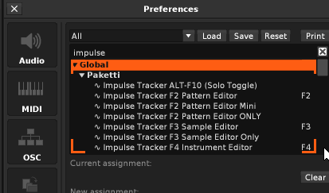


---
### 2024-06-16 - Improvement: Effect Column writers (shortcuts) now either outputs to selected_row if no selection, or to the selection
their naming has been tweaked also for better discoverability

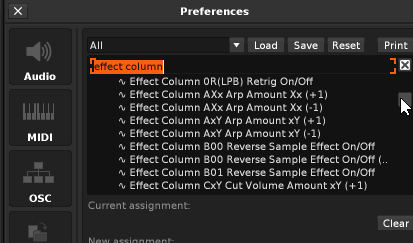


---
### 2024-06-16 - Improvement: Been working a bunch on making Menu Entries better and more organized, here's Keyzones
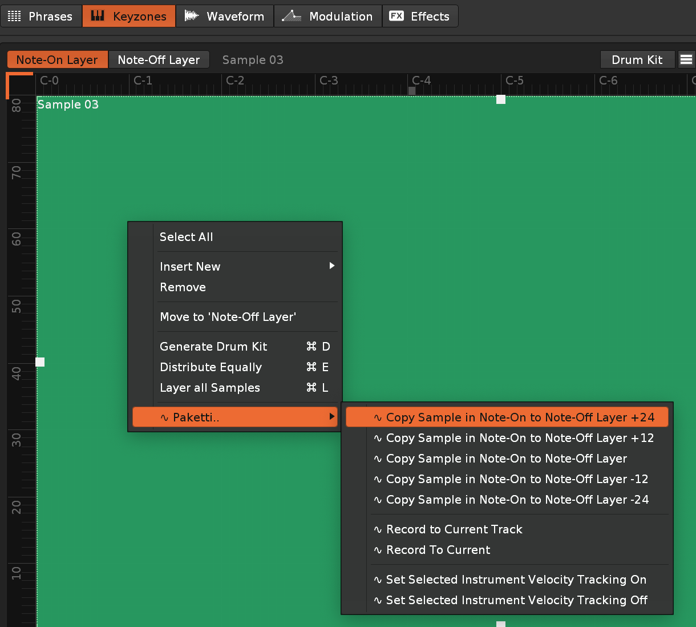


---
### 2024-06-16 - Improvement: "Wipe Song Retain Sample" now no longer errors if the Instrument you selected has no sample.

---
### 2024-06-16 - WIP Improvement: Instrument Box Menu Entries are better organized
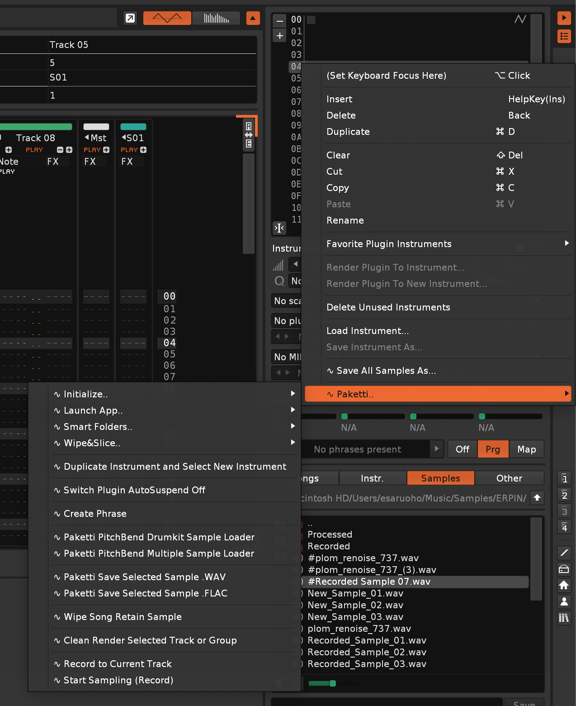

---
### 2024-06-16 - Improvement: Wipe & Slice no longer shoots an error if there is no sample in the instrument.  - instead shows a status "No samples available in the selected instrument".

---
### 2024-06-16 - Improvement: Wipe & Slice will tell you how many slices have been added to the instrument, and reference the sample name.
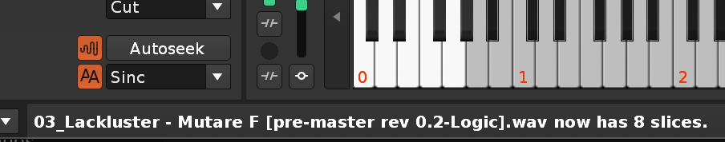

---
### 2024-06-16 - Improvement: Wipe & Slice will tell you when you've wiped all slices
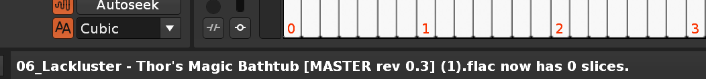

---
### 2024-06-16 - Improvement: LoopBlock "2nd binds" made available with matching naming convention to what Renoise provides
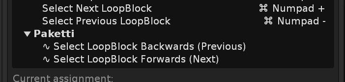

---
### 2024-06-16 - Improvement: Enable / Bypass EFX in Pattern now uses the right commands to bypass the first 8 effects, or enable the first 8 effects.
(Meaning: now compatible with Renoise 3)

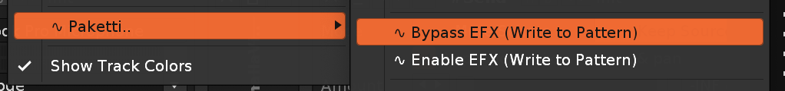

---
### 2024-06-16 - esaruoho

Backend Improvement: there's now a global function for giving a XML Preset and loading it directly to a plugin. which'll be useful in the future for loading XML content into active_preset_data for a plugin or a device.

---
### 2024-06-16 - Improvement: Whenever saving a script, or saving a song, or loading a new song, or creating a new song, or loading a sample, the view_preset1 would be forcibly shown. 
I've removed that since it benefits no-one - the viewport should stay the same no matter what

---
### 2024-06-17 - Improvement to ImpulseTracker `ALT-L *2` functionality. 
Now, if you are on Send or Master, and press ALT-L, it will select the content of the Send or Master track. when you press ALT-L again, it will select all of the pattern data (including sends + masters). instead of "only the tracks and not sends + masters".

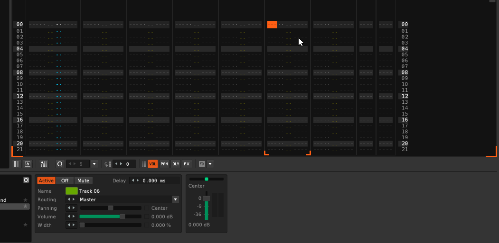

---
### 2024-06-17 - Fixed: when using Pattern Doubler to double a 256 row pattern to 512 - and the pattern has automation, there used to be an error shot.
now no error is shot no more and the automation works as expected.

---
### 2024-06-17 - Improvement: Sample Navigator now has the "Mono to Stereo" & "Mono to Left, Right Blank" & "Mono to Right, Left Blank" entries
And they're sorted correctly
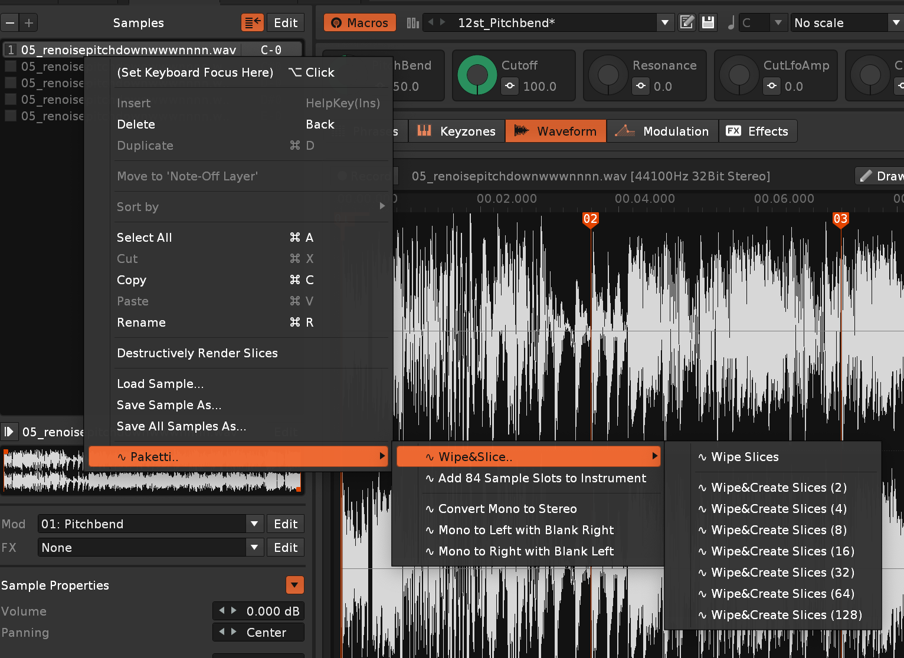

---
### 2024-06-17 - improvement: tweaked the naming convention of "Bypass EFX (Write to Pattern)" and "Enable EFX (Write to Pattern)"
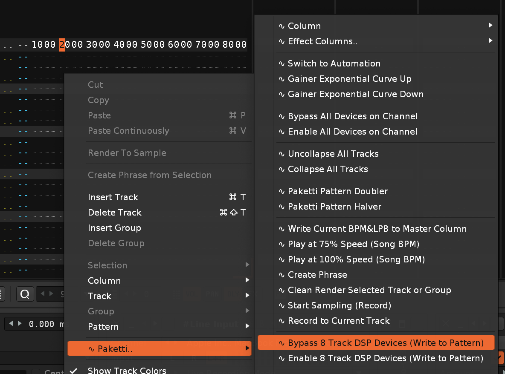

---
### 2024-06-17 - Improvement: Paketti PitchBend DrumKit Loader now correctly sets LoopMode + Sample Interpolation for each of the samples loaded into the drumkit.

---
### 2024-06-17 - Improvement: Bypass EFXs are now grouped together
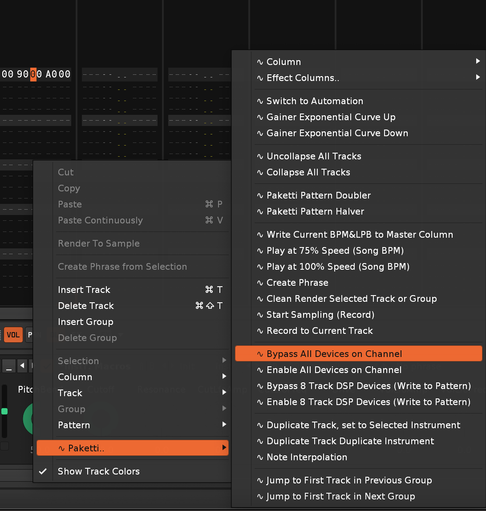

---
### 2024-06-17 - Improvement: had to switch from vb:switch for loop release to vb:checkbox -  - but now the preferences actually work properly. for loading samples and for slicing.

this Loop Release mode, coupled with Backward - means that whenever you let go of the playing slice, it will start playing backwards until the beginning of the sample is reached.
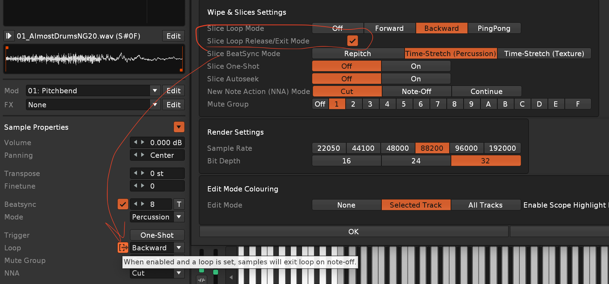

---
### 2024-06-17 - Feature: "Jump to First Track in Next Group" & "Jump to First Track in Previous Group" - as requested by icasiino - 
pretty much does what it says on the tin - if there are no groups, then it doesn't do anything.
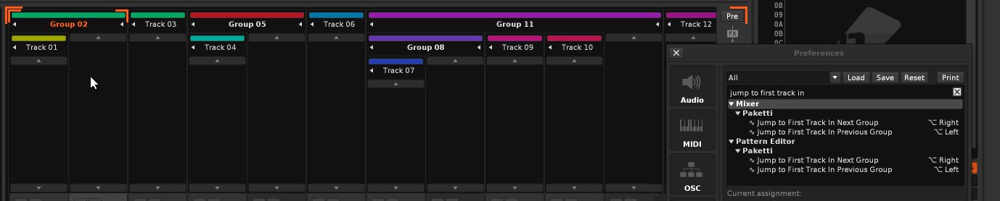

---
### 2024-06-17 - Improvement: 24st_pitchbend, 36st_pitchbend, 48st_pitchbend, 64st_pitchbend, 96st_pitchbend loaders updated with macros set up
these init instruments were lagging behind from 12st_pitchbend which had all the goodies
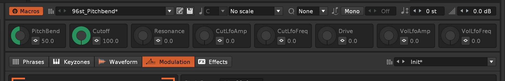

---
### 2024-06-17 - Improvement: Pattern Editor Cheat Sheet: added "0Yxx" (Maybe), "0Zxx" (Trigger Phrase) - tweaked order of effects so they match ["Effect Command Cheatsheet on Renoise Forum"](https://forum.renoise.com/t/effect-commands-cheat-sheet/45512) .. 
more tweaks incoming later (additional efx, grouping)

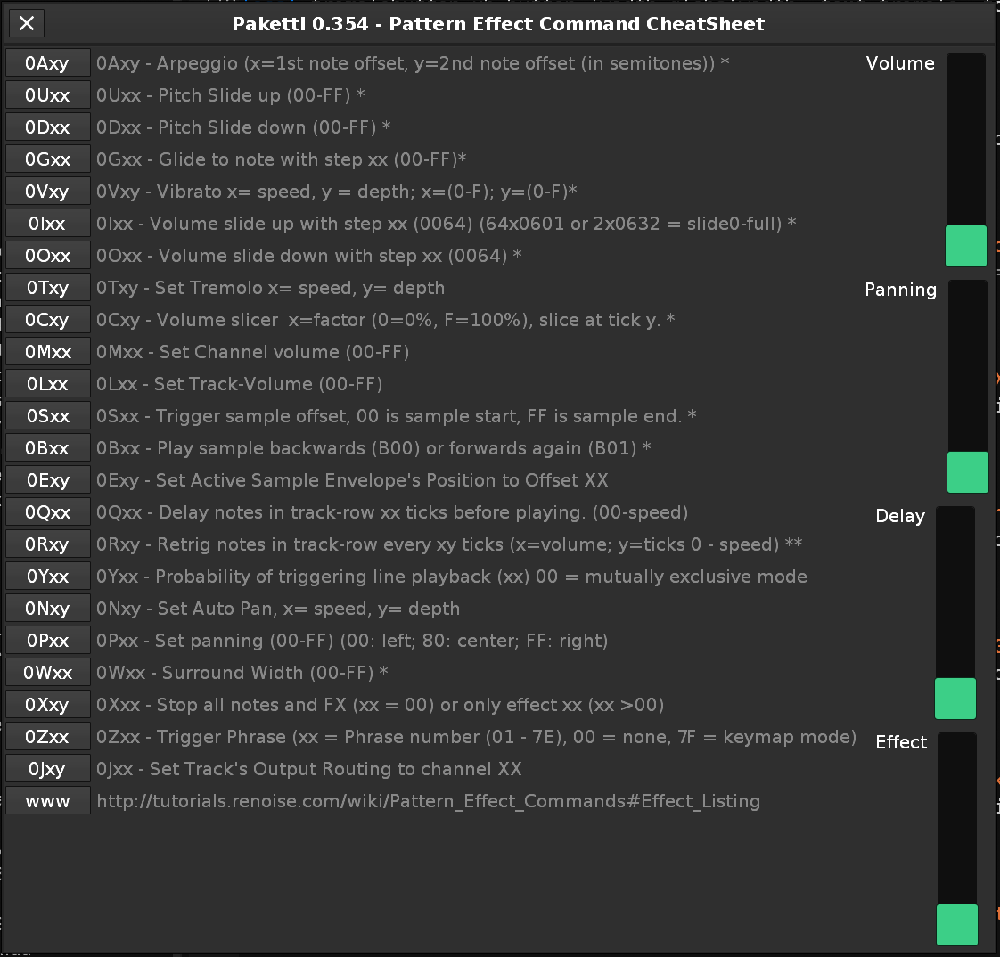

[Effect Commands Cheatsheet (Renoise Forum post, printable PDF by someone else)](https://forum.renoise.com/t/effect-commands-cheat-sheet/45512)

---
### 2024-06-18 - Feature: Globally Enable / Disable Volume Column, Panning Column, Delay Column, Sample FX Column. Available in Global:Tools:Paketti..:Pattern Editor, and Pattern Editor:Paketti..:  menu entries, and also as shortcuts. 

these change the Column Visibility of all regular Tracks to On/Off (Toggle) or Set to Visible.
(found this on a Renoise Forum post by ViZiON from 2008)
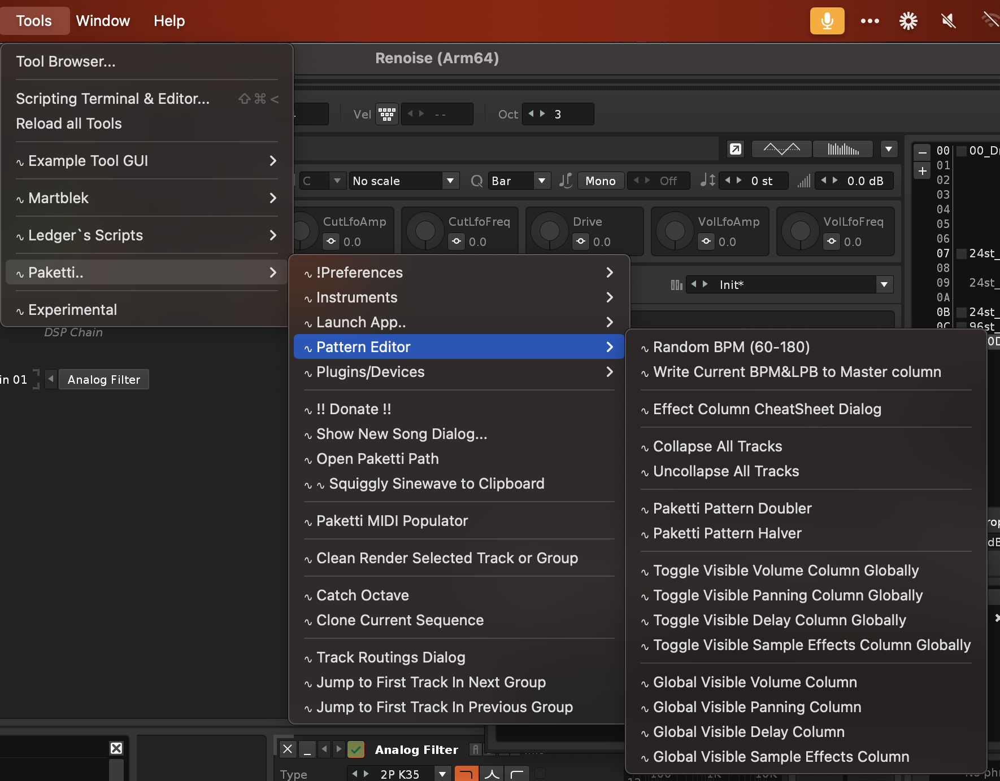

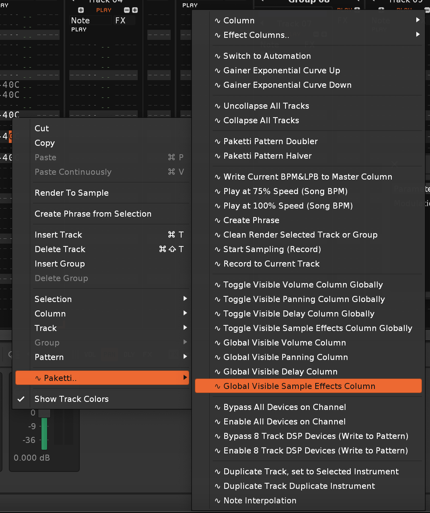

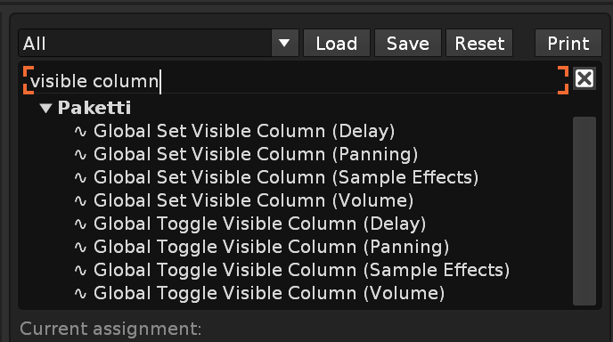

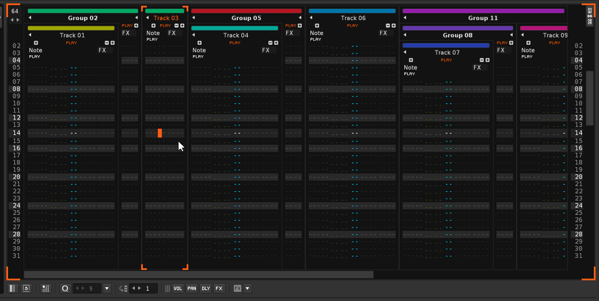


---
### 2024-06-18 - Improvement: Globally / Enable Visible Columns are now also visible on View -> Paketti.. -> Pattern Editor -> submenu
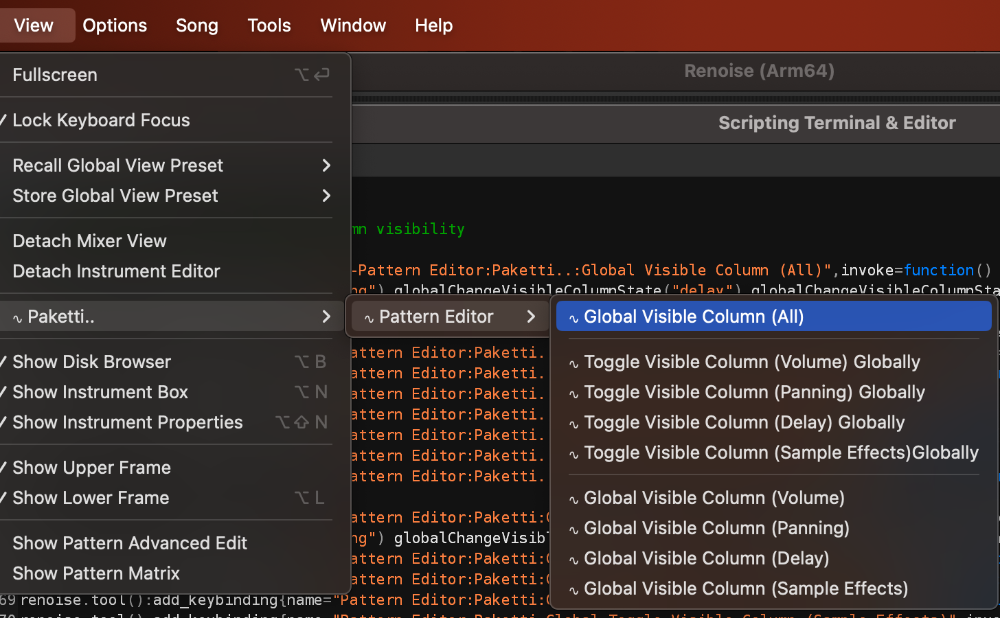


---
### 2024-06-18 - Improvements: `Bypass all Effects on Channel` now shows status `Disabled all Track DSP Devices on Selected Channel`
`Enable all Effects on Channel` now shows status `Enabled all Track DSP Devices on Selected Channel`

Tweaked most Track DSP Device hiding shortcuts + menu entries to make mention of "External Editor"
and added `"All open External Editors for Track DSP & Sample FX Chain Devices have been closed."`  and `"No Track DSP or Sample FX Chain Device External Editors were open, did nothing."` for informing the user what is going on.

this show_status thing will need to be done for hundreds of functions so whenever you see one that doesn't tell you what it does, hit me up and i'll tweak it in. there's too many for it to be doable in one go.


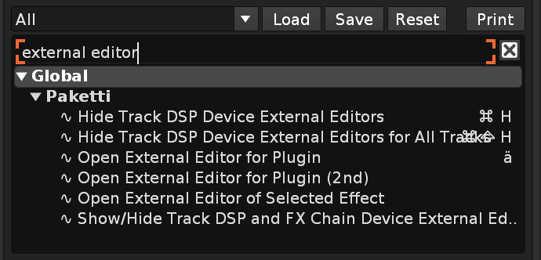


---
### 2024-06-19 - Feature: `Bypass All Other Track DSP Devices (Toggle)` as a keyshortcut, menu entry for Mixer + Track DSP  (Lower Frame) -- as requested  by untilde
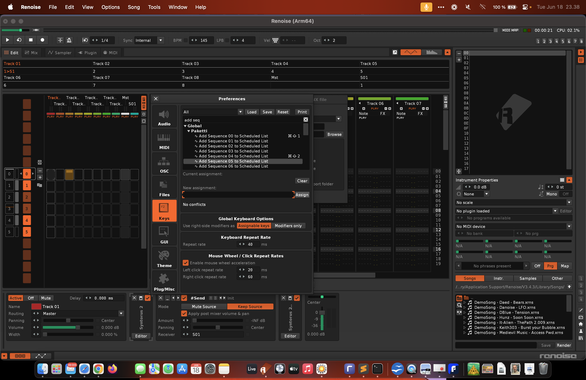

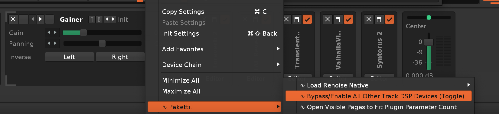


---
### 2024-06-19 - Improvement: "Jump to First Track in Next Group" & "Jump to First Track in Previous Group" shortcuts added to Pattern Matrix -- as requested by icasiino

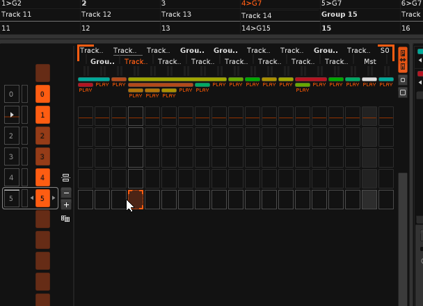


---
### 2024-06-19 - Improvement: 12st, 24st, 36st, 48st, 64st, 96st + drumkit loaders / init instruments now correctly map Cutoff knob to Cutoff, instead of.. Volume.. 🫢 🤦‍♂️

---
### 2024-06-19 - Improvement: added "Mono to Stereo, Mono to Left, Mono to Right" to Sample Mappings (=Keyzones) menu
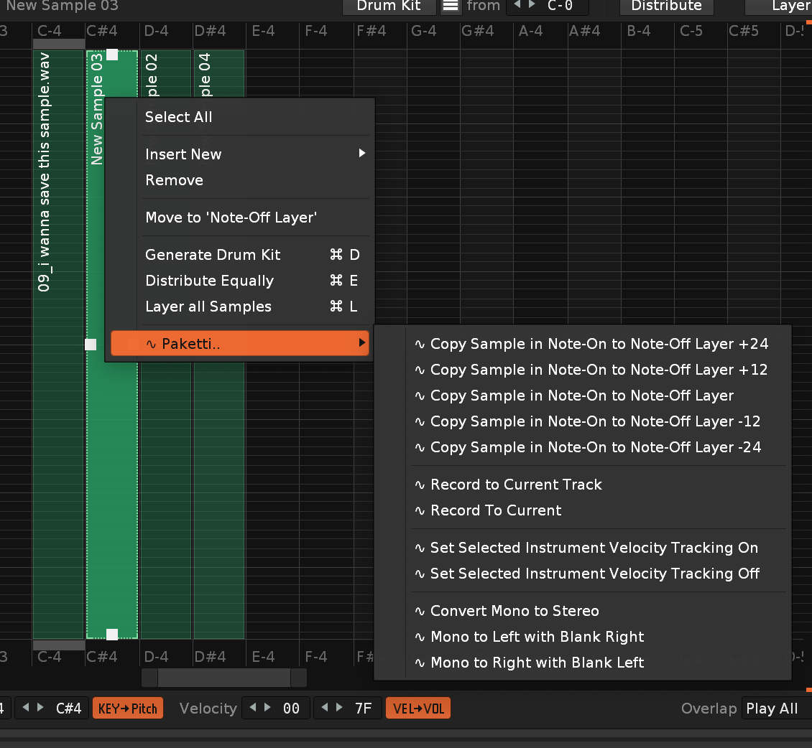


---
### 2024-06-20 - Improvement: "Mono to Stereo" "Mono to Left with Right Blank", "Mono to Right with Left Blank" now retain basenote and other key mapping settings, and are put into the same sample slot as previously (meaning instruments with multiple samples will retain their organization correctly).

---
### 2024-06-21 - Improvement: if 0G01 Loader is ON and you Wipe&Slice - new tracks are no longer created for slicecount (if you sliced a sample to 128 slices, you'd get 128 tracks) now you no longer need to protect yourself by disabling 0G01 Loader in order to wipe&slice and then re-enable 0G01 Loader -- the wipe&slicer just does the ad-hoc disable at the start of wiping&slicing, and then just re-enables it, if it was enabled. 
(this closes [https://github.com/esaruoho/org.lackluster.Paketti.xrnx/issues/183](https://github.com/esaruoho/org.lackluster.Paketti.xrnx/issues/183) )

---
### 2024-06-21 - Feature: AppSelection GUI now includes method for setting three Smart Folders (for macOS use), instead of hardwiring them to /Users/esaruoho/Music/samples/LogicSmartFolder + /Users/esaruoho/Music/samples/LiveSmartFolder..
I've also removed `sox` usage for adjusting 32bit samples to 24bit samples, which is no longer needed since Logic Pro can handle 32bit wavefiles nowadays.

NOTE: if there are apps out there that can't handle 32bit wavefiles, please tell me which ones they are, so i can try them out and add "adjust to 16bit" "adjust to 24bit" next to the Smart Folder path buttons.

(this closes  [https://github.com/esaruoho/org.lackluster.Paketti.xrnx/issues/161](https://github.com/esaruoho/org.lackluster.Paketti.xrnx/issues/161) )
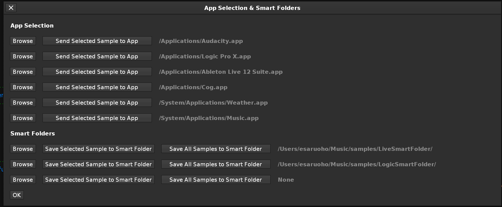

---
### 2024-06-21 - Improvement: If you try to save sample or samples to a Smart Folder that is not set - an error is shown on the status and the Smart Folder GUI opens up

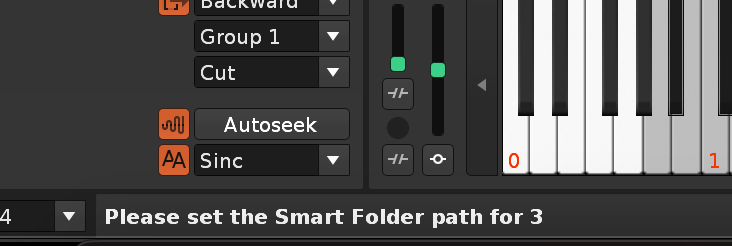

---
### 2024-06-21 - esaruoho

Feature: Create Identical Track.
if your track has X amount of Note Columns, Effect Columns, Panning, Delay, Volume, Sample FX Columns visible or the track is collapsed -- (or if none of these are visible or on), the "Create Identical Track" shortcut will create a Track that matches the track you were on.
closes https://github.com/esaruoho/org.lackluster.Paketti.xrnx/issues/208
(as requested by ViZiON on the Renoise Forums in January2009)

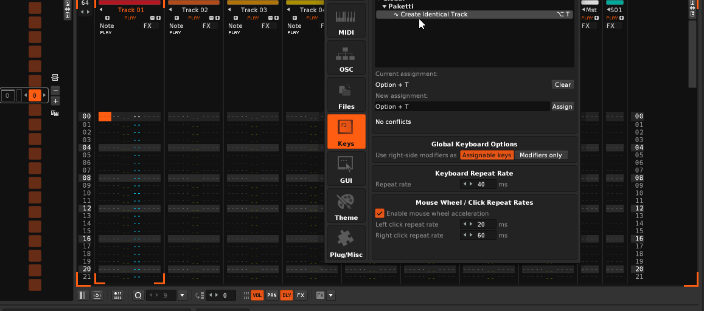


---
### 2024-06-21 - esaruoho

Feature: Randomize Selected Device Parameters:
<div style="position: relative; padding-bottom: 64.90384615384616%; height: 0;"><iframe src="https://www.loom.com/embed/52748313bf284544976bf7f90b62e6c6?sid=a2142966-d532-49d2-adbc-2aca8bd751fa" loading="lazy" frameborder="0" webkitallowfullscreen mozallowfullscreen allowfullscreen style="position: absolute; top: 0; left: 0; width: 100%; height: 100%;"></iframe></div>

https://www.loom.com/share/52748313bf284544976bf7f90b62e6c6?sid=b3198df4-229b-47e0-a5ce-465ca11f90e6

---
### 2024-06-21 - esaruoho

Feature: Randomize Selected Instrument (All) Plugin Parameters .. but since it randomizes each parameter, you might have a bad time if the synth sets itself to not play anything (outputs that you're not listening to, etc..)

---
### 2024-06-21 - esaruoho

Improvement: Randomize Selected Device Parameters now shows the name of the device that was randomized.
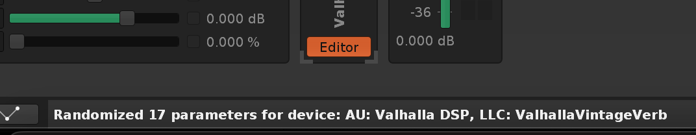

---
### 2024-06-21 - esaruoho

Feature: LADSPA/DSSI Device loader (shortcut + midimapper) GUI created. if you have Linux, please DM me and i'll send you a xrnx and please take some video + screenshots, i can't test how it works myself.
EDIT: there's apparently some noisy devices there that have a really long name (looking at you: 
```
721  Audio/Effects/LADSPA/lsp-plugins-ladspa.so:http://lsp-plug.in/plugins/ladspa/sc_mb_dyna_processor_stereo
```
fun. but shoot me some screenshots + video  so i can pick up the pieces. seems to work anyway.

---
### 2024-06-21 - esaruoho

Improvement: Gainer Exponential Curve Up, Gainer Exponential Curve Down now goes from 0.0dB to INF or from INF to 0.0dB - instead of to "12.5dB" - thus boosting the input signal by +12dB.
fixes [https://github.com/esaruoho/org.lackluster.Paketti.xrnx/issues/171](https://github.com/esaruoho/org.lackluster.Paketti.xrnx/issues/171)

usecase: make a way to fade in a sound by adding a gainer device to the track and fading sound in or sound out.
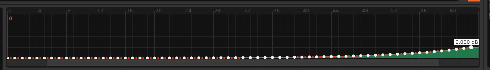

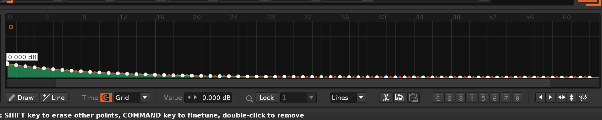


---
### 2024-06-22 - esaruoho

Improvement: Moved "Jump to First Track in Next Group" & "Jump to First Track in Previous Group" to Main Menu:Tools:Paketti..:Pattern Editor:
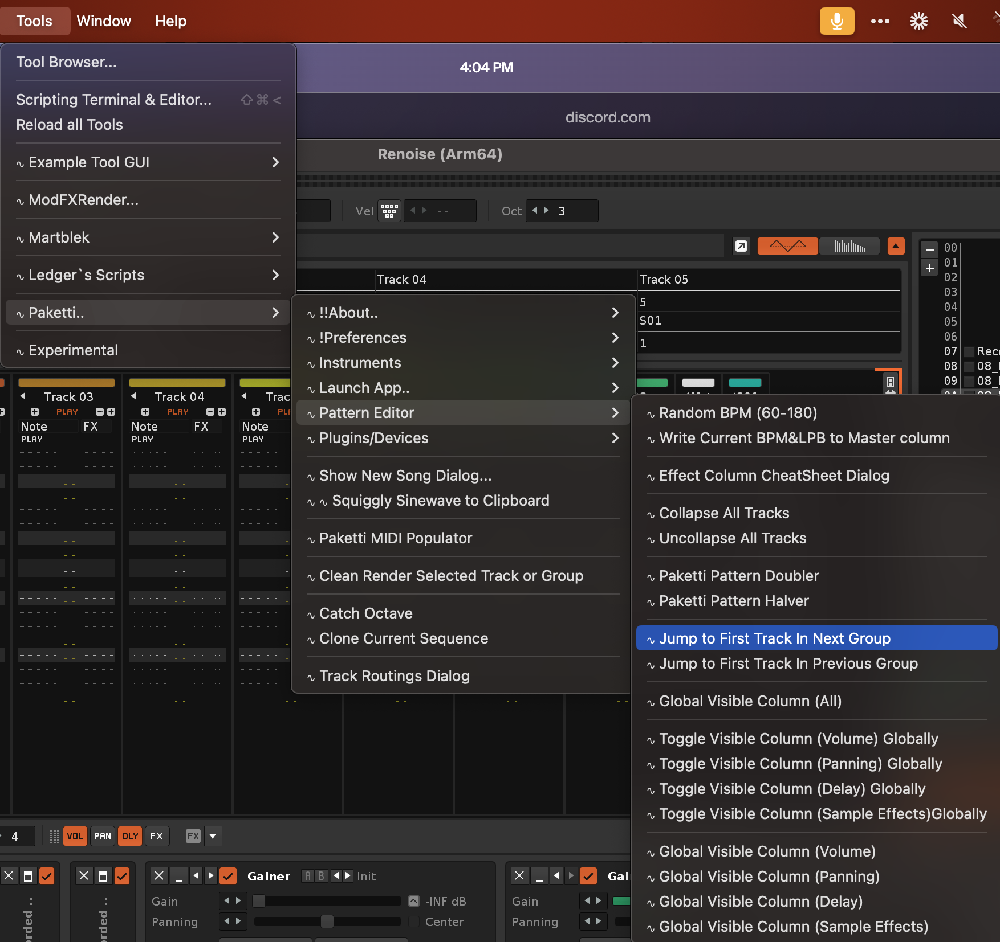


---
### 2024-06-22 - esaruoho

Improvement: Added "Create Identical Track" to Tools->Paketti.. -> Pattern Editor

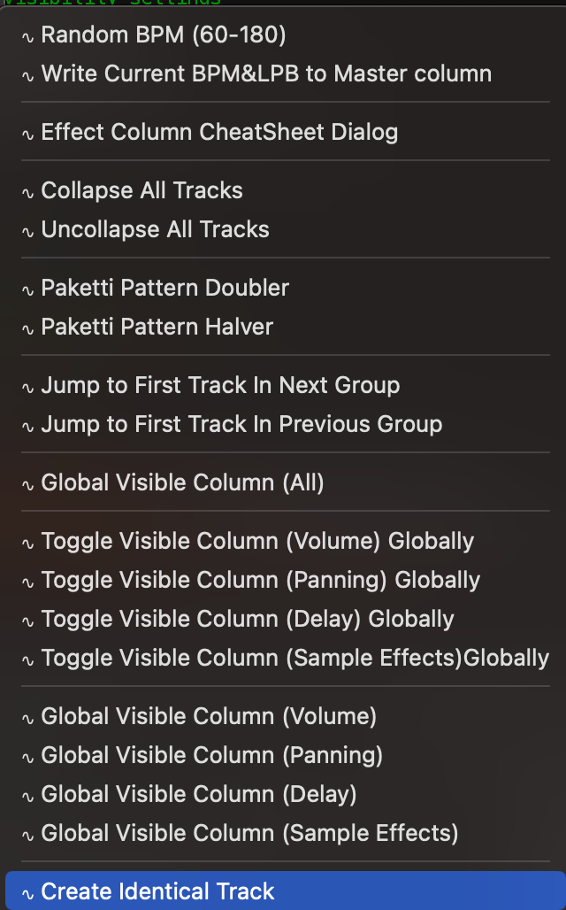

---
### 2024-06-22 - esaruoho

Improvement: Added "Randomize Selected Instrument Plugin Parameters" &."Randomize Selected Device Parameters" to Tools->Paketti..->Plugins/Devices
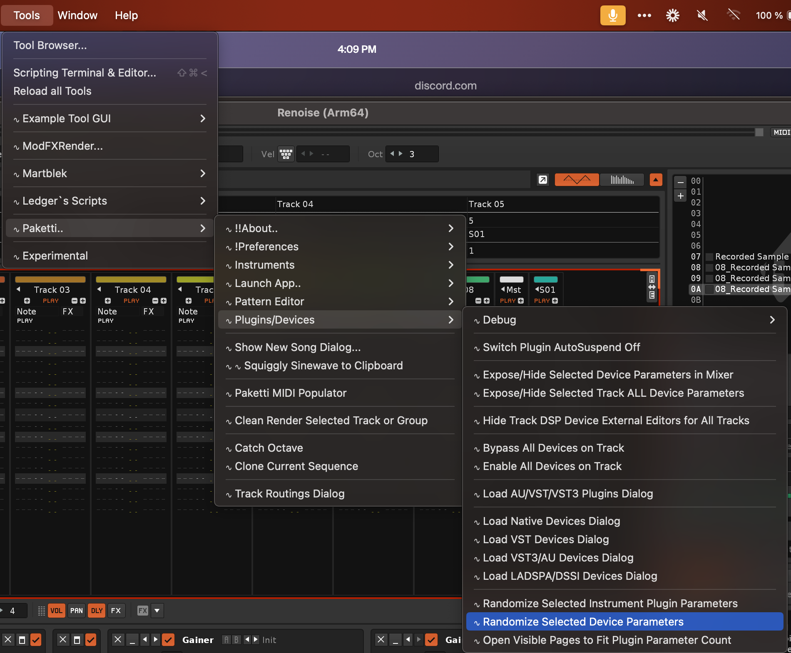

---
### 2024-06-22 - esaruoho

Feature: Move Slice End Left/Right by +10/-10, +100/-100, Move Slice Start LeftRight by +10/-10 +100/-100:
this means that you can be in the slice itself, and adjust the slice visually with nudges.
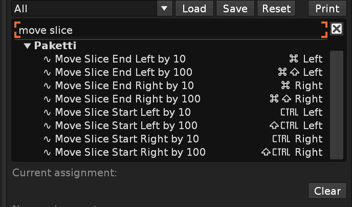

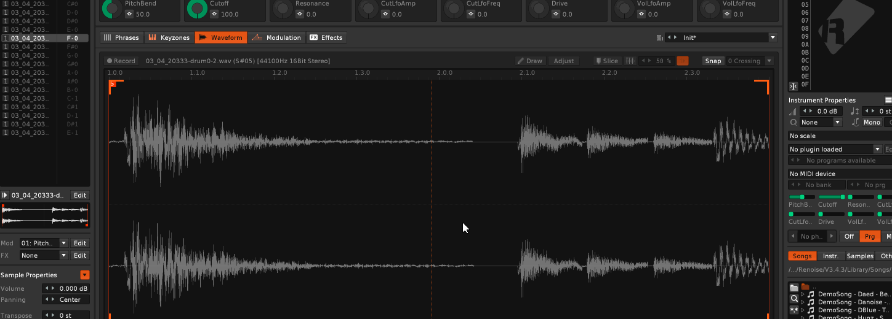

---
### 2024-06-22 - esaruoho

Improvement: Wipe Slices (in Wipe&Slice suite of features) now will properly wipe all slices from the sample even if a slice was selected when you wipe slices. (it used to do nothing)

---
### 2024-06-22 - esaruoho

Improvement: If there are no apps configured in App Selection, the dialog does not forcibly open on every new song, Renoise start, etc. Just a show_status message instead:
```
No apps have been configured in Paketti..:Launch App..:Configure Launch App Selection, cannot populate Menu.
```

---
### 2024-06-22 - esaruoho

Improvement: if no LADSPA or DSSI devices found on computer, display a sensible message (`No LADSPA/DSSI Devices found on this computer.` )  instead of ruining the GUI by making the buttons not show properly

---
### 2024-06-22 - esaruoho

Improvement: if no AU, VST or VST3 plugins found on computer, display a sensible message ( `No AudioUnit Plugins found on this computer.` or `No VST Plugins found on this computer.` or `No VST3 Plugins found on this computer.`) instead of ruining the GUI by making the buttons not show properly

---
### 2024-06-23 - esaruoho

Feature: Solo Selected Track in Group using Note Column Mute:
closes [https://github.com/esaruoho/org.lackluster.Paketti.xrnx/issues/106](https://github.com/esaruoho/org.lackluster.Paketti.xrnx/issues/106)
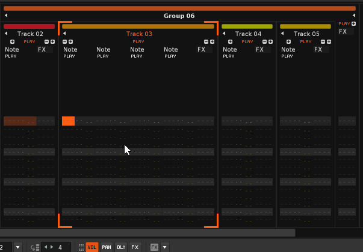

---
### 2024-06-23 - esaruoho

Improvement: +300/-300 +500/-500 for both Slice Start & Slice End:

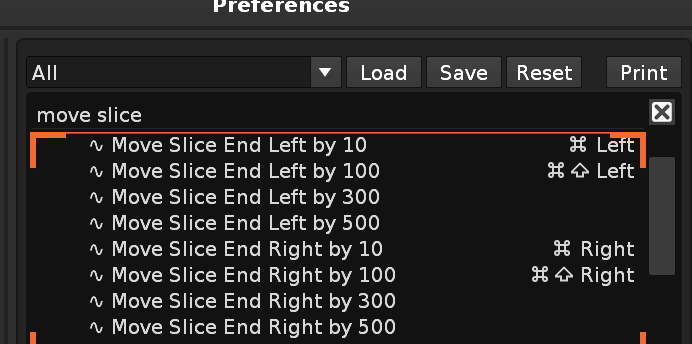

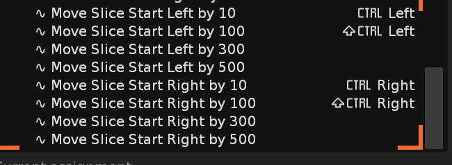

---
### 2024-06-23 - esaruoho

Improvement: Midi Mapping Sample FX Column knob now shows the Sample FX Column, for better visibility.

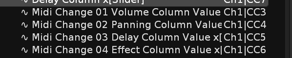

---
### 2024-06-23 - esaruoho

Improvement: Midi Change 01 Volume Column Value / 02 Panning Column Value / 03 Delay Column Value / 04 Sample FX Value: 
if you have nothing selected, it'll output to current_line row. if columns are not visible, they are made visible. if you have a selection, then the whole selection will be changed by midi knobs.

<div style="position: relative; padding-bottom: 64.90384615384616%; height: 0;"><iframe src="https://www.loom.com/embed/3af37cfeac9a4aa78834d7b6c74b7f36?sid=8448be8d-8f03-469a-a7a2-12df1888add2" loading="lazy" frameborder="0" webkitallowfullscreen mozallowfullscreen allowfullscreen style="position: absolute; top: 0; left: 0; width: 100%; height: 100%;"></iframe></div>

[https://www.loom.com/share/3af37cfeac9a4aa78834d7b6c74b7f36?sid=0285c5a2-1d7b-4c83-820c-e9e07f40a52f](https://www.loom.com/share/3af37cfeac9a4aa78834d7b6c74b7f36?sid=0285c5a2-1d7b-4c83-820c-e9e07f40a52f)

---
### 2024-06-23 - esaruoho

Feature: Selected Device Parameter Randomizer Dialog.
Offers a slider for controlling percentage of randomization
auto-updates to new device if you select a new device.
<div style="position: relative; padding-bottom: 64.90384615384616%; height: 0;"><iframe src="https://www.loom.com/embed/6358542ad6db449daf581421653548fa?sid=710584ec-3e0c-47ae-9e3b-9da0abecefba" loading="lazy" frameborder="0" webkitallowfullscreen mozallowfullscreen allowfullscreen style="position: absolute; top: 0; left: 0; width: 100%; height: 100%;"></iframe></div>

[https://www.loom.com/share/6358542ad6db449daf581421653548fa?sid=aee4ccb0-2738-4214-933d-0bd5c50eb163](https://www.loom.com/share/6358542ad6db449daf581421653548fa?sid=aee4ccb0-2738-4214-933d-0bd5c50eb163)

---
### 2024-06-23 - esaruoho

Improvement: BPM +0.1 / BPM -0.1 (in addition to +1/+5/-5/-1 already being there since 14 years ago in Paketti.) this is ripped straight from the ModPlugTracker playbook:

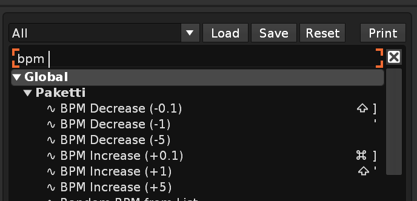

---
### 2024-06-23 - esaruoho

Improvement: Randomize Selected Device Parameters Dialog now updates if no Device is selected. also, after clicking on the Randomize button, the keyboard focus is returned to Renoise / the Tracker, so you can continue shortcutting+keyjazzing.

---
### 2024-06-24 - esaruoho

Feature: "Duplicate Effect Column Content to Pattern"

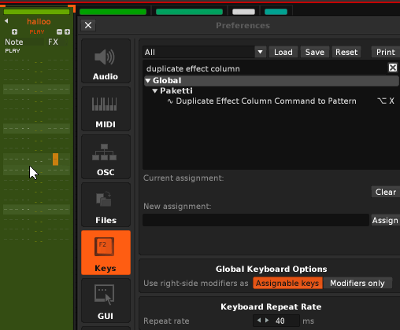

---
### 2024-06-24 - esaruoho

Improvement: "Duplicate Effect Column Content to Pattern or Selection" -> if something is selected, your current row effect parameter is input to selection.. if nothing selected, then the whole pattern gets the effect parameter input

---
### 2024-06-24 - esaruoho

Feature: "Randomize Effect Column Parameters for Pattern or Selection"

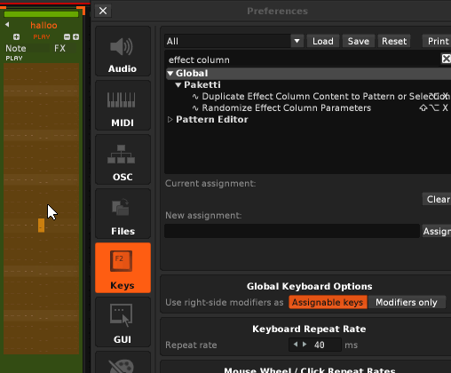


---
### 2024-06-24 - esaruoho

Feature: Effect Column Interpolation for Selection or Pattern.

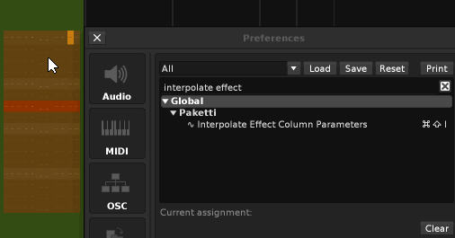

---
### 2024-06-24 - esaruoho

Feature: Flood Fill Selection or Track with Instrument + Note:

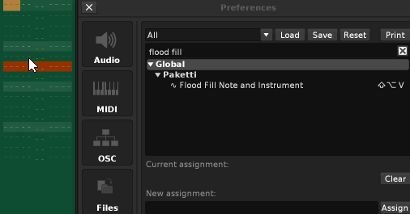

---
### 2024-06-24 - esaruoho

Improvement: now all Plugin parameters can be randomized, or all plugins in the whole song can be randomized.  same GUI as Selected Track Device & All Devices on Selected Track.
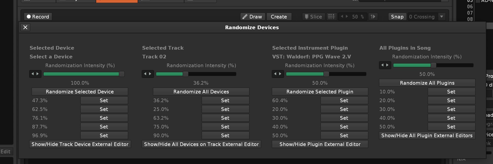

---
### 2024-06-25 - esaruoho

Improvement: If currently selected instrument has no plugin, Randomize Devices & Plugins dialog will still open.
If there are no plugins in the song, then Randomize All Plugins will show_status stating there are no plugins, instead of saying "yes, randomized all plugins in song". and in the same situation, "Show/Hide all Plugin External Editors" will also show a status.
and visual update: the fourth column now has empty space before the "Randomization intensity (%)" line to better line up.
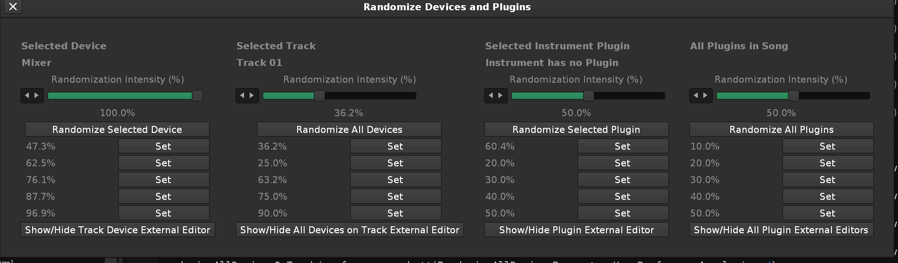

---
### 2024-06-26 - esaruoho

Feature: Impulse Tracker ALT-Left / ALT-Right (two flavors, one that Wraps (last track to first track.. or first track to last track), and another that doesn't wrap (press alt-left enough, and you'll be in first track but that's it.. same for alt-right)))

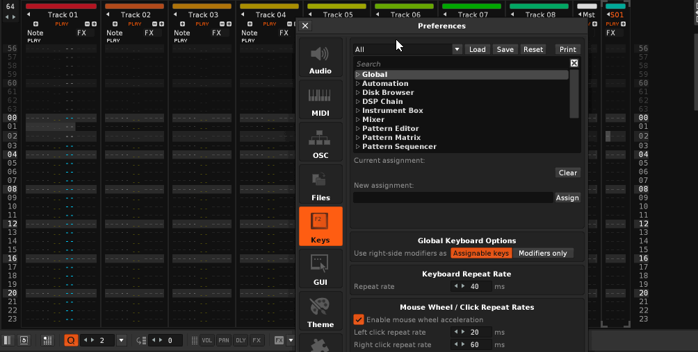

---
### 2024-06-28 - esaruoho

Feature: Impulse Tracker "Slide Content Up / Down". this takes Selected Track.. or Selected Note Column or Selected Effect Column. will slide it up and down.
	
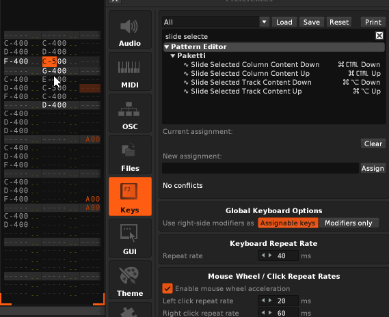

---
### 2024-06-28 - esaruoho

Feature: Solo Tracks - if no pattern selection - then mute currently selected track. if current track is selected or has selection, mute that. draw selection around multiple tracks and run shortcut = all other tracks are muted. or unmuted.


---
### 2024-06-28 - esaruoho

Improvement: Note Interpolation now works on any note column on the track. same with selection. and.. if you have multiple note columns selected, and there's notes there at the start + end of pattern rows, the interpolation will happen. and if you have a selection within a track, the note interpolation will happen for the whole selection.


---
### 2024-06-28 - esaruoho

Feature: ALT-Y "Swap Block" straight from ImpulseTracker2/SchismTracker/ScreamTracker3(?)


---
### 2024-06-28 - esaruoho

Improvement: Alt-Y will now work with tracks that don't have "enough" note columns, they will be resized. and now this can be used for multiple note columns, and to the track you're at.


---
### 2024-06-29 - esaruoho

Improvement: Transpose +12 / -12 / +1 / -1  so that if nothing is selected in the pattern, it will transpose the whole selected_track. if something is selected in the pattern, then it'll transpose the selection.
Feature: Transpose +12/-12/+1/-1 for selection, or just current note column.

both of these transposes actually go from C-9 to C-0 if you keep transposing.


---
### 2024-06-29 - esaruoho

Feature: Duplicate Instrument and Reverse Sample -- this just takes your currently selected instrument, duplicates it below it, and reverses the samples in the instrument. (and selects the newly created reversed instrument)


---
### 2024-06-30 - esaruoho

Improvement: F5 "Impulse Tracker Play" used to have a 0.4 second delay after Panic + playback starting. it was to avert plugins from crashing (F5 is a macro that stops playback, runs Renoise Panic (to kill all audio) and then starts playback with follow pattern = on)) - now i cut it down to 0.225second, so it "feels less sluggish".

---
### 2024-07-01 - esaruoho

Feature: Paketti Renamer - shortcut + menu entry for renaming a track. opens a dialog with current name highlighted, you can type, press enter -> renaming done. works for master, send, group, track.


---
### 2024-07-01 - esaruoho

Improvement: Now Paketti Track Renamer reads selection-in-pattern for multi-track renaming one at a time.


---
### 2024-07-04 - esaruoho

Improvement: "Wipe Plugins" added to CTRL-N, it will look through all the instruments and clear the plugins from the instruments.


---
### 2024-07-05 - esaruoho

Improvement: Added the Note-On to Note-Off (with transpose) copying to Sample Navigator, since i went there to try and run it and realized it's not there. it's now in sample editor, sample mappings, and sample navigator.


---
### 2024-07-05 - esaruoho

Improvement: Solo Tracks will now:
- Work if the selected track is a Send - the rest of the Sends + Tracks are muted.
- Mute Sends if selected track is a Track, or if Selection In Pattern covers tracks.
- Work if Selected Track is within a Group - mutes the rest of the Tracks within the Group, but keeps the Group playing.
- If you Selection in Pattern say tracks4-5, and run shortcut, and then move Selection In Pattern to 5-6 and run shortcut, 5-6 will be unmuted and the rest muted. this used to mess up.
- Master is ignored and is not allowed to shoot error. (i.e. script no longer tries to mute Master for no reason.)

still ironing out 4 other issues, then it's ready. .. 🫢

---
### 2024-07-05 - esaruoho

Feature: Isolate Slices to New Instruments - this takes the slices in your sliced instrument, and copies all their settings and modes, and creates new instruments, naming them according to the slice.
available in Sample Editor, Sample Navigator, Sample Mappings and Instrument Box. and a global shortcut.


---
### 2024-07-05 - esaruoho

Feature: Reverse Notes in Selection


---
### 2024-07-05 - esaruoho

Improvement: Load Native Devices Dialog can be opened multiple times instead of only once (and then the gui fails to render)

---
### 2024-07-05 - esaruoho

Improvement: the Smart Folders segment of this dialog has been, more understandably, modified to include "Backup Folders" and for the buttons to refer to "Folders" instead of "Smart Folders" - because the usecase is of course that you can set the folder of your choice to be a folder that's a smart folder (macOS) or any folder (such as a backup folder). think "folder 1 = drums, folder 2 = melodies, folder 3 = pads" or something like that


---
### 2024-07-05 - esaruoho

Improvement: End *2 now actually first takes you to last row of current note column, and on second press, to the last track last row.

---
### 2024-07-05 - esaruoho

Feature: Send Populator for Selected Track or All Tracks.


---
### 2024-07-06 - esaruoho

Feature: Flood Fill Note & Instrument with Edit Step - this takes the Edit Step and fits the currently selected line note + instrument to it, or if you have a multi-track selection, it will take the current row and fill the selection with the note+instrument using editstep.
<div style="position: relative; padding-bottom: 64.90384615384616%; height: 0;"><iframe src="https://www.loom.com/embed/2dc0c84c97dc4dcc9c5125671e6b1da2?sid=1e5f9784-6265-47de-b622-eb39cc463ab5" loading="lazy" frameborder="0" webkitallowfullscreen mozallowfullscreen allowfullscreen style="position: absolute; top: 0; left: 0; width: 100%; height: 100%;"></iframe></div>

[https://www.loom.com/share/2dc0c84c97dc4dcc9c5125671e6b1da2?sid=081e5637-a092-4299-ac49-7433e90d344a](https://www.loom.com/share/2dc0c84c97dc4dcc9c5125671e6b1da2?sid=081e5637-a092-4299-ac49-7433e90d344a)

---
### 2024-07-06 - esaruoho

Improvement: Load Native Devices Dialog now has "Randomize Selection" as a possibility.  it will clear the current selection, and then select a random amount of devices.


---
### 2024-07-06 - esaruoho

Improvement: Load VST Devices Dialog also has "Randomize Selection"


---
### 2024-07-06 - esaruoho

Improvement: Load VST3/AudioUnit Randomize Selection


---
### 2024-07-06 - esaruoho

Improvement: Load VST3/VST/AudioUnit Plugins Randomize Selection:


---
### 2024-07-06 - esaruoho

Improvement: Plaidzap gift now uses the macros (pitchbend,cutoff,resonance,cutoffLFOAmount,cutoffLFOFreq,Overdrive,VolLFOAmount,VolLFOFreq

---
### 2024-07-06 - esaruoho

Feature: Unison Generator.. creates 6 samples  and finetunes them by -1 +1 -2 +2 -3 +3 and adjusts the sample startpoint by fractions (1/8 to 7/8) so they're slightly offset


---
### 2024-07-08 - esaruoho

Feature: You can now Export the Convolver IR to a new Instrument, which will export it and then show the Sample Editor. You can also, after modifying, Import the Selected Sample back to the Selected Device (Convolver).
if anyone's into IRs, please DM me and I'll send a build and we can continue looking at this - i need plenty of IRs to make sure it all works

---
### 2024-07-08 - esaruoho

Improvement: There's now a connection between 0G01 loader and Paketti PitchBend Multiple Sample Loader - if 0G01 loader is set to On, then new tracks will be created per each loaded sample, and each track will cleanly have a instr automation device added, so there's no longer a flood of instr automation devices for the track you were on, i.e. you load 36 samples and there's 36 instr automation devices on selected_track.

closes [https://github.com/esaruoho/org.lackluster.Paketti.xrnx/issues/191](https://github.com/esaruoho/org.lackluster.Paketti.xrnx/issues/191)

---
### 2024-07-10 - Improvement: Export / Import Convolver IR
file feature now offers a GUI for also importing to convolver or exporting from convolver, and the gui allows for using shortcuts while open, so you can select a new sample to be imported to a Convolver of your choice. it also will update when you select a different sample, it allows you to add a Convolver to the start of the Track DSP Chain or the end of it, and you can import or export from any of them.


---
### 2024-07-10 - Feature: Set Master Track Output Routings 00...32 - this changes the Master Track Output.


---
### 2024-07-10 - esaruoho

Improvement: Set Master is now 0...63
Selected Track Output Routing is now 0...63

---
### 2024-07-11 - esaruoho

Feature: MidiMapping Knob 0...127 for Selected Track Output Routing, and Master Track Output Routing:


---
### 2024-07-12 - esaruoho

Feature: MidiMapping Buttons for Selected Track Output Routing, and Master Track Output Routing:  0...63


---
### 2024-07-13 - esaruoho

Feature: a brand new donation dialog with buttons for donating via ko-fi, bandcamp or PayPal, and with a list of people who donated, how much, and links to their pages as promotion.

---
### 2024-07-14 - esaruoho

Feature: PlayerPro Note Dialog - lets you output selected instrument and note to row if nothing selected.. if there's a selection_in_pattern, and you press a note, the selected instrument + clicked on note will appear in the selection.


---
### 2024-07-15 - esaruoho

Feature: Set Master Track Volume +0.1dB / -0.1dB, with clamping at -INF and 3dB.

---
### 2024-07-16 - esaruoho

Feature: Paketti eSpeak Text-to-Speech, tested with macOS & Linux.
This supports both `espeak` and `espeak-ng` 
it is an improvement over Martblek's abandoned ReSpeak. (Martblek gave permission to take his work and improve upon it)

Supports: 
- Loading textfiles and rendering
- selection from text can be rendered
- same shortcut that opens the dialog, renders the sample
- espeak path is stored  in Preferences
- settings stored in Preferences
- Sample Editor is brought up after rendering, so you can see what happened
- Can select whether new instrument is rendered or sample.
- User setting: every voice/language change will render a new sample / new instrument. (dropdownmenu & +/- changes for quickly changing the voice / language) -> means when you  hit +/- it'll render a new instrument every time.
- Languages sorted alphabetically


---
### 2024-07-16 - esaruoho

Improvement: if you have no MIDI input devices and/or MIDI output devices, the Paketti Midi Populator no longer errors out and stops working.

---
### 2024-07-18 - esaruoho

Improvement: Switch to Automation will now switch back to TrackDSPs if Automation is already displaying

---
### 2024-07-18 - esaruoho

Feature: Resize & Fill. (available in Pattern Editor menu, Tools menu, and as a shortcut). this takes your pattern (and pattern automation) and expands until you have a pattern of 032, 064, 128, 256, 512 rows. so if you have a 4 row pattern, and you press "Resize & Fill 128" - the 4 row pattern changes to 128 rows, and the content is duplicated 32 times. 
if, however, you have a 512 row pattern and you press "resize&fill 032" - it will simply resize the pattern to 32 rows. and tell you accordingly.

this is basically a controlled "Paketti Pattern Doubler".


---
### 2024-07-18 - esaruoho

Improvement: Paketti Save Sample as FLAC / WAV menu entries added to Sample Editor (!!!) they should have always been there.


---
### 2024-07-18 - esaruoho

Improvement: Paketti Save Selected Sample as FLAC / WAV menu entries added to Sample Navigator.


---
### 2024-07-18 - esaruoho

Improvement: Unison Generator -> sets the selected instrument selected sample loopmode to Forward, in case if it is not set

---
### 2024-07-19 - esaruoho

Improvement: Unison Generator now both makes a copy of the original instrument, and loads 12st_Pitchbend.xrni instrument, for macros.
(closes [https://github.com/esaruoho/org.lackluster.Paketti.xrnx/issues/274](https://github.com/esaruoho/org.lackluster.Paketti.xrnx/issues/274))

---
### 2024-07-19 - esaruoho

Improvement: "Save Selected Sample" & "Save All Samples" to Smart/Backup Folder menu entries added for Sample Navigator (Selected+All), Sample Editor (Selected) and Instrument Box (All)
EDIT: typo fix, "All Sample" -> "All Samples" for each menu entry 🙂
(closes [https://github.com/esaruoho/org.lackluster.Paketti.xrnx/issues/245](https://github.com/esaruoho/org.lackluster.Paketti.xrnx/issues/245) )


---
### 2024-07-19 - esaruoho

Improvement: Transpose +1/-1/+12/-12 now work with 1) selection only if selection in pattern 2) each note column in track if no selection in pattern.
(closes [https://github.com/esaruoho/org.lackluster.Paketti.xrnx/issues/174](https://github.com/esaruoho/org.lackluster.Paketti.xrnx/issues/174)

---
### 2024-07-19 - esaruoho

Update: Paketti Donations list updated with URL button added to newest donator - a maximum of 3 URLs can be added upon donation (Zoey Samples got the BTD Records url)


---
### 2024-07-19 - esaruoho

Improvement: Unison Generator now reads this brand new (still WIP) setting in Paketti Preferences:  .. i.e. if it is set to ON, then the Unison Generated Instrument will have AHDSR envelope enabled instead of disabled. default is disabled.


---
### 2024-07-19 - esaruoho

Improvement: Unison Generator is now the first feature that uses the "Default .XRNI to use" Paketti Preferences setting. This allows you to set your own instrument to be loaded when generating a Unison - enabling you to decide which macros + etc modfx + samplefx settings (sample fx chains) stuff your instrument comes preloaded with. including sample modulation. this is a powerful thing to have.

---
### 2024-07-19 - esaruoho

Improvement: "Create New Instrument & Loop" now also uses Default XRNI Preference

---
### 2024-07-19 - esaruoho

Improvement: Paketti Pitchbend Multi Sample Loader now also uses Default .XRNI preference

---
### 2024-07-19 - esaruoho

Improvement: Paketti Clean Render now also uses Default .XRNI Preference

---
### 2024-07-20 - esaruoho

Improvement: Default XRNI Loader now has a dropdown menu in Paketti Preferences: you can pick from the ones already available, or your own.
this lets me also collaborate with other people who want to make a default XRNI available, and want to contribute it to Paketti


---
### 2024-07-22 - esaruoho

Plumbing: Paketti has KeyBindings.xml files inside the script itself, I've moved them to the `KeyBindings` folder. These are, for now, only used for storing the "macOS Paketti" shortcuts.. The objective is to eventually offer a PakettimacOS / PakettiWindows / PakettiLinux  KeyBindings files, but that is further down the line.

---
### 2024-07-22 - esaruoho

Feature: PlayerPro Transpose Selection or Row +1/-1/+12/-12


---
### 2024-07-23 - esaruoho

Feature: Paketti Theme Selector Dialog.
<div style="position: relative; padding-bottom: 64.90384615384616%; height: 0;"><iframe src="https://www.loom.com/embed/2289acd190614b388a93edc2e7f3507a?sid=ff453d9e-81db-49ea-be24-3592a85b2f6a" loading="lazy" frameborder="0" webkitallowfullscreen mozallowfullscreen allowfullscreen style="position: absolute; top: 0; left: 0; width: 100%; height: 100%;"></iframe></div>

[https://www.loom.com/share/2289acd190614b388a93edc2e7f3507a](https://www.loom.com/share/2289acd190614b388a93edc2e7f3507a)

- 453 themes added within Paketti (from Renoise Theme Thread, and private sendings) - if you want your theme added, please shoot me a DM.
- A dropdown menu that shows you the whole list. +/- and Randomize functions.
- Shows you the previously selected theme (saved when closing dialog)
- You can create a list of Favorited themes, and +/- and Randomize from that.
- "Select a Random Favorite on Renoise Launch" checkbox - your Favorite list will be looked at, and a theme is randomly selected.
- Open Themes Path - should work on Windows, Linux and macOS - opens the Themes path so you can update
- Refresh for refreshing the dropdown menu.


---
### 2024-07-23 - esaruoho

Improvement: Paketti eSpeak TTS now will use the Default XRNI Instrument - so you have pitchbend, cutoff, resonance, overdrive etc Macros already set up

---
### 2024-07-23 - esaruoho

Improvement: Paketti Theme Selector:
Removed all the duplicate themes.. and added all the Renoise default themes + "More" themes, so there's 505 now.
Added shortcuts for these functions.


---
### 2024-07-23 - esaruoho

Plumbing: Isolated all Preferences to separate segments of the preferences.xml for better managing. this should help a lot. Hopefully also with the Paketti Theme Selector

---
### 2024-07-25 - esaruoho

Improvement: Paketti Theme Selector:
- Added "Save Favorites" & "Load Favorites" so you can save your Favorites properly
- Fixed Preferences so the "Select a Random Favorite on Renoise Launch" & Favorites are properly stored.
- Tweaked the interface so it feels more optimized (+/- & randomize & add to favorite & remove favorite are on the same row as the dropdown menu)
- made "Pick a Random Theme (Favorites)  properly work
- Removed "Load Favorite Theme (Next)" & "Load Favorite Theme (Previous)".


---
### 2024-07-25 - esaruoho

Improvement: 12st_Pitchbend now has 
- a deactivated "Mono" device for Monoing up the output
- Glide Inertia button
- Parallel Compression button

NOTE: this modifies the Instr Control device usage, should not touch X_Pitchbend but instead Pitchbend in Automation lane. 
this closes
[https://github.com/esaruoho/org.lackluster.Paketti.xrnx/issues/286](https://github.com/esaruoho/org.lackluster.Paketti.xrnx/issues/286)


---
### 2024-07-25 - esaruoho

(regards 12st_Pitchbend)


---
### 2024-07-25 - esaruoho

Improvement:  `*Key Tracker` & `*Velocity Tracker` can no longer be added from Menu Entry or shortcuts, to Send, Master or Group Tracks. instead of shooting an error (!!) there will be a show_status notification.


---
### 2024-07-25 - esaruoho

Improvement: Separate blacklists for loading native devices. 
Master cannot load `#Send, #Multiband, #Sidechain, *Key Tracker, *Velocity Tracker`
Group cannot load `*Key Tracker or *Velocity Tracker`
Send cannot load `*Key Tracker or *Velocity Tracker.`
SampleFX cannot load `#ReWire Input`

---
### 2024-07-25 - esaruoho

Improvement: #Sidechain added to "regular Paketti Shortcuts" (the ones that are manually written, not created by user via Native Device dialog

---
### 2024-07-25 - esaruoho

Improvement: "Randomize Selected Device" will now read if you're in the Sample FX Chain - and randomize the parameters of that. if you're not there, it'll randomize the selected device (in track dsp chain, or in mixer). it used to shoot an error.

---
### 2024-07-25 - esaruoho

Improvement: "Pitchbend" is now part of the "start from center" brigade for drawing automation using midimapping. (the Default XRNI had PitchBend, but that's now called X_PitchBend since it's not to be touched (since the addition of the Inertia for Gliding with Pitchbend).

---
### 2024-07-25 - esaruoho

Improvement: added `*Instr. MIDI Control`, `*Instr. Automation` and `*Instr. Macros` to blacklist of SampleFX Chain - so they can no longer be added even if you have them shortcutted - meaning that no error will be shot but a warning will be shot on the show_status.


---
### 2024-07-25 - esaruoho

Improvement: If you're in the Sample Editor, and press the "Switch to Automation" shortcut, it'll jump to Pattern Editor + Automation, instead of requiring two presses of "Switch to Automation" to have the Automation lane display.

---
### 2024-07-26 - esaruoho

Improvement: EditMode Signaler now no longer shoots an error, if you had editmode on, a track was blended, and you open a new song or create a new song.

---
### 2024-07-27 - esaruoho

Improvement: "Isolate Slices to New Instruments" now also adds the Default XRNI Instrument for each isolated slice to new instrument - meaning, your slices now have cutoff, resonance, pitchbend inertia, overdrive, parallel compression and cutoff LFO Amount & cutoff LFO Freq. 
(closes [https://github.com/esaruoho/org.lackluster.Paketti.xrnx/issues/295](https://github.com/esaruoho/org.lackluster.Paketti.xrnx/issues/295) )

---
### 2024-07-27 - esaruoho

Improvement: "Wipe Song & Retain Sample" now retains the name of the Instrument and the name of the Sample in the new song. 
(closes [https://github.com/esaruoho/org.lackluster.Paketti.xrnx/issues/294](https://github.com/esaruoho/org.lackluster.Paketti.xrnx/issues/294) )

---
### 2024-07-27 - esaruoho

Improvement: "Wipe Song & Retain Sample" now also adds the Default XRNI Instrument for the sample.
also, added the feature to Sample Navigator & Sample Editor menus.

---
### 2024-07-27 - esaruoho

Improvement: "Load Renoise Native" menu entries now also list the Hidden devices (deprecated devices)
(closes [https://github.com/esaruoho/org.lackluster.Paketti.xrnx/issues/292](https://github.com/esaruoho/org.lackluster.Paketti.xrnx/issues/292) )


---
### 2024-07-27 - esaruoho

Improvement: Added Hidden / deprecated devices as shortcuttable devices:


---
### 2024-07-27 - esaruoho

Improvement: the Load Native Devices dialog, for loading, or adding to shortcuts+ midimappings, now also shows the Hidden/deprecated devices:


---
### 2024-07-27 - esaruoho

Improvement: Paketti YT-DLP Downloader has been verified as working for downloading content from SoundCloud, Bandcamp and Instagram (in addition to YouTube). updating the dialog to better inform the user:


---
### 2024-07-27 - esaruoho

Improvement: Paketti Pattern Effect Cheat Sheet now correctly outputs `0Y` into selection in pattern, or if no selection in pattern exists, to current row.

---
### 2024-07-27 - esaruoho

Improvement: Paketti Pattern Effect Cheat Sheet now has dialog improvements: you can open and close it with the same shortcut.
the Delay, Panning and Volume sliders now will turn the tracks within selection in pattern to visible, if they aren't already.
(closes [https://github.com/esaruoho/org.lackluster.Paketti.xrnx/issues/300](https://github.com/esaruoho/org.lackluster.Paketti.xrnx/issues/300) )


---
### 2024-07-27 - esaruoho

Feature: Paketti About page:
( closes [https://github.com/esaruoho/org.lackluster.Paketti.xrnx/issues/291](https://github.com/esaruoho/org.lackluster.Paketti.xrnx/issues/291) )


---
### 2024-07-27 - esaruoho

Improvement: If you're on Modulation tab and run a shortcut to add a VST,VST3,AudioUnit,Native Device or LADSPA/DSSI device, then the view will change to Sample FX Tab.
closes [https://github.com/esaruoho/org.lackluster.Paketti.xrnx/issues/284](https://github.com/esaruoho/org.lackluster.Paketti.xrnx/issues/284)

---
### 2024-07-27 - esaruoho

Improvement: "Isolate Slices to New Instruments" is now "Isolate Slices or Samples to New Instruments" -> meaning if your instrument has multiple samples, you can dump them to new instruments, with the Default XRNI instrument applied to each instrument.
closes [https://github.com/esaruoho/org.lackluster.Paketti.xrnx/issues/246](https://github.com/esaruoho/org.lackluster.Paketti.xrnx/issues/246)


---
### 2024-07-27 - esaruoho

Improvement: Paketti Coluga Downloader  will now automatically focus the "URL" textfield, meaning, for me, the workflow is CTRL-C (start Coluga), CMD-V (paste YouTube URL), press enter  -> download starts

---
### 2024-07-28 - esaruoho

Improvement: It seems they lowered minimum BPM from 32 to 20.. So BPM +1/-1/+0.1/-0.1 will now go to 20BPM. 
closes [https://github.com/esaruoho/org.lackluster.Paketti.xrnx/issues/306](https://github.com/esaruoho/org.lackluster.Paketti.xrnx/issues/306)

---
### 2024-07-28 - esaruoho

Feature: "Select First Half of Sample Buffer" - this will select exactly half of the available sample buffer content in Sample Editor.


---
### 2024-07-28 - esaruoho

Improvement: "Select First Half of Sample Buffer" now has a counterpart, "Select Second Half of Sample Buffer".


---
### 2024-07-28 - esaruoho

Improvement: Paketti eSpeak Text-to-Speech now:
- no longer renders a Selection if you press +/- - unless if "Render on +/-" is ON
- has shortcuts for Generate Sample, Generate Selection, and Refresh textfile

---
### 2024-07-29 - esaruoho

Improvement: Pattern Editor Cheat Sheet
- On start of Dialog, returns focus to Pattern Editor, so you can keep selecting, tracking, while using the dialog.
- now correctly shows the pattern effect command + effect description in show_status, and the GUI no longer says "0Axx" in button only to be followed by textfield starting with "0Axx - ". (no need to show redundant information twice)
- now writes properly to the selected effect columns and selected note columns - no matter where your cursor is. doing the note column + effect column math to figure out where to write. so your "not-selected" effect columns, and "not-selected note columns" are safe.
- the dialog sliders are in the correct places (aligned to the right, so the gui looks better)
- if you select a Group, Master or Send track, the Delay,Volume,Panning sliders no longer shoot errors.
- If you have Group, Master or Send tracks in Selection In Pattern, the Delay,Volume,Panning sliders no longer shoot errors.
- the cursor no longer jumps to the effect column, if you're on note column, instead writing to the effect column from the note column.
- if the selection_in_pattern does not have any effect columns selected, and you press a button for inputting an effect, the first effect column will be used.


---
### 2024-07-29 - esaruoho

Improvement: Pattern Editor Cheat Sheet
added all missing effect commands from the "FX dropdown" in Renoise Pattern Editor.
tweaked the copywriting to conform to what FX dropdown says


---
### 2024-07-29 - esaruoho

Improvement: Cheatsheet modified with.. randomize functions.
hopefully this video will shed some light as to what is going on:
<div style="position: relative; padding-bottom: 64.90384615384616%; height: 0;"><iframe src="https://www.loom.com/embed/978e659e038e432d873272b8a819b96c?sid=df8061c5-fef7-45a0-bb43-aa0333bbe66a" loading="lazy" frameborder="0" webkitallowfullscreen mozallowfullscreen allowfullscreen style="position: absolute; top: 0; left: 0; width: 100%; height: 100%;"></iframe></div>

[https://www.loom.com/share/978e659e038e432d873272b8a819b96c?sid=df8061c5-fef7-45a0-bb43-aa0333bbe66a](https://www.loom.com/share/978e659e038e432d873272b8a819b96c?sid=df8061c5-fef7-45a0-bb43-aa0333bbe66a)


---
### 2024-07-30 - esaruoho

Improvement: CheatSheet randomize functions improvements:
- Randomize Min/Max Only - if it is on, the randomize switches from min value and max value - so you can pick your favorite min value and max value and that will be the only content put to the selection in pattern, or whole track.
- Don't Overwrite - if this checkbox is On, the buttons you click during randomize will not overwrite currently existing effect content
- Fill All checkbox replaced with 0% to 100% Slider - Slider at 100% ? fill all. Slider at 10%? Fill Probability will be 10%.
- fixed ZTxx and Txx effects so the min + max are properly used, instead of erraneously introduced default values.

(closes [https://github.com/esaruoho/org.lackluster.Paketti.xrnx/issues/313](https://github.com/esaruoho/org.lackluster.Paketti.xrnx/issues/313) )


---
### 2024-07-31 - esaruoho

Feature: Paketti Gater
offers 16 steps for Volume, (C00 to C0F) and for Retrig (user can set the Retrig speed)
randomize features, shift left&right, imprint on volume column (volume/retrig), panning column (retrig), effect columns (volume/retrig)
clear checkboxes. .. 
how it works: will fill the whole selected track with content, and you have 16 steps available, the length of which you can modify so that retrig could be 8 steps and volume could be 6 steps,.. and presets like all, every second, every third, every fourth.
can also receive the first 16 rows of volume, or retrig, to the checkboxes. 
some screenshot examples:


---
### 2024-08-01 - esaruoho

Feature: Flood Fill with Selection.
<div style="position: relative; padding-bottom: 64.90384615384616%; height: 0;"><iframe src="https://www.loom.com/embed/147fab8a865e4b87af4850185620aae3?sid=c52b301d-7084-4074-80ce-44a77210c1bf" loading="lazy" frameborder="0" webkitallowfullscreen mozallowfullscreen allowfullscreen style="position: absolute; top: 0; left: 0; width: 100%; height: 100%;"></iframe></div>

[https://www.loom.com/share/147fab8a865e4b87af4850185620aae3?sid=191b0f48-7985-4603-b218-c77abbd84d87](https://www.loom.com/share/147fab8a865e4b87af4850185620aae3?sid=191b0f48-7985-4603-b218-c77abbd84d87)
select anything, effect columns, note columns, run flood fill with selection = result = pattern filled with content.

---
### 2024-08-01 - esaruoho

Feature: Selected Row to / Selection In Pattern Start  -> circular rotate to first row.
this means, if your cursor is on say row 6 and you trigger the shortcut, row6 becomes row1 and everything in row1-row5 goes to the end of the pattern. or if you have a selection, such as a couple of note columns and a couple of effect columns, and trigger the shortcut, then the first row in the selection is moved to the first row of the pattern.
<div style="position: relative; padding-bottom: 64.90384615384616%; height: 0;"><iframe src="https://www.loom.com/embed/a3f55137bb4d46de9ccd81e76296fc60?sid=a7902e6e-86ac-45fb-86cf-2def38563cbc" loading="lazy" frameborder="0" webkitallowfullscreen mozallowfullscreen allowfullscreen style="position: absolute; top: 0; left: 0; width: 100%; height: 100%;"></iframe></div>

https://www.loom.com/share/a3f55137bb4d46de9ccd81e76296fc60?sid=b7c8a4f5-9d76-46b9-9034-5bbbc5c73500


---
### 2024-08-01 - esaruoho

Feature: Oblique Strategies 
this fetches a random line from the official Oblique Strategies list and shows it either in a dialog, or on the statusbar.


---
### 2024-08-02 - esaruoho

Feature: Paketti Dater & Titler - (Save Song As replacement)
<div style="position: relative; padding-bottom: 64.90384615384616%; height: 0;"><iframe src="https://www.loom.com/embed/6d1b8cf98ee0471cb67156b6a98fa383?sid=6373355d-068c-46fc-b1c1-028d0d5074df" loading="lazy" frameborder="0" webkitallowfullscreen mozallowfullscreen allowfullscreen style="position: absolute; top: 0; left: 0; width: 100%; height: 100%;"></iframe></div>

[https://www.loom.com/share/6d1b8cf98ee0471cb67156b6a98fa383?sid=73e989d0-b7ff-4f96-a538-264f67a18239](https://www.loom.com/share/6d1b8cf98ee0471cb67156b6a98fa383?sid=73e989d0-b7ff-4f96-a538-264f67a18239)


---
### 2024-08-02 - esaruoho

Improvement: Mixer: Load Native Device menu entry now shows both the renoise native devices and renoise hidden devices - instead of there being two menus (one with the name "Load Native Device" and the other "Load Native Device ")
closes [https://github.com/esaruoho/org.lackluster.Paketti.xrnx/issues/335](https://github.com/esaruoho/org.lackluster.Paketti.xrnx/issues/335)

---
### 2024-08-02 - esaruoho

Improvement: "Duplicate and Reverse Instrument" is now available in the Instrument Box, Sample Editor and Pattern Editor
closes [https://github.com/esaruoho/org.lackluster.Paketti.xrnx/issues/331](https://github.com/esaruoho/org.lackluster.Paketti.xrnx/issues/331)

---
### 2024-08-02 - esaruoho

Improvement: "Paketti Save sample as FLAC / WAV" now says that the file was successfully saved, and where
closes  [https://github.com/esaruoho/org.lackluster.Paketti.xrnx/issues/329](https://github.com/esaruoho/org.lackluster.Paketti.xrnx/issues/329)


---
### 2024-08-02 - esaruoho

Improvement: If you were in F4 view ( MIDI or Plugin frame ) and pressed F3  , nothing happened. fixed.
closes [https://github.com/esaruoho/org.lackluster.Paketti.xrnx/issues/323](https://github.com/esaruoho/org.lackluster.Paketti.xrnx/issues/323)

---
### 2024-08-02 - esaruoho

Improvement: Naming of Delay +1 -1 +10 -10 - discoverability improvement:
closes [https://github.com/esaruoho/org.lackluster.Paketti.xrnx/issues/333](https://github.com/esaruoho/org.lackluster.Paketti.xrnx/issues/333)


---
### 2024-08-02 - esaruoho

Improvement: Double Beatsync Line & Halve Beatsync Line now has a total of 4 shortcuts. both for selected sample, and for all slices, or all samples. if there are slices, the 1st (original sample slot) will not be touched. if there's only samples, (all) will apply for all.
closes [https://github.com/esaruoho/org.lackluster.Paketti.xrnx/issues/51](https://github.com/esaruoho/org.lackluster.Paketti.xrnx/issues/51)


---
### 2024-08-03 - esaruoho

Improvement: Wipe Song & Retain Sample now supports Selected Slice -> if you select a slice and run the script, a new song is created with that slice retained. 
closes [https://github.com/esaruoho/org.lackluster.Paketti.xrnx/issues/304](https://github.com/esaruoho/org.lackluster.Paketti.xrnx/issues/304)

---
### 2024-08-03 - esaruoho

Feature: Paketti KeyBindings Dialog. 
Shows all the KeyBindings with Paketti. 
sort by path (Global, Sample Editor)
can filter "unshortcutted"
menu entry in main menu tools paketti.. but also in every instance (right-click on Mixer for instance to go to **Paketti..: Show Keybindings**

closes [https://github.com/esaruoho/org.lackluster.Paketti.xrnx/issues/308](https://github.com/esaruoho/org.lackluster.Paketti.xrnx/issues/308)


---
### 2024-08-03 - esaruoho

Improvement: Paketti KeyBindings Dialog:
- KeyBinding names sorted alphabetically
- Padding added for shortcuts -> easier to see, matching padding on each tab
- Important note added ( `NOTE: KeyBindings.xml is only saved when Renoise is closed - so this is not a realtime / updatable Dialog. Make changes, quit Renoise, and relaunch this Dialog`) 
- Pattern Editor added to list of Menu_Entries (meaning, you can right click in a place such as sample editor, pattern editor, instrument box, mixer, pattern sequencer, pattern matrix.. and you'll see the available shortcuts in that Section because the dialog opens and selects that place
- "and 0 are unassigned" would show in annoying places, fixed.
- Show only Keybinds with Shortcuts set added


---
### 2024-08-04 - esaruoho

Plumbing: Removed all `Paketti..:` shortcuts (should be `Paketti:`

---
### 2024-08-04 - esaruoho

Feature: Renoise KeyBindings Dialog:
shows all KeyBindings in Renoise.
you can only show tools, or show without tools.
search is fuzzier (for both Renoise + Paketti KeyBindings dialogs)
padding has been introduced to make it better looking.


---
### 2024-08-04 - esaruoho

Improvement: Paketti KeyBindings Dialog:
fuzzy search
padding for better readability


---
### 2024-08-05 - esaruoho

Improvement: 0G01 Loader no longer triggers every time you load a sample, even if Off (!!!).

---
### 2024-08-06 - esaruoho

Improvement: I've tweaked all the Midi Mappings to no longer fluctuate wildly ("Global:Paketti:Name" // "Global:Tools:Paketti:Name" // "Tools:Paketti:Name" // "Tools:Name" //). now they're either Paketti:Name or Context:Paketti:Name.

closes https://github.com/esaruoho/org.lackluster.Paketti.xrnx/issues/342

---
### 2024-08-07 - esaruoho

Improvement: `Wipe&Create Slice` renamed to `Wipe&Slice` - better conforms to what the Paketti Preferences calls it.
closes https://github.com/esaruoho/org.lackluster.Paketti.xrnx/issues/352

---
### 2024-08-07 - esaruoho

Improvement: Impulse Tracker shortcut naming convention is now `Impulse Tracker <keyshortcut> featurename`
and "Set Selection to Instrument (Protman)" has been renamed to `Impulse Tracker ALT-S Set Selection to Instrument` for better discoverability. 
closes https://github.com/esaruoho/org.lackluster.Paketti.xrnx/issues/346
and https://github.com/esaruoho/org.lackluster.Paketti.xrnx/issues/345


---
### 2024-08-07 - esaruoho

Feature: "Insert Stereo -> Mono to Master Track"
closes https://github.com/esaruoho/org.lackluster.Paketti.xrnx/issues/350


---
### 2024-08-07 - esaruoho

Feature: Paketti Midi Mappings dialog.
This shows all the Midi Mappings created by Paketti. if you also open the CMD-M Midi Mappings Dialog and enter the Extended mode, clicking on the button selects the Midi Mapping and you can press a button, twist a knob or move a slider to assign that. fastest way to onboard yourself into the features Paketti introduces.
I've also tweaked the namings of all the midimappings, and grouped them accordingly.
<div style="position: relative; padding-bottom: 64.90384615384616%; height: 0;"><iframe src="https://www.loom.com/embed/ad75ebed54234085965675a1c4649726?sid=868e331a-ee92-43de-90cc-f8f343b509e7" loading="lazy" frameborder="0" webkitallowfullscreen mozallowfullscreen allowfullscreen style="position: absolute; top: 0; left: 0; width: 100%; height: 100%;"></iframe></div>

https://www.loom.com/share/ad75ebed54234085965675a1c4649726?sid=7ad37178-855d-4b9e-af35-7594afdc09fe

Closes https://github.com/esaruoho/org.lackluster.Paketti.xrnx/issues/262


---
### 2024-08-07 - esaruoho

Improvement: "Duplicate Instrument and Reverse" would break if instrument had slices.  now no longer. - now it reverses the first sample and the slices are maintained.

---
### 2024-08-08 - esaruoho

Improvement: "Duplicate Instrument and Reverse" now handles each slice setting separately and works.
closes https://github.com/esaruoho/org.lackluster.Paketti.xrnx/issues/332

---
### 2024-08-08 - esaruoho

Feature: Strip Silence shortcut - this will take the currently selected sample, and strip silence from beginning and from the end. some examples in the gif.
this might help with drumloops.


---
### 2024-08-08 - esaruoho

Improvement: Strip Silence now has Strip Silence Threshold  - "some sort of threshold"..
closes https://github.com/esaruoho/org.lackluster.Paketti.xrnx/issues/48#issuecomment-2275323680


---
### 2024-08-08 - esaruoho

Feature: Move Beginning Silence to End


---
### 2024-08-08 - esaruoho

Feature: Rotate Sample Buffer Content Backward / Forward:
i believe this lets me close these:
https://github.com/esaruoho/org.lackluster.Paketti.xrnx/issues/228
https://github.com/esaruoho/org.lackluster.Paketti.xrnx/issues/148


---
### 2024-08-08 - esaruoho

Feature: Paketti Clean Render Track or Group with LPB*2 

Ok, so what this does is pretty much identical to Paketti Clean Render - except.. right after it diskwrites, it writes current BPM + LPB to Master of current pattern
then it clones the pattern, increases LPB by *2 (so 4 -> 8), and writes BPM + LPB to Master of the new cloned pattern, which non-destructively replaces the original_pattern, and then puts in the sample onto the new track.
closes https://github.com/esaruoho/org.lackluster.Paketti.xrnx/issues/65

---
### 2024-08-08 - esaruoho

Feature: MidiMapping for EditStep Double + Halve:
closes https://github.com/esaruoho/org.lackluster.Paketti.xrnx/issues/92


---
### 2024-08-08 - esaruoho

Improvement: EditStep Halve + EditStep Double added to Paketti MidiMappings dialog


---
### 2024-08-08 - esaruoho

Improvement: now all Plugin, VST, VST3, AudioUnit, Native Device loaders will work properly with Midi Mapping - meaning, a pad will trigger it once - instead of loading the same thing twice (!)
closes https://github.com/esaruoho/org.lackluster.Paketti.xrnx/issues/173

---
### 2024-08-08 - esaruoho

Improvement: Create New Instrument & Loop MidiMapping now triggers once instead of twice

---
### 2024-08-09 - esaruoho

Improvement: "Midi Select Track (Next)" & "Midi Select Track (Previous)" now triggers once instead of twice (and no longer need you to hammer a midipad at 127 velocity to happen 🙂

---
### 2024-08-09 - esaruoho

Improvement: "Midi Select Group (Next)" & "Midi Select Group (Previous) now trigger once with the press of midipad, and no longer capped to "must be velocity 127 to work"

---
### 2024-08-09 - esaruoho

Improvement: Midi Trigger fixes:
```
Impulse Tracker F5 Start Playback x[Toggle]
Impulse Tracker F8 Stop Playback (Panic) x[Toggle]
Switch to Automation
Impulse Tracker Pattern (Next) x[Toggle]
Impulse Tracker Pattern (Previous) x[Toggle]
Wipe&Slice 004-128 x[Toggle] (all 6 of them)
Paketti:Metronome On/Off x[Toggle]
Paketti:Uncollapser
Paketti:Collapser
Paketti:Show/Hide Pattern Matrix x[Toggle]
Paketti:Record Quantize On/Off x[Toggle]
```
also renamed Start Playback to `Impulse Tracker F5 Start Playback` for easier discoverability, also `Wipe & Create Slices` to `Wipe&Slice` so it matches the other places.

---
### 2024-08-09 - esaruoho

Improvement: Global:Paketti:Selected Instrument Midi Program +1 (Next)
& Global:Paketti:Selected Instrument Midi Program -1 (Previous) now map from 0...128 meaning you can select "Off" in addition to 1...127
+ added Midi Mappings for both features.

---
### 2024-08-09 - esaruoho

Improvement: 
these now work with triggers
```
Paketti:Play Current Line & Advance by EditStep x[Toggle]
Paketti:Record and Follow x[Toggle]
Paketti:Impulse Tracker F7 Start Playback from Cursor Row x[Toggle]
Paketti:Stop Playback (Panic) x[Toggle]
Paketti:Set Delay (+1) x[Toggle]
Paketti:Set Delay (-1) x[Toggle]
```
more updates coming

---
### 2024-08-09 - esaruoho

Feature: NumPad SelectPlay 0-8 now works with MidiMappings (single trigger, not double trigger). what this does is, you can play instrument slots 00 to 08 with pads. why is it called NumPad? Because there's also a version for NumPads. NOTE: this will NOT play the sample. it WILL however record to the pattern. if you have a quick pattern running, you can tap in beats and keep tapping in more beats. it will input a note to "current row". the note will always be C-4. while it is of course possible to fingerdrum a singular instrument's drums, this is for fingerdrumming instruments 00 to 08.


---
### 2024-08-09 - esaruoho

Improvement: NumPad SelectPlay 0-8 will now warn the user to select a note column, if on effect column.


---
### 2024-08-09 - esaruoho

Improvement: MidiTrigger singular fix:
```
Paketti:Capture Nearest Instrument and Octave
Paketti:Simple Play
all Columnizers
```
also renamed the Columnizers for better discoverability

also fixed Columnizer Effect Amount / Effect Number Increase Decrease to not error out if you're on Note Column instead of Effect Column.


---
### 2024-08-09 - esaruoho

Improvement: added "Midi Paketti PitchBend Drumkit Loader" midimapping
(and more "Trigger once only" things)


---
### 2024-08-09 - esaruoho

Improvement: Paketti Gater now has `LPB*2` and `LPB/2` buttons for `Clone Current Pattern and set LPB*2` and `Clone Current Pattern and set LPB/2`
what these do, is, print current LPB + BPM to current pattern.. then if you run `LPB*2` , it makes an identical copy of the same pattern, selects the new pattern, prints LPB*2 and BPM to the pattern.  LPB/2 does the LPB halving so LPB4 becomes 2.

Also, Print now writes to the amount of rows in the pattern, instead of only writing to 64 rows of the pattern.

---
### 2024-08-09 - esaruoho

Improvement: Paketti Gater now will output `L00` & `LC0` - in case you want to flip the mixer volume instead of sample volume.


---
### 2024-08-09 - esaruoho

Improvement: Clear FX Column would not clear L00/LC0  columns. now it clears them.
if you resize the pattern while dialog is open, now the maximum amount of rows to be printed to will be set on every Print, instead of "set on start of dialog".

---
### 2024-08-09 - esaruoho

Improvement: Receive would receive volume or retrig stuff from where the cursor was, not from the beginning of the pattern. it now receives it from the beginning of the pattern.

---
### 2024-08-09 - esaruoho

Feature: Shift Sample Buffer Upwards / Downwards (MidiMapping)


---
### 2024-08-10 - esaruoho

Improvement: renamed these and added -INF dB. they now more clearly say it's all the samples in the instrument


---
### 2024-08-10 - esaruoho

Feature: Set Selected Instrument Volume 0.0dB / -INF dB.


---
### 2024-08-10 - esaruoho

Feature: Set Selected Instrument Volume +0.01dB / -0.01dB


---
### 2024-08-10 - esaruoho

Feature: Set Selected Sample Volume to 0.0dB and others to -INF dB
closes [https://github.com/esaruoho/org.lackluster.Paketti.xrnx/issues/371](https://github.com/esaruoho/org.lackluster.Paketti.xrnx/issues/371)


---
### 2024-08-10 - esaruoho

Improvement: better name


---
### 2024-08-10 - esaruoho

Improvement: Now references Global Volume name


---
### 2024-08-10 - esaruoho

Improvement: Set Selected Sample Volume 0.0dB, others -INF now has an informative showstatus


---
### 2024-08-10 - esaruoho

Feature: "Paketti Save Selected Sample Range .FLAC / .WAV" - basically just saves the selection in sample editor to a wav or flac using macOS Finder or Windows Explorer prompts.  available in midimapping, keybinding and menu entry flavors.

p.s. the genesis of this is FastTracker 2! [https://github.com/esaruoho/org.lackluster.Paketti.xrnx/issues/233](https://github.com/esaruoho/org.lackluster.Paketti.xrnx/issues/233)


---
### 2024-08-10 - esaruoho

Improvement: CTRL-N  "New Song Dialog" now has Track DSP Wipe/Keep.
wipes Track DSP devices from all tracks, groups, sends, master.
closes [https://github.com/esaruoho/org.lackluster.Paketti.xrnx/issues/249](https://github.com/esaruoho/org.lackluster.Paketti.xrnx/issues/249)


---
### 2024-08-10 - esaruoho

Improvements: Paketti Midi Mappings Dialog has been updated with additional tweaks and fixes and added midimappings

---
### 2024-08-10 - esaruoho

Feature: "FT2 Minimize Selected Sample" -> another FT2 port - this will remove the rest of the sample after LoopEnd.
shortcut + menu entry
closes [https://github.com/esaruoho/org.lackluster.Paketti.xrnx/issues/232](https://github.com/esaruoho/org.lackluster.Paketti.xrnx/issues/232)


---
### 2024-08-11 - esaruoho

Improvement: Paketti DrumKit default instrument now has ParallelCompression and Glide Inertia

closes [https://github.com/esaruoho/org.lackluster.Paketti.xrnx/issues/336](https://github.com/esaruoho/org.lackluster.Paketti.xrnx/issues/336)


---
### 2024-08-11 - esaruoho

Improvement: if you're in Mixer with TrackDSP displaying and run "F12", it used to kick you from TrackDSP to Automation - now it correctly goes to Mixer, Master, TrackDSP. same with if you're in Sample Editor, Sample FX Chain, or Instrument pages (f3, f3, f4, f4)
closes [https://github.com/esaruoho/org.lackluster.Paketti.xrnx/issues/344](https://github.com/esaruoho/org.lackluster.Paketti.xrnx/issues/344)

---
### 2024-08-11 - esaruoho

Improvement: if you're in Mixer without Upper Frame visible, pressing F3 would do nothing - now it goes to Sample Editor without requiring a second F3 press.

---
### 2024-08-11 - esaruoho

Improvement: All Plugin & Device loader dialogs now say "Add as Shortcut(s) & MidiMappings".
closes [https://github.com/esaruoho/org.lackluster.Paketti.xrnx/issues/347](https://github.com/esaruoho/org.lackluster.Paketti.xrnx/issues/347)


---
### 2024-08-11 - esaruoho

Improvement: ALT-D when there's less rows to be selected than LPB allows (you're on 3rd last row, LPB is 8), would shoot an error. now it gracefully selects from 3rd last row to last row.
closes https://github.com/esaruoho/org.lackluster.Paketti.xrnx/issues/354

---
### 2024-08-11 - esaruoho

Feature: Recursive DC Offset - one shortcut that wrecks the sample, the other that runs it random amounts (1-50 times)
<div style="position: relative; padding-bottom: 64.90384615384616%; height: 0;"><iframe src="https://www.loom.com/embed/3b67650f0d8242f8ad7d08c6640207fc?sid=b4996356-c5b1-4cf6-a66b-1f9a56952d82" loading="lazy" frameborder="0" webkitallowfullscreen mozallowfullscreen allowfullscreen style="position: absolute; top: 0; left: 0; width: 100%; height: 100%;"></iframe></div>

https://www.loom.com/share/3b67650f0d8242f8ad7d08c6640207fc?sid=b4996356-c5b1-4cf6-a66b-1f9a56952d82


---
### 2024-08-11 - esaruoho

Feature: Load Device Chain shortcut - this is within Paketti. the first Device Chain Load command. If you have XRNTs you wanna share that are utility/utilitarian in essence, please hit me up with DMs.  This is only the beginning re: Device Chain uses / scope of where we're going with this


---
### 2024-08-11 - esaruoho

Feature: Record,Follow,Jump to Pattern Editor & start playback with Metronome Precount for 1-4bars.
(closes https://github.com/esaruoho/org.lackluster.Paketti.xrnx/issues/348 )


---
### 2024-08-11 - esaruoho

Improvement: for better discoverability, midimapping names `Sample Buffer Selection 01 Start x[Knob]` & `Sample Buffer Selection 02 End x[Knob]` will be used from now on.
(closes https://github.com/esaruoho/org.lackluster.Paketti.xrnx/issues/349)


---
### 2024-08-11 - esaruoho

Improvement: Midi Mapping for Move Slice Start Left / Right, Move Slice End Left / Right
(closes https://github.com/esaruoho/org.lackluster.Paketti.xrnx/issues/355)


---
### 2024-08-11 - esaruoho

Feature: 15 frame Fade in & Fade out to sample buffer
(closes https://github.com/esaruoho/org.lackluster.Paketti.xrnx/issues/372)


---
### 2024-08-12 - esaruoho

Feature: Invert Left Sample, Invert Right Sample, Invert whole sample - with protection against running "Left Sample Invert" if sample is mono (same for Right)  - available as menu entries and keybindings


---
### 2024-08-12 - esaruoho

Improvement: Re-added OverSampling + AutoFade to PakettiLoader - when loading multiple or single samples, or drumkit, these two are now applied.
(closes https://github.com/esaruoho/org.lackluster.Paketti.xrnx/issues/360)


---
### 2024-08-13 - esaruoho

Improvement: Autoseek + Oneshot added to Paketti Loader Settings.


---
### 2024-08-14 - esaruoho

Improvement: Renamed "Enable Pitchbend Loader Envelope" to "Enable AHDSR Envelope" (as witnessed with the two screenshots above
also some additional tweaks like having the Note text be on the next row, matching "One-Shot" text everywhere (not "One-Shot" somewhere and "Oneshot" somewhere else. also increased the Beatsync Mode Switch width so the text is better displayed.
Paketti Preferences dialog can now be closed with the same shortcut that opens it.
and it is now less wide. and other minor look'n'feel tweaks


---
### 2024-08-14 - esaruoho

Improvement: CTRL-N (Keep/Clear song elements) now has a Keep/Clear switch that switches all the below ones to Clear (or to Keep)
(closes https://github.com/esaruoho/org.lackluster.Paketti.xrnx/issues/388 )


---
### 2024-08-14 - esaruoho

Improvement: Added "Select All" to all the VST,VST3,AudioUnit,Ladspa/DSSI,Native Devices & VST,VST3,AudioUnit Plugin dialogs.
(closes https://github.com/esaruoho/org.lackluster.Paketti.xrnx/issues/380 )


---
### 2024-08-14 - esaruoho

Improvement: the "SimpleSend" DeviceChain now looks like this:
(i.e. needless hydra device parameters have been hidden and it really is just "one slider for send dry/wet")


---
### 2024-08-14 - esaruoho

Improvement: Midi Populator dialog now has better text titles
(closes https://github.com/esaruoho/org.lackluster.Paketti.xrnx/issues/384)


---
### 2024-08-14 - esaruoho

Improvement: Paketti Clean Render Selection/Track now has a setting in Paketti Preferences for bypassing devices on rendered track after end of render.
(closes https://github.com/esaruoho/org.lackluster.Paketti.xrnx/issues/250)


---
### 2024-08-15 - esaruoho

Improvement: "Pale Green Theme" actually works now. it was broken after i renamed it as a file. so it's been broken for multiple weeks 😉

---
### 2024-08-15 - esaruoho

Improvement: the Plaid Zap Gift XRNI name is more accurate now. Next to the Pale Green theme, there's a button for opening the Paketti Theme Selector dialog.


---
### 2024-08-15 - esaruoho

Improvement: added dialog openers into Paketti Preferences. so Theme Selector, Gater, Effect Column Cheatsheet, Phrase Init Dialog, MIDI Populator, KeyBindings, MidiMappings


---
### 2024-08-15 - esaruoho

Improvement - grouping is now a little bit better, less visual jitter.


---
### 2024-08-15 - esaruoho

Improvement: added minor 0G01 Loader detail / info. further small tweaks to layout.


---
### 2024-08-15 - esaruoho

Improvement: Theme Selector no longer uses numbers in the dropdown menus, or when exporting XML or loading XML. this should mean that if you add x amount of Themes, the Favorite loading no longer breaks.
(closes https://github.com/esaruoho/org.lackluster.Paketti.xrnx/issues/338 )

---
### 2024-08-15 - esaruoho

Feature: Paketti Dialogs Dialog. This should in theory show all the dialogs in Paketti. It's a handy piece you can use to open them, or familiarize yourself with different features of Paketti.


---
### 2024-08-15 - esaruoho

Improvement: Forgot "Paketti Preferences" from the Dialog 🙂

here's a demo of opening all the dialogs
<div style="position: relative; padding-bottom: 64.90384615384616%; height: 0;"><iframe src="https://www.loom.com/embed/830634bae9f544bcacc6867d74ee5a6c?sid=1cbcd58f-a70b-4612-b910-9a19566b6305" loading="lazy" frameborder="0" webkitallowfullscreen mozallowfullscreen allowfullscreen style="position: absolute; top: 0; left: 0; width: 100%; height: 100%;"></iframe></div>

https://www.loom.com/share/830634bae9f544bcacc6867d74ee5a6c?sid=e771626f-c8e7-4f10-b840-a99e1b408c0f


---
### 2024-08-16 - esaruoho

Improvement: "Computer Keyboard Velocity Slider" now works instead of shooting an error. this is a midimapping knob that lets you set the Velocity of your Computer Keyboard.


---
### 2024-08-16 - esaruoho

Improvement: I've changed the "Strip Silence" & "Move Beginning Silence to End of Sample" default settings to be "0.0121" (1.21%) so they immediately do something useful from the start, instead of requiring the user to set the Strip Silence/Beginning Silence Move settings in the dialog. of course they can set the dialogs as they want, after, but it's good to start with "for most cases, this'll be identified as silence -> blammo, do something useful" 🙂
(closes https://github.com/esaruoho/org.lackluster.Paketti.xrnx/issues/394)

---
### 2024-08-16 - esaruoho

Improvement: "Paketti Pattern Doubler" will now shoot a status error if you're trying to go beyond 512 rows.
(closes https://github.com/esaruoho/org.lackluster.Paketti.xrnx/issues/392)


---
### 2024-08-16 - esaruoho

Improvement: Theme Selector Favorites dropdown menu no longer has  `.xrnc` at the end. this means loading +/- randomize (favorites) in dialog & randomize favorite shortcut work without issues now.


---
### 2024-08-16 - esaruoho

Improvement: Randomize Devices / Plugins dialog now tells you which preset you're setting (user#1 to user#5) for each of the four flavors, and there's a "run" button to run the randomize.
(closes https://github.com/esaruoho/org.lackluster.Paketti.xrnx/issues/334)
(closes https://github.com/esaruoho/org.lackluster.Paketti.xrnx/issues/387)


---
### 2024-08-16 - esaruoho

Improvement: Main Menu Entries tweaked and organized with better horizontal ruler sorting 
same for Instrument Box:
and Pattern Editor:

i.e. Clean Render Selected Track or Group + LPB*2 flavor are together instead of separated.


---
### 2024-08-16 - esaruoho

Improvement: "MIDI Populator Dialog" now closes if you click on a button that opens it, instead of opening a second (and third and fourth.. etc) copy of the same dialog. shortcut for opening it also opens it, or if open, closes it.

---
### 2024-08-16 - esaruoho

Improvement: Menu Entries in Tools:Paketti..: are now organized in a better way.
and from now on, I'll try to enforce `...` for signifying that it's a dialog in both keybindings, menu entries and midimappings


---
### 2024-08-16 - esaruoho

Improvement: Unison Generator now correctly assigns all the created instruments to Sample FX Chain 1, so "Parallel Compression" etc works. - i.e., you load Devices (Renoise, VST, VST3, AudioUnits) to FX Chain1, and you hear them being played.
(closes https://github.com/esaruoho/org.lackluster.Paketti.xrnx/issues/401)

---
### 2024-08-16 - esaruoho

Feature: Randomize Selected Instrument Modulation Filter Type shortcut
this will pick a random Filter Type .


---
### 2024-08-17 - esaruoho

Improvement: Added Default Filter Type to Paketti Loader settings. - from now on you don't need to be stuck with "LP Clean" - you can set the filter you want the samples/kits/renders/create new instrument/unison generator/isolate slices/samples to new instruments/duplicate instrument and reverse sample etc   to be loaded with.
(Closes https://github.com/esaruoho/org.lackluster.Paketti.xrnx/issues/231)


---
### 2024-08-17 - esaruoho

Feature: Added Midi Mapping for controlling Beatsync value 1-128. If Beatsync Mode is Off - it turns it On.
(closes https://github.com/esaruoho/org.lackluster.Paketti.xrnx/issues/409)


---
### 2024-08-18 - esaruoho

Feature: Paketti Phrase Default Settings Dialog + shortcuts + midimappings + menu entries for creating according to the Settings.

this lets you set your own specified settings for Phrase creation, meaning you can use it instead of the Renoise Native "Insert Phrase" shortcut that people might already be using. 

(closes https://github.com/esaruoho/org.lackluster.Paketti.xrnx/issues/165 and
https://github.com/esaruoho/org.lackluster.Paketti.xrnx/issues/399 )


---
### 2024-08-19 - esaruoho

Improvement: Paketti Loader Preferences now has NNA & Loop Release / Exit Mode (these are used for unison, multiple sample loader, drumkit loader, clean render, etc, etc, etc.
(closes https://github.com/esaruoho/org.lackluster.Paketti.xrnx/issues/376 )


---
### 2024-08-19 - esaruoho

Improvement: Paketti Preferences Dialog has been split in half (the maximum height was exhausted, i couldn't have added anything extra at all - the OK/Cancel buttons would have stopped showing. 
I also added some more dialogs to the top bar of the dialog. this resize will hopefully let me add some more content to to all the places in the near future.


---
### 2024-08-20 - esaruoho

Feature: Midi Mapping for toggling selected track Send 01-64 Value On/Off. It will either be `-INF dB` or `0.0dB` aka full volume.
(closes https://github.com/esaruoho/org.lackluster.Paketti.xrnx/issues/79 )
p.s. if there is no send, it will gracefully error on the show_status


---
### 2024-08-21 - esaruoho

Improvement: Changed `Midi Change 04 Effect Column Value x[Knob]` to `Midi Change 04 Sample FX Column Value x[Knob]`
(since it wrote to sample fx column and not effect column)


---
### 2024-08-21 - esaruoho

Feature: Added `Midi Change 05 Effect Column Value x[Knob]`  which directly inputs into the Effect Column with a slider.
this now completes the 5 columns. 
note the "selected row" or "selected column"
(closes https://github.com/esaruoho/org.lackluster.Paketti.xrnx/issues/134 )


---
### 2024-08-21 - esaruoho

Improvement: Midi Change 01 to 04 (Volume, Panning, Delay, Sample) will now work even if you're on Effect Column.

---
### 2024-08-21 - esaruoho

Improvement: Midi Change  05 Effect Column Value will now check which Effect Column you are on and output to that column


---
### 2024-08-21 - esaruoho

Improvement: Midi Change 05 Effect Column Value will now check which Effect Columns are selected, across multiple tracks, and output to those columns.


---
### 2024-08-21 - esaruoho

Improvement: Midi Change 01 -04 (Volume Panning Delay SampleFX) will now work across all columns that have been selected.


---
### 2024-08-21 - esaruoho

Improvement: Paketti Cheatsheet now has the Sample FX Column Slider too
(one checkbox marked as done at https://github.com/esaruoho/org.lackluster.Paketti.xrnx/issues/317 )


---
### 2024-08-21 - esaruoho

Improvement: Hot Dog Stand theme added to Theme Selector!


---
### 2024-08-21 - esaruoho

Improvement: Sand (Contrast) added to Theme Selector


---
### 2024-08-21 - esaruoho

Improvement: Paketti Default Drumkit XRNI Loader  can now be set in the Paketti Preferences - meaning, you aren't stuck using the default Drumkit XRNI  - and can instead use your own.
(closes https://github.com/esaruoho/org.lackluster.Paketti.xrnx/issues/305)


---
### 2024-08-21 - esaruoho

Improvement: `Pick a Random Theme (All)` now shows the name of the theme picked


---
### 2024-08-21 - esaruoho

Improvement: Randomize a Theme on Startup of Renoise from all Themes.
(one checkbox from https://github.com/esaruoho/org.lackluster.Paketti.xrnx/issues/283 )
note: this will take preference over "Randomize Theme from Favorites".


---
### 2024-08-22 - esaruoho

Improvement: "About Paketti..." Dialog will now close if it is already open, and you try to open it again.

---
### 2024-08-22 - esaruoho

Improvement: "Donate" Dialog will now close if it is already open, and you try to open it again.

---
### 2024-08-22 - esaruoho

Improvement: "Oblique Strategies" Dialog will now close if it is already open, and you try to open it again.

---
### 2024-08-22 - esaruoho

Improvement: "Paketti Theme Selector" Dialog will now close if it is already open, and you try to open it again.

---
### 2024-08-22 - esaruoho

Improvement: "Create New Instrument & Loop" now has Autofade, AutoSeek + Interpolation settings inside Paketti Preferences


---
### 2024-08-22 - esaruoho

Improvement: Paketti Gater/Retrig/Playback now has 0B01 / 0B00 added.
(closes https://github.com/esaruoho/org.lackluster.Paketti.xrnx/issues/443)


---
### 2024-08-22 - esaruoho

Improvement: Added Set Pattern Length 006 012 024
(closes https://github.com/esaruoho/org.lackluster.Paketti.xrnx/issues/438)


---
### 2024-08-22 - esaruoho

Improvement: Added Set Phrase Length 006 012 024 
(closes https://github.com/esaruoho/org.lackluster.Paketti.xrnx/issues/439 )


[Embedded Link](https://github.com/esaruoho/org.lackluster.Paketti.xrnx/issues/439)


---
### 2024-08-22 - esaruoho

Improvement: Phrase Init Generator, added 006 012 024
(closes https://github.com/esaruoho/org.lackluster.Paketti.xrnx/issues/437)


---
### 2024-08-22 - esaruoho

Improvement: Fix `Toggle Visible Column (Sample Effects) Globally` string in menu
(closes https://github.com/esaruoho/org.lackluster.Paketti.xrnx/issues/435)


---
### 2024-08-22 - esaruoho

Improvement: Grouped Sample Editor Menu Entries(Save Sample as WAV / FLAC, Save Selected Sample Range WAV / FLAC) together for better discoverability 
(closes https://github.com/esaruoho/org.lackluster.Paketti.xrnx/issues/422)


---
### 2024-08-22 - esaruoho

Improvement: Moved Strip Silence Threshold Dialog & Move Beginning Silence to End Threshold Dialog sliders to Paketti Preferences for better discoverability.
(closes https://github.com/esaruoho/org.lackluster.Paketti.xrnx/issues/440)


---
### 2024-08-22 - esaruoho

Feature: Max Amplitude DC Offset Kick Generator
- this creates a 16800 length sample, sets maximum amplitude, and runs a randomized amount of dc-offsets on it (1-50)
result is a clicky kick. - mix this with "recursive dcoffset randomizer" shortcut and you can get an even clickier, longer, kick-click
(closes https://github.com/esaruoho/org.lackluster.Paketti.xrnx/issues/434)


---
### 2024-08-22 - esaruoho

Improvement: F3 will now correctly exit back to Sample Editor `<->` Sample FX Chain loop .. even if you're in Phrase Editor, Keyzones or Modulation.
(closes https://github.com/esaruoho/org.lackluster.Paketti.xrnx/issues/442 & https://github.com/esaruoho/org.lackluster.Paketti.xrnx/issues/418)

---
### 2024-08-22 - esaruoho

Improvement: Added "Global Visible Column (None)" to all menu entries (Pattern Editor, Tools, View)
(closes https://github.com/esaruoho/org.lackluster.Paketti.xrnx/issues/436)


---
### 2024-08-22 - esaruoho

Improvement: Plaid Zap now uses Parallel Compression + Glide Inertia instead of "old Drumkit XRNI)
(closes https://github.com/esaruoho/org.lackluster.Paketti.xrnx/issues/427)


---
### 2024-08-23 - esaruoho

Improvement: Reintroduced LPB*2 LPB/2 to Paketti Gater


---
### 2024-08-23 - esaruoho

Improvement: F4 *2 will now go from Midi Monitor in Midi Out, to Instrument Plugins Phrase Editor (instead of Instrument Plugins External Editor screen which just has a button there for opening the External Editor)
(closes https://github.com/esaruoho/org.lackluster.Paketti.xrnx/issues/417)


---
### 2024-08-23 - esaruoho

Feature: Wipe Selected Track Track DSPs
a shortcut that wipes the Track DSPs from the selected track
(closes https://github.com/esaruoho/org.lackluster.Paketti.xrnx/issues/419)


---
### 2024-08-23 - esaruoho

Improvement: Midi Populator will now also name the track accordingly - i.e. if you load a plugin, then the plugin name is shown in the track title.
(closes https://github.com/esaruoho/org.lackluster.Paketti.xrnx/issues/429)


---
### 2024-08-23 - esaruoho

Improvement: If you try to run "Create New Instrument and Loop" while there is no sample there - an error used to be shot. now shows a show_status and exits gracefully.


---
### 2024-08-23 - esaruoho

Improvement: Pattern Effect Command CheatSheet now has visual rows, hopefully making it easier to recognize where tempo + bpm + lpb stuff is.
(closes https://github.com/esaruoho/org.lackluster.Paketti.xrnx/issues/430)


---
### 2024-08-23 - esaruoho

Improvement: Paketti Gater will now print C00 to each of the empty checkbox rows until there's a checkbox that starts the C01 process.
also if there are no checkboxes for playback reversing checked, then `0B01` will no longer printed on each row of the selected track.

---
### 2024-08-23 - esaruoho

Improvement: Paketti Gater now has Panning for Panning Column or Effect Column 4.


---
### 2024-08-23 - esaruoho

Feature: Multi-pattern Automation Drawing (Curve Up, Curve Down, Line Up, Line Down)  - this reads the selection in Pattern Matrix and imprints
<div style="position: relative; padding-bottom: 64.90384615384616%; height: 0;"><iframe src="https://www.loom.com/embed/2642b8a5ab7f4afe9328ddff90aba7bf?sid=7c90e800-2600-4cbc-9255-54cdf28c9a75" loading="lazy" frameborder="0" webkitallowfullscreen mozallowfullscreen allowfullscreen style="position: absolute; top: 0; left: 0; width: 100%; height: 100%;"></iframe></div>

https://www.loom.com/share/2642b8a5ab7f4afe9328ddff90aba7bf?sid=c94130c3-5274-4e7a-abb2-b4322398aa70
(Closes https://github.com/esaruoho/org.lackluster.Paketti.xrnx/issues/57)

---
### 2024-08-23 - esaruoho

Improvement: Multi-pattern Automation Drawing now has Center->Top, Top->Center, Center-> Bottom, Bottom->Center in both Exp + Lin form.
<div style="position: relative; padding-bottom: 64.90384615384616%; height: 0;"><iframe src="https://www.loom.com/embed/6d851711aa52451eb41cbedd631d61cc?sid=6ce5efe5-2c77-4def-9c7e-c2193d2374c8" loading="lazy" frameborder="0" webkitallowfullscreen mozallowfullscreen allowfullscreen style="position: absolute; top: 0; left: 0; width: 100%; height: 100%;"></iframe></div>

https://www.loom.com/share/6d851711aa52451eb41cbedd631d61cc?sid=77630b42-cef3-4ff7-a4e2-9c0192000dc4


[Embedded Link](https://www.loom.com/share/6d851711aa52451eb41cbedd631d61cc?sid=77630b42-cef3-4ff7-a4e2-9c0192000dc4)


---
### 2024-08-23 - esaruoho

Feature: Set Velocity Range 00,7F for selected sample, and 00,00 for all the other samples in the instrument. midimapping + keybinding flavors. midimapping is 0...127, keybinding is +1 -1 and random.
this lets you load f.ex. 120 snares into an instrument, you manually click "Layer" in the KeyMappings, then tweak a midiknob or press a shortcut and all the other snares  stop playing - but the one you selected will play. quickly audition your samples or other drums or oneshot synth sounds or wotevs.
(closes https://github.com/esaruoho/org.lackluster.Paketti.xrnx/issues/157)


---
### 2024-08-23 - esaruoho

Improvement: the above Switcharoo now will actually select the selected sample - meaning, if you're in the Sample Editor, you immediately can see, and start editing, the sample that you've selected with shortcuts or midimapping.


---
### 2024-08-23 - esaruoho

Improvement: Receive / Writing of Panning + 0B00 / 0B01 in Paketti Gater has had various bugs fixed, and a Jaguar preset has been added to Volume.


---
### 2024-08-23 - esaruoho

Improvement: Added "Caapi" preset to Paketti Gater


---
### 2024-08-23 - esaruoho

Improvement: Some minor improvements to make the Paketti Gater gui less wide:


---
### 2024-08-23 - esaruoho

Improvement: "Solo one sample out of all samples in instrument" (Velocity Range / Switcharoo -- still looking for a name) now prints status of which sample slot / sample name is selected.


---
### 2024-08-25 - esaruoho

Improvement: "Global Receive" added to Paketti Gater -> this will take what's in the currently selected track, and receive.


---
### 2024-08-25 - esaruoho

Feature: OctaMED Pick/Put Dialog / Shortcuts / MidiMapping:
This lets you PICK a row to a slot (10 slots).. then you can move your cursor around and PUT it anywhere, to any track. the slots are saved.
there's editstep too. so you could pick, say, 10 very highly customized rows, and bang them in yourself with midi buttons or shortcuts, to any track.
it will resize the track to fit the max 12 note columns and max 8 effect columns, if they're in use.
you can also set it to selected instrument, so grab something that uses one instrument, and paste it somewhere else, using another instrument.
(Closes https://github.com/esaruoho/org.lackluster.Paketti.xrnx/issues/453)


[Embedded Link](https://github.com/esaruoho/org.lackluster.Paketti.xrnx/issues/453))


---
### 2024-08-25 - esaruoho

Improvement: Paketti MIDI Populator takes less screen space - dialog is more optimized:


---
### 2024-08-25 - esaruoho

Improvement: OctaMED Pick/Put shortcuts + midimappings will now put slot content to pattern editor even if dialog is not open.

---
### 2024-08-25 - esaruoho

Feature: Selected Track Mute 
midimapping for toggling mute on/off with one button. if it's off, it'll be turned on. if it's on, it'll be turned off. flavors: "selected track" or track01-64. also has protection against track not existing.


---
### 2024-08-25 - esaruoho

Feature: Set all non-empty patterns to current pattern length
Set all non-empty patterns to 96 rows.
menu entries + keybinds
(closes 2/3 of https://github.com/esaruoho/org.lackluster.Paketti.xrnx/issues/464)


---
### 2024-08-26 - esaruoho

Improvement: Paketti KeyBindings + Renoise KeyBindings dialogs will now close when you run the shortcut again (and the dialog was open).

---
### 2024-08-26 - esaruoho

Improvement: Paketti Theme Selector will now return focus to Pattern Editor when opening dialog.

---
### 2024-08-26 - esaruoho

Improvement: Paketti Preferences can now be opened, closed .. and re-opened multiple times without an error

---
### 2024-08-26 - esaruoho

Improvement: Audio Processing Tools Dialog can now be opened.. and closed, with the same shortcut.

---
### 2024-08-26 - esaruoho

Improvement: Merged Audio Processing Tools Dialog and Resample Dialog together - because it makes sense.


---
### 2024-08-26 - esaruoho

Improvement: fixed the width of the slider and overall the rectangle boxes.. for Audio Processing Dialog


---
### 2024-08-26 - esaruoho

Improvement: Paketti About dialog is now the Donate dialog too.
(Closes https://github.com/esaruoho/org.lackluster.Paketti.xrnx/issues/465)


---
### 2024-08-27 - esaruoho

Improvement: Paketti Preferences topbar + Dialog of Dialogs content tweaked. (aka removed Donations, renamed "About Paketti" to "About Paketti/Donations..." - and removed "Resample" dialog since it is in Audio Processing Dialog.


---
### 2024-08-27 - esaruoho

Improvement: Formula Device Documentation Dialog + manual text optimized so it no longer takes so much space. this loads the Formula device and displays the manual, with helpful Renoise forum links at the bottom.


---
### 2024-08-27 - esaruoho

Improvement: App Selection dialog has now been optimized so it takes less space
(Closes https://github.com/esaruoho/org.lackluster.Paketti.xrnx/issues/470)


---
### 2024-08-27 - esaruoho

Improvement: About Paketti/Donations dialog can now be closed with "OK" or "Cancel":
(Closes https://github.com/esaruoho/org.lackluster.Paketti.xrnx/issues/482)

---
### 2024-08-27 - esaruoho

Improvement: Pattern Effect CheatSheet will now correctly write to current row SampleFX Column if no selection in pattern exists - instead of erroring.
(Closes https://github.com/esaruoho/org.lackluster.Paketti.xrnx/issues/475 )

---
### 2024-08-27 - esaruoho

Feature: "Duplicate Sample Range, Mute Original"
this takes the samplerange, copies it to a new sample slot, mutes the original and makes sure all other settings are copied for the sample. (transpose, pitch, finetune, panning, autofade,autoseek, interpolation, oversampling, beatsync etc)
(Closes https://github.com/esaruoho/org.lackluster.Paketti.xrnx/issues/457)


---
### 2024-08-27 - esaruoho

Improvement: "Interpolate Effect Column Parameters" now also duplicates the first row effect number - so it's not just empty lines with interpolated effect values.
(Closes https://github.com/esaruoho/org.lackluster.Paketti.xrnx/issues/170
and https://github.com/esaruoho/org.lackluster.Paketti.xrnx/issues/480
and https://github.com/esaruoho/org.lackluster.Paketti.xrnx/issues/473)


---
### 2024-08-27 - esaruoho

Feature: Clean Render Selected Track or Group and save as WAV or FLAC
this will do a render of the original track, without muting notecolumns of original track, without collapsing the track, and without printing C-4 on a new track (since no new track is created).
this is basically a shortcut and a menu entry for "selected track or group straight to .WAV/.FLAC".
(Closes https://github.com/esaruoho/org.lackluster.Paketti.xrnx/issues/408)


---
### 2024-08-27 - esaruoho

Feature: Randomize Selected Sample Pitch +6/-6 and Finetune +127/-127
(Closes https://github.com/esaruoho/org.lackluster.Paketti.xrnx/issues/458)


---
### 2024-08-27 - esaruoho

Improvement: moved "Strip Silence Dialog & Move Beginning Silence to End Dialog" content to Audio Processing Dialog
(closes https://github.com/esaruoho/org.lackluster.Paketti.xrnx/issues/451)


---
### 2024-08-28 - esaruoho

Improvement: Audio Processing Tool now includes "15 frame fade in, 15 frame fade out" - and it correctly updates the sample waveform at the end of running it - and some visual tweaks to make the dialog take less space.


---
### 2024-08-28 - esaruoho

Improvement: Added Max Amp DC Offset Kick, DC Offset, DC Offset 1-50 times buttons to Audio Processing dialog and a slider for running DC Offset multiple times (1-500 times)
(Closes https://github.com/esaruoho/org.lackluster.Paketti.xrnx/issues/450)


---
### 2024-08-28 - esaruoho

Improvement: Rotate up,down,left,right shortcuts + midimappings now all refer to Rotate instead of some Rotate and some Shift.
(Closes https://github.com/esaruoho/org.lackluster.Paketti.xrnx/issues/481)


---
### 2024-08-28 - esaruoho

Improvement: Added Invert Left Channel, Invert Right Channel, Invert Sample buttons to Audio Processing Dialog.
also added DC Offset, Recursive DC Offset with a slider, and a max amp dc offset kick generator
(Closes https://github.com/esaruoho/org.lackluster.Paketti.xrnx/issues/485)


---
### 2024-08-28 - esaruoho

Improvement: Resample Name + Details now change when changing to a new sample, and they update when running Process or Resample 44.1khz


---
### 2024-08-28 - esaruoho

Feature: Transpose Notes in Selection via Midi Mapping
(Closes https://github.com/esaruoho/org.lackluster.Paketti.xrnx/issues/449)


---
### 2024-08-28 - esaruoho

Improvement: Rotate Sample Buffer Left/Right Fine + Coarse MidiMappings:
and with protection against rotating a sample larger than 64000 frames - (as it would cause a significant hit on performance, crash renoise - well, all 3.
(Closes https://github.com/esaruoho/org.lackluster.Paketti.xrnx/issues/486)


---
### 2024-08-28 - esaruoho

Improvement: Rotate Sample Buffer Left / Right by 1000/10000 shortcuts now implemented.


---
### 2024-08-28 - esaruoho

Feature: Duplicate selected Sample, Maximize Sample, Convert to 16bit, save as WAV or FLAC
(Closes https://github.com/esaruoho/org.lackluster.Paketti.xrnx/issues/445)


---
### 2024-08-28 - esaruoho

Improvement: Midi Change 05 Effect Column Value x[Knob] will now work even if you are on Note Column. it used to shoot an error.


---
### 2024-08-28 - esaruoho

Improvement: Introduced "Sample FX Column Visible" to the dialog + preferences for Paketti Phrase Init.

also modified "Create Phrase" entry in Menu Entries to read the Phrase Init Settings and use them.


---
### 2024-08-28 - esaruoho

Improvement: Flood Fill Note and Instrument every 1-64 step now also captures Volume, Panning, Delay, SampleFX column content
(Closes https://github.com/esaruoho/org.lackluster.Paketti.xrnx/issues/476)


---
### 2024-08-28 - esaruoho

Feature: Replicate at Cursor (0, +1, -1, +12, -12). this will replicate everything that is above the cursor to below the cursor until pattern runs out.
this is from PollyTracker, JohnPlayer and QuantumSoundTracker.
<div style="position: relative; padding-bottom: 64.86486486486486%; height: 0;"><iframe src="https://www.loom.com/embed/66b956cf80d24ad2a72ed5abe590b84a?sid=eb84ac98-249e-4ab1-9bda-47e3fc75d6ce" loading="lazy" frameborder="0" webkitallowfullscreen mozallowfullscreen allowfullscreen style="position: absolute; top: 0; left: 0; width: 100%; height: 100%;"></iframe></div>

https://www.loom.com/share/66b956cf80d24ad2a72ed5abe590b84a?sid=fae3b7e0-359f-472b-b059-5a4c9ab9a683
(Closes https://github.com/esaruoho/org.lackluster.Paketti.xrnx/issues/460)


---
### 2024-08-28 - esaruoho

Improvement: Added "Replicate Selected Track at Cursor" to the above.

quick demo.
<div style="position: relative; padding-bottom: 64.90384615384616%; height: 0;"><iframe src="https://www.loom.com/embed/2df6c536454041128e2d38aff6c4dcd3?sid=a2603636-8c75-4cf8-907b-560d12f3f9e0" loading="lazy" frameborder="0" webkitallowfullscreen mozallowfullscreen allowfullscreen style="position: absolute; top: 0; left: 0; width: 100%; height: 100%;"></iframe></div>

https://www.loom.com/share/2df6c536454041128e2d38aff6c4dcd3?sid=8c2ce261-ce79-45a3-a9c9-02efb6ecb432


---
### 2024-08-29 - esaruoho

Improvement: Rotate Sample Buffer Left / Right  by 10, 100 added


---
### 2024-08-29 - esaruoho

Improvement: Wipe&Slice now reads if the drumloop or other loop has beatsync mode ON and a specific line set. meaning. if you set sample to 128 beatsync, and slice into 64 slices, then each slice will have beatsync 2. if you set sample to 16 beatsync, and slice into 16 slices, then each slice will have beatsync 1. and so on.
and if sample has no beatsync, then slice without beatsync.
(Closes https://github.com/esaruoho/org.lackluster.Paketti.xrnx/issues/100)

---
### 2024-08-29 - esaruoho

Feature:  Draw a diagonal line to new sample for DC Offset drum generation
(Closes https://github.com/esaruoho/org.lackluster.Paketti.xrnx/issues/493)


---
### 2024-08-29 - esaruoho

Improvement: Paketti Transpose  will no longer shoot an error if you try to transpose a selection in a Group, Send or Master track which cannot have Note Columns. Will cleanly error. If selection in pattern contains tracks, sends, groups and masters - no error will be shot, also - just transpose the rows with notes.
(Closes https://github.com/esaruoho/org.lackluster.Paketti.xrnx/issues/488)


---
### 2024-08-30 - esaruoho

Improvement: The Randomized Theme randomizing is now run once, not twice, on load/save of Song and restart of Renoise.

---
### 2024-08-31 - esaruoho

Improvement: Added "Mono->Stereo" & "Mono->Stereo (Blank L)" and "Mono->Stereo (Blank R)" to Audio Processing Dialog.


---
### 2024-08-31 - esaruoho

Feature: Double LPB / Halve LPB - this will double the current LPB - or halve it, if possible (odd LPBs will not be halved).
(Closes https://github.com/esaruoho/org.lackluster.Paketti.xrnx/issues/500 )


---
### 2024-08-31 - esaruoho

Feature: Initialize Groove Automation.
this adds three `*Instr. Automation` devices to Master, the first is set up for Global Groove Settings (slot 1-4) and the second one is set for EditMode, EditStep and Octave, and a currently experimental RunScript1 and a third device will have RunScript2-5. 
they will be the first four `No Parameter` in each automation for each device.

these are not yet configured for anything since I'm trying to find usecases for which Paketti functions should be automated.
(Closes https://github.com/esaruoho/org.lackluster.Paketti.xrnx/issues/150)

Here's a little video of how it works:
<div style="position: relative; padding-bottom: 64.90384615384616%; height: 0;"><iframe src="https://www.loom.com/embed/f24ab48833aa47aab640aa3a79350b16?sid=891d6b7d-f83b-48a6-a43e-dcd256bb2a0e" loading="lazy" frameborder="0" webkitallowfullscreen mozallowfullscreen allowfullscreen style="position: absolute; top: 0; left: 0; width: 100%; height: 100%;"></iframe></div>

https://www.loom.com/share/f24ab48833aa47aab640aa3a79350b16?sid=c6c8c08d-1aae-49f8-86e2-8b15e1a31c2e


---
### 2024-09-01 - esaruoho

Improvement: the above Automation now is named accordingly - am still tweaking this and it requires a reload of the parameter notifiers on every song load or song save, but at least the automation lanes are named accordingly.


---
### 2024-09-01 - esaruoho

Improvement: Another screenshot for the above to show the improvement better


---
### 2024-09-01 - esaruoho

Improvement: "instr00" is automatically added, which is a placeholder for "Paketti Automation" - and now there's no chance you will accidentally automate some plugin's parameters.

---
### 2024-09-01 - esaruoho

Improvement: When launching Paketti Automation - the current Global Groove 1-4, EditStep, LPB, BPM, Octave are read into the Doofer devices. so there's no "oh!" panic situation happening when launching the init (i.e. all your settings changing)


---
### 2024-09-01 - esaruoho

Improvement: Upon request from Osionik `Cyberpunk1.xrnc` has been renamed as `Osi-Cyberpunk1.xrnc` in Themes

---
### 2024-09-01 - esaruoho

Improvement: `Mono Blue` & `Mono Orange` & `Mono Red` removed since `Mono Blue (dblue).xrnc` & `Mono Orange (dblue).xrnc` & `Mono Red (dblue).xrnc` already exist

---
### 2024-09-01 - esaruoho

Improvement: 12st_Pitchbend.xrni instrument (aka Paketti PitchBend Multiple Sample Loader etc) now has "PitchStepper" automatically added to the instrument. this means you have a 16 step randomizer for pitch there, which will only become active when you start configuring the steps.


---
### 2024-09-01 - esaruoho

Feature: "Jump to Sends" - this jumps to Sends globally, anywhere. (Renoise Native jump one is only available in the Mixer)
(Closes https://github.com/esaruoho/org.lackluster.Paketti.xrnx/issues/504)


---
### 2024-09-01 - esaruoho

Improvement: eSpeak TTS now has Randomize Settings for randomizing Language, Voice, Word Gap, Pitch Capitals, Pitch, Speed.
(Closes 3rd checkbox of https://github.com/esaruoho/org.lackluster.Paketti.xrnx/issues/307 )

---
### 2024-09-01 - esaruoho

Improvement: Added "Normalize Sample" function to Audio Processing Dialog.


---
### 2024-09-01 - esaruoho

Improvement: eSpeak TTS now automatically normalizes the audio, this prevents clipping.
(Closes a todo-entry in https://github.com/esaruoho/org.lackluster.Paketti.xrnx/issues/307)

---
### 2024-09-01 - esaruoho

Improvement: eSpeak TTS now has `Randomize Consonants` and `Randomize Vowels`
(Closes a todo-entry in https://github.com/esaruoho/org.lackluster.Paketti.xrnx/issues/307)


---
### 2024-09-01 - esaruoho

Improvement: eSpeak TTS now has `Randomized String` 
(Closes a todo-entry in https://github.com/esaruoho/org.lackluster.Paketti.xrnx/issues/307)


---
### 2024-09-01 - esaruoho

Improvement: Added Pitchbend Drumkit Init Menu Entries (Instrument Box, Tools, keybinding)
(Closes https://github.com/esaruoho/org.lackluster.Paketti.xrnx/issues/507)


---
### 2024-09-01 - esaruoho

Improvement: added PitchStep to Drumkit default XRNI

---
### 2024-09-02 - esaruoho

Feature: Show/Hide PitchStep External Editor
this will show/hide the PItchStep External Editor of selected device.. There's protection against errors if there's no sample, or if modulationset is not called `Pitchbend`. 
(Closes https://github.com/esaruoho/org.lackluster.Paketti.xrnx/issues/506)


---
### 2024-09-02 - esaruoho

Feature: Pakettify Selected Instrument - this will make an identical copy of the sample, samples or slices, and inject the Default XRNI into the mix.


---
### 2024-09-02 - esaruoho

Improvement: .WAV and .FLAC are now capitalized in the Dialogs for saving samples.
(Closes https://github.com/esaruoho/org.lackluster.Paketti.xrnx/issues/514)

---
### 2024-09-02 - esaruoho

Improvement: "Set Pattern Length" and "Set Phrase Length" shortcuts will now show the number in Hex after it. so `012 (00C)`
(Closes https://github.com/esaruoho/org.lackluster.Paketti.xrnx/issues/512)


---
### 2024-09-02 - esaruoho

Improvement: OctaMED Pick/Put Slots are now named from 01-10 instead of from 1-10
(Closes https://github.com/esaruoho/org.lackluster.Paketti.xrnx/issues/511)


---
### 2024-09-02 - esaruoho

Improvement: Changed the Clean Render and Save Selected Track or Group as .WAV to a shorter version for better discoverability in KeyBinding:
(Closes https://github.com/esaruoho/org.lackluster.Paketti.xrnx/issues/515)


---
### 2024-09-02 - esaruoho

Improvement: added "Replicate at Cursor" MidiMappings:
(Closes https://github.com/esaruoho/org.lackluster.Paketti.xrnx/issues/518)


---
### 2024-09-02 - esaruoho

Improvement: Paketti Gater "Retrig Gater" feature will now clear the steps that don't have checkboxes set to On.
It will now read the switch status (FX Column, Volume Column, Panning Column) for Retrig - and clear that, before printing the new content in.
(Closes https://github.com/esaruoho/org.lackluster.Paketti.xrnx/issues/478)

---
### 2024-09-02 - esaruoho

Improvement: Paketti Gater "Panning Gater" - Clear FX Column or Clear Panning Column will now set `0P80` or `40` (panning column) when wiping. - returning the Panning to the original state.
(Closes https://github.com/esaruoho/org.lackluster.Paketti.xrnx/issues/456)


---
### 2024-09-03 - esaruoho

Improvement: Unison Generator now auto-sets the Instrument Volume down to -10.5dB to evade clipping

---
### 2024-09-03 - esaruoho

Feature: Chordsplus add 1-12 / sub 1-12. This takes the current note column content, and adds x to it and adds the note+x to the next column row. if there's more visible note columns required, then it adds more visible note columns. looks like this:


---
### 2024-09-03 - esaruoho

Feature: "Insert Note Offs to all Visible Note Columns" - this will put a note off to all the visible note columns.


---
### 2024-09-03 - esaruoho

Improvement: Paketti Automation now has 2 Doofers. the Doofer2 has "EditMode" & "Sample Recorder" & "Pattern Length" and "Instrument Pitch"


---
### 2024-09-03 - esaruoho

Improvement: 2nd Doofer now has "LoopEnd" for Selected Sample. 
example:
<div style="position: relative; padding-bottom: 64.90384615384616%; height: 0;"><iframe src="https://www.loom.com/embed/acbb53d9d5b34f04b9dc11f9274fb794?sid=6d95d0b5-f339-4800-a6d8-20bab7cca78e" loading="lazy" frameborder="0" webkitallowfullscreen mozallowfullscreen allowfullscreen style="position: absolute; top: 0; left: 0; width: 100%; height: 100%;"></iframe></div>

https://www.loom.com/share/acbb53d9d5b34f04b9dc11f9274fb794?sid=2e88e830-5ecc-4be4-a72e-8614873b4423

---
### 2024-09-03 - esaruoho

Improvement: "Insert Note Offs to all Visible Note Columns" has been renamed to `Toggle Note Off in All Visible Note Columns` - and yep, it now adds or removes Note Off.

---
### 2024-09-03 - esaruoho

Improvement: Added BPM +0.5 & -0.5 shortcuts 
(Closes https://github.com/esaruoho/org.lackluster.Paketti.xrnx/issues/520)

---
### 2024-09-03 - esaruoho

Feature: Track Grouper - creates a Group based on Selection in Pattern.
`Selection in Pattern to Group`

edit: this is a KeyShortcut that i run in the video. i select tracks with mouse or keyboard (regular renoise feature), then run the shortcut and bang, the tracks that are in the selection, are grouped)
(idea from https://forum.renoise.com/t/fastest-group/34495)
(Closes https://github.com/esaruoho/org.lackluster.Paketti.xrnx/issues/521 )


[Embedded Link](https://github.com/esaruoho/org.lackluster.Paketti.xrnx/issues/521)


before: here's `hey` `ho` `huh` and `track 08` selected
after: here's the selection grouped. 👍


---
### 2024-09-04 - esaruoho

Feature: There's now a Customization folder inside Paketti which includes the transparent "Badge" & "Logo" images - so that your Renoise can look like this (i.e. Renoise logos  from bottom right + R badge in Instrument Box are removed)
note, the copying is manual work since Renoise cannot be open at the same time. These are just stashed so they are safe.


---
### 2024-09-04 - esaruoho

Improvement: Paketti Gater now correctly writes a 0P7F for real Center, when wiping Panning with no entries.
EDIT: it's actually a bug in Renoise. they say `0P80` is center, but when you right-click on Center, it says `0P7F` and neither of them are Center. i've reported it.

---
### 2024-09-04 - esaruoho

Improvement: the Paketti Automation Doofer will now correctly set Global Groove 1,2,3,4, LPB, BPM, EditStep and Octave to the Doofer device - so you can start automating from "actual settings".

---
### 2024-09-04 - esaruoho

Improvement: Unison Generator now introduces randomized Panning (Hard Left / Hard Pan), and Finetuning happens randomly between -8 and 8 finetune values.

---
### 2024-09-04 - esaruoho

Feature: Chordsplus - this one is heavily in progress. Basically, you select a note on the first note column, and run either "add 1" to "add 12" - what it does is, print a note on the second note column that is pitched upwards by the number. so "add 3"? C-4 now has D#4 on the second note column. add 4? C-4 now has E-4 on the second note column. you can continue until you get to the 12th note column, after which, you'll be kicked back to the first note column but next row.

then, the same for sub to sub 12 - you have a C-4 on note column and run sub12? you now have C-3 on the next note column and that column is selected. this means you can quickly put together a chord with intervals.

but that's not all.

there are ready-made chords that you bang out with a shortcut (check second screenshot).
this means, you run the script while cursor is on a basenote -> result is a chord.

and the real deal is the midimapping. Global:Paketti:Chord Selector [0-127] <- this means you're on any row with a note on notecolumn1 -> twist a knob, and you've output an interval based on the note the cursor is under. meaning a large amount of possibilities of chords and variations.

note: this is very much a work in progress so if you're seeing intervals that are missing, send me a DM with the intervals (run them as "3-4-4-3" meaning 3rd transpose of basenote, 4th transpose of 2nd note, 4th transpose of 3rd note and 3rd transpose of 4th note.

I'm also introducing "Toggle Note Off to all Visible Note Columns on track" and a "Phrasing Randomizer" which takes the notes on your row and transposes them by 1, 2, 3 octaves up or down.

if you have any ideas, please get in touch.


---
### 2024-09-05 - esaruoho

Improvement: Paketti Phrase Doubler / Halver naming tweaked
(Closes https://github.com/esaruoho/org.lackluster.Paketti.xrnx/issues/526)


---
### 2024-09-06 - esaruoho

Improvement: PitchStep Show/Hide will now allow for hiding the PitchStep if running the shortcut on an instrument that has no instrument / sample.

---
### 2024-09-06 - esaruoho

Plumbing: Paketti Manual has now been added to my account, and the first PR has been merged in.
( https://github.com/esaruoho/paketti-manual/ )

---
### 2024-09-06 - esaruoho

Feature: Show/Hide Selected Device on Master or Selected Track
you have your favorite visualizer or different device on Master? now you can set "ok, always show TDR Kotelnikov external editor, no matter where it is on Master, if shown, hide it". meaning, you can configure your preferred devices to be shown on master or on selected track, 10 slots in total. you will get a dropdown menu with a list. if you always have device1, device2, device3 on your master - anywhere in the fx chain, you can display one of them, or hide one of them. 
(closes https://github.com/esaruoho/org.lackluster.Paketti.xrnx/issues/374)


---
### 2024-09-06 - esaruoho

Feature: Main Menu -> Tools -> Paketti.. -> Plugins/Devices -> Debug -> Dump VST/VST3/AU/LADSPA/DSSI/Native Effects to Dialog
opens up a dialog, with a save button, with the full list of available devices, and their full details.
good for debugging.


---
### 2024-09-06 - esaruoho

Improvement: Show/Hide Slots will now add, and show, the slot device to your Master or Selected Track, if it's not already there.
also added midimappings.. so when you press a midibutton.. if it's not there, it's added. if it's there, it's shown. if it's visible, it's hidden.
Also Improvement: fixed LADSPA / DSSI so they are shown in the dropdown menus
Also Improvement: the dropdowns are now alphabetically ordered for easier discoverability


---
### 2024-09-06 - esaruoho

Improvement: Show/Hide Slots -> If no External Editor available, then say it instead of erroring. and don't minimize the device, since parameters can be shown within the device.

---
### 2024-09-06 - esaruoho

Improvement: Show/Hide Slots: if you open the dialog while it is open, it closes. when you open the dialog, cursor focus is shot back to Renoise.
and when you use the shortcut to close the dialog -> the slots are saved.

---
### 2024-09-06 - esaruoho

Improvement: Added missing Silence + Beginning Silence threshold text info to Paketti Preferences
(Closes https://github.com/esaruoho/org.lackluster.Paketti.xrnx/issues/529)


---
### 2024-09-06 - esaruoho

Improvement: Paketti Transpose +1 -1 +12 -12 and Note Column Transposes now 
6. no longer transpose "OFF" note to B-9 or C-0 (both)
7. no longer exit transposing if first column selected is an effect column (Note Column Transpose)
(1. Closes https://github.com/esaruoho/org.lackluster.Paketti.xrnx/issues/524)

---
### 2024-09-06 - esaruoho

Feature: Insert Random Delay on Visible Note Columns on Selected Row of Selected Track
(Closes https://github.com/esaruoho/org.lackluster.Paketti.xrnx/issues/492)


---
### 2024-09-06 - esaruoho

Improvement: Added Insert Random Delay, Insert Random Volume, Insert Random Panning shortcuts + midimappings:


---
### 2024-09-06 - esaruoho

Improvement: Modified Insert Random Delay Volume + Panning shortcuts + midimappings to either do it to the current row, or to selection in track .. or selection in pattern.

---
### 2024-09-06 - esaruoho

Improvement: From now on, all Modulation Device loaders (menu, shortcuts) will default to `+` instead of `*` 
(Closes https://github.com/esaruoho/org.lackluster.Paketti.xrnx/issues/534)


---
### 2024-09-06 - esaruoho

Improvement: Player Pro Note Dialog will now wipe Instrument column of selection, if "000" or "OFF" is selected:
(Closes https://github.com/esaruoho/org.lackluster.Paketti.xrnx/issues/499 & 
https://github.com/esaruoho/org.lackluster.Paketti.xrnx/issues/498)


---
### 2024-09-06 - esaruoho

Improvement: Player Pro Note Dialog now can follow EditStep.


---
### 2024-09-07 - esaruoho

Improvement: if PlayerPro Note Dialog receives EditStep = 0 - it defaults to filling the rows as if EditStep was 1

---
### 2024-09-07 - esaruoho

Improvement: minor PlayerPro dialog tweaks and EditStep row is more informative now.


---
### 2024-09-07 - esaruoho

Improvement: Player Pro Transpose now works across multiple tracks, and does not transpose "OFF" "notes"


---
### 2024-09-08 - esaruoho

Improvement: Added "Save as Textfile" to Paketti KeyBindings - saves a textfile of what is shown on the textfield.


---
### 2024-09-08 - esaruoho

~~Improvement: I've added a new file to the paketti-manual; https://github.com/esaruoho/paketti-manual/blob/main/Documentation/22-KeyBindings.md
it is a direct print from the Paketti KeyBindings.~~
(Closes https://github.com/esaruoho/paketti-manual/issues/5)


---
### 2024-09-09 - esaruoho

Feature: "Set Repeater Value" MidiMapping. this takes a leaf from the `Show/Hide Slot` book, but instead of opening an external editor, one knob will 1. add Repeater if it is not already in Selected Track 2. change the parameters from parameterspace
```
Off, 1/1 Even, 1/1 Triplet, 1/1 Dotted, 1/2 Even, 1/2 Triplet, 1/2 Dotted, 1/4 Even, 1/4 Triplet, 1/4 Dotted, 1/8 Even, 1/8 Triplet, 1/8 Dotted, 1/16 Even, 1/16 Triplet, 1/16 Dotted, 1/32 Even, 1/32 Triplet, 1/32 Dotted, 1/64 Even, 1/64 Triplet, 1/64 Dotted, 1/128 Even, 1/128 Triplet, 1/128 Dotted
```
meaning, you tweak a knob and it changes to one of these. this is surprisingly powerful.
there's two flavors - one will rename the track destructively, so you know what's going on, the other will not rename the track.


---
### 2024-09-09 - esaruoho

Feature: Global Set EditStep to 00...64
this means you only configure one set of shortcuts, instead of "Pattern Editor EditStep" & "Phrase Editor EditStep". Found this need while going to Phrase Editor and cmd-1-9 doing nothing.

---
### 2024-09-09 - esaruoho

Improvement: "Duplicate Instrument and Select New Instrument" shortcuts will now detect you're in the Phrase Editor, and keep you in the Phrase Editor. meaning: you've got a phrase you're happy with, run the script, you're editing a new phrase for a new instrument, but still in the Phrase Editor.

---
### 2024-09-09 - esaruoho

Improvement: "Duplicate Instrument and Select New Instrument" shortcuts will now detect if you're in Plugin->Monitor view and stay there.

---
### 2024-09-09 - esaruoho

Improvement: Init Phrase Settings will now create a new Phrase if there is no Selected Phrase - otherwise it'll modify the Selected Phrase.

---
### 2024-09-09 - esaruoho

Improvement: added `2` and `4` to Init Phrase Settings dialog because.. they weren't there.


---
### 2024-09-10 - esaruoho

Improvement: Added further protections for Randomize Devices and Plugins dialog - now it will properly update the selected Plugin, and return from "No Plugin Selected" state back to the selected Plugin state.

---
### 2024-09-10 - esaruoho

Improvement: Player Pro Note Dialog will now also follow editstep when changing instruments - instead of typing the whole selection in pattern full of the instrument.

---
### 2024-09-11 - esaruoho

Feature: "Record Automation to Selected Parameter" - pick a parameter in Automation View (Lower Frame), twist the knob assigned to this midimapping - whichever parameter you have selected in Automation, is the one that gets automated. 
<div style="position: relative; padding-bottom: 64.90384615384616%; height: 0;"><iframe src="https://www.loom.com/embed/5b46a1dd7d5e4d82b87ff145fc38c3cb?sid=47d167d0-2442-4251-a87b-f9a407fb528a" loading="lazy" frameborder="0" webkitallowfullscreen mozallowfullscreen allowfullscreen style="position: absolute; top: 0; left: 0; width: 100%; height: 100%;"></iframe></div>

https://www.loom.com/share/5b46a1dd7d5e4d82b87ff145fc38c3cb?sid=a70c3095-f7b8-4909-a664-6b449baecb23

---
### 2024-09-11 - esaruoho

Improvement: Record Automation to Selected Parameter" will now write it to selected automation range, if there is such a thing. but if playback + follow pattern is ON, then it will write to playhead position.

---
### 2024-09-12 - esaruoho

Feature: Selected Device Automation Parameter 001-128 midimappings added. 
This means, you select a Device on TrackDSP, and twist a knob, and if it has a parameter in the knob you've set (001-128), that parameter will change, in the device, no automation. 
BUT if you have EditMode on, then the parameter value change is written to automation automatically to currentStep (not following playhead)
BUT if you have EditMode + Playing on, then the automation is written to playStep -> following playhead.

this means you will automate, with your battery of knobs or sliders, the value of any parameter in a selected device. - or if not recording, then simply change the parameter of any device.
(Closes https://github.com/esaruoho/org.lackluster.Paketti.xrnx/issues/543)


---
### 2024-09-12 - esaruoho

Improvement: Selected Device Automation Parameter will now also edit device parameters if Playing is on, but follow pattern is off.

---
### 2024-09-12 - esaruoho

Improvement: Selected Device Automation Parameter will now also edit device parameters if Playing is Off.
and if Playing is Off and Record is On, it will write to Automation.

---
### 2024-09-13 - esaruoho

Improvement: If using Wipe&Slice while there was no BeatsyncLines set - it would shoot an error. no more.
(Closes https://github.com/esaruoho/org.lackluster.Paketti.xrnx/issues/547)

---
### 2024-09-13 - esaruoho

Improvement: If you run Paketti Normalize Sample on a Slice - it will normalize the original sample. otherwise, selected sample.
(Closes https://github.com/esaruoho/org.lackluster.Paketti.xrnx/issues/548)

---
### 2024-09-13 - esaruoho

Improvement: Paketti Renoise Native, VST, VST3, LADSPA, DSSI, AudioUnit dialogs have now been combined into one dialog. with dropdown menus. this averts the issue with "too many devices" when in AU/VST3.
it also has a randomize slider. 
(Closes https://github.com/esaruoho/org.lackluster.Paketti.xrnx/issues/403 & 
https://github.com/esaruoho/org.lackluster.Paketti.xrnx/issues/466 & 
https://github.com/esaruoho/org.lackluster.Paketti.xrnx/issues/406 & 
https://github.com/esaruoho/org.lackluster.Paketti.xrnx/issues/404)


---
### 2024-09-13 - esaruoho

Improvement: Paketti Device Loader dialog now correctly sorts VST3, and has 36 rows per column, which should help with large selections of VST3

---
### 2024-09-13 - esaruoho

Improvement: Paketti Plugin Loader dialog now shows LADSPA, DSSI, splits VST3 and VST and AudioUnit to separate dropdown menu dialogs.


---
### 2024-09-13 - esaruoho

Improvement: Paketti Device Loader dialog has now been optimized for maximum amount of rows i can stretch out of it. this should help when you have hundreds of devices. you now have 39 items per each column, and the dialog will fit to how many columns you have.


---
### 2024-09-13 - esaruoho

Improvement: I've optimized the Paketti Device Loader about as far as it can go. Please post on <#1251962697298214922> with a screenshot if you have any issues with the Device Loader Dialog.


---
### 2024-09-13 - esaruoho

Improvement: LADSPA / DSSI dialog names have been filtered so they no longer take up a lot of space.
(Closes https://github.com/esaruoho/org.lackluster.Paketti.xrnx/issues/414 )

---
### 2024-09-14 - esaruoho

Improvement: Added "ClippyClip" Device Chain to Shortcuts:


---
### 2024-09-14 - esaruoho

Improvement: "Change Selected Track Volume +0.1 +0.05  +0.01 -0.1 -0.05 -0.01" - this sets the PostFX volume of the Selected Track. protection against going over 3dB and below 0dB.
(Closes https://github.com/esaruoho/org.lackluster.Paketti.xrnx/issues/553)


---
### 2024-09-14 - esaruoho

Improvement: Coluga YT-DLP downloader now no longer uses BASH scripting. it should now work with both macOS and Linux. Windows is still pending. there's also a log screen so you can see what is going on. and a Clear button.
(Closes https://github.com/esaruoho/org.lackluster.Paketti.xrnx/issues/267)


---
### 2024-09-14 - esaruoho

Improvement: eSpeak Text-to-Speech now has a "Which Row" valuebox, meaning you can either use 0 - which renders everything, or a specific row.
(closes https://github.com/esaruoho/org.lackluster.Paketti.xrnx/issues/263)


---
### 2024-09-15 - esaruoho

Improvement: "Populate Sends to All Tracks / Selected Track" will now consider if the Sends have already been added. if the SendTrack name has changed, then, instead of adding a new duplicate send, it will rename the currently existing one.
(Closes https://github.com/esaruoho/org.lackluster.Paketti.xrnx/issues/256)

---
### 2024-09-15 - esaruoho

Improvement: YT-DLP downloader will now, at the end of having downloaded the whole sample, normalize it.

---
### 2024-09-15 - esaruoho

Feature: Match Current Sub Column Selection. This lets you fill the current pattern content with Instrument, Volume, Panning, Delay, SampleFX(01) and SampleFX(02) and works for selected note column.
(Closes https://github.com/esaruoho/org.lackluster.Paketti.xrnx/issues/130)


---
### 2024-09-16 - esaruoho

Improvement: Added a Normalize flavor to Paketti PitchBend Multiple Sample Loader. this will normalize the samples being loaded.


---
### 2024-09-16 - esaruoho

Improvement: if you ran PitchStep external editor shower with no sample, you would get an error. fixed.

---
### 2024-09-17 - esaruoho

for the sake of clarity, here


---
### 2024-09-17 - esaruoho

Improvement: There's now two flavors of "Replicate at Cursor". one that replicates above+cursor and one that replicates above only.
(Closes https://github.com/esaruoho/org.lackluster.Paketti.xrnx/issues/495)


---
### 2024-09-17 - esaruoho

Feature: Loop Set Texture, Loop Set Percussion.
This takes the current sample
- Enables Beatsync
- Sets Beatsync to either Texture or Percussion
- Enables Forward Loop
- Enables AutoSeek.

(Closes https://github.com/esaruoho/org.lackluster.Paketti.xrnx/issues/560)


---
### 2024-09-17 - esaruoho

Improvement: "Save Notes" for Paketti Track Dater & Titler
if you find a cool name, you can save it to your selected note file.
(Closes https://github.com/esaruoho/org.lackluster.Paketti.xrnx/issues/337)


---
### 2024-09-17 - esaruoho

Improvement: Flood Fill Note and Instrument, will, now when there's no selection, fill from current row onwards instead of all rows in pattern. Also errors fixed
(Closes https://github.com/esaruoho/org.lackluster.Paketti.xrnx/issues/359)

---
### 2024-09-17 - esaruoho

Improvement: Paketti Gater "Insert Commands" shortcut + midimapping added
(Closes https://github.com/esaruoho/org.lackluster.Paketti.xrnx/issues/517)


---
### 2024-09-17 - esaruoho

Feature: 3 shortcuts: 
- Set Selected Sample Velocity Range to 7F
- Set Selected Sample Velocity Range to 00
- Set All Samples Velocity Range to 7F
(Closes https://github.com/esaruoho/org.lackluster.Paketti.xrnx/issues/559)


---
### 2024-09-17 - esaruoho

Improvement: Added one more "Delay Column Increase/Decrease +1 -1 +10 -10". This one does current row, or current selection.
(Closes https://github.com/esaruoho/org.lackluster.Paketti.xrnx/issues/366)


---
### 2024-09-17 - esaruoho

Improvement: eSpeak now has "Generate Row 00-32" shortcuts. 00 will generate all the rows. 1 will generate 1st.. and so on.
(Closes yet another checkbox in https://github.com/esaruoho/org.lackluster.Paketti.xrnx/issues/307 )


---
### 2024-09-17 - Improvement: Loop Set Texture / Loop Set Percussion now set Mute Group 1.
(Closes https://github.com/esaruoho/org.lackluster.Paketti.xrnx/issues/564)

---
### 2024-09-17 - esaruoho

Feature: Smart Beatsync from Selection
This reads selection in pattern and imprints it on selected sample beatsync.
meaning: select 4 rows, run shortcut - sample Beatsync lines is now 4.
select 64 rows, run shortcut - sample Beatsync line is now 64.
(Closes https://github.com/esaruoho/org.lackluster.Paketti.xrnx/issues/561)

---
### 2024-09-19 - Feature: "Change Selected Instrument (Next / Previous)" added to MidiMappings.
it's a +1 -1 effort.


---
### 2024-09-19 - esaruoho

Improvement: Added -1 protection, so can't go lower than instrument 1 (00)

---
### 2024-09-20 - esaruoho

Improvement: Coluga / YT-DLP now has a textfield for storing the location of the `yt-dlp` executable. This, along with the heavy plumbing i did, converting the bash script (which was macOS only, really) to full LUA, should allow yt-dlp to successfully download YouTube videos in full and add them as samples into a new instrument, complete with the Default XRNI Instrument (and it's macros) automatically added, on macOS, Linux and Windows.
It's been a long time in coming
(Closes https://github.com/esaruoho/org.lackluster.Paketti.xrnx/issues/570)

---
### 2024-09-20 - esaruoho

Sidequest: In case you're wondering about the drop-off on updates on this channel, it's because I've been reworking the Sononymph tool so that it has more and better features, and improve the Configuration file detection. here's a screenshot or two. Sononymph is a tool that allows for a deep integration between Sononym and Renoise, and I've added certain features to it that "made sense" to have. If I include this in Paketti, I'll have to do a complete rewrite of it, so that it fits into how Paketti has been coded. I'm in contact with danoise about these features and hoping to see some, shall we say, official progress, further down the line. If he has abandoned it, I'll rewrite it and include it in Paketti.


---
### 2024-09-20 - esaruoho

Another sidequest: I've received permission from Martblek to take his "Simple Beat Detector" tool, which uses a lowpass filter to detect low-end beats and create slices, and modify it. I've been working on it, and now it has both lowpass and highpass filters for detecting beats, and therefore it now detects hihats too, not only bassdrums. It's still a work in progress, though - I want it to be better than the Renoise transient detection, before I will ship it in Paketti. Here's a rudimentary video. 
<div style="position: relative; padding-bottom: 64.90384615384616%; height: 0;"><iframe src="https://www.loom.com/embed/8908487817cc4c888ce00657afed9d8b?sid=6f669599-25be-4631-9d81-a93692891d2e" loading="lazy" frameborder="0" webkitallowfullscreen mozallowfullscreen allowfullscreen style="position: absolute; top: 0; left: 0; width: 100%; height: 100%;"></iframe></div>

https://www.loom.com/share/8908487817cc4c888ce00657afed9d8b?sid=629daeb8-01d8-4e97-ae84-a6837371556d

---
### 2024-09-20 - esaruoho

Improvement: I've added three TouchOSC specific shortcuts, designed for switching to Pattern Editor, or to Sample Editor, and the third one starts sampling and stops it. So press a button and hold it down on TouchOSC - Renoise samples a new sample. Let go -> stops sampling.


---
### 2024-09-20 - esaruoho

Plumbing: Finally removed all the four separate Load VST, Load VST3, Load AU, Load LADSPA/DSSI, Load Native device dialogs from the code since there's only one preferred dialogs that loads all 6 things.

---
### 2024-09-20 - esaruoho

Improvement: Added Graphite RC1 and Yellow Harmony to Paketti Theme Selector


---
### 2024-09-20 - esaruoho

Plumbing: Moved features around in codebase

---
### 2024-09-20 - esaruoho

Feature: Expose and Select New Column
Hide Current and Select Previous Column
these are slightly smarter shortcut replacements for the Renoise "Add New Column" .. It not only adds the new column (effect or note column) but also selects the column. if you're on the 12th note column and remove one, then you're on the 11th note column. same for if you're on the 8th effect column and remove one, then you're on the 7th effect column.
(Closes https://github.com/esaruoho/org.lackluster.Paketti.xrnx/issues/567 & 
https://github.com/esaruoho/org.lackluster.Paketti.xrnx/issues/505)


---
### 2024-09-21 - esaruoho

Improvement: When loading a Plugin using a shortcut, the Middle Frame would change from "Midi tab" to "Sample tab" - mostly to Sample Editor. Added some logic to avert that, and also made sure that if you're in the Plugin Phrase Editor, you are no longer transported to Sample Phrase Editor.
(Closes https://github.com/esaruoho/org.lackluster.Paketti.xrnx/issues/551)

---
### 2024-09-21 - esaruoho

Improvement: Expose and Select New Column & Hide Current and Select Previous Column are now available as MidiMappings

---
### 2024-09-21 - esaruoho

Feature: Select Sample Next/Previous shortcut + midimapping:
it also communicates at the bottom status row, which sample has been selected and if there's no more to move to
(Closes https://github.com/esaruoho/org.lackluster.Paketti.xrnx/issues/571)


---
### 2024-09-21 - esaruoho

Improvement: Osionik has sent four more themes to me.
`Osi-BladeRunner`
`Osi-Moss1`
`Osi-TheBlueBrandy`
`Osi-TrackerHacker`
they've been added to the Themes. Now there's a total of 516 themes in the Paketti Theme Selector. If you have any additional themes, please send them my way via DM.

---
### 2024-09-21 - esaruoho

Feature: "Flood Fill Column with Row". if you are on effect column 1 and what's on the row you wanna fill the pattern with, then run this. or note column.


---
### 2024-09-21 - esaruoho

Feature: Toggle Note Off on All Tracks on Current Row
it will write a Note Off (or turn it off) on the current row of all tracks.
(Closes https://github.com/esaruoho/org.lackluster.Paketti.xrnx/issues/568)


---
### 2024-09-21 - esaruoho

Improvement: The "Selected Instrument Macros1-8" generation has been simplified so it is no longer so over-the-top.
they're no longer dynamically created, they just exist. this should avert an error caused in a newer version of Renoise that's currently in alpha.


---
### 2024-09-22 - esaruoho

Improvement: Added noby's "Mango theme" to Paketti Theme Selector

---
### 2024-09-22 - esaruoho

Feature: Double Double LPB & Halve Halve LPB. 
(Closes https://github.com/esaruoho/org.lackluster.Paketti.xrnx/issues/581)


---
### 2024-09-22 - esaruoho

Feature: Double Double Beatsync, Halve Halve Beatsync (Selected Sample or All)
(Closes https://github.com/esaruoho/org.lackluster.Paketti.xrnx/issues/582)


---
### 2024-09-22 - esaruoho

Feature: Double BPM, Halve BPM, Double Double BPM, Halve Halve BPM.
(Closes https://github.com/esaruoho/org.lackluster.Paketti.xrnx/issues/580)


---
### 2024-09-22 - esaruoho

Update: Removed "Gainer Exponential Curve" from Pattern Matrix, KeyBindings, Track Automation etc. this can be done properly with other Paketti Automation shortcuts + menu entries.
(Closes https://github.com/esaruoho/org.lackluster.Paketti.xrnx/issues/471)

---
### 2024-09-22 - esaruoho

Improvement: Flood Fill Note and Instrument with Step will now also Flood Fill the Effect Column content.
(Closes https://github.com/esaruoho/org.lackluster.Paketti.xrnx/issues/398)

---
### 2024-09-23 - esaruoho

Improvement: Launch App Selection added to Sample Navigator + Sample Editor dropdown menus
(Closes https://github.com/esaruoho/org.lackluster.Paketti.xrnx/issues/516)


---
### 2024-09-23 - esaruoho

Improvement: If you use ALT-Y Swap Block to swap the selected block, and have the cursor on the first row of the selection - Renoise would become unresponsive, end up in a loop and eventually either crash or ask you to stop the tool. 
(Closes https://github.com/esaruoho/org.lackluster.Paketti.xrnx/issues/513)

---
### 2024-09-23 - esaruoho

Improvement: ALT-Y Swap Block now correctly swaps Volume, Panning, Delay, SampleFX Columns and makes them visible in the new track.

---
### 2024-09-23 - esaruoho

Improvement: If you are on Master track and load samples using the Paketti PitchBend Multiple Sample Loader / Paketti PitchBend Drumkit Sample Loader, the `*Instr. Macros` device will not be created to the Master channel and an error will now be shot.
(Closes https://github.com/esaruoho/org.lackluster.Paketti.xrnx/issues/501)


---
### 2024-09-23 - esaruoho

Improvement: ALT-Y Swap Block now finally, correctly, also swaps the effect column content, and makes the correct amount of effect columns visible in the track where they are being swapped to.


---
### 2024-09-23 - esaruoho

Feature: `Set Pattern Length to LPB*001` to `Set Pattern Length to LPB*512` added
(Closes https://github.com/esaruoho/org.lackluster.Paketti.xrnx/issues/420)


---
### 2024-09-23 - esaruoho

Improvement: Pattern Editor context menu reorganizations - submenus, no longer scrollbar galore. and somewhat better organized anyway
(Closes https://github.com/esaruoho/org.lackluster.Paketti.xrnx/issues/330)


---
### 2024-09-24 - esaruoho

Improvement: Pattern Editor CheatSheet now looks like this, so more optimized. almost 100% there with the Randomize buttons - they will only randomize the rows that do have content. volume, panning, delay, samplefx already work. just effect columns to go.
(Closes https://github.com/esaruoho/org.lackluster.Paketti.xrnx/issues/316)


---
### 2024-09-24 - esaruoho

Improvement: Effect Columns now get properly randomized - ignoring the empty rows.


---
### 2024-09-24 - esaruoho

Improvement: Pattern CheatSheet no longer writes to each pattern in the song, only the one you're on.
(Closes https://github.com/esaruoho/org.lackluster.Paketti.xrnx/issues/474)

---
### 2024-09-25 - esaruoho

Improvement: Pattern CheatSheet now follows "Randomize whole track if nothing is selected", otherwise reads selection in pattern, and if no selection, and "randomize whole track" is off -> then it just outputs to current row.
(Closes https://github.com/esaruoho/org.lackluster.Paketti.xrnx/issues/589)

---
### 2024-09-25 - esaruoho

Improvement: Paketti Preferences now (again) closes and opens without issues multiple times.
(Closes https://github.com/esaruoho/org.lackluster.Paketti.xrnx/issues/587)

---
### 2024-09-25 - esaruoho

Improvement: Wipe Effects from Selection will now only wipe the selected effect columns, not all effect columns of the track. and if there's multiple effect columns selected across multiple tracks, it'll still continue working and only wipe the effect columns that were selected.

---
### 2024-09-25 - esaruoho

Improvement: Added 2nd keybinds for "Impulse Tracker Pattern (Next)" / "Impulse Tracker Pattern (Previous)"
(Closes https://github.com/esaruoho/org.lackluster.Paketti.xrnx/issues/202)

---
### 2024-09-25 - esaruoho

Feature: Impulse Tracker ALT-X (interpolate, or, if already interpolated, wipe)
(Closes https://github.com/esaruoho/org.lackluster.Paketti.xrnx/issues/205)


---
### 2024-09-25 - esaruoho

Improvement: The Center-to-Bottom & Center-to-Top automation drawing while in Automation, from menu entry, now properly starts from 0.5 instead of "slightly off".
(Closes https://github.com/esaruoho/org.lackluster.Paketti.xrnx/issues/124)

---
### 2024-09-25 - esaruoho

Feature: Toggle Match EditStep with Note Placement. This is meant for Effect Column use. If you are on the Effect Column and you toggle this off, the EditStep will dynamically change to match the "next note".
(Closes https://github.com/esaruoho/org.lackluster.Paketti.xrnx/issues/128)


---
### 2024-09-25 - esaruoho

Improvement: Paketti PitchBend Multiple Sample Loader  had regressed to no longer working due to Coluga changes. Fixed.
(Closes https://github.com/esaruoho/org.lackluster.Paketti.xrnx/issues/590)

---
### 2024-09-26 - esaruoho

Improvement: added Autofade to Paketti Preferences for Wipe&Slice
(Closes https://github.com/esaruoho/org.lackluster.Paketti.xrnx/issues/566)


---
### 2024-09-26 - esaruoho

Feature: Device Control 01-34 Bypass, Enable, Toggle.
These shortcuts+midimappings will let you bypass, or enable, or toggle, all the 34 devices of the Track DSP Chain.
(Closes https://github.com/esaruoho/org.lackluster.Paketti.xrnx/issues/583)


---
### 2024-09-27 - esaruoho

Improvement: Normalize no longer worked with Coluga or eSpeak or Audio Processing Dialog - due to a regression. fixed.

---
### 2024-09-27 - esaruoho

Improvement: eSpeak now has a brand new checkbox, called "Add Render to Current Instrument" - which will add a new slot and add the render there. 
(Closes https://github.com/esaruoho/org.lackluster.Paketti.xrnx/issues/307)


---
### 2024-09-28 - esaruoho

Improvement: After a ton of plumbing, I got eSpeak dialog to open and close and open without erroring out.
also some tweaks to how it looks.


---
### 2024-09-28 - esaruoho

Improvement: Player Pro Note Dialog is now a Global shortcut and takes you to the Pattern Editor so it "immediately makes sense"

---
### 2024-09-28 - esaruoho

Plumbing: in preparation for making it possible to set a user-defined key for closing a dialog, I've modified the following dialogs to follow the forthcoming user-defined key:
8. Paketti Preferences
9. Paketti Theme Selector
10. eSpeak
11. Dialog of Dialogs
12. About/Donations
13. Paketti Gater
14. Paketti Phrase Init Dialog
15. Oblique Strategies
16. Track Dater & Titler
17. Track Routings
18. Select or Add Convolver Device
19. User Preferences for Show/Hide Slots
20. ImpulseTracker New Song CTRL-N
21. Effect Column CheatSheet
22. Midi Populator
23. OctaMED Pick/Put Dialog
24. Paketti KeyBindings
25. Renoise KeyBindings
26. Paketti Midi Mappings
27. Paketti Track Renamer
28. Paketti Coluga YT-DLP
29. Beat Detector Dialog
30. Launch App Selection
31. Player Pro Note Dialog
32. Load Devices (VST,VST3,AU,Native,LADSPA,DSSI)
33. Load Plugins (VST,VST3,AU,LADSPA,DSSI) 
34. Debug: Available Plugin Information
35. Debug: Available Device Information
36. Audio Processing Tools Dialog
37. Player Pro Effects Dialog
38. Player Pro Tools Dialog

---
### 2024-09-30 - esaruoho

Improvement: Track Routings dialog ui has been tweaked, so the dropdown menus will show a longer output channel name, and margins have been removed.


---
### 2024-09-30 - esaruoho

Feature: Output Routing (Serial, Continual) & (Serial, Non-Continual) - this maps the Outputs for all tracks including master + sends. it is serial. continual will go through the list continually, non-continual will map as many outputs as you have, and the rest of the tracks will have the same output channel, if output channels have been exhausted.
there are "omit Master & include Master" flavors of each.
(Closes https://github.com/esaruoho/org.lackluster.Paketti.xrnx/issues/542)


---
### 2024-09-30 - esaruoho

Improvement: the "Selected Track Send 01-64" has been changed from volume control to On/Off toggle. and the placement can be anywhere in the selected track. first send is first send. doesn't matter where it is.
(Closes https://github.com/esaruoho/org.lackluster.Paketti.xrnx/issues/428)


---
### 2024-09-30 - esaruoho

Improvement: added the "Master is in Loop" too flavors for Output Routing:
(Closes https://github.com/esaruoho/org.lackluster.Paketti.xrnx/issues/597)


---
### 2024-10-01 - esaruoho

Feature: Play current line + step forwards & Play current line + step backwards shortcuts. These will toggle follow pattern off, and step forwards, or backwards.
(Closes https://github.com/esaruoho/org.lackluster.Paketti.xrnx/issues/599)

---
### 2024-10-01 - esaruoho

Feature: Set Output Routings to Master, and Master to ` 1 & 2` 
(Closes https://github.com/esaruoho/org.lackluster.Paketti.xrnx/issues/600)


---
### 2024-10-01 - esaruoho

Improvement: added "Play Current Line&Step Random" which steps to a random step in the current pattern.
(Closes https://github.com/esaruoho/org.lackluster.Paketti.xrnx/issues/602)


---
### 2024-10-01 - esaruoho

Feature: Clean Render Seamless Track/Group.. this will take your <256 row pattern, duplicate it to max 512 rows, i.e. play it "twice", then render it, select the first half of the sample, and add a loop from the end of the first half to the end of the second half. meaning, seamless loops with reverb tails.
(Closes https://github.com/esaruoho/org.lackluster.Paketti.xrnx/issues/280)


---
### 2024-10-01 - esaruoho

Feature: Rotate Sample by 1/2, 1/4, 1/18, 1/16
this will flip your beat by a fraction of the whole beat.
(Closes https://github.com/esaruoho/org.lackluster.Paketti.xrnx/issues/362)


---
### 2024-10-02 - esaruoho

Feature: Play at Random Line in Current Pattern, 2, 4 or LPB.
this will either, if follow pattern off, move the cursor to a random line in the pattern-space, or if set to 2, move to a matching.. or 4, move to a matching,  or LPB, move to a matching LPB space. so if you have 64 row pattern and LPB is 8, then it'll only randomize all the "8th" rows if that makes sense. also available for midimapping.
and if follow pattern is on, it will actually kick you to play the random line it picks. and no duplicate lines will be hit - so if you're already on row 48, pressing a randomizer will not accidentally kick you to row 48. enjoy (and remember to use autoseek! if you're working with loops)


---
### 2024-10-02 - esaruoho

Feature: Play at Row 001-512 (Shortcut + midimapping)
(Closes https://github.com/esaruoho/org.lackluster.Paketti.xrnx/issues/603)


---
### 2024-10-02 - esaruoho

Feature: Stepper Dialog for Volume, Delay, Panning - Auto-Grab will also automatically grab the current track's settings.
(Closes https://github.com/esaruoho/org.lackluster.Paketti.xrnx/issues/340)


---
### 2024-10-02 - esaruoho

Improvement: OctaMED Pick/Put Dialog now
- has Load / Save buttons for loading and saving the Slots
- Will work with Group, Send and Master - no longer putting in Note Column content to a track that has no Note Columns - instead only putting in Effect Columns
- Will no longer overwrite Notes if Putting in a Effect Column only Slot.
- has a Randomize slider + Randomize checkbox so you can randomize how many times the Slot is put in
(Closes https://github.com/esaruoho/org.lackluster.Paketti.xrnx/issues/463 & 
https://github.com/esaruoho/org.lackluster.Paketti.xrnx/issues/461 & 
https://github.com/esaruoho/org.lackluster.Paketti.xrnx/issues/462 )


---
### 2024-10-02 - esaruoho

Improvement: Renoise KeyBindings Dialog now, again, correctly opens in the right context - open it in Sample Editor? -> Shows Sample Editor selection. open it in Pattern Editor ? -> Shows Pattern Editor selection.
(Closes https://github.com/esaruoho/org.lackluster.Paketti.xrnx/issues/407)

---
### 2024-10-02 - esaruoho

Feature: Paketti Macro 01 - this is designed for setting your own preferred middle frame views. so meaning, you have one shortcut that cycles through the ones you have selected.
(Closes https://github.com/esaruoho/org.lackluster.Paketti.xrnx/issues/379)


---
### 2024-10-02 - esaruoho

Feature: "Wipe All Columns of Selected Track" - fully wipes the whole track all note columns all effect columns and all columns.


---
### 2024-10-02 - esaruoho

Improvement: "Play at Row 001-512" now also includes HEX next to it.


---
### 2024-10-02 - esaruoho

Improvement: "Play at Row 000-511" makes more sense 😉


---
### 2024-10-02 - esaruoho

Improvement: Play at Row will now default to "Play Current Line" and move to that Line, if playback is not on. if playback is on, then it just plays from that line.
(Both this and the above two close https://github.com/esaruoho/org.lackluster.Paketti.xrnx/issues/606)

---
### 2024-10-02 - esaruoho

Improvement: while eSpeak dialog is open, and *no textfield is selected*, pressing ctrl-R will refresh (reload) the textfile. ctrl-enter will "Generate Sample". alt-enter will "Generate Selection"
(Closes https://github.com/esaruoho/org.lackluster.Paketti.xrnx/issues/264)

---
### 2024-10-02 - esaruoho

Feature: Dynamic MidiMapping for Compressor (Threshold, Ratio, Release, Makeup), RingMod (Note, Transpose, Dry/Wet), CombFilter (Note, Transpose, Feedback, Dry/Wet)
meaning, once you bind them, you can modify them no matter where they are in the Selected Track.
<div style="position: relative; padding-bottom: 64.86486486486486%; height: 0;"><iframe src="https://www.loom.com/embed/e7360634fec44795bd8ace4ebafccc01?sid=20736f6a-786e-4c1a-881f-6d210c54f008" loading="lazy" frameborder="0" webkitallowfullscreen mozallowfullscreen allowfullscreen style="position: absolute; top: 0; left: 0; width: 100%; height: 100%;"></iframe></div>

https://www.loom.com/share/e7360634fec44795bd8ace4ebafccc01?sid=4b7073bb-4bfa-4654-8fde-a26700fa35a9
(Closes https://github.com/esaruoho/org.lackluster.Paketti.xrnx/issues/410)

---
### 2024-10-02 - esaruoho

Improvement: EQ10 now also Dynamically MidiMapped
(closes https://github.com/esaruoho/org.lackluster.Paketti.xrnx/issues/608)


---
### 2024-10-03 - esaruoho

Feature: Start/Stop Sample Recording and Pakettify it.
This means you have one shortcut, that immediately creates a new instrument slot, selects it, writes onto it .. and injects the Macros, Paketti Loader default autofade, autoseek, oneshot, interpolation, mutegroup, new note action, oversample, beatsync, interpolation into it.
(but detail: you ***have*** to have "Create a new instrument on each take" off).  this way anything you sample using the function, will always be Pakettified.


---
### 2024-10-05 - esaruoho

Feature: Inverter Device. This is a Gainer device with Invert set for both channels.
(idea was touched upon on the Facebook Renoise "Workflows/Painpoints" chatgroup - seems valid, here it is)
(Closes https://github.com/esaruoho/org.lackluster.Paketti.xrnx/issues/613)


---
### 2024-10-05 - Improvement: If you add a VST/VST3/AU/LADSPA/DSSI device to Sample Chain, that specific device is selected - allowing for direct randomization or other modifications

---
### 2024-10-07 - Improvement: I made the Gainer device load into Sample FX Chain too

---
### 2024-10-07 - esaruoho

Update: If you're wondering about the lack of updates, I've been working on a quite massive dialog + Dynamic View script which started around thursday-friday as (image1).. then changed to (image2).., and kept ballooning up until we're now at:
(Closes https://github.com/esaruoho/org.lackluster.Paketti.xrnx/issues/379 & 
https://github.com/esaruoho/org.lackluster.Paketti.xrnx/issues/605)
it's still WIP so I'll describe it better, just an update so you know that it's coming and that's why it's been tumbleweed town on this channel.
(i was also on a trip to play a gig on friday and only returned last night at 9pm). there's updates coming, that's for sure.


---
### 2024-10-07 - esaruoho

Feature: Paketti Dynamic View Dialog + 8 Shortcuts. There's 4 Cycle slots per Dialog (1-4 Dialog & 5-8 Dialog).
This lets you fully configure a cycle-based shortcut (Dynamic View 01 to Dynamic View 08) with full control over Upper Frame, Middle Frame, Lower Frame and Visibility (Disk Browser, Instrument Box, Sample Recorder, Pattern Matrix, Pattern Advanced Edit). you can set up your own preferred shortcut for the controls. I believe this is the maximum control that the Renoise API allows for ViewModes, and they are dynamic, so you can set a maximum of 8 cycles, i.e. one shortcut will start from the first slot, then proceed to the next and next and next. 
there's also a system for saving and loading the presets. Enjoy.


---
### 2024-10-08 - esaruoho

Feature: Select 00...F0 in Instrument Box. if the Slot/Chunk does not exist, it creates it.
(Closes https://github.com/esaruoho/org.lackluster.Paketti.xrnx/issues/585)


---
### 2024-10-08 - esaruoho

Improvement: Added BPM +1 -1 +0.1 -0.1 +0.5 -0.5 as MidiMappings
This comes from the Renoise Forum request from October 2012 - https://forum.renoise.com/t/bpm/37363
(Closes https://github.com/esaruoho/org.lackluster.Paketti.xrnx/issues/615)


---
### 2024-10-08 - esaruoho

Feature: Wipe&Slice now has a Paketti Preference for "Off". this means that even if the original sample that you want to wipe&slice DOES have a beatsync set up, the slices will NOT have beatsync set up.
(Closes https://github.com/esaruoho/org.lackluster.Paketti.xrnx/issues/611)


---
### 2024-10-08 - esaruoho

Feature: Create New Track&Load Random Device Chain/Preset
this takes the DeviceChains/ folder already available in Paketti, creates a new track, and loads either a random .XRNT or a random .XRDP inside Paketti, onto the track.
(Closes https://github.com/esaruoho/org.lackluster.Paketti.xrnx/issues/358)


---
### 2024-10-08 - esaruoho

Improvement: Paketti Preferences now correctly loads and displays the Default Filter Type
(Closes https://github.com/esaruoho/org.lackluster.Paketti.xrnx/issues/591)

---
### 2024-10-08 - esaruoho

Improvement: Paketti Preferences now has "Random Device Chain Loader Path".


---
### 2024-10-09 - esaruoho

Improvement: Change Selected Track volume is now in dB. 
(Closes https://github.com/esaruoho/org.lackluster.Paketti.xrnx/issues/554)


---
### 2024-10-10 - esaruoho

Feature: "Clear all Track DSPs from Selected Track". 
This will, well, wipe all the TrackDSPs from the Selected Track. that was simple.


---
### 2024-10-11 - esaruoho

Sidequest: In order to make it easier for me to "pick something to do" from the 120+ tickets on Paketti, I improved this script that picks a random ticket:

https://tobycm.github.io/random-issue-picker/?url=https://github.com/esaruoho/org.lackluster.Paketti.xrnx/issues&fetch

so running this resulted in me working on one long-standing ticket that i've been now tweaking for 1,5 days.
[Embedded Link](https://tobycm.github.io/random-issue-picker/?url=https://github.com/esaruoho/org.lackluster.Paketti.xrnx/issues&fetch)


---
### 2024-10-11 - esaruoho

Update: I'm working on the same large new feature that i started yesterday morning and am hopefully gonna be able to finish it before Wednesday. Am making great progress with it. stay tuned. send a DM if interested in previews

---
### 2024-10-13 - esaruoho

Improvement: There's a theoretically-working-with API5 build Paketti (older version), which might work with Renoise v3.1.1. I don't have it available to me right now so can't check. it disables eSpeak, BeatDetector and removes all font styling.

---
### 2024-10-13 - esaruoho

Improvement: more alterations to API5 Older build, this should now evade certain errors encountered

---
### 2024-10-14 - esaruoho

Feature: Paketti Groovebox 8120. this is a 8 row groovebox, 16 steps per row. each step count can be modified between 1-16. it will, in realtime, output to the pattern editor. youcan load instruments into it using Browse - meaning, one instrument can have max 120 samples. so you can load 120 kicks, 120 snares, 120 hihats, 120 claps, 120 rimshots, 120 rides, 120 toms and 120 randompercs in, and use the Selection Slider or Random button to immediately change to one of them. there's also direct routing for automating pitchbend / cutoff / the Paketti Macro works. there's a Random Gate which will fill the 16 steps across all 8 rows in such a way that only one of the 8 instruments will be playde on that row. there's Global Groove controls. there's mute buttons for muting them. there's a Random Fill which will modify the Step counts and fill randomly. you can control bpm, play, follow pattern. when you move Select or Random slider, it shows the Sample Editor. when you click on Step-count of on Follow or Play, or a checkbox in the stepsequencer, it shows the pattern editor. when you click on Random Groove, or enable Global Groove, or Global Groove sliders, it shows you the Global groove. when you click on Show Automation, it shows you the automation.
Here's a little video demo of it:
<div style="position: relative; padding-bottom: 64.86486486486486%; height: 0;"><iframe src="https://www.loom.com/embed/a6866eb0d331409ab092a7c13c5b357e?sid=048d1e35-7b62-484c-bdd2-d10d1754dae6" loading="lazy" frameborder="0" webkitallowfullscreen mozallowfullscreen allowfullscreen style="position: absolute; top: 0; left: 0; width: 100%; height: 100%;"></iframe></div>

https://www.loom.com/share/a6866eb0d331409ab092a7c13c5b357e?sid=2d20a67e-0d3b-4c63-810b-903ad21f1c99

I'm still improving on this, but this is the thing i've been working on for 3-4 days. Will keep cracking away at it until it does everything I want and when using it in a jam session type deal, i don't get any additional ideas. I'm open to any suggestions, out of interest, but let's please not blow this out of proportion by demanding lots of more rows etc.
(Closes https://github.com/esaruoho/org.lackluster.Paketti.xrnx/issues/448)

---
### 2024-10-14 - esaruoho

Improvement: Here's three ways of booting up the Paketti Groovebox 8120 - a shortcut, a midimapping and a menu entry


---
### 2024-10-14 - esaruoho

Improvement: Groovebox 8120 has been improved in these ways in the past 3 days:
bug: Checkboxes should update Pattern
bug: Random Gate&Fill Empty steps functions missing
feature: Select Button that shows the sample currently playing in sample editor for quick edits
feature: buttons return focus to Renoise instead of dialog
feature: clicking on Random will select the instrument in Sample Editor
feature: moving slider for Drum Sample selection will select the instrument and show the Sample Editor
feature: global groove sliders + random groove should select master track and show global groove
bug: Browse does not trigger Refresh
bug: Random fill slider at 0, clears all rows
bug: Select slider does now select a sample
bug: Samplename now properly changes when pressing Random
bug: Global Groove checkbox is not checked for, i.e. shows as off even though ON in settings
bug: when fetching, dialog lurches + overwrites destructively.
bug: Select Slider should set the correct samplename
Improvement: When clicking on 1...16 Global Steps, display Pattern Editor
Improvement: Global Groove is now correctly updated - i.e. if master has it on-> then it reads it. if master has it off -> then it reads it.
Improvement: When opening the dialog, the correct steps are fetched from Pattern Editor, without overwriting Pattern Editor content
Improvement: "Randomize All" will randomize each of the 8 rows
Improvement: "Random All" will random pick a sample of each instrument.
Improvement: Selected Slider now selects the correct samplename
Improvement: Select Row1-Row8 Automation Device for pitchbend working
Improvement: Dynamically rename Tracks upon Loading
Improvement: "Show Automation" shows automation for easy pitchbending
Feature: Clicking on Follow Pattern should show the Pattern Editor
Clicking on Play should show Pattern Editor
1st sample should be selected - and the rest muted, after adding instrument.
Random All now sets random samples for each row.
Random Gate resets steps to 16

---
### 2024-10-15 - esaruoho

Improvements: Paketti Groovebox 8120
- now correctly fetches the sample name when opening dialog
- now no longer errors if no samples have been loaded
- dialog opens properly without uninformative error

---
### 2024-10-15 - esaruoho

Improvements: Paketti Groovebox 8120
- Random Fill now gives an informative status
- Added BPM/2 and BPM*2
- Random Gate now gives a better status
- Global >> and << now give a better status.
- Clear All now says "Wiped all steps of each row."
- Random All now says "Each Instrument Bank now has a Random Selected Sample"
- Randomize All now says "Each Instrument Row step content has now been randomized."
- Select button has been renamed to Show for better discoverability.


---
### 2024-10-15 - esaruoho

Improvement: Added all buttons to midimappings:


---
### 2024-10-16 - esaruoho

Improvement: now each row in 8120 has Reverse and there's a Reverse All which reverses all the selected samples for each row

---
### 2024-10-17 - esaruoho

Improvement: Paketti Preferences now only runs the XRNI Default search once instead of running it twice.

---
### 2024-10-17 - esaruoho

Improvement: GitHub plumbing now means that "choose random theme" Paketti Theme Selector is not run by default when installing Paketti. There was an issue with GitHub inputting all the preferences (aka my settings) to any user who downloaded the build. this is not so in private builds.
I've also set EditMode blend highlight so that it is not Selected Track by default. working on a few other things.
(Closes https://github.com/esaruoho/org.lackluster.Paketti.xrnx/issues/467)

---
### 2024-10-17 - esaruoho

here's something quite simple but with possibilities that might be really useful:  "selection in pattern to selection in automation"


---
### 2024-10-17 - esaruoho

Improvement: ALT-D / ALT-U (Doubleselect, unmark) now read if automation is displayed, and provide selection/deselection there, too.


---
### 2024-10-18 - esaruoho

Improvement: Windows Paketti no longer opens up two CMD.exe's to query default XRNIs, instead does it without using terminal / cmd.

---
### 2024-10-18 - esaruoho

Plumbing: all mentions of "ReSpeak" removed and replaced with "eSpeak" everywhere. 
Improvement: Randomize Settings will now render the textfield content, instead of just randomizing the settings and doing nothing.

---
### 2024-10-18 - esaruoho

Improvement: "Bypass all Devices on Track" & "Enable all Devices on Track" weren't available as shortcuts. now they are

---
### 2024-10-18 - esaruoho

Improvement: Three Bypass/Enable&Toggle menu entries are now sorted correctly in Mixer Menu Entry for better discoverability


---
### 2024-10-18 - esaruoho

Feature: Bypass All Devices on All Tracks / Enable All Devices on All Tracks
(Closes https://github.com/esaruoho/org.lackluster.Paketti.xrnx/issues/630)


---
### 2024-10-18 - esaruoho

Improvement: moved Clean&Render features in Pattern Editor to be next to eachother instead of all over the place in the menu.
also did the same thing for Mixer menus, all 5 are shown in their own correct place.


---
### 2024-10-18 - esaruoho

Improvement: Groovebox 8120 "BPM" text is no longer a text, it's a button that randomizes the BPM between 20-300


---
### 2024-10-19 - esaruoho

Improvement: Inverter device can now be loaded (and gets renamed) in both Sample FX Chain and Track DSP Chain:


---
### 2024-10-20 - esaruoho

Improvement: Groovebox 8120 now has probability Yxx setting below every actual step - each instrumentbank can have it's own Yxx set for the probability checkbox


---
### 2024-10-20 - esaruoho

Improvement: "Yxx ProbabilitY" now listed next to the valuebox for better discoverability
+ "Random Fill" Removed because "Randomize All" does the same thing


---
### 2024-10-20 - esaruoho

Improvement: eSpeak error from Menu Entries: it was still referring to ReSpeak so fixed it to eSpeak

---
### 2024-10-21 - esaruoho

Improvement: "Load Random Chain" button added to Paketti Preferences:
so you can immediately start testing out your device chain loading.


---
### 2024-10-21 - esaruoho

Improvement: Grabbed Renoise subforums 10 (Tips & Tricks), 18 (Renoise Tools) and 19 (Renoise Tool Development) to PDFs - a total of 4209 posts
(Closes https://github.com/esaruoho/org.lackluster.Paketti.xrnx/issues/413)

---
### 2024-10-21 - esaruoho

Improvement: Yxx now starts at FF (so "always play". that way you can start dropping it down from there to where you like it

---
### 2024-10-21 - esaruoho

Improvement: 8120 now has Clear for each probability row - and also buttons for quickly setting them.


---
### 2024-10-21 - esaruoho

Improvement: added MidiMappings for "Random Gate", "Random All", "Randomize All"," "Reverse All" and steps 1,2,4,6,8,12,16 and << >> global controls

---
### 2024-10-22 - esaruoho

Improvement: Added "No Selected Sample" error protection for "Set Selected Sample Velocity Tracking On/Off" shortcuts

---
### 2024-10-22 - esaruoho

Update: I've finally reached a milestone, i've gone through 30% of the "Ideas and Suggestions" Renoise subforum (2002-2024 posts). i've picked 346 tickets from the 30% (there were 7361 in total). some of them are already done, but some are just "oh, look at this and eventually do it". if i were to add these to the GitHub we'd probably jump to 500 open tickets or so. but work is being done to filter through the ideas and suggestions, beginners questions, tips and tricks, tool development, renoise tools discussion threads. there's i believe in total over 16000 threads i need to filter through and make decisions. just wante dto let you know i'm at 30% of 7361 now. (only 5130 to go through left on Ideas and Suggestions)

EDIT: and i just got through all 2002 Ideas and Suggestions, now it's upwards from 2023

---
### 2024-10-22 - esaruoho

Feature: Show/Hide Selected Track Device 1...32 - this shows or hides the Selected Track's device x if it has an external editor.


---
### 2024-10-22 - esaruoho

Improvement: Plaid Zap XRNI loads on Paketti Preferences again
Also Lackluster Pale Theme button loads on Paketti Preferences
(Closes https://github.com/esaruoho/org.lackluster.Paketti.xrnx/issues/643)

---
### 2024-10-22 - esaruoho

Improvement: "isolate Slices to new Samples" now sets the octave correctly so "q" is C-4
(Closes https://github.com/esaruoho/org.lackluster.Paketti.xrnx/issues/639)

---
### 2024-10-22 - esaruoho

Improvement: "Set Selected Instrument Panning / Interpolation" shortcuts are now global instead of stuck in Sample Editor (joining the rest of the Global "Set Selected Instrument" settings.
(Closes https://github.com/esaruoho/org.lackluster.Paketti.xrnx/issues/637)

---
### 2024-10-22 - esaruoho

Improvement: when using "Create New Instrument & Loop" and Paketti PitchBend Multiple Sample Loader, if Master is selected, you'll get told "Did not add *Instr. Macros device to Master track"
(Closes https://github.com/esaruoho/org.lackluster.Paketti.xrnx/issues/641)

---
### 2024-10-22 - esaruoho

Improvement: Player Pro Note Dialog now returns cursor focus to Pattern Editor - meaning, you can edit the editstep with shortcuts while clicking on the note dialog.
(Closes https://github.com/esaruoho/org.lackluster.Paketti.xrnx/issues/646)

---
### 2024-10-22 - esaruoho

Improvement: Unison Generator Sample Slot names now accurately say what the pan is (such as L50 or R50 for hard pan left, hard pan right) for each unison sample.
(Closes https://github.com/esaruoho/org.lackluster.Paketti.xrnx/issues/640)


---
### 2024-10-22 - esaruoho

Improvement: Send and MultiSend now no longer have this:  - it's off from now on.


---
### 2024-10-23 - esaruoho

Improvement: When loading the Maximizer device, the "Boost" parameter is automatically displayed in the Mixer.


---
### 2024-10-23 - esaruoho

Improvement: Gater now updates the pattern immediately on every checkbox click.
(Closes https://github.com/esaruoho/org.lackluster.Paketti.xrnx/issues/642)


---
### 2024-10-24 - esaruoho

Improvement: I've been tweaking the Instrument Box and Tools Menu Entries and organizing them in a better way. also moved the WIP/Unfinished stuff to "Xperimental/Work in Progress" submenu, for better discoverability. also some copywrite tweaks ("..." = Dialog, ".." = Submenu). removed Clean Render menu entries from Instrument Box because they're Pattern Editor/Mixer specific, and just in general doing more discoverability/readability tweaks. aka "instrument box shouldn't talk about samples too much when they can be in sample editor/sample navigator"


---
### 2024-10-24 - esaruoho

Improvement: Removed "Add 64 slices to instrument" since 84 already exists. Added 84 to Instrument Box, Sample Editor, Sample Navigator.
Some Menu Entries were tied to "Sample Navigation" instead of "Sample Navigator" so they did not get shown
Removed Unison Generator from Instrument Box Menu Entries
Tweaked Sample Mappings Menu Entries look and organization
Added "Configure Launch App Selection..." to Sample Editor and Sample Navigator submenus
Hid Coluga/yt-dlp (since it's WIP) from Sample Navigator, Sample Editor and Instrument Box
Added 7F/00 switcher to Keyzones tab


---
### 2024-10-24 - Feature: Set Interpolation to None,Linear,Cubic,Sinc across the whole song (each sample, each slice) shortcuts
(Mentioned in https://forum.renoise.com/t/set-interpolation-of-every-sample-in-song-to-none/74220)


---
### 2024-10-25 - Improvement: Paketti Donation / About dialog buttons open URLs again

Improvement: the Paketti Donation / About dialog buttons for opening urls now.. open the url again.

---
### 2024-10-25 - Improvement: OctaMED Pick/Put Dialog keybindings with correct paths

Improvement: OctaMED Pick / Put Dialog keybindings are now under "Paketti:" instead of "Paketti..:" for better discoverability

---
### 2024-10-26 - esaruoho

Improvement: more organization for Main Menu -> Tools -> Paketti -> Instruments


---
### 2024-10-27 - esaruoho

Improvement: Additional tweaks - all menus in menu entry now end with ".." and they are better organized


---
### 2024-10-27 - Improvement: "Capture Nearest Instrument and Octave" 
- After selecting the nearest instrument, if you run the script again, it shows the Sample Editor.
- If you're already in the nearest instrument, and Sample Editor is showing, then back to Pattern Editor and Automation
- If you're already in the nearest instrument, and Pattern Editor and Automation are showing, then show Track DSPs.
(Related to some discussions at https://forum.renoise.com/t/sample-selection/20837, so 2007.. )

---
### 2024-10-28 - esaruoho

I pretty much ended up using most of today trying to get the Paketti Manual GitHub page working, didn't make much headway, the markdown is not correctly parsed. but also filtered through tons of Renoise Threads

---
### 2024-10-29 - Improvement: Midi Mapping cleanup

Improvement: Moved the path of these so there's no "Global:Paketti" for MidiMappings, instead Paketti: for these


---
### 2024-10-29 - esaruoho

Improvement: Path changes for MidiMappings for these


---
### 2024-10-29 - esaruoho

Improvement: Path changes (easier to show the before fix)


---
### 2024-10-29 - esaruoho

Improvement: Fixed the numbering order of these so they start from 01 instead of 1 - better discoverability
(Closes https://github.com/esaruoho/org.lackluster.Paketti.xrnx/issues/666)


---
### 2024-10-29 - esaruoho

Improvement: Unison Generator will no longer error out if being run on an instrument with multiple samples. it will instead make a copy of the selected sample, and start the unison generator process.
(Closes https://github.com/esaruoho/org.lackluster.Paketti.xrnx/issues/662)

---
### 2024-10-30 - esaruoho

Updates: I've merged the paketti manual work with the brickwall of text into one article instead of multiple pages. and wrote some more stuff to the brickwall and did the first rudiments of organizing it a bit better. i'll need to split it into little pieces and group them by themes and areas. It's a longform project, would probably take me a month to get it done fully and properly
Added some more Loom videos to it

---
### 2024-10-30 - esaruoho

Improvement: Added shortcuts and midimappings for controlling Automation playmode - so you can set it to Points, Lines or Curves at will.
(Closes https://github.com/esaruoho/org.lackluster.Paketti.xrnx/issues/667)


---
### 2024-10-30 - esaruoho

Improvement: "Show External Editor for Selected Device" in Automation will no longer error if there is no External Editor 🙂 instead shows an informative error.


---
### 2024-10-30 - esaruoho

Improvement: "Show External Editor for Selected Plugin" now also shows an informative error


---
### 2024-10-31 - esaruoho

Improvement: Track Titler now has different date formats for those who want them:
(Closes https://github.com/esaruoho/org.lackluster.Paketti.xrnx/issues/657) 


---
### 2024-10-31 - esaruoho

Feature: Midi Mapping for changing Selected Instrument Transpose
(Closes https://github.com/esaruoho/org.lackluster.Paketti.xrnx/issues/638)


---
### 2024-10-31 - esaruoho

Improvement: I've added 8 midiknobs that fit the 0...127 values into 1...8 for cycling through the Dynamic Views. if there's only two cycles configured for a dynamic view - then 0-64 will change to cycle1, and 65-127 to cycle2.
this means, you can configure a max of 8 different dynamic view states as per one Dynamic View number, and use one knob  to switch between these views.
so if you have a situation where you absolutely must quickly run from pattern editor to sample editor to sample editor with sample recorder showing to mixer to pattern editor with automation, to.. sample phrases.. to.. something - you can do it with the twist of a knob.
(closes https://github.com/esaruoho/org.lackluster.Paketti.xrnx/issues/656) 


---
### 2024-10-31 - esaruoho

Improvement: Paketti Groovebox 8120 now has a slider for Yxx probability, a Randomize for each row's Yxx, and a Randomize all Yxx.
(Closes https://github.com/esaruoho/org.lackluster.Paketti.xrnx/issues/623) 


---
### 2024-10-31 - esaruoho

Feature: "Populate Sends to all Selected Tracks"
select a few tracks in the song and run script -> sends added to all tracks.
(Closes https://github.com/esaruoho/org.lackluster.Paketti.xrnx/issues/614)
this was from a post on the Ideas and Suggestions Renoise forum made in 2004 ( https://forum.renoise.com/t/strapping-a-send-across-several-tracks/15087 )


---
### 2024-11-01 - esaruoho

Improvement: added MPReverb 2 controls (dynamic midimappings that find where the device is in the selected track) for Color, Duration, WetMix


---
### 2024-11-01 - esaruoho

Improvement: the Paketti Edit Mode Signaler no longer reverts "Song Set Track Blend Values" for all tracks to off, if EditMode Signaler is set to "None" and you toggle Edit Mode on or off..
(Closes https://github.com/esaruoho/org.lackluster.Paketti.xrnx/issues/386)

---
### 2024-11-01 - esaruoho

Improvement: Now when you use the Paketti loaders to load #Send or #Multiband send - it will always be added to the end of the track dsp device chain or sample fx device chain.
(Closes https://github.com/esaruoho/org.lackluster.Paketti.xrnx/issues/426)

---
### 2024-11-01 - esaruoho

Plumbing: I've removed 30 duplicate themes (different namings) and added grymmjack themes - there's now a total of 502 themes.

---
### 2024-11-01 - esaruoho

Feature: "Load new sample with current slice markers". select a sample with slice markers. run it via shortcut, or two menu entries (sample editor, or instrument box). prompt comes up, for loading the sample. load the sample -> markers from previous sample are applied to it. if there's less sampleframes, only the markers that fit inside the sample length are applied.
<div style="position: relative; padding-bottom: 64.90384615384616%; height: 0;"><iframe src="https://www.loom.com/embed/f8a4d31abb1643459ca58389357fc78a?sid=ffe72a17-f359-4618-802e-0ad79eb7ccf2" loading="lazy" frameborder="0" webkitallowfullscreen mozallowfullscreen allowfullscreen style="position: absolute; top: 0; left: 0; width: 100%; height: 100%;"></iframe></div>

https://www.loom.com/share/f8a4d31abb1643459ca58389357fc78a?sid=546bd950-8176-45fc-b9a7-2617e349cf49
(Closes https://github.com/esaruoho/org.lackluster.Paketti.xrnx/issues/668)

---
### 2024-11-01 - esaruoho

Improvement: the #Send and #MultiSend XML loaders were calling "PakettiSend.XML" and "PakettiMultiSend.XML" instead of "PakettiSend.xml" and "PakettiMultiSend.xml". fixed.

---
### 2024-11-02 - esaruoho

Feature: Duplicate Selection with padding & Move Cursor 1 & 2:
select 4 rows. press shortcut. introduces 4 rows of silence, duplicates the 4 rows, another 4 rows of silence, and moves the cursor accordingly. will also resize pattern if you're at the end of the pattern.

video only of "padding clearing" flavor (1) 
<div style="position: relative; padding-bottom: 64.90384615384616%; height: 0;"><iframe src="https://www.loom.com/embed/7dc5d7710ad844f081e4af89a8d85af8?sid=77436d53-6c74-416e-9b46-f21f78b7c1ca" loading="lazy" frameborder="0" webkitallowfullscreen mozallowfullscreen allowfullscreen style="position: absolute; top: 0; left: 0; width: 100%; height: 100%;"></iframe></div>

https://www.loom.com/share/7dc5d7710ad844f081e4af89a8d85af8?sid=d601b232-ea0e-44f5-a508-24a8023416ca


---
### 2024-11-03 - esaruoho

Feature: "Duplicate Pattern & Clear Muted Tracks" ->
you're on a pattern. you have a bunch of muted tracks. you maybe have some automation, and also some pattern matrix muted tracks.
you run the shortcut.
now, below the selected pattern, there's a newly created (and selected)  pattern, with the muted tracks(notes+automation) cleared, the pattern matrix mutes retained.  and if the pattern had a name, then the name is repeated, with `(mutes cleared)` added, and if the pattern had no name, then the name is printed as `pattern <number> (mutes cleared)` 
got the suggestion from a thread in Trackercorps Discord.
<div style="position: relative; padding-bottom: 64.90384615384616%; height: 0;"><iframe src="https://www.loom.com/embed/d5a591475e7c407ea25d43ebce1d9d9b?sid=b67df2d9-ecee-45c9-ab61-2d0fadd73c65" loading="lazy" frameborder="0" webkitallowfullscreen mozallowfullscreen allowfullscreen style="position: absolute; top: 0; left: 0; width: 100%; height: 100%;"></iframe></div>

https://www.loom.com/share/d5a591475e7c407ea25d43ebce1d9d9b?sid=20ff4b86-2014-4edc-b141-b64d84d6f946

---
### 2024-11-03 - esaruoho

Feature: "Nudge and Paste Selection"
This will, instead of adding the padding of silence, instead, read the selection on the track, move the rest of the track down by the selection row count, then paste in the content.


---
### 2024-11-03 - esaruoho

Improvement: "Switch to Automation" will now actually switch to the Automation view, if you're in the Sample Editor and you already had Automation displaying elsewhere (such as pattern editor, mixer, etc). so it will cleanly, reliably, always move you to the track automation.

---
### 2024-11-03 - esaruoho

Feature: Duplicate Selected Sample at -12/-24/+12/+24 menu entries, shortcuts and midimappings added.
This will take the current sample, duplicate it, and set the transpose of the duplicate to one of those.
good for doubling up a sample.


---
### 2024-11-03 - Improvement: Duplicate Pattern & Clear Muted Tracks now has an Above and a Below flavor
the Above will place the duplicate+muted track above the original pattern, and the Below will paste it below.


---
### 2024-11-03 - esaruoho

Improvement: Nudge Paste now has two flavors, one that moves the selection, and one that deselects.


---
### 2024-11-03 - Improvement: Load new sample with current slice markers now also loads sample settings and all slice settings to the new one.

---
### 2024-11-03 - esaruoho

Feature: Randomize Automation Parameter.
this is a global shortcut that will run anywhere, without needing you to focus automation just to randomize. if there's no envelope, it creates a new one. if there's a selection in envelope, it randomizes that. if you have pattern editor + automation displaying, and use `ALT-D *2` to select, you get to select an amount of automation rows and randomize that. at the end of the gif i use the Paketti loader shortcuts to shoot in some track dsp fx and then start automating them
(Closes https://github.com/esaruoho/org.lackluster.Paketti.xrnx/issues/665)


---
### 2024-11-04 - esaruoho

Feature: Invert Volume, Delay, Panning Column content across selection in pattern 
as requested on the trackercorps discord


---
### 2024-11-04 - esaruoho

Improvement: There's now three flavors of it. Invert Volume, Delay, Panning, SampleFX Columns on Note Columns, 
Invert Effect Columns
Invert Effect + Note Column content
and they work with selection in pattern, or no selection in pattern.


---
### 2024-11-04 - esaruoho

Improvement: PitchStep now has a Clear, a Random and a Octave up / Octave Down shortcut.


---
### 2024-11-04 - esaruoho

Feature: Randomize Automation Envelopes for Device - this will write randomized automation for each and every parameter of selected device. it's available in Track DSP frame, Mixer and as a shortcut. Write utterly wild randomized automations to your devices of choice and see what happens.


---
### 2024-11-05 - esaruoho

Improvement: ALT-L will now also select the automation lane, if automation frame is displayed.

---
### 2024-11-05 - esaruoho

Improvement: the PitchStep modifiers made yesterday now have protection against if the Pitch Stepper device is not even there. They no longer error out.

---
### 2024-11-05 - esaruoho

Improvement: "Pakettify Current Instrument" now puts in the original instrument volume after doing the Pakettification (loading the macros, modulations and samplefx)

---
### 2024-11-05 - esaruoho

Improvement: ALT-U now has a Global shortcut so you can unmark pattern selection while in Mixer or anywhere. This fixes the issue where you, unknowingly, have something selected in the pattern editor, and try to mute/solo the selected track, and the selection in pattern is muted/solod

---
### 2024-11-05 - esaruoho

Improvement: Added four XRDPs (Device Chain presets) created by NPC1
```
Track Compressor (NPC1).xrdp
Low - High Cut (steep) (NPC1).xrdp
Low - High Cut (halfsteep) (NPC1).xrdp
Low - High Cut (flat) (NPC1).xrdp
```

---
### 2024-11-06 - esaruoho

Feature: added the AKWF waveforms to Paketti at +2 pitch and -35 finetune - there's loaders now that incorporate the default XRNI Instrument in the mix:
a random file will be selected, with the correct pitch and finetune, and loop mode enabled.
and you can stack them, i.e. load a max of 12 samples in and the volume will be reduced so it does not clip. same with "random 1...12" or just random 1. let me know if you need more changes and tweaks.


---
### 2024-11-06 - esaruoho

Feature: Sample Offset (dialog and shortcuts)
requested on https://forum.renoise.com/t/gain-offset-in-sample-editor/74279/


---
### 2024-11-06 - Improvement: "Select Instrument" numbering is now 00 instead of "0" - allowing for better discoverability.


---
### 2024-11-06 - Improvement: "select specific track" numbering is now 01 instead of 1 - better discoverability.


---
### 2024-11-06 - Improvement: Nudge Slice 01-32 is now 01-32 instead of 1-32 , better discoverability


---
### 2024-11-06 - Improvement: Set Global LPB is now 001 instead of 1 onwards - better discoverability


---
### 2024-11-06 - Improvement: Set Phrase LPB is now 3 digits instead of 1, for better discoverability


---
### 2024-11-06 - esaruoho

Improvement: Display Note Column is now 2 digits instead of 1
Column Cycle Keyjazz 2 digits instead of 1


---
### 2024-11-06 - esaruoho

Feature: Switch to Automation Dynamic
Yes. this will cycle through the Automation envelopes that exist in your track.
<div style="position: relative; padding-bottom: 64.90384615384616%; height: 0;"><iframe src="https://www.loom.com/embed/dbc1113a5c4b45a1a8f66b6381f72808?sid=ee610eba-28b6-441a-aa18-31cd197cb363" loading="lazy" frameborder="0" webkitallowfullscreen mozallowfullscreen allowfullscreen style="position: absolute; top: 0; left: 0; width: 100%; height: 100%;"></iframe></div>

https://www.loom.com/share/dbc1113a5c4b45a1a8f66b6381f72808?sid=926aeaea-d037-4f10-99f7-2a820dd54c66


---
### 2024-11-07 - esaruoho

Improvements to the Manual: just rewrote + added gifs of Loading, Saving Samples, Sending Samples to other Apps, Loading Devices and Plugins with Shortcuts & MidiMappings  and Wipe&Slice (Mathematical slicing), Isolate Slices and the MPC-like start/endpoint changing via viewing slice itself.. still a lot to do 
to https://esaruoho.github.io/paketti-manual/#loading-samples

---
### 2024-11-07 - esaruoho

Plumbing: Removed all `.DS_Store` files from the GitHub repo for Paketti

---
### 2024-11-07 - esaruoho

Improvement: the AKWF loaders will now add a new instrument slot and select it - so you can run the loaders as many times as you like and start chiptuning away.

---
### 2024-11-07 - esaruoho

Update: am now at 3568 out of 7361 left on "Ideas and Suggestions" filtering (=picking/deleting)

---
### 2024-11-07 - esaruoho

Feature: "Select Loop Range" for Sample Editor:


---
### 2024-11-08 - esaruoho

Update: GitHub has now been switched around so Ko-Fi, Patreon and GitHub Sponsors are visible directly from the repository:


---
### 2024-11-08 - esaruoho

Update: GitHub url has been shortened to `esaruoho/paketti` to better match `esaruoho/paketti-manual`

---
### 2024-11-08 - esaruoho

Feature: Set Random EditStep 0-64
Set Random EditStep 1-64


---
### 2024-11-08 - esaruoho

Feature: Jump Backwards Within Pattern by 0...128
Jump Backwards Within Pattern by Random
Jump Forwards Within Pattern by 0...128
Jump Forwards Within Pattern by Random
Jump Backwards Within Song by 0...128
Jump Backwards Within Song by Random
Jump Forwards Within Song by 0...128
Jump Forwards Within Song by Random

shortcuts + midimappings added
(Closes https://github.com/esaruoho/paketti/issues/682)


---
### 2024-11-09 - esaruoho

Improvement: Paketti Gater had a bug where it would touch the notes and instruments i.e. if you had a 16 step gater, the first 16 steps would be repeated with notes. this no longer happens.

---
### 2024-11-09 - esaruoho

Improvement: Paketti Load Devices shortcuts + midimappings were no longer read when renoise was started - they are now read and applied.
(Closes https://github.com/esaruoho/paketti/issues/679)

---
### 2024-11-09 - esaruoho

Improvement: I lately modified the Capture Nearest Instrument and Octave so that it would jump, on second run, to sample editor, on third run to pattern editor+automation and on fourth run to pattern editor + track dsp (this in case the nearest instrument is already selected).
i've now made two flavors, one that jumps around like that and one that doesn't


---
### 2024-11-10 - esaruoho

Improvement: I've probably fixed the Paketti PitchBend Drumkit Loader which is instrumental for Paketti Groovebox 8120 to work, so, that it will work directly from first install onwards. It was a path issue. Waiting for feedback from 7 people on whether it works. 🤞

EDIT: Ok, got 1 confirmation that it works.. waiting for the others to ping in

---
### 2024-11-10 - esaruoho

Plumbing: Paketti Titler Dialog preferences are now saved to the general Paketti preferences, not a secondary file.

---
### 2024-11-11 - esaruoho

Plumbing: Paketti MIDI Populator preferences are getting ready to be saved to Paketti preferences, but not 100% there yet. i'm really trying.

---
### 2024-11-11 - esaruoho

Improvement: Paketti MIDI Populator now has preferences that are loaded and saved (from Note Columns to Open External Editor).  also changed from switchboxes to dropdown menus for midi input device + midi output device.


---
### 2024-11-12 - esaruoho

Improvement: Added "Set Keyboard Velocity" 00, 10, 20, 30, 40, 50, 60, 70, 7F shortcuts + midimappings:


---
### 2024-11-12 - esaruoho

Improvement: Max Amp DC Kick Generator shortcut now also renames the instrument + sample, just like the Audio Processing Dialog one already did.


---
### 2024-11-12 - esaruoho

Feature: Open Automation Value Dialog.
This will.. Open a dialog (sets Pattern Editor + Automation frames displaying)-> focus the textfield
you type in a number between 0...1
press enter twice - writes to automation line. if no automation envelope, creates it.
and the textfield is re-focused again.
(Closes https://github.com/esaruoho/paketti/issues/685)


---
### 2024-11-13 - esaruoho

Improvement: Write Automation Value 0.0 ... 1.0 
these shortcuts will do much of what the above does, but always to "that value".


---
### 2024-11-13 - esaruoho

Improvement: Added more pattern lengths to "Resize all non-empty Patterns to.." shortcuts.
(Closes https://github.com/esaruoho/paketti/issues/698)


---
### 2024-11-13 - esaruoho

Improvement: AKWF Random Loading did not work on Windows. Fixed.

---
### 2024-11-13 - esaruoho

Improvement: added Duplicate Selected Sample to +12 +24 -12 -24 to Sample Mappings.


---
### 2024-11-14 - esaruoho

Feature: GlobalGainer - adds a `GlobalGainer` to each track - and the same midi knob that controls the volume of each GlobalGainer device.  and if you add more tracks, the same midi knob will add more GlobalGainers to the new tracks.
<div style="position: relative; padding-bottom: 64.90384615384616%; height: 0;"><iframe src="https://www.loom.com/embed/41c362b9a8c44ff79bd869f49cbbdab1?sid=b139a6df-f1b8-4d23-a9db-c8b6f19967b7" loading="lazy" frameborder="0" webkitallowfullscreen mozallowfullscreen allowfullscreen style="position: absolute; top: 0; left: 0; width: 100%; height: 100%;"></iframe></div>

https://www.loom.com/share/41c362b9a8c44ff79bd869f49cbbdab1?sid=e1d0548a-28bb-4633-a000-e8ba7deef9fc
as requested by [Patreon subscriber](https://www.patreon.com/esaruoho) number two

---
### 2024-11-14 - esaruoho

Feature: A/B Shortcuts for adding A or B - Gainer device to selected track -- and a midiknob that does a crossfade between A & B.
<div style="position: relative; padding-bottom: 64.90384615384616%; height: 0;"><iframe src="https://www.loom.com/embed/4d19d732f7f643c69da83c50dc402103?sid=a0d975ad-61ee-4019-a373-08f7f3dbae10" loading="lazy" frameborder="0" webkitallowfullscreen mozallowfullscreen allowfullscreen style="position: absolute; top: 0; left: 0; width: 100%; height: 100%;"></iframe></div>

https://www.loom.com/share/4d19d732f7f643c69da83c50dc402103?sid=c7dd1de9-206a-4f22-b894-a4c97a69f832
as requested by [Patreon subscriber](https://www.patreon.com/c/esaruoho) number one

(Closes https://github.com/esaruoho/paketti/issues/700 )

---
### 2024-11-14 - esaruoho

Feature: Load 1.. or 32.. random samples from any subfolder in selected folder.
<div style="position: relative; padding-bottom: 64.90384615384616%; height: 0;"><iframe src="https://www.loom.com/embed/fe011e3d56d441918a9eb70659c22c79?sid=74a0dd92-eb94-4bf5-809e-31f113dfe994" loading="lazy" frameborder="0" webkitallowfullscreen mozallowfullscreen allowfullscreen style="position: absolute; top: 0; left: 0; width: 100%; height: 100%;"></iframe></div>

https://www.loom.com/share/fe011e3d56d441918a9eb70659c22c79?sid=bd9dc155-1f9d-44b1-b163-db983fd51631
[Embedded Link](https://www.loom.com/share/fe011e3d56d441918a9eb70659c22c79?sid=bd9dc155-1f9d-44b1-b163-db983fd51631)


---
### 2024-11-14 - Improvement: Added 2nd midibinds of the 8 Selected Instrument macros and the selected automation parameter writer.

---
### 2024-11-15 - esaruoho

Improvement: Show Automation Value Dialog now writes directly to automation lane and closes.. one single enter required only
repost since gif added


---
### 2024-11-15 - Feature: Load 32 random samples from user-defined folder. (One sample per instrument)

<div style="position: relative; padding-bottom: 64.90384615384616%; height: 0;"><iframe src="https://www.loom.com/embed/fe011e3d56d441918a9eb70659c22c79?sid=482a730a-a58a-4e61-b8fc-35e679d8cf38" loading="lazy" frameborder="0" webkitallowfullscreen mozallowfullscreen allowfullscreen style="position: absolute; top: 0; left: 0; width: 100%; height: 100%;"></iframe></div>

https://www.loom.com/share/fe011e3d56d441918a9eb70659c22c79?sid=bd9dc155-1f9d-44b1-b163-db983fd51631
(Closes https://github.com/esaruoho/paketti/issues/701 )

---
### 2024-11-15 - Feature: load 12 random samples to new instrument.

---
### 2024-11-15 - Feature: load 120 random samples as a drumkit
Video with some audio:
<div style="position: relative; padding-bottom: 64.90384615384616%; height: 0;"><iframe src="https://www.loom.com/embed/9dba2e74146c45dfa1299b9af6cb6686?sid=7453fb29-8618-4805-9ddc-a92dd015fa96" loading="lazy" frameborder="0" webkitallowfullscreen mozallowfullscreen allowfullscreen style="position: absolute; top: 0; left: 0; width: 100%; height: 100%;"></iframe></div>

https://www.loom.com/share/9dba2e74146c45dfa1299b9af6cb6686?sid=80a48602-e0d3-4b47-b22c-c922b7c2ef88
[Embedded Link](https://www.loom.com/share/9dba2e74146c45dfa1299b9af6cb6686?sid=80a


---
### 2024-11-16 - esaruoho

Feature: Save Song with Timestamp - saves yyyy-mm-dd-hh-mm-ss timestamp - shortcut + menu entry.
(Closes https://github.com/esaruoho/paketti/issues/702)


---
### 2024-11-16 - esaruoho

Plumbing: Renoise Tools, GitHub + [Gumroad](https://lackluster.gumroad.com/l/paketti) Paketti builds updated

---
### 2024-11-17 - esaruoho

Improvement: Clean Render was no longer correctly soloing, and now it correctly solos the channel and unsolos, and also it should remember which tracks were muted before the specific track was rendered. proof


---
### 2024-11-18 - esaruoho

Plumbing: Been working on a Selection In Pattern Pro improvement which should help with all future tooling relating to pattern editor

---
### 2024-11-18 - esaruoho

Improvement: `12st_` does not bring anything especially important to the Sample Navigator Sample Filename, so removed the `12st_` automatic addition for pitchbend drumkit loader for easier readability


---
### 2024-11-18 - esaruoho

Feature: `Wipe Random Notes` (Random Amount of Notes from Selection) - this will replace notes with Note Offs in selection in pattern across multiple tracks.


---
### 2024-11-18 - esaruoho

Improvement: Initialize for 8120 - this is a menu entry and a global shortcut that adds 8 new tracks to the beginning of the song so you can immediately start using Groovebox 8120.


---
### 2024-11-18 - esaruoho

Improvement: Initialize for 8120 now correctly sets the editmode off while doing the tracks, then re-enables it so there's no two tracks with editmode blend on.

---
### 2024-11-18 - esaruoho

Improvement: Mixer `Paketti..` menu now has the Add Gainer A & B menu entries for preparing for crossfade.


---
### 2024-11-18 - esaruoho

Improvement: `Open VolDelayPan Slider Dialog...` seems to have slipped through the cracks. I've added it to the Main Menu and to the Pattern Editor submenu for Paketti. Easier to remember it exists.


---
### 2024-11-18 - esaruoho

Improvement: It made no sense for the Sliders to have those `< >` buttons which did nothing.  this looks better.


---
### 2024-11-18 - esaruoho

Improvement: Now when you change the valuesteps value, the content is automatically printed.

---
### 2024-11-18 - esaruoho

Improvement: Added "Populate Global Gainers" to Mixer menu


---
### 2024-11-18 - esaruoho

Improvement: Moved "Write Automation value 0.0 - 1.0" menu entries from Main Menu Paketti to Main Menu Paketti: Automation..:


---
### 2024-11-19 - esaruoho

Improvement: Repeater Divisor is now shown in Mixer, when using the midimapping to modify Repeater.
(Closes https://github.com/esaruoho/paketti/issues/710)


---
### 2024-11-21 - esaruoho

Plumbing effort: Still trying to move loadPlugins from one preference to global preference - it's been harrowing but not making much progress 😦 even with assistance

---
### 2024-11-21 - esaruoho

Feature: Paketti User-Defined Sample Folders:
This lets you define specific folders (10 in total), then use the Load 32 (32 samples, one per instrument), Load 12( 12 samples within one instrument) and load Drumkit (120 samples) from the folders. they're all randomized.
(Closes https://github.com/esaruoho/paketti/issues/669)


---
### 2024-11-23 - esaruoho

Feature: Clear Below Current Row - this clears the rest of the pattern of the selected track below the current row.


---
### 2024-11-23 - esaruoho

Improvement: Clear All Tracks Below Current Row


---
### 2024-11-24 - esaruoho

Feature: XY Audio Mixer for 4 AKWF + 4 random samples in same instrument
<div style="position: relative; padding-bottom: 64.90384615384616%; height: 0;"><iframe src="https://www.loom.com/embed/7ed3c942a53241b58a43fceabb932dc2?sid=532ca7ad-bbaa-4457-8aee-6c5f3416e1be" loading="lazy" frameborder="0" webkitallowfullscreen mozallowfullscreen allowfullscreen style="position: absolute; top: 0; left: 0; width: 100%; height: 100%;"></iframe></div>

https://www.loom.com/share/7ed3c942a53241b58a43fceabb932dc2


---
### 2024-11-24 - esaruoho

Feature: Generate Track Automation Points out of Notes in Pattern Editor:


---
### 2024-11-24 - esaruoho

Plumbing: "Load Plugins" now writes to the correct preferences file, not a secondary file. and works.

---
### 2024-11-24 - esaruoho

Improvement: Added "Wipe Selected Track Track DSP Devices" to Mixer + Track DSP Layer.


---
### 2024-11-24 - esaruoho

Plumbing: "Load Devices" now writes to the correct preferences file, not a secondary file. and works.

---
### 2024-11-25 - esaruoho

Plumbing: Dynamic Views are no longer overwritten when being given local builds - you just gotta save your current dynamic views, and load them in after reinstalling new Paketti version - this should now help.

---
### 2024-11-26 - esaruoho

Feature: Automation Selection Flood Fill. 
Takes your selected Automation segment, and fills the rest of the pattern with it.


---
### 2024-11-26 - esaruoho

better gif for the above


---
### 2024-11-26 - esaruoho

Improvement: Automation Menu sorting might now be better organized


---
### 2024-11-26 - esaruoho

Improvement: Flip Selected Automation Horizontally (menu, midimap, shortcut), + Flip Selected Automation Vertically (menu, midimap, shortcut)


---
### 2024-11-27 - esaruoho

Feature: Set All Tracks to Center - this sets the prefx + postfx of all tracks (including master + send) to Center.
it's in Track DSP, Mixer and Pattern Editor now


---
### 2024-11-27 - esaruoho

Crisis: Dynamic Views needs to be reverted to the non-preferences.xml situation - it just doesn't work. returning back to how it used to be. sorry.
i really tried to get this going but can't seem to write it properly.

---
### 2024-11-27 - esaruoho

Improvement: Added Stereo->Mono (end of chain / beginning of chain) as menu entry to Track DSP Device area & Mixer.


---
### 2024-11-27 - esaruoho

Improvement: "Capture Nearest Instrument & Octave with Jump" now will detect the sample key you are on, and show that specific sample in the sample editor. if you are in the sample editor and run the script, it returns back to pattern editor. suggested key: "Enter".

---
### 2024-11-28 - esaruoho

Improvement: Impulse Tracker "Next Track / Previous Track" jumpers would fail if trying to move from Note Column to a track that is a Group, a Send or a Master. fixed.

---
### 2024-11-29 - esaruoho

Improvement: Added amigaos3 4k and amegas 4k created by ffx themes

---
### 2024-11-30 - esaruoho

Improvement: I'm down to  1934 PDFs left in "Ideas and Suggestions" folder. -- slowly progressing through all of these

---
### 2024-11-30 - esaruoho

Feature: Load XRNI + Wipe Phrases menu entries, keybindings, midimappings
Load XRNI + Keep Phrases menu entries, keybindings, midimappings.
These open a fileprompt, you can load a .XRNI, and either retain or wipe Phrases.
from https://forum.renoise.com/t/when-loading-instrument-presets-phrase-playback-should-be-disabled-by-default/74519/

---
### 2024-11-30 - esaruoho

Feature: "Load Recently Saved Song" shortcut + menu entry. loads the newest saved song
idea from 2007 https://forum.renoise.com/t/open-recently-saved-song/20253

---
### 2024-12-02 - esaruoho

Improvement: YT-DLP now correctly lets you select yt-dlp if it's not set originally
also tweaked some of the dialogs and am slowly removing Coluga from the naming since this is a `YT-DLP` tool.

---
### 2024-12-02 - esaruoho

update, i'm down to 1460 left

---
### 2024-12-02 - esaruoho

Improvement: added "User-Defined Samples Folders" Dialog opener as shortcut


---
### 2024-12-02 - esaruoho

Improvement: Automation Value Dialog now with EditStep - it follows the EditStep and re-highlights the textfield so you can quickly input more automation values at your desired editstep.
(from B-Complex requests on the Renoise Forum https://forum.renoise.com/t/automation-edit-step/24186)


---
### 2024-12-03 - esaruoho

Improvement: Changed "Basenote Transpose" to "Instrument Transpose" - same location for menu entries + shortcuts.


---
### 2024-12-03 - esaruoho

Improvement: moved Randomize Automation Device Parameter / All Parameters + Flood Fill menu entries inside Automation for better Main Menu Tools clarity


---
### 2024-12-03 - esaruoho

Feature: Roll the Dice on Notes
this will take the selection in pattern and roll the dice on all the notes aka randomly place them to the current rows there are notes on.


---
### 2024-12-03 - esaruoho

Improvement: Roll the Dice on Notes now works on multi-track selection


---
### 2024-12-03 - esaruoho

There are now 996 PDFs left in this folder.

slowly getting there for "Ideas and Suggestions"
EDIT: 862

---
### 2024-12-04 - esaruoho

Improvement: Fixed ImpulseTracker "F5" to start from the beginning of the song!
(As per mention in Forum thread https://forum.renoise.com/t/playback-from-start-of-song/29692 Beginners Questions)

---
### 2024-12-04 - esaruoho

improvement: wrote a script that picks a folder, (Ideas and Suggestions, Beginners and Questions, Tool Discussions, Tool Releases) and starts running through it, so i can get a completely random subforum PDF start. there's quite a bit to go through, about 980 Tool discussions, 5600 or so Beginners Questions, still 840 Ideas and Suggestions, and then the Tool Help discussions which i think is 1300 or so discussions. this is gonna be a big goldmine

```
There are now 5127 PDFs left in the folder Beginners Questions Renoise Forum
There are now 853 PDFs left in the folder Ideas and Suggestions Renoise Forum
There are now 1560 PDFs left in the folder Renoise Tool Development Renoise Forum.
There are now 928 PDFs left in the folder Renoise Tools Renoise Forum.
```

---
### 2024-12-04 - esaruoho

Feature: Nudge Up / Down by Delay Values +1 -1
another Ideas and Suggestions post - this allows for - when you get to FF delay value, nudging the note down (when pressing nudge down one more time).. and when you get to 00 delay value, nudging the note up (when pressing nudge up)


---
### 2024-12-04 - esaruoho

Improvement: now the nudge by delay value will actually also nudge them to the last row notes to the beginning row.


---
### 2024-12-05 - esaruoho

Improvement: Did the same last night for non-delay-value-nudges, instead nudging notes down without delay values being modified


---
### 2024-12-05 - esaruoho

Improvement: AKWF Random Loader now sets instrument volume also, so it no longer blares at you at full volume. also, each loaded sample has -10 or +10 finetune auto-set to it, for widening the sound

---
### 2024-12-05 - esaruoho

Feature: Paketti Device Chain Dialog.
this lets you go to a track, and save the slot.. and use a shortcut to load it to another track.
or the dialog itself.
enjoy.


---
### 2024-12-06 - esaruoho

Improvement: The Device Chain Dialog is now a Device Chain (.XRNT) & Instrument (.XRNI) Dialog. you can load both, or either.


---
### 2024-12-06 - esaruoho

Feature: Hide All Effect Columns:
this .. hides all effect columns for all regular tracks.


---
### 2024-12-06 - esaruoho

Improvement: Hide All Effect Columns doesn't error out if you have a Group-track in the mix

---
### 2024-12-07 - esaruoho

Feature: Switch Upper Frame (Track Scopes/Master Spectrum)
(Closes https://github.com/esaruoho/paketti/issues/739)


---
### 2024-12-07 - esaruoho

Feature: Set Selected Track or Master Panning to Hard Left, Hard Right, Center
(Closes https://github.com/esaruoho/paketti/issues/715)


---
### 2024-12-07 - esaruoho

Feature: Isolate Slices to New Instrument - takes the slices in your instrument, and creates a new instrument with samples instead of slices.
(Closes https://github.com/esaruoho/paketti/issues/735)


---
### 2024-12-07 - esaruoho

Improvement: "Load XRNI & Disable Phrases" - for those who don't want to wipe phrases but also don't want them to play.
(Addresses https://forum.renoise.com/t/when-loading-instrument-presets-phrase-playback-should-be-disabled-by-default/74519)

---
### 2024-12-09 - esaruoho

I've been making a lot of progress last night and during the flight on the Ideas and Suggestions folder - we're below 600 threads now. I've also been implementing some extra stuff from there, and maintaining a changeslog which is getting to be pretty huge. am also assisting a friend with a tool they have made.

---
### 2024-12-09 - esaruoho

Feature: Create New Pattern from Selection (with Automation) - resizes pattern to selection length and duplicates the pattern for those selected rows for all tracks.

---
### 2024-12-09 - esaruoho

Feature: Set Selected Instrument Overlap Mode "Play All"/"Cycle"/"Random"
Cycle Overlap Mode between all 3

---
### 2024-12-09 - esaruoho

Feature: Load Drumkit with Overlap Mode Cycle or Random (two shortcuts + menu entries)

---
### 2024-12-09 - esaruoho

Feature: Midi Mapping for Clearing current Track content

---
### 2024-12-09 - esaruoho

Feature: Duplicate Selected Track & Name (Drums01 -> Drums02, f.ex.)

---
### 2024-12-09 - esaruoho

Feature: Hide All Effect Columns - hides all effect columns for each and every track!

---
### 2024-12-09 - esaruoho

Improvement: tweaked the naming so `Isolate Slices to New Instrument as Samples` hopefully makes more sense as a naming


---
### 2024-12-09 - esaruoho

Feature: Automatically Open Selected Track's Devices if they have External Editors. - close them when changing to the next track - and open that one's devices.
<div style="position: relative; padding-bottom: 64.90384615384616%; height: 0;"><iframe src="https://www.loom.com/embed/5f55296e885e42b3825f7a4a840516d5?sid=b5625d2d-70c1-44b9-8936-c69a63bb8799" loading="lazy" frameborder="0" webkitallowfullscreen mozallowfullscreen allowfullscreen style="position: absolute; top: 0; left: 0; width: 100%; height: 100%;"></iframe></div>

https://www.loom.com/share/5f55296e885e42b3825f7a4a840516d5?sid=472e4800-95a5-4394-aa73-da074420d6f5


---
### 2024-12-10 - esaruoho

Improvement: the `Transpose Octave Up (Selection/Track)`  now fully works as expected - even if you have 12 note columns displaying, no longer erroring out in a weird edgecase where it tries to also modify a 13th note column which does not exist.

---
### 2024-12-11 - esaruoho

Improvement: F7 ImpulseTracker "Play Pattern from current row" would not work because I had commented away the experimental `SBx` code. I've reinstated the code so F7 + F5 & F6  properly work

---
### 2024-12-11 - esaruoho

Improvement: Fixed F8 so when you run it for the first time to stop playback, your cursor stays on the line you are on. Second F8 jumps the cursor to current pattern first row. Third F8 jumps the cursor to first pattern first row.

---
### 2024-12-11 - esaruoho

Improvement: Menu Entry for setting all Samples in current Instrument to Loop Forward, PingPong, Reverse or Off.

---
### 2024-12-11 - esaruoho

Improvement: "Insert Track (2nd)" Global shortcut now adds the new track behind the current one, and selects it.

---
### 2024-12-11 - esaruoho

Improvement: Set all samples inside selected instrument Autofade ON & Autoseek ON menu entries in Sample Navigator

---
### 2024-12-11 - esaruoho

Feature: Expand Selection Twice, Shrink Selection Twice shortcuts


---
### 2024-12-13 - esaruoho

update: out of 7361 threads from 2002 to may 2024 - i picked 1736. i also started processing through which tool discussions / tool ideas / tool releases are worth looking into and either hijacking if they're abandoned, or rewriting with Paketti in mind.

also now that 7361->1736, i'll be working on sorting them into ~~three~~four distinct categories, aka
42. already done and in Paketti
43. not yet in Paketti, do
44. not yet in Paketti, could be done but very complex (further down the todo stream)
45. wait for API changes to allow the feature

---
### 2024-12-15 - esaruoho

Improvement: Made ALT-F Expand Selection & Flood Fil
and ALT-G Shrink Selection & Flood Fill.
these will basically let you expand or shrink the selection and then fill the rest of the pattern with the content.

---
### 2024-12-17 - esaruoho

Improvement: when running "Replicate above Cursor" - if you're on the first row, it'll start replication from first row 🙂
(Closes https://github.com/esaruoho/paketti/issues/730)

---
### 2024-12-17 - esaruoho

Update: I've started to rewrite the Paketti Documentation in Obsidian, hopefully this'll result in me being able to better organize information cohesively.

so far, so good. just need to work it into getting it directly into readme.md on the pakettimanual repository, so that it will 100% work. with the gifs and the screenshot assets.


---
### 2024-12-17 - esaruoho

Update: I've also done a 2 hour Twitch stream of the new feature **Paketti Stacker**, which I'm slowly finetuning and working out the kinks to make it work even faster and in a more userfriendly way. I have a long todo-list of things to do for this, it's a pretty big feature.

---
### 2024-12-17 - esaruoho

Improvement: I've added the missing menu entries + midimappings for both Automation Selection Flood Fill and Automation Value Dialog

---
### 2024-12-18 - esaruoho

Update: Slowly adding more Automation stuff while preparing for wikilinks to markdown conversion.


---
### 2024-12-18 - esaruoho

Improvement: While writing the documentation, I realized that the Pattern Matrix Automation menu entries were confusing, so organized & titled them slightly better. Also, the "Original" Automations (i.e. "current pattern, or if selection then selection within pattern") are grouped inside "Automation Curves.." for better discoverability.


---
### 2024-12-18 - esaruoho

Update: More Automation documentation progress


---
### 2024-12-18 - esaruoho

Feature: "Duplicate Pattern, Wipe Notes in Pattern Matrix Selected Tracks" == Retain Automation, lose notes
"Duplicate Pattern, Wipe Automation in Pattern Matrix Selected Tracks" == Wipe Automation, keep notes
(closes https://github.com/esaruoho/paketti/issues/750)

---
### 2024-12-19 - esaruoho

Feature: Volume Interpolation, Delay Interpolation, Panning Interpolation. select anything in the track, any columns, and interpolate those.
(Closes https://github.com/esaruoho/paketti/issues/327)

---
### 2024-12-19 - esaruoho

Feature: Move Track Left / Move Track Right - these are global shortcut that work everywhere
(Closes https://github.com/esaruoho/paketti/issues/753 )

---
### 2024-12-19 - esaruoho

Improvement: "Note Interpolation" is now called "Interpolate Notes"

---
### 2024-12-19 - esaruoho

Improvement: Renamed / Reorganized all of these into one easily findable place


---
### 2024-12-19 - esaruoho

Improvement: Paketti Groovebox 8120 - fixed an error when pressing Randomize All

---
### 2024-12-19 - esaruoho

Improvement: added ALT-X there too so they are in the right places


---
### 2024-12-20 - esaruoho

Feature: Duplicate All Samples at -36 -24 -12 +12 +24 +36 Transpose 
menu entries + shortcuts added. this will read the current keymappings of the selected instrument, duplicate the slots, and pitch the duplicated slots by the amount you picked.
EDIT: added protection so that it does not duplicate the already duplicated samples, creating a feedback loop
EDIT: added volume controls so it will drop the volume slowly so you don't get blaring sounds
<div style="position: relative; padding-bottom: 64.90384615384616%; height: 0;"><iframe src="https://www.loom.com/embed/5f55296e885e42b3825f7a4a840516d5?sid=b5625d2d-70c1-44b9-8936-c69a63bb8799" loading="lazy" frameborder="0" webkitallowfullscreen mozallowfullscreen allowfullscreen style="position: absolute; top: 0; left: 0; width: 100%; height: 100%;"></iframe></div>

<div style="position: relative; padding-bottom: 64.90384615384616%; height: 0;"><iframe src="https://www.loom.com/embed/15e01283dd5843869ece3c3e1b2d3891?sid=2374bdee-801f-4ebc-97f9-be3fe7a06b5e" loading="lazy" frameborder="0" webkitallowfullscreen mozallowfullscreen allowfullscreen style="position: absolute; top: 0; left: 0; width: 100%; height: 100%;"></iframe></div>

https://www.loom.com/share/15e01283dd5843869ece3c3e1b2d3891?sid=2374bdee-801f-4ebc-97f9-be3fe7a06b5e


---
### 2024-12-20 - esaruoho

Feature: Random Selected Notes Octave Up 25% - 50% - 75% Probability


---
### 2024-12-20 - esaruoho

Improvement: If you add a *Instr. Macros while in Automation, you stay in Automation view, so you don't get kicked to Track DSP View.

---
### 2024-12-22 - esaruoho

Improvement: I've been cleaning the Xperimental/Work in Progress features to reside in their own folder again

---
### 2024-12-22 - esaruoho

Feature: Global Reduce Instrument Volume -4.5dB
Global Reduce Sample Volume -4.5dB
Global Instrument/Sample Reduction dialog:


Let's you reduce the instrument or sample+slice volumes as you need.


---
### 2024-12-22 - esaruoho

Feature: Paketti Tuplet Generator - a very WIP feature based on the tuplet calculator website. http://tridentloop.com/renoisecalc/ still needs some more work. but here's a little video + gif 
(the gif is pretty outdated, check the video)

 <div style="position: relative; padding-bottom: 64.90384615384616%; height: 0;"><iframe src="https://www.loom.com/embed/454f3cdb1ccf402dbbc15fda6e7c508b?sid=f211f6ca-cfe6-48f0-9371-6f86ff55c3a4" loading="lazy" frameborder="0" webkitallowfullscreen mozallowfullscreen allowfullscreen style="position: absolute; top: 0; left: 0; width: 100%; height: 100%;"></iframe></div>

 https://www.loom.com/share/454f3cdb1ccf402dbbc15fda6e7c508b


---
### 2024-12-22 - esaruoho

Improvement: Added Clone and Expand Pattern to LPB*2 and Shrink Pattern to LPB/2 to Pattern Sequencer for better discoverability.


---
### 2024-12-22 - esaruoho

Improvement: Moved Section/Sequence -related menu entries to a subfolder in Pattern Sequencer


---
### 2024-12-22 - esaruoho

Improvement: Sorted `Resize all non-empty Patterns to xxx` so the numbering makes sense

---
### 2024-12-22 - esaruoho

Improvement: Resizes moved to subfolder in Pattern Editor and in Pattern Sequencer. for better discoverability


---
### 2024-12-22 - esaruoho

Improvement: added Clone Pattern and LPB*2 / LPB/2 to Pattern Matrix for better discoverability


---
### 2024-12-22 - Improvement: Added OSI-Terminator Theme to Theme Selector

---
### 2024-12-23 - Feature: Pattern Matrix Selection Expand / Shrink - meaning if you Expand 4 tracks in 4 patterns, they are destructively expanded (pattern is not resized)

---
### 2024-12-23 - esaruoho

Feature: Edit Step Dialog. focuses the textfield, lets you write something between 0-64 (or larger-than 64, then capped to 64), and sets editstep.


---
### 2024-12-23 - esaruoho

Improvement: Clone Current Pattern & LPB*2 used to read the wrong pattern row length and would error out with over 256 row pattern duplication. fixed.

---
### 2024-12-23 - esaruoho

Improvement: Paketti Default Phrase Init Dialog LPB was limited to 64 - can now be set to max 256.

---
### 2024-12-26 - esaruoho

Feature: Paketti Timestretch Dialog
- can render the timestretched result


<div style="position: relative; padding-bottom: 64.90384615384616%; height: 0;"><iframe src="https://www.loom.com/embed/e7189db45e514446aa90de4742c3bf61?sid=e3799ce5-d2ea-4c8b-ad76-0f574ec85546" loading="lazy" frameborder="0" webkitallowfullscreen mozallowfullscreen allowfullscreen style="position: absolute; top: 0; left: 0; width: 100%; height: 100%;"></iframe></div>

https://www.loom.com/share/e7189db45e514446aa90de4742c3bf61?sid=e8dca846-9fd3-4ca1-b682-d3e74df42b35

<div style="position: relative; padding-bottom: 64.90384615384616%; height: 0;"><iframe src="https://www.loom.com/embed/6ead19c0c7384a81977f2e5d664a5ee6?sid=c1e372b6-276d-4dc1-ad93-304c05cb6d01" loading="lazy" frameborder="0" webkitallowfullscreen mozallowfullscreen allowfullscreen style="position: absolute; top: 0; left: 0; width: 100%; height: 100%;"></iframe></div>

https://www.loom.com/share/6ead19c0c7384a81977f2e5d664a5ee6?sid=ee2d3f62-285d-4cc4-81ce-d9908ab22b72


(No text)


---
### 2024-12-28 - esaruoho

Improvement: Paketti Timestretch Dialog now:
lets you have 512 row pattern (two repeats of the same sample)
lets you write pitch to current row-and-below, meaning you can create a render with varied note pitch
and the -24 -12 c-4 +12 +24 buttons also follow the "print notes"
many improvements incoming

---
### 2024-12-28 - esaruoho

Improvement: ChordsPlus has now been added as menu entries like this:


---
### 2024-12-29 - esaruoho

Improvement: Paketti Timestretch Dialog now
makes it possible to have AHDSR envelope for clipping the sounds really quickly (fast gate).. 
has controls for changing to sample editor for better wave display visibility, or modulation mappings to see the pitch settings and the pitch envelope
has default Release and Scale for Release for the AHDSR sliders
protection against going below C-0 and higher than B-9, no errors there anymore.
various Reversed checkbox fixes

---
### 2024-12-30 - esaruoho

Improvement: Paketti Timestretch Dialog now
correctly shows the millisecond/second value of the Release slider
checks whether the instrument has been pakettified or not (i.e. ahdsr envelope release will not work), and suggests to run Pakettify on the sample.
has a Pakettify button that makes an identical copy, but with instrument macros. which correctly sets the instrument valuebox in the interface to the new, Pakettified, instrument.
no longer errors out if there's over LPB32 (such as LPB56).
correctly sets a 64 row pattern to 256 rows in order to print in the sampleoffset numbers.
sets forward loop mode ON when enabling AHDSR, sets it off when disabling AHDSR.

---
### 2024-12-30 - esaruoho

Improvement: Paketti Timestretch Dialog will now write BPM+LPB to Master track.


---
### 2024-12-31 - esaruoho

Improvement: Fixed error on start of Renoise / script

---
### 2025-01-01 - esaruoho

Improvement: Paketti Timestretch Dialog will now output the LPB into the instrumentname + samplename too, like this:
`137BPM 16LPB A-3`

---
### 2025-01-01 - esaruoho

Improvement: Paketti Timestretch Dialog < and > for BPM, LPB, ComboTempo + Note now all move by -1/+1

---
### 2025-01-04 - esaruoho

I have been writing down the main unfinished features and bugs on s piece of paper while planning on what to do this January to be able to start February from a Clean slate

---
### 2025-01-05 - esaruoho

Improvement: Tweaked Chordsplus so it says what it did and how


---
### 2025-01-05 - esaruoho

Improvement: Chordsplus menu entry now also shows a related function, which is Randomize Phrasing.  this changes the octaves of the notes on the row randomly


---
### 2025-01-05 - esaruoho

Improvement: Chordsplus shortcuts now match the basenote velocity column volume amount (


---
### 2025-01-05 - esaruoho

Improvement: the EZMaximizeSpectrum easter egg features that worked for Renoise v2.8, has been reintroduced, but hidden - only available if you happen to run Paketti with v2.8 Renoise 👍

---
### 2025-01-05 - esaruoho

Improvement: some additional tweaks to menu entries and better organization


---
### 2025-01-06 - esaruoho

Improvement: Added "Paketti Init Phrase" to the Main Menu !Preferences segment
tweaked the repetition of "Dialog..." out of some of the menu entries


---
### 2025-01-06 - esaruoho

Improvement: "Available Routings for Selected Track" had stopped opening due to regression - dialog works again.


---
### 2025-01-06 - esaruoho

Improvement: The Debug content has now been aptly named so people don't wonder why nothing showed (if it's only for `(Console)` )


---
### 2025-01-07 - esaruoho

Improvement: tweaked all Clean Render menu entries to be inside `Pattern Editor..` in Main Menu .. also moved the VolDelayPan dialog to be in the main menu tools Paketti subfolder


---
### 2025-01-07 - esaruoho

Feature: Normalize Slices Independently
(apparently this was a feature in Propellerheads ReCycle - aka Normalize Each Slice)
Before:


After:


---
### 2025-01-08 - esaruoho

Improvement: Paketti KeyBindings dialog now has a dropdown menu for sorting, much like the Renoise KeyBindings dialog.
Renoise KeyBindings dialog now properly sorts the subcategories together (so "all Edit subcategories are together" etc instead of all over the place)


---
### 2025-01-08 - esaruoho

Improvement: Due to all the above KeyBindings fixes, noticed a bunch of "Paketti..:" format keybindings, tweaked them so they're `Paketti:` instead.

---
### 2025-01-08 - esaruoho

Improvement: Sorting of Paketti + Renoise KeyBindings fixed
(Closes https://github.com/esaruoho/paketti/issues/763, https://github.com/esaruoho/paketti/issues/760)


---
### 2025-01-09 - esaruoho

Improvement: slowly renaming everything related to `Coluga` to `YTDLP` since that's what it is and that's how people are going to understand what it is and what it does

---
### 2025-01-09 - esaruoho

Feature: PitchStep Hard Detune, this creates 16 steps of PitchStep content, ranging between -0.05 to +0.05


---
### 2025-01-09 - esaruoho

Improvement: Added the same above (but 64 steps of PitchStep with -0.05 to +0.05 to Unison Generator, meaning:
after creating an unison generator sound, a random pitchstep of 64 step length is added for further detuning


---
### 2025-01-10 - esaruoho

Improvement: I've added "Send Selected Sample" to the Main Menu Entries  and finally introduced the separator for better readability in the sample editor


---
### 2025-01-11 - esaruoho

Improvement: Saw this request for "Menu Entry for Randomize Device Parameters in Mixer" at [here](https://forum.renoise.com/t/idea-device-randomizer-tool/36980/14) so here it is:


---
### 2025-01-12 - esaruoho

Improvement: The "Sample NOW and F3" shortcuts have been renamed to 
`Start Sampling and Sample Editor (Record)`
What this does:
simple shortcut starts the sample recorder, and starts sampling. same shortcut stops the sample recording. after the sample has finished being saved and made available to Renoise, the Sample Editor is displayed.

---
### 2025-01-12 - esaruoho

Improvement: Added the above feature to Pattern Editor, Sample Editor, Instrument Box & Mixer, and it now has Autoseek set to On.

---
### 2025-01-12 - esaruoho

Removal: I have commented away the "Select Next / Previous ReWire channel" or ReWire features. if you want them back, please ping me.

---
### 2025-01-12 - esaruoho

Improvement: The `Contour Shuttle Record Prototype` has been renamed and is no longer considered a prototype. this is now called `Contour Shuttle Record On/Off`.  all it does is display the Sample Recorder dialog, start sampling.. and if you run it again, it stops sampling. no extras.

---
### 2025-01-12 - esaruoho

Improvement: Contour Shuttle Record On/Off now sets Autoseek+Autofade to True.
same for Start Sampling and Sample Editor.

---
### 2025-01-12 - esaruoho

Improvement: Contour Shuttle Record Off, Follow On, Record On, Follow Off shortcuts have been clarified. this is not a sample recorder feature. so the names have been changed too.


---
### 2025-01-12 - esaruoho

Feature: Record & Follow Flip. 
this shortcut + menu entry will enable Editmode. but disable follow pattern. if you run it again with editmode on, then it disables editmode, but enables follow pattern. so one shortcut will let you follow, until you're ready to quit following and instead edit. same for midimapping button.

---
### 2025-01-13 - esaruoho

Improvement: Added "Set Track Volume Level (L00)" as a MidiMapping too

---
### 2025-01-13 - esaruoho

Improvement: Added "Effect Column B00 Reverse Sample Effect On/Off" as a MidiMapping too

---
### 2025-01-13 - esaruoho

Improvement: Effect Column B00 On/Off will now read the first free Effect Column and write the 0B00 effect there. and make more effect columns visible if all currently visible ones are filled.

---
### 2025-01-14 - esaruoho

Improvement: I've resurrected the "Record to Current Track+Plus" feature and renamed it as `Paketti Overdub` . this allows, while Sample Recorder is set to these settings:
(sync start stop: Pattern, Create a new instrument set to OFF)
for recording max 12 new instruments per track, and auto-inputs the instrument at c-4 note and with 0G01 (glide) meaning you can record say 30 minutes of pads, and then have it play in your 16-64 row pattern (or any size pattern) and right at the end, restart the playback from the beginning. i.e. flawless loops.
i've got two more improvements for this on my todo-list, after which it's video-time.


---
### 2025-01-15 - esaruoho

Improvement: Overdub now has a 12 note column per track and 1 note column per track flavor.
so one instrument per track, or 12 instruments per track.
(Closes https://github.com/esaruoho/paketti/issues/769)


---
### 2025-01-15 - esaruoho

Improvement: Overdub now returns cursor focus to middle frame so that you can reverse or normalize what you recorded
and also cuts the sample by 3500frames so that it definitely loops

---
### 2025-01-16 - esaruoho

Feature: Tempo Calculator for IT2/ST3/Schism etc stuff


---
### 2025-01-17 - esaruoho

More work on Overdub including bugreports to Renoise devs - they're looking at the bugs

---
### 2025-01-18 - esaruoho

Feature: Nudge Delay Output Delay +1ms -1ms and set to 0ms - shortcuts, menu entries and midimapping


---
### 2025-01-18 - esaruoho

^^


---
### 2025-01-18 - esaruoho

Feature: Global Groove 2&4  - this midi mapping will let you modify the 2nd + 4th shuffle with one knob.


---
### 2025-01-19 - esaruoho

Improvement: +05 -05 +10 -10 as menu entries, keybindings


---
### 2025-01-19 - esaruoho

Improvements: Retitled some Midi Mappings for easier discoverability:
these focus on being able to clear or wipe a specific column, track, selected track below, or all tracks below current row


---
### 2025-01-20 - Feature: Step by EditStep (Forwards / Backwards)
https://forum.renoise.com/t/editstep-jumping/75076/2


---
### 2025-01-20 - Improvement: Unison Generator fixes.
- if you used the Unison Generator on a sample that's already been Unison Generator'd up, the panning was all wrong (not center, 50L, 50R, 50L, 50R, 50L, 50R, 50L - instead, all over the place)
- If you Unison Generator a Unison Generator'd sample, the naming used to go wrong. (think `New Sample 02 (Unison 7 [-2] (50R)) (Unison 7 [-2] (50L)) (Unison 7 [7] (50L))` etc and other such mess) - now, no longer.
Fixes https://github.com/esaruoho/paketti/issues/748

---
### 2025-01-20 - Improvement: Pakettify Current Instrument  has been added as a menu entry to Instrument Box and Sample Navigator.

---
### 2025-01-20 - esaruoho

Improvement: Pakettify Current Instrument now correctly assigns the pakettified instrument to FX01 samplechain instead of keeping it unassigned.

---
### 2025-01-20 - esaruoho

Improvement: Shortcut + Menu Entry for turning Pakettified instrument to Mono or non-Mono:
Closes https://github.com/esaruoho/paketti/issues/655
If the Instrument is not Pakettified, it suggests the Pakettification of the Instrument.


---
### 2025-01-21 - esaruoho

Feature: Note Switch Dialog
this shows the notes in a dialog, and lets you select the instrument. meaning if you have 100 E-4 notes at instrument 3 and want to change them all to instrument 5, now you can. 
Closes https://github.com/esaruoho/paketti/issues/363


---
### 2025-01-22 - esaruoho

Improvement: Finally!! I've figured out the difference between Windows and macOS/Linux when it comes to Loading Paketti Presets. Windows now properly loads them when loading with "Paketti PitchBend Multiple Sample Loader" or "Paketti PitchBend DrumKit Loader".

---
### 2025-01-22 - esaruoho

Improvement: In light of the above - I've removed all of the custom code + user-definable XRNI preset code from Paketti Preferences.  since load_instrument doesn't work in the same way with windows / macOS - and nobody has volunteered any details of what kinds of 3rd party .XRNI instruments they use for this -- let's just keep it in a functional state by defaulting to the Paketti specified XRNI templates.


---
### 2025-01-23 - esaruoho

Feature: `Select Sample x[Knob]` will now kick you to the sample editor, and show you the sample you've selected. same for Select Sample Next & Select Sample Previous (both midi mappings and shortcuts).

---
### 2025-01-23 - esaruoho

Improvement: Now, hidden inside the Paketti PitchBend 12st_ instrument, there's a Panning LFO that is deactivated until you activate it.


---
### 2025-01-23 - esaruoho

Feature: Wipe&Slice now has a Paketti Preferences setting for adding a Loop for the second half of each slice.

---
### 2025-01-23 - esaruoho

finally put in the checkbox for Wipe&Slice LoopEndHalf
(Closes https://github.com/esaruoho/paketti/issues/777)


---
### 2025-01-23 - Feature: Reverse Selected Sample or Slice
(Closes https://github.com/esaruoho/paketti/issues/770)

---
### 2025-01-23 - Improvement: Track Output Routings Dialog now has a Refresh - which closes + reopens the dialog so it shows the new tracks.
(Closes https://github.com/esaruoho/paketti/issues/596)


---
### 2025-01-24 - Feature: Computer Keyboard Velocity (Halve) / (Double) shortcuts added
Fixes https://github.com/esaruoho/paketti/issues/694


---
### 2025-01-24 - Improvement: The Automation Value Dialog now reads the EditStep if the EditStep is changed by midi or shortcut.
Fixes https://github.com/esaruoho/paketti/issues/749

---
### 2025-01-24 - Improvement: The Automation Value Dialog now captures (!) the Cursor back to the Dialog upon EditStep change by user. so change the EditStep manually, and type in the automation value number to continue.

---
### 2025-01-24 - Feature: Realign Samples
Closes https://github.com/esaruoho/paketti/issues/650
this is a menu entry that adds some extra spaces to match the "Chain" icon for better readability


---
### 2025-01-24 - esaruoho

Improvement: Groovebox 8120 now has Output Delay for each of the 8 tracks!
Closes https://github.com/esaruoho/paketti/issues/779


---
### 2025-01-25 - esaruoho

Feature: Wipe All Automation in All Tracks on Current Pattern
Wipe All Automation in All Tracks on Whole Song
Wipe All Automation in Track on Current Pattern
Wipe All Automation in Track on Whole Song
Wipe All Effect Columns in All Tracks on Current Pattern
Wipe All Effect Columns in All Tracks on Song
Wipe All Effect Columns in Selected Track on Current Pattern
Wipe All Effect Columns in Selected Track on Song
Menu Entries + Shortcuts added.
Closes https://github.com/esaruoho/paketti/issues/555
EDIT: (screenshots that mention "Delete" are outdated, i renamed to "Wipe" for easier discoverability


---
### 2025-01-26 - esaruoho

Improvement: Paketti Pattern Cheatsheet Dialog now has "Clear Effect Columns"
Closes https://github.com/esaruoho/paketti/issues/746


---
### 2025-01-26 - Improvement: Flood Fill Note and Instrument
- doesn't error if you're in effect column, instead errors gracefully in the statusbar
- now also floodfills the volume, panning, delay and samplefx columns, if they happen to contain data.

---
### 2025-01-26 - esaruoho

Improvement: Automation Exp Up Exp Down Linear Up Linear Down now detects if you're in Volume and goes from -INF to 0dB instead of -INF to MAXdB (not desired)
same for Pattern Matrix Selection Automation
Fixes https://github.com/esaruoho/paketti/issues/447 & https://github.com/esaruoho/paketti/issues/472

---
### 2025-01-26 - esaruoho

Improvement: Added Wipe All Automation in track in pattern, in track in song, in all tracks in pattern, in all tracks in song to Pattern Matrix
Fixes https://github.com/esaruoho/paketti/issues/696

---
### 2025-01-26 - esaruoho

Improvement: Wipe All Automation in track/tracks,pattern,song now also wipes Volume,Width,Panning if they exist.

---
### 2025-01-27 - esaruoho

Feature: Double BPM&Halve LPB.. & Halve BPM&Double LPB
Menu Entry in Pattern Matrix + Pattern Editor, and global shortcuts.


---
### 2025-01-27 - esaruoho

Feature: Normalize All Samples in Current Instrument
Feature: Move Beginning Silence to End of Sample for all Samples in Current Instrument
Added to Sample Editor, Sample Navigator and as shortcuts


---
### 2025-01-27 - esaruoho

Improvement: Paketti DrumKit Loader will now offer the possibility of Move Benning Silence to End + Normalize All Samples.


---
### 2025-01-27 - esaruoho

Improvement: Load Plugins now shows the favorited Plugins, and lets you select from those only with the slider, if you enabled the "Favorites Only" checkbox.


---
### 2025-01-28 - esaruoho

Improvements: Load Plugins & Load Devices both now have Favorited Plugins, and you have a checkbox for "Favorites Only" for Load Devices too.
Closes https://github.com/esaruoho/paketti/issues/549

---
### 2025-01-28 - esaruoho

Feature: Invert Random Samples in Instrument
Invert Entire Sample
this helps with the Unison Generator


---
### 2025-01-28 - esaruoho

Improvement: Unison Generator will now correctly read the Paketti Loader settings such as Autofade, Oversampling, Interpolation mode, and apply them to each of the 8 Unison Generator samples.

---
### 2025-01-28 - esaruoho

Improvement: Column Cycle Keyjazz (Special) will fill the current track with note delays, and let you input a note per each "tick" and when you get 12th note column and input a note, you are moved to 1st note column but next row.


---
### 2025-01-29 - esaruoho

Improvement: eSpeak now has "Don't Pakettify" for those who need it
Closes https://github.com/esaruoho/paketti/issues/738


---
### 2025-01-30 - esaruoho

Improvement: the Dynamic Views now no longer forces Sample Recorder to be hidden while recording! And all the (instrument box, disk browser, adv. edit, pattern matrix, sample recorder stuff) can now be set to `<change nothing>`, `<show>`,  `<hide>`
Closes https://github.com/esaruoho/paketti/issues/687 & https://github.com/esaruoho/paketti/issues/620
this unfortunately means that your settings will need to be re-created.


---
### 2025-01-30 - Feature: Metronome Volume Control **(V3.5 Only!)**
Closes https://github.com/esaruoho/paketti/issues/132
this introduces midimappings + shortcuts for +1 -1 metronome volume, "default metronome volume" & "metronome volume OFF" and a midimapping for 0...127 knob control of metronome volume.
This will be shipped with the current Paketti - but only available for those who are on V3.5 Beta (i'm not so i'm working in the blind here)

---
### 2025-01-31 - esaruoho

Updates: Due to v3.5 beta updates (which i still don't have access to, I've resurrected certain tickets which i had marked as `BlockedByAPI` and will be taking care of them due to the API updates.

---
### 2025-02-02 - Feature: Set Sync Mode to Internal/Midi Clock/Ableton Link/Jack **(V3.5 Only!)**
This introduces menu entries + shortcuts for setting the Sync Mode to one of the four.
This will be shipped with the current Paketti - but only available for those who are on V3.5 (Beta/Release) - I'm not, so I'm working in the blind here.

---
### 2025-02-03 - esaruoho

Feature: Paketti CapsLock feature now works in Phrase Editor **(V3.5 Only!)**
I'm protecting nonv3.5 beta/release users from seeing errors - while still working in the blind (with no access to v3.5)
(Closes https://github.com/esaruoho/paketti/issues/2)

---
### 2025-02-03 - esaruoho

Improvement: if using "Capture Nearest Instrument" while in Phrase Editor with no Phrase existing in the Instrument -> pressing enter in Phrase Editor will create a new phrase and select the phrase.

---
### 2025-02-03 - esaruoho

Feature: Reintroducing Increase Delay +1/+10/-1/-10 to Phrase Editor.. it was waiting for V3.5 API functions. **(V3.5 Only!)**

---
### 2025-02-03 - esaruoho

Feature: Show/Hide Right Frame (Disk Browser & Instrument Box?) **(V3.5 Only!)**

---
### 2025-02-03 - esaruoho

Improvement: **(V3.5 Only!)**
Expose and Select Next Column (for Effect Columns or Note Columns in Phrase Editor)
Hide Current and Select Previous Column (for Effect Columns or Note Columns in Phrase Editor)

---
### 2025-02-04 - esaruoho

Feature: Introduce "Instrument Box Slot Size" True/False shortcuts (show/hide, true, false) with a check whether the function works. **(V3.5 Only!)**

---
### 2025-02-04 - esaruoho

Feature: Show/Hide Disk Browser (Shortcuts) **(V3.5 Only!)**

---
### 2025-02-04 - esaruoho

Feature:  Fill Effect Column with 0G01+0D00 & Fill Effect Column with 0G01+0U00
this will fill the first row with 0G01 and the second row to end row with 0D00.. or 0U00. after doing it, the cursor is moved to second row, effect column 1, and editstep is 0, so you can easily set the effect to what you want

---
### 2025-02-04 - esaruoho

Improvement to Impulse Tracker F8 - first press will stop playing, second press will move you to current pattern first row. third press will move you to song first row.. fourth press will abort&cut the audio.

---
### 2025-02-04 - esaruoho

Improvement to Impulse Tracker "8" - **(V3.5 Only!)**
if using 8, the whole row will be played, and advance by editstep. Without using "start playback stop playback" tricks.
(Closes https://github.com/esaruoho/paketti/issues/607)

---
### 2025-02-05 - esaruoho

Improvement: Some minor improvements to Pattern Editor Menu entries - sorting Column Cycle Keyjazz into it's own subfolder, same for the above 0D00/0U00/0G01 stuff to Effect Columns..:


---
### 2025-02-05 - esaruoho

Improvement: Moved Paketti Overdub functions to be within Record.. to de-clutter the Mixer Menu Entries


---
### 2025-02-05 - esaruoho

Improvement: Added Renoise Native devices loading methods to Sample FX Chain.


---
### 2025-02-05 - esaruoho

Improvement: OctaMED Note Spread 01 - 12 - this takes the current track and spreads the notes on the note columns from 1 to 12 note columns. you can also go back. note off is taken into consideration. 
also increment + decrement shortcuts added:


---
### 2025-02-05 - esaruoho

Feature: Sort Notes Ascending/Descending
this will take the notes on current row and sort them to ascending or descending order


---
### 2025-02-05 - esaruoho

Feature: "Shift Notes to the Right" - frees up the first note column and highlights it, so you can add "lower notes".

---
### 2025-02-06 - esaruoho

Improvement: 12st_Pitchbend (aka default Paketti instrument) - now has a disabled DC Offset command at the end of the effect chain. + same for drumkit.
(Closes https://github.com/esaruoho/paketti/issues/810)

---
### 2025-02-06 - esaruoho

Improvement: Paketti Offset Dialog / Shortcuts no longer error out if no sample selected
(Closes https://github.com/esaruoho/paketti/issues/805)

---
### 2025-02-06 - esaruoho

Feature: Isolate Selected Sample to New Instrument
(Closes https://github.com/esaruoho/paketti/issues/804)

---
### 2025-02-06 - esaruoho

Improvement: PitchSteppers will now just detect the Pitch Stepper device, instead of being hardcoded to a specific device number which might not be true. This means that all the +1 +2 +1 0 -1 -2 -1 0 pitchsteppers, the randomized pitchsteppers, 0 +1 0 -1 0 pitchsteppers etc now work, even with the added panning device. and should continue working till perpetuity.
(Closes https://github.com/esaruoho/paketti/issues/796)

---
### 2025-02-06 - esaruoho

Improvement: Reset Output Delay to 0ms no longer errors out if trying to run it on Send, Master or a Group Track
"Reset Output Delay to 0ms (ALL)" now will set the 0ms for all valid tracks in one go
same for +1 +5 +10 -1 -5 -10 - no longer error on master,send,group
(Closes https://github.com/esaruoho/paketti/issues/792)

---
### 2025-02-07 - esaruoho

Improvement: Paketti Groovebox 8120's Groove Controls / Randomize Groove now no longer force you to Mixer view - in case you wanted to be in Pattern Editor view.
(Closes https://github.com/esaruoho/paketti/issues/799)

---
### 2025-02-07 - esaruoho

Feature:  Insert 0B00 (play sample backwards) onto each row that has a note, in selection), Menu Entry & Shortcut.
if the notes in the selection already have 0B00, then the 0B00 is removed.
(Closes https://github.com/esaruoho/paketti/issues/807)


---
### 2025-02-07 - esaruoho

Improvement: "Nudge Delay Output Delay" shortcuts + menu entries + midimappings now have a rename feature which renames the name of the track so you can easier see what the ms delay is.
(Closes https://github.com/esaruoho/paketti/issues/794)


---
### 2025-02-07 - esaruoho

Improvement: User-defined sample folders now have shortcuts + menu entries
(Closes https://github.com/esaruoho/paketti/issues/803)


---
### 2025-02-08 - esaruoho

Feature: Delete (=Hide) Unused Columns (Note Columns / Effect Columns)
(Closes https://github.com/esaruoho/paketti/issues/288)

---
### 2025-02-09 - esaruoho

Improvement: "Isolate Selected Sample to New Instrument" now sets the instrument name to sample name, for better discoverability. (it used to be `instrumentname (selected samplename)` )

---
### 2025-02-10 - esaruoho

Improvement: Introduced Changeslog to http://esaruoho.github.io/paketti-manual/ and moved the whole repository to be editable via Obsidian.

---
### 2025-02-10 - esaruoho

Feature: Added Transpose +3 -3 +4 -4 +7 -7 +11 -11 to ChordsPlus as Menu Entries + Shortcuts. This will transpose the current row, or the selection.


---

### 2025-02-10 - esaruoho
Added the Automation features to the Paketti Manual - Not necessarily all, but it's a good start.


---
### 2025-02-11 - esaruoho
Improvement: I've fixed the AutomationAssets so all the animated .gifs and Automation-related screenshots are fully displayed.
EDIT: and also fixed the text / image line feeds so they no longer collide.

---
### 2025-02-11 - esaruoho
Improvement: `Set Selected Sample Velocity Range to 7F` will now tell you, with an informative message of
`The Velocity Range of this Sample is already set to 0-127.` - if there is nothing to do.

Feature: `Global:Paketti:Set All Samples Velocity Range 00` introduced - this will set all the Samples in the Selected Instrument to Velocity Range 0-0.

Improvement: `Global:Paketti:Set All Samples Velocity Range 7F` now correctly sets all of the samples in the Selected Instrument to 0-127.

---
### 2025-02-11 - esaruoho
Feature: `Decrease All Track Volumes by 3dB` / `Increase All Track Volumes by 3dB`
These are available as Shortcuts, Menu Entries for Mixer, Pattern Editor and on the Main Menu.

---
### 2025-02-11 - esaruoho
Feature: `Global:Paketti:Shift Notes Left` - this will shift all the notes in the selection to the left, or if no selection, then all the notes on the current row, to the left. 
Improvement: `Global:Paketti:Shift Notes Right` - this will also now shift all the notes in the selection to the right, and if no selection, then all notes on the current row.
(Closes https://github.com/esaruoho/paketti/issues/787)


---
### 2025-02-11 - esaruoho
Improvement: Create Identical Track has been modified to 
- duplicate the notes on the track
- duplicate the track dsps on the track
I have also added it as a shortcut to the Mixer and to Pattern Editor.
(Fixes https://github.com/esaruoho/paketti/issues/815)

---
### 2025-02-11 - esaruoho
Improvement: Chordsplus Transposer now has a "Row Only" flavor in addition to the "Row/Selection" flavor.


---
### 2025-02-11 - esaruoho
Feature: Replace `FCxx` with `0Lxx` across the whole song, for those that need this conversion to be done.


---
### 2025-02-12 - esaruoho
Feature: Clever Note Off (Right After/Half Before/Right Before)
This inserts Note Off commands to each of the note columns on the selected track - in case they have notes on them. 
The Right After will put a Note Off right after each note. Half Before, will put a Note Off right in the middle of "played note" & "next note". The Right Before, puts a Note Off right before the next note plays.
(Closes https://github.com/esaruoho/paketti/issues/812)


---
### 2025-02-12 - esaruoho

Feature: Bypass/Enable all Sample FX Chain Devices in current Instrument
Feature: Bypass/Enable all Sample FX Chain Devices in all Instrument in Song
(Closes https://github.com/esaruoho/paketti/issues/784)


---
### 2025-02-12 - esaruoho

Feature: Match EditStep to Notes
This will change the EditStep so that every time you input a note, it will jump to the row with the next note.
(Closes https://github.com/esaruoho/paketti/issues/592)


---
### 2025-02-12 - esaruoho
Feature: Reset every PitchStep on Playback Stop (Impulse Tracker F8), on Playback Start (Impulse Tracker F7&Impulse Tracker F5)
There's also an extra shortcut + menu entry for this use
(Closes https://github.com/esaruoho/paketti/issues/536)


---
### 2025-02-12 - esaruoho
Improvement: Fixed "Reverse Notes in Selection" to work properly across multiple tracks

(Closes https://github.com/esaruoho/paketti/issues/298)


---
### 2025-02-12 - esaruoho
Improvement: Paketti Groovebox 8120: Each of the 8 stepsequencers can be set to max 64 steps, with 16 steps containing checkboxes aka playable notes, and when they get played, then if you have it set to 64 steps, there will be 48 steps of silence until replay happens again. This is good for offsetting things and maintaining a kind of "shape" of stepsequences repeating over the course of time.

(Closes https://github.com/esaruoho/paketti/issues/648)

---
### 2025-02-13 - esaruoho
Feature: Clear Selected Track Below Current Row / Clear All Tracks Below Current Row
Clear Selected Track Above Current Row / Clear All Tracks Above Current Row
I've made these available as Menu Entries, Shortcuts and Midi Mappings.


(Closes https://github.com/esaruoho/paketti/issues/584)

---
### 2025-02-13 - esaruoho
Feature: Insert Random Device (AU/Native), Insert Random Device (All), Insert Random Plugin (AU), Insert Random Plugin (All)
The inserted device's or plugin's External Editor will be opened, if available. The inserted device, if not a Native device, will be opened in minimized mode.
(Closes https://github.com/esaruoho/paketti/issues/711)


---
### 2025-02-13 - esaruoho
Feature: Generate Delay Value on Note Columns
This will read the amount of Note Columns and fit the delay values so they play evenly.

(Closes https://github.com/esaruoho/paketti/issues/811)


---
### 2025-02-13 - esaruoho
Improvement: "Switch Note Dialog" now has a "Whole Song" version which will change the note instrument across all patterns in the song.

(Closes https://github.com/esaruoho/paketti/issues/776)


---
### 2025-02-13 - esaruoho
Improvement: PlayerPro Effect Column Dialog now shows both the hexadecimal and the decimal values.
(Closes https://github.com/esaruoho/paketti/issues/813)


---
### 2025-02-14 - esaruoho
Feature: Slice DrumKit (Percussion) / Slice DrumKit (Texture)
These shortcuts + menu entries do the following thing:
Original Sample:
1. Set Beatsync On
2. Set Beatsync Mode to Percussion OR Texture
3. Set Forward Loop On
4. Set Autoseek On
5. Set Mute Group 1

Slices:
1. Disable Beatsync
2. Enable One-Shot
3. Set Autofade on
4. Set Mute Group 1

(Closes https://github.com/esaruoho/paketti/issues/565)


---
### 2025-02-14 - esaruoho
Feature: Normalize Selected Slice or Sample
This is a follow-up to the "Reverse Selected Slice or Sample" - it just hits the Slice (or Sample) and normalizes it.
Available on the Sample Editor, Sample Navigator and as Midi Mappings + Shortcuts (same for Reverse Selected Slice or Sample, so, slight improvements there)


---
### 2025-02-14 - esaruoho
Improvement: Both Normalize & Reverse Selected Slice or Sample now correctly reverse or normalize the last slice.

---
### 2025-02-14 - esaruoho
Improvement: Edit Mode Blend Value is now settable via the Paketti Preferences
(Closes https://github.com/esaruoho/paketti/issues/425)


---
### 2025-02-14 - esaruoho
Feature: Note Off with EditStep
(Closes https://github.com/esaruoho/paketti/issues/806)


---
### 2025-02-14 - esaruoho
Improvement: `Impulse Tracker Home*2` and `End*2` functionality for Phrase Editor **V3.5 Only**
These detect if you're in the Phrase Editor and then run the same functionality (go to the top of the current note column, if pressed again, go to the first note column.. and.. go to the end of the current note column, if pressed again, go to the last note column.)
(Closes https://github.com/esaruoho/paketti/issues/819)

---
### 2025-02-14 - esaruoho
Feature: Phrase Follow Pattern Hack **V3.5 Only**
This tries to follow the pattern, but in the phrase. i.e. if phrase is 64rows and LPB4, and pattern is 64 rows and LPB4 - it will detect: oh, pattern is playing, let's adjust the selected phrase line index of the phrase.

This is considered highly experimental and might not work at all. Waiting for V3.5 access.


---
### 2025-02-14 - esaruoho
Improvement: Audio Processing Dialog should be openable and reopenable
(Closes https://github.com/esaruoho/paketti/issues/595)

---
### 2025-02-15 - esaruoho
Improvement: OctaMED Pick/Put Dialog now reads Selection in Pattern in Selected Track and writes to Selection, while following EditStep.


---
### 2025-02-14 - esaruoho
Feature: Cycle Chord Inversion Down / Up
This will take either current row, or selection in Pattern, and modify, per each row, the lowest note to be lifted an octave higher - and then re-organizes the notes by ascending order (lowest first, highest last) 


---
### 2025-02-15 - esaruoho
Improvement: Note Sorter (Ascending) / (Descending) now also follow the "Change Selection if exists, otherwise only current row" thinking.

---
### 2025-02-15 - esaruoho
Improvement: Tweaked "Randomize Phrasing for Notes on Current Row" to actually be "Randomize Phrasing for Notes in Row/Selection" - this means the Menu + Shortcut + MidiMapping have been renamed and should be re-assigned. 
Also, it now reads the selection in pattern, or if no selection, then just current row.
And no longer randomizes between -3 octaves and +3 octaves, instead -2 octaves and +2 octaves.


---
### 2025-02-16 - esaruoho
Improvement: Fixed 12st_Pitchbend.xrni so that it uses `*` instead of `+` for AHDSR device, for less buggy / blaring Envelopes.


---
### 2025-02-16 - esaruoho

Am going through a ChangesLog I was maintaining and realized I've neglected to mention bunches of things I've done last year. Here's a catchup:

Feature: Set Quantization to 01...32 (Global, Pattern Editor, Phrase Editor)


Feature: XLN Audio XO opener - checks where XO is in the track, VST,VST3,AudioUnit - if it is found, opens the External Editor. If not, loads it to a new instrument and opens. If already showing external editor, closes it. Reason for being? because you can alt-drag a selected drum into renoise (!!!) and load it.

Improvement: If "Replicate at Cursor All Above Current Track", and you're on the first row, then it defaults to repeating that low.

---
### 2025-02-16 - esaruoho
Continuing with the "Didn't I talk to anyone about this??" changeslog:
The **Paketti Stacker**.
This loads a sample, then lets you divide it mathematically into slices, then stacks them into a new instrument with velocity controlling which slice is played, then you can output a rising ramp (first to last), downwards ramp (last to first), then random ramp (any hit). 

To make this more sensible, I've added "Expand + Flood Fill" & "Shrink + Flood Fill", Pitch Stepper controls (-24, -12, 0, +12, +24), and Instrument Pitching, Loop Modes to the Dialog.

This enables you to scretch valid loops into little pieces and have them tick tick tick tick through the pattern.

Give it a try.

<div style="position: relative; padding-bottom: 64.90384615384616%; height: 0;"><iframe src="https://www.loom.com/embed/00fbe479717044cfb96dd8abdd60ef8a?sid=b92dc5b0-a9f8-4cfa-88b8-bd67afea0e7c" loading="lazy" frameborder="0" webkitallowfullscreen mozallowfullscreen allowfullscreen style="position: absolute; top: 0; left: 0; width: 100%; height: 100%;"></iframe></div>

---
### 2025-02-16 - esaruoho
Feature: Set All Instruments All Samples Autoseek Off / On
This queries all the Instruments - and sets all samples in each Instrument Autoseek state On or Off.

Feature: Set All Instruments All Samples Autofade Off/On
Same as Autoseek


---
### 2025-02-16 - esaruoho
Feature: Insert Random Note-Offs in Empty Rows
Feature: Randomize Note-Offs in Selection
(Closes https://github.com/esaruoho/paketti/issues/820)


---
### 2025-02-16 - esaruoho
Feature: Create Group & Move DSPs.. 
This inserts the current Track into a Group, and moves the Track DSPs of the Track to the Group, and inserts a new Track and selects the new Track within the Group.
Available in Pattern Editor + Mixer as Shortcut & Menu Entry


---
### 2025-02-17 - esaruoho
Feature: Move DSPs to Next / Previous Track
This will move the current track's Track DSP Devices to the Next or the Previous Track.
Improvement: Can move DSPs between Tracks, Groups, Master.. and Sends. Also remembers Maximized/Minimized status.


---
### 2025-02-17 - esaruoho
Feature: Flood Fill within Selection with Arp
This will create a Delay Value, and then read the current row's Chord, replicate it to the rest of the Selection, and then alter the Voicing, and sort it ascending / descending, resulting in, well, arpeggios.

---
### 2025-02-17 - esaruoho
Improvement: Sort Notes (Ascending) / (Descending) now no longer changes the Delay Values around, if it detects that you've been using Generate Delay Values within ChordPlus.

---
### 2025-02-17 - esaruoho
Improvement: ChordsPlus now has a "Random Chord" Midi Mapping, Menu Entry + Shortcut.


---
### 2025-02-17 - esaruoho
Improvement: Move "Selected Track DSP Device" to Next / Previous Track


---
### 2025-02-17 - esaruoho
Improvement: Renamed "Randomize Phrasing for Notes in Row/Selection" to "Randomize Voicings for Notes in Row/Selection" since it is Voicing, not Phrasing. Sorry.

---
### 2025-02-18 - esaruoho
Feature: ChordsPlus Extract Bassline to Next Track


---
### 2025-02-18 - esaruoho
Feature: ChordsPlus Extract Highest Note to Next Track


---
### 2025-02-18 - esaruoho
Plumbing: Native Device loading / VST/AU/LADSPA/DSSI loading can now change the name of the device and load a specific preset (XML format)
(Closes https://github.com/esaruoho/paketti/issues/622)

---
### 2025-02-18 - esaruoho
Improvement: When loading the ValhallaDelay AU - it will now boot up with LowCut at 200Hz.

---
### 2025-02-18 - esaruoho
Feature: Load Random IR from folder set in Paketti IR Folder Settings in Paketti Preferences This will add a Convolver to the Track if there is no such device, or, modify the current Convolver device with a random IR from user-defined folder.
(Closes https://github.com/esaruoho/paketti/issues/824)


---
### 2025-02-18 - esaruoho
Improvement: Plaid Zap (gift) update: Now has a deactivated DC Offset at the end of the Sample FX Chain, and I've added Autofade / Sinc Interpolation + Oversampling to the last sample, which was missing it.
(Closes https://github.com/esaruoho/paketti/issues/814)

---
### 2025-02-18 - esaruoho
Feature:  M00/MFF control - this sets the individual Note Column Sample Effect Column, for selected Note Column, to MFF, and the rest to M00 - meaning, the others don't play, but the selected Note Column does play.
(Closes https://github.com/esaruoho/paketti/issues/766)


---
### 2025-02-18 - esaruoho
Improvement: "Hide Current and Select Previous Column" would error out if you try to hide the Effect Column of a Group, Master of Send Track. No longer happens.

---
### 2025-02-18 - esaruoho
Improvement: Added a "Notes Only" version for Generate Delay Value, meaning, the Delay Values will be added only to the notes, to fit the note content onto delay, not based on Note Column amount, but based on Note amount.


---
### 2025-02-19 - esaruoho
Improvement: When loading the ValhallaShimmer AU - it will now boot up with LowCut at 200Hz.

---
### 2025-02-19 - esaruoho
Feature: "Duplicate Track & Duplicate Instrument"
this handles:
visible note columns, effect columns, visible delay,panning,volume,sample effects columns
whether instrument external editor is visible or not
and duplicates the track in mixer, pattern editor or pattern matrix - and selects the new instrument and the new track.
(Closes https://github.com/esaruoho/paketti/issues/809)

---
### 2025-02-19 - esaruoho
Feature: "Save Unused Samples"
This will save the unused samples as wav and unused instruments as .XRNI. and if the instruments have unused samples, those are saved too.
(Closes https://github.com/esaruoho/paketti/issues/800)

---
### 2025-02-20 - esaruoho
Feature: "Save All Samples to Folder"
Prompts for a folder and then saves all the samples in the whole song to the folder.
Added to Sample Navigator, Instrument Box, and Main Menu.

---
### 2025-02-20 - esaruoho
Improvement: When loading D16 Repeater, it will now boot up with Mix volume at 0dB (i.e. no reduction), and Left Mix & Right Mix percentage at 15%.


---
### 2025-02-21 - esaruoho
Added "Save Unused Samples" & "Save All Samples" to Main Menu: File:


---
### 2025-02-21 - esaruoho
Improvement: Added "Analog Filter" (Type,Cutoff,Resonance,Drive) to Midi Mappings. Search for "Selected Track Dev Analog Filter". The idea here is: If you're on a track with an Analog Filter on it, the specific Midi Knobs will change the settings of these specific parameters, no matter where the Analog Filter is.
EDIT: Also added Inertia, and the "Filter Type" (which required XML injection to work)


---
### 2025-02-21 - esaruoho
Feature: OctaMED Note Echo 
(Closes [https://github.com/esaruoho/paketti/issues/454](https://github.com/esaruoho/paketti/issues/454 "https://github.com/esaruoho/paketti/issues/454"))


---
### 2025-02-22 - esaruoho
Feature: OctaMED NumPad Mute/Unmute Shortcuts
For tracks 1...16
https://forum.renoise.com/t/numpad-to-control-track-on-off/13334


---
### 2025-02-22 - esaruoho
Feature: Dialog DSP Device List with Dropdown Menu
(Closes https://github.com/esaruoho/paketti/issues/773)


---
### 2025-02-23 - esaruoho
Improvement: the "App Selection & Backup Folder" dialog can now be opened and closed with the same shortcut (i.e. the same shortcut no longer opens multiple dialogs), and "OK" will no longer error - instead will close as expected.
(Closes https://github.com/esaruoho/paketti/issues/827)

---
### 2025-02-23 - esaruoho
Improvement: Paketti Stacker dialog can now be opened and closed with the same dialog, and the same shortcut / Menu Entry no longer opens multiple dialogs.

---
### 2025-02-23 - esaruoho
Feature: Paketti Action List
This dialog dynamically creates all the Shortcuts / Menu Entries into a dialog with a dropdown menu (50 slots) - so you can boot up the Paketti Action List and pick your favorite Paketti features and click "Run" next to them.
(Closes https://github.com/esaruoho/paketti/issues/273)


---
### 2025-02-24 - esaruoho
Improvement: Paketti Rotate Sample Buffer Fine / Coarse - in the Paketti Preferences Settings
(Closes https://github.com/esaruoho/paketti/issues/385)


---
### 2025-02-24 - esaruoho
Improvement: Strip Silence / Move Silence will show the currently selected sample, so you can see what the settings you are making are gonna look like for the example sample.
(Closes https://github.com/esaruoho/paketti/issues/789)


---
### 2025-02-24 - esaruoho
Improvement: Clean Render Selected Group/Track now introduces DC Offset - if chosen from Paketti Preferences. It is added to the Group or the Track, and then removed post-render.
(Closes https://github.com/esaruoho/paketti/issues/469)


---
### 2025-02-24 - esaruoho
Improvement: The Clean Render Selected Group/Track will now also unmute all the tracks, when rendering a Group, instead of leaving "the rest of the tracks" muted.
(Closes https://github.com/esaruoho/paketti/issues/828)

---
### 2025-02-24 - esaruoho
Improvement: Phrase Follow Pattern Hack **V3.5 Only** now fully integrated to `Record+Follow Toggle` so if you are in Phrase Editor, pressing the shortcut will start following the Pattern Editor while in the Phrase Editor. If elsewhere, kicks the user to the Pattern Editor.

---
### 2025-02-25 - esaruoho
Improvement: Added "Width" to mpReverb2 MIDI controls


---
### 2025-02-25 - esaruoho
Improvement: Added Phaser 2 parameters for `Selected Track Dev` - Ceiling, Depth, Feedback, Floor, Rate, Stages


---
### 2025-02-25 - esaruoho
Improvement: Added LofiMat 2 parameters for `Selected Track Dev` - Bit Crunch, Dry Mix, Noise, Rate, Wet Mix


---
### 2025-02-25 - esaruoho
Improvement: Added Delay parameters for `Selected Track Dev` - L Delay, L Feedb., L Sync Time, R Delay, R Feedb., R Sync Time, Send


---
### 2025-02-25 - esaruoho
Feature: Write ZLxx via Midi Mapping to Pattern Selection or Current Row.
(Closes https://github.com/esaruoho/paketti/issues/795)


---
### 2025-02-25 - esaruoho
Feature: Write 0Sxx via Midi Mapping to Pattern Selection or Current Row - Modifies to Slices 0...127 if Slices exist, otherwise stays at S00 to SFF.


---
### 2025-02-25 - esaruoho
Improvement: Random Slice/Offset now works faster, never hits S00 (always S01 until S(slicecount)), and has a shortcut.


---
### 2025-02-25 - esaruoho
Improvement: Paketti Pattern Editor CheatSheet will now read, on dialog-open, the Max Value to be Slicecount. And if using Randomize, the SliceCount 01-SliceCount will be applied automatically.
Improvement: "Only Write to Rows with Effects"
(Addresses https://github.com/esaruoho/paketti/issues/317)


---
### 2025-02-25 - esaruoho
Feature: Insert Mono to each Track (Track, Group, Send, Master)


---
### 2025-02-25 - esaruoho
Feature: Set All Tracks Hard Left / Hard Right


---
### 2025-02-25 - esaruoho
Improvement: Paketti Pattern Effect Command Cheatsheet now has a "Rows with Notes Only" for Randomize


---
### 2025-02-27 - Improvement: 0G00/0D00 & 0G00/0U00 will no longer overwrite the 2nd row Dxx or Uxx effect value.
(Closes https://github.com/esaruoho/paketti/issues/839)

---
### 2025-02-27 - Improvement: Paketti Gater improvements
Improvement: Paketti Gater respects the step valueboxes correctly again, fixing a regression.
Improvement: Paketti Gater does not wipe Retrig column content, if Receiving from Playback.
Improvement: Paketti Gater now auto-receives current track content when opening the Dialog.
(Closes https://github.com/esaruoho/paketti/issues/838 & 
https://github.com/esaruoho/paketti/issues/837)

---
### 2025-02-28 - esaruoho
Improvement: Paketti Volume/Delay/Pan Slider Controls Dialog will now
- Automatically grab the Volume/Delay/Pan information and update the sliders
- Automatically write the Slider changes without needing a Print
- Has a `<<` and `>>` for Global use
(Closes https://github.com/esaruoho/paketti/issues/836 & https://github.com/esaruoho/paketti/issues/835)


---
### 2025-02-28 - Improvement: Paketti Gater Optimizations
- Introduced `<<` and `>>` for Global Moving
- Introduced "Global Randomize" for randomizing all the four different Gaters
- Introduced "Global Clear" for clearing all the four different Gaters.
- `<` and `>` rotation of individual Gaters are noticeably faster
- "Clear" Gaters are now noticeably faster
- "Random" Gaters are now noticeably faster
- "Auto-Grab" will now grab the track's contents and update accordingly.

---
### 2025-02-28 - esaruoho
Feature: Write Notes Ascending / Descending / Random
This will write to the current Track. Perfect for checking out "Random DrumKit Loader" for instance.
(Closes https://github.com/esaruoho/paketti/issues/834)


---
### 2025-02-28 - esaruoho
Feature: "Show All Instrument Properties" / "Hide All Instrument Properties" **V3.5 Only**
(Closes https://github.com/esaruoho/paketti/issues/833)

---
### 2025-03-01 - esaruoho
Improvement: The Paketti PitchBend Drumkit Sample Loader (Random) is now fully random.

---
### 2025-03-01 - esaruoho
Improvement: "Move Beginning Silence to End of All Samples" used to ruin the keymappings. Now it no longer does so. Also optimized the speed of it so it first detects minimum 50 frames of silence, and only out of those, moves the Beginning Silence to the End.


---
### 2025-03-01 - esaruoho
Feature: "Save Unused Instruments (.XRNI)" Saves Unused Instruments to a user-specified folder in XRNI format.


---
### 2025-03-01 - esaruoho
Feature: Show Largest Samples (Top 30)


---
### 2025-03-01 - esaruoho
Improvement: Write Notes Ascending/Descending/Random now only write the notes that exist in the sample mapping, instead of C-0 to B-9 even though no samples from "last sample of instrument" onwards till B-9.
Also reports in Status bar how many were written and what the last row is.

---
### 2025-03-01 - esaruoho
Improvement: Added "Hide All Effect Columns" to Main Menu:Tools:Paketti..:Pattern Editor..:Visible Columns..
and Main Menu:View:Visible Columns..


---
### 2025-03-02 - esaruoho
Feature: Toggle Sample Selection Info
This shows the samples/frame count and the millisecond count of the selection in the Sample Editor.


---
### 2025-03-02 - esaruoho
Improvement: Unison Generator will now retain Phrases
Improvement: Pakettify Instrument will now retain Phrases, and remove the last "Placeholder sample" slot from the Instrument.
(Closes https://github.com/esaruoho/paketti/issues/843)

---
### 2025-03-02 - Improvement: Toggle Sample Selection Info now also shows beats and divisions


---
### 2025-03-03 - Improvement: Tweaked the Sample Editor Menu Entries for better discoverability


---
### 2025-03-03 - Feature: Delete Unused Instruments


---
### 2025-03-03 - Feature: Delete Unused Samples
This will delete Instruments that aren't in use, but also samples that aren't in use in drumkit instruments, and if you have a velocity mapped instrument, the unused velocity samples will be deleted.


---
### 2025-03-03 - Feature: Find Free KeyBindings
(Closes https://github.com/esaruoho/paketti/issues/309)


---
### 2025-03-04 - esaruoho
Improvement: Largest Sample Finder now has a method for showing which samples are not used, and a button for removing the Unused Samples with a single button.


---
### 2025-03-04 - Feature: Shortcut that detects where the LFO is, and modifies the Shape:


---
### 2025-03-04 - Feature: Rename Tracks by Played Samples
This takes the tracks that have notes in them, and reads which samples are in use on the notes, and names the tracks accordingly.
(Closes https://github.com/esaruoho/paketti/issues/845)


---
### 2025-03-05 - Feature: Sample Loop Halve / Sample Loop Double


---
### 2025-03-05 - Improvement: "Create Group and Move DSPs" will now reliably retain the minimized state of devices.

---
### 2025-03-05 - Improvement: Replicate at Cursor in Phrase **V3.5 Only**
(Closes https://github.com/esaruoho/paketti/issues/844)

---
### 2025-03-05 - Improvement: Phrase Follow Pattern Hack should now be able to follow 512 rows of a phrase with triggers coming from a 64 row pattern.  **V3.5 Only**
(Closes https://github.com/esaruoho/paketti/issues/846)

---
### 2025-03-06 - Improvement: Inspect Selected Device (Debug -> Terminal)
This will output the parameter names, and the values, of each of the parameters of the selected device, to the Terminal.

---
### 2025-03-06 - Improvement: Renoise Native Repeater with Hold Off
(Closes https://github.com/esaruoho/paketti/issues/569)


---
### 2025-03-06 - Feature: Dialog Close Key
(Closes https://github.com/esaruoho/paketti/issues/519)


---
### 2025-03-07 - Feature: Midi Knob for Selected Phrase LPB control (1...127), 1-64, powers of 2.


---
### 2025-03-08 - Improvement: Dialog Close Key no longer has `Shift` but instead `Dontdonothing`
which will make sure that nothing ever closes the dialog, no keypress, that is.

---
### 2025-03-08 - Improvement: I've added Paketti TimeStretch, Automation Value Dialog, Set EditStep&Enter, Global Instrument / Sample Volume Adjustment to follow keyhandlers and therefore Dialog Close Key.

---
### 2025-03-08 - esaruoho
Improvement: Re-wrote the Formula "Manual", included some forum links where there is discussion of the device, and added Inertial slider + Spring Slider and a Placeholder for another.


---
### 2025-03-08 - esaruoho
Improvement: Updated the Formula Device Manual with more functions from the Help


---
### 2025-03-09 - esaruoho
Improvement: Added a brand new Formula Device to the Formula Device Manual, it's called "Playcount/Silentcount/Tremolo" - It will let the current track play audio for a specific amount of Beats, and then be silent for a specific amount of Beats. You can also use the C-slider to switch it to an experimental Tremolo mode.
<div style="position: relative; padding-bottom: 64.92335437330928%; height: 0;"><iframe src="https://www.loom.com/embed/0926f554443b4e18bf4309bee1df942d?sid=78891081-6fd5-460e-9696-aeac13c505a8" loading="lazy" frameborder="0" webkitallowfullscreen mozallowfullscreen allowfullscreen style="position: absolute; top: 0; left: 0; width: 100%; height: 100%;"></iframe></div>


---
### 2025-03-09 - esaruoho
Improvement: Added "Input Inertia" Formula Device preset as Shortcut + Menu Entry for Main Menu & Mixer.


---
### 2025-03-09 - esaruoho
Improvement: Tweaked "Play/Silent/Tremolo" device to automatically hook up to Mixer Volume so it's ready to go.


---
### 2025-03-09 - esaruoho
Improvement: Modified the Formula Device Dialog so it is less wide


---
### 2025-03-09 - esaruoho
Improvement: Added "Input Inertia" shortcut.
(Closes [https://github.com/esaruoho/paketti/issues/848](https://github.com/esaruoho/paketti/issues/848 "https://github.com/esaruoho/paketti/issues/848"))


---
### 2025-03-10 - esaruoho
Improvement: Added Wipe&Slice 256 slices since FF is the maximum.

---
### 2025-03-10 - esaruoho
Improvement: Added Formula "Presets" such as:
"Input Line Quantize" (by danoise, originally), "LFO Beat Sync", "LFO Chaotic", "Mixer Equal Weight" to Formula Dialog presets
Improvement: Made the correct amount of sliders visible in the Mixer View


---
### 2025-03-11 - esaruoho
Improvement: Added more Formula "Presets" such as: `kRAkEn/gORe The Stepper`, `Cas Super Formula` , `Martblek Lorenz LFO`, `Bit_Arts Meta Modulator`,  `Cas Sample & Hold`. and `Afta8 Slew Limiter`


---
### 2025-03-12 - esaruoho
Improvement: Added "Paketti Fadeout (Instant)" & "Paketti Fadeout (Manual)" to Formula Device Manual.
(Closes https://github.com/esaruoho/paketti/issues/849)


<div style="position: relative; padding-bottom: 64.92335437330928%; height: 0;"><iframe src="https://www.loom.com/embed/a40199c9d7914fc88093ccb81ffe7be9?sid=fc17bfb5-e499-4421-9d4b-2e08d5fed46d" loading="lazy" frameborder="0" webkitallowfullscreen mozallowfullscreen allowfullscreen style="position: absolute; top: 0; left: 0; width: 100%; height: 100%;"></iframe></div>


---
### 2025-03-13 - esaruoho
Feature: LFO Automation Parameter Writer WIP
This takes a specific LFO which is modulated by another LFO's Amp+Freq settings, and writes the LFO Amp to the selected automation parameter.


<div style="position: relative; padding-bottom: 64.92335437330928%; height: 0;"><iframe src="https://www.loom.com/embed/17b18654e56742a794e3975b4517a0bc?sid=a6f6db2c-7e9a-4031-8cfb-0ecc9f45feea" loading="lazy" frameborder="0" webkitallowfullscreen mozallowfullscreen allowfullscreen style="position: absolute; top: 0; left: 0; width: 100%; height: 100%;"></iframe></div>

---
### 2025-03-13 - esaruoho
Improvement: Fixed the GitHub Release pipelines + tagging + local deployment for easier Paketti Releases at http://github.com/esaruoho/paketti/releases

---
### 2025-03-13 - esaruoho
Feature: LFO Write to Effect Column
This will create a LFO, patch it to another LFO, make the required elements visible in the Master Track, and let you write to the currently selected track's effect column.
There are S00, Y00, R00, U00, D00, G00 flavors and a 00 flavor that doesn't write anything to the Effect Number, only to the Effect Value.


---
### 2025-03-14 - esaruoho
Improvement: Added "Toggle Note Off on All Tracks in current row / Selected track / Selected Column" to MidiMappings as buttons.
Improvement: Added "KapsLock Note Off (With Step / Without Step)" to Midi Mappings as buttons.


---
### 2025-03-14 - esaruoho
Improvement: Renamed all of the LFO Write -specific hack tools into `LFO Write` for easier discoverability.


---
### 2025-03-14 - esaruoho
Improvement: Wipe/Clear/Delete Row, Current Note Column, Current Note Column with EditStep, and Current Row and Current Row without EditStep now available as Midi Mappings and as Shortcuts, and have been renamed to match the format.


---
### 2025-03-15 - esaruoho
Improvement: LFO Writer Delete/Keep Preference added to Paketti Preferences - this will keep the devices existing, or delete them, if so desired.


---
### 2025-03-15 - esaruoho
Improvement: LFO Writer Single Parameter Write to Automation - Initializes a singular LFO device, which's Amplitude directly writes to a selected automation parameter. This for those who don't have a midicontroller available, or desire to just quickly draw some automation.


---
### 2025-03-15 - esaruoho
Improvement: LFO Writer for Selected Phrase LPB - this modifies the LPB of the selected phrase - allowing for, well, madness. Enjoy.

---
### 2025-03-15 - esaruoho
Improvement: Separated LFO Writer Single Parameter from the trio of "LFO Writer for Selected Phrase LPB", "LFO Writer for Automation Parameter" and "LFO for Effect Column" so these two flavors can peacefully coexist.

---
### 2025-03-16 - esaruoho
Feature: Paketti .XRNS Probe
This will show the Midi Input, Midi Output, Plugin, Sample, Sample FX Chain, Track Devices of the currently open track. You can also save it as a textfile.


---
### 2025-03-17 - esaruoho
Improvement: "Query Missing Device Parameters"
This Menu Entry & Shortcut will show you the Device Parameters for a missing Device. They are outputted to the Scripting Terminal & Editor, and formatted so that they're ready to be pasted to the next Device you select, which might or might not be 100% compatible.


---
### 2025-03-17 - esaruoho
Improvement: Legacy plugin OhmForce Hematohm will now initialize with 50% mix and phase 0.00 instead of auto-pitched.
Improvement: Legacy plugin OhmForce Predatohm will now initialize without full-on blast of distortion, instead allowing you to dial in the dial in the distortion you want.

---
### 2025-03-19 - esaruoho
Improvement: Renamed Paketti PitchBend instrument + drumkit "GlideInertia" Knob/Device to "PB Inertia" for better discoverability.

---
### 2025-03-19 - esaruoho
Improvement: Organized Instrument Box Menu Entries for better discoverability

---
### 2025-03-19 - esaruoho
Improvement: Random AKWF Wavetable now works even without a loop (the whole sample becomes a loop instead of doing nothing), and the Sample + Instrument names are correctly set.


---
### 2025-03-19 - esaruoho
Improvement: Reinstated Paketti Default Instrument & Drumkit choosers


---
### 2025-03-19 - Improvement: Lots of Windows Paketti Default XRNI / Drumkit tweaks to make them load reliably.

---
### 2025-03-19 - Improvement: All "Chordsplus" shortcuts + menu entries re-titled as "ChordsPlus"

---
### 2025-03-19 - Improvement: Single LFO Writer & LFO Writer to Selected Automation Parameter both move you to Mixer & Automation frames.

---
### 2025-03-19 - Improvement: Fixed the LFO Write Device Delete Off/On setting to work again.

---
### 2025-03-19 - Feature: Explode Notes to New Tracks
(Closes https://github.com/esaruoho/paketti/issues/852)


---
### 2025-03-19 - esaruoho
Feature: Find Note (Next/Previous) (Track/Pattern)
(Closes https://github.com/esaruoho/paketti/issues/831)


---
### 2025-03-19 - Improvement: Random AKWF Wavetable Loader now has a Paketti PitchBend Default Instrument ingested.


---
### 2025-03-20 - Improvement: Hide Notepad load shortcut from nonv3.5 Renoise.

---
### 2025-03-21 - esaruoho
Improvement: Added more AKWF Loader content to the Instrument Box Context Menu


---
### 2025-03-21 - esaruoho
Improvement: Load Random AKWF Samples features now obey the Paketti Loader settings, so if you have Autofade set to On, and Oversampling set to On, and Interpolation sent to Sinc (or anything) - the samples you load will also have the same settings.

---
### 2025-03-21 - esaruoho
Improvement: AutoFade -> Autofade everywhere.
Improvement: Beatsync -> Beatsync everywhere.
This might mean that you need to re-bind some shortcuts.

---
### 2025-03-22 - esaruoho
Improvement: Capture Nearest Instrument & Octave (jump) will now jump from Pattern Editor to Phrase Editor and then back to Pattern Editor - if a Phrase exists. If you are in the Sample Editor, and there are no notes on the Selected Track, the same shortcut will jump you to Phrase Editor, and then back to Pattern Editor.

---
### 2025-03-22 - esaruoho
Improvement: Random AKWF & Random AKWF Wavetable Loaders will now also apply the same 
"Minor flurry" randomized PitchStep each time you load an AKWF.


---
### 2025-03-22 - esaruoho
Improvement: Selection in Pattern Matrix to Group now works as expected.
(Fixes https://github.com/esaruoho/paketti/issues/853 & https://github.com/esaruoho/paketti/issues/752)

---
### 2025-03-22 - Feature: Fill Empty Sample Slots (Randomized Folder)
This will read the current instrument's empty note ranges and fill them with randomly selected samples - prompting the user for a folder.
Before/After:


---
### 2025-03-22 - Improvement: Delete Unused Samples
will now reliably delete the correct amount of unused samples and not wreck the sample mapping order.

---
### 2025-03-22 - esaruoho
Improvement: Record+Follow Toggle will now automatically detect if you're not-in Pattern Editor, and send you to Pattern Editor with Record = On and Follow = On.
	
---
### 2025-03-22 - esaruoho
Feature: Flip Device 1&2 On/Off - if Device1=On, Device2=Off, then it'll flip their active state. If both devices are on, Dev2 will be flipped Off. If both devices are off, Dev1, will be flipped On.

---
### 2025-03-23 - esaruoho
Improvement: Flip Gainers A/B shortcut
This will simply switch Gainer A to -INF and Gainer B to 0.0dB - and if run again, it'll switch B to -INF and A to 0.0dB.
So no longer will your Gainer devices hit maximum volume (too loud).

---
### 2025-03-23 - esaruoho
Improvement: Gainer Crossfade A/B MidiMapping now also maps between -INF and 0.0dB, instead of -INF + max.

---
### 2025-03-23 - esaruoho
Improvement: Fill Empty Sample Slots (Randomized Folder) now available as a shortcut too.

---
### 2025-03-23 - Improvement: Replicate Note Column at Cursor added


---
### 2025-03-24 - esaruoho
Improvement: Added "Delete Unused Samples..." to Sample Navigator + Sample Mappings.

---
### 2025-03-25 - esaruoho
Improvement: Organized Sample Modulation Matrix menu entries to include PitchStepper devices organized in a better way.


---
### 2025-03-26 - Feature: Paketti Preferences setting for Load Device First or Last
(Closes https://github.com/esaruoho/paketti/issues/670)


---
### 2025-03-26 - esaruoho
Feature: Snapshot Device Parameters to Automation
Feature: FX Column Device Parameter Automation to Automation
Improvement: Automation Format settings for FX Column + Snapshot, Lines, Points, Curves.

Improvement: Automation Wipe after Switch setting: Keep / Clear

<div style="position: relative; padding-bottom: 64.92335437330928%; height: 0;"><iframe src="https://www.loom.com/embed/ab7e6b01f1744212926fe3ac5b215800?sid=4202c434-d528-47e6-92df-db8933efc853" frameborder="0" loading="lazy" webkitallowfullscreen mozallowfullscreen allowfullscreen style="position: absolute; top: 0; left: 0; width: 100%; height: 100%;"></iframe></div>

---
### 2025-03-27 - esaruoho
Feature: Volume Interpolation Looper dialog
(Closes [https://github.com/esaruoho/paketti/issues/494](https://github.com/esaruoho/paketti/issues/494 "https://github.com/esaruoho/paketti/issues/494"))


---
### 2025-03-27 - esaruoho
Improvement: Volume Interpolation Looper is now Value Interpolation Looper - controlling Volume, Panning and Delay.


---
### 2025-03-27 - esaruoho
Feature: Toggle Native Devices On/Off (Shortcuts / MidiMappings) & Hold MidiMapping to Activate, Release to Deactivate for Native Devices
(Starts https://github.com/esaruoho/paketti/issues/535)

---
### 2025-03-28 - esaruoho
Feature: Paketti Fuzzy Search Track
This lets you search for a trackname or a snippet of a trackname, and in case of singular result, it gets selected, and in case of more than one result, use cursor keys + enter to select.


---
### 2025-03-28 - esaruoho
Improvement: Paketti Groovebox 8120 will now correctly initialize the correct amount of tracks (and no longer, f.ex., sends, if you're not on track1), will name them accordingly (8120_01 to 8120_02), and the tracks will be collapsed.


---
### 2025-03-28 - esaruoho
Improvement: Paketti Groovebox 8120 "Random" button will now also update the Sample Selection Slider - thus easier to continue and control.
Improvement: "Fill Empty Steps" percentage will no longer resize the Dialog window.
Improvement: Paketti Groovebox 8120: Output Delay, Random Fill, Probability, Sample Selection mini-arrows left and right on Sliders will now add +1 or -1, thus working as expected.
Improvement: Added "RandomLoad" for each part, which will prompt the user for a folder, load 120 random samples from the folder and all it's subfolders.
Improvement: Global Groove percentages are now listed with Bold & Strong font. Same for "Fill Empty Steps"
Improvement: Heavily optimized Global Step Count modification so the update is much faster. Also added 24, 32, 48, 64 as buttons.
Improvement: Optimized "Random Gate", "Randomize All" so they run faster.
Improvement: Renamed "Show Automation" to "Automation"
Improvement: Added "Macros" for taking you to Sample Editor to view Macros
Improvement: StepCount maximum is now 512. So 16 steps will only be played once in a 512 row pattern.
Improvement: Added 128, 192, 256, 384, 512 buttons for setting Global StepCounts
Improvement: Random Gate will no longer fill the same steps for beat triggering AND probability - instead separated.

---
### 2025-03-29 - esaruoho
Improvement: Impulse Tracker CTRL-N Dialog will now correctly close, if triggered again while dialog is open.

---
### 2025-03-29 - esaruoho
Improvement: 8120: Added "Reset Output Delay" which resets all the Output Delays.
~~Improvement: 8120: StepCount is now stored when closing the dialog, and re-fetched when opening the dialog.~~
Improvement: 8120: Moved "Random All" / "Randomize All" / "Reverse All" / "Randomize all Yxx" / "Reset Output Delay" to their own separate row.
Improvement: 8120: Added some spacing between all parts, for better readability. Removed "Print to Pattern" for readability, since nobody uses it :)
Improvement: 8120: If you're already viewing an Automation Frame, opening the Groovebox no longer kicks you to 1st track and to "some other automation".
Improvement: 8120: When clicking on Automation, immediately takes you to Pitchbend automation.
Improvement: 8120: When clicking on Macros, focuses the correct instrument and correct sample.


---
### 2025-03-29 - esaruoho
Improvement: Tweaked Valhalla VintageVerb Reverb Dry/Wet to be 30.4% instead of 47.4%.

---
### 2025-03-29 - esaruoho
Improvement: Moved "Show" right next to Automation & Macros, for easier discoverability.
Improvement: Merged "Show" and "Macros" to "Sample" for better discoverability.


---
### 2025-03-30 - esaruoho
Improvement: 8120: Sequential Load will let you select max 120 samples per part, manually, instead of Randomly.
Improvement: 8120: Random & Slider for selecting sample will now select the last sample instead of only the second last.
Improvement: 8120: Sample Slider will now correctly select the 120th sample too
Improvement: 8120: Upon opening the Dialog, the Sample Slider will be correctly set to the correct sample.
Improvement: 8120: Global Groove Control Sliders will now correctly set 99% to 99% in Global Groove settings in the song, instead of 99% = 100%.


---
### 2025-03-30 - esaruoho
Improvement: 8120: Tweaked the interface once more - reintroduced the missing global steps controls and made sure there is no extra spacer at the end of the interface.


---
### 2025-03-30 - esaruoho
Improvement: Modified "Record+Follow Toggle" so that if playback is on, and follow pattern is on, pressing the shortcut will turn editmode back on.

---
### 2025-03-31 - esaruoho
Improvement: 8120: When clicking on Sample, the correct Track is selected.
Improvement: 8120: When changing Stepcounts, the track title is modified - and then, the titles are used to fetch the Stepcounts when opening the dialog. This saves them in the best possible way (simplest way, too)
Improvement: 8120: When changing a Sample (Slider or Valuebox), the correct Track is selected.


---
### 2025-03-31 - esaruoho
Improvement: Added "Set All Beatsync values for Instrument" & renamed "Set Beatsync Value for Selected Sample"

---
### 2025-03-31 - esaruoho
Improvement: "Random 12" will now result in an Instrument named "12 Random Samples"

---
### 2025-03-31 - esaruoho
Improvement: Moved certain WIP/Experimental tools under the Xperimental/Work in Progress -subfolder.

---
### 2025-03-31 - esaruoho
Improvement: Paketti TimeStretch "Reverse" button no longer overwrites notes, instead only flips the Sxx commands. Even at 512 rows.

---
### 2025-03-31 - esaruoho
Improvement: Selected Track Dev MidiMappings no longer force the Middle Frame to Pattern Editor.

---
### 2025-03-31 - esaruoho
Improvement: Retitled the Wipe&Slice numbers so they are 002-256 instead of 2-256. You will need to re-bind your keybinds.

---
### 2025-03-31 - esaruoho
Improvement: Fixed Track Dater & Titler to correctly open from Dialog.

---
### 2025-03-31 - esaruoho
Improvement: Added Doofer to Selected Track Dev MidiMappings.


---
### 2025-03-31 - esaruoho
Improvement: EQ10 and Mixer EQ are now automatically set to -9dB to 9dB visualization.

---
### 2025-03-31 - esaruoho
Improvement: Menu Entries for Transpose Shift -12 to +12 for All Instruments or Current Instrument are now better organized for easier discoverability:


---
### 2025-03-31 - Improvement: Toggle Note Offs in 1) All Visible Column 2) All Tracks will no longer overwrite notes that are on the row.

---
### 2025-03-31 - Improvement: Paketti Pattern Effect Command CheatSheet will no longer error out if you try to randomize values above 80 on Volume and Panning columns.

---
### 2025-03-31 - Feature: Midi Change Pattern Row Position - this MidiMapping will let you use a 1...127 knob to control which row of the pattern you are on.


---
### 2025-03-31 - esaruoho
Improvement: Paketti Gater will now resume Lxx volume of Selected Track to "Regular volume" if you switch from L00 to C00.

---
### 2025-04-01 - esaruoho
Improvement: Combined BPM&LPB related content into a BPM&LPB subfolder in Pattern Editor and Main Menu Paketti.

---
### 2025-04-01 - esaruoho
Improvement: Added "Toggle Automatically Open Selected Track Device Editors ON/OFF" to Mixer, Pattern Matrix and better discoverability on Main Menu.

---
### 2025-04-01 - esaruoho
Improvement: Removed shortcuts + menu entries for "24st Pitchbend" to "96st Pitchbend" Default XRNI Instruments since they no longer worked (the .xrni files have been renamed).

---
### 2025-04-01 - esaruoho
Improvement: Paketti Stacker will now correctly and accurately print a 128 part sample into 128 rows. (Slice at 128).
Improvement: Paketti Stacker will no longer error out if trying to print 128 rows into a 64 row pattern.
Improvement: The RampUp / RampDown / RampRandom will write to selected Note Column, or the first Note Column if you're on an Effect Column.
Improvement: When running the Stack Slices, the Instr Macro device will be removed and re-added so it will control the current Slices.

---
### 2025-04-01 - esaruoho
Improvement: 8120: Fixed an issue with 512 row pattern and automation finding.

---
### 2025-04-01 - esaruoho
Improvement: Normalize Selected Sample or Slice - if there's a selection, then normalize that, if no selection, then selected sample or slice.


---
### 2025-04-01 - esaruoho
Improvement: Edited the manual page somewhat and updated the Table of Content hierarchy to work again - which meant renaming some of the titles heavily. Also removed outdated information.

---
### 2025-04-01 - esaruoho
Improvement: Reverse Selected Sample or Slice or Selection in Sample or Slice now works.

---
### 2025-04-03 - esaruoho
Feature: Paketti REX Import ***NOTE: this is .REX not .RX2***
This rewrites, from scratch, the REX Import tool originally available for Renoise V2.8 only, which has been abandoned for the past 14 years or so, and adds additional features.
- The REX filename you loaded, is printed to the Instrument Name and to the Sample Name and to the Sample FX Chain & Sample Modulation Chain names.
- Will always add a new Instrument instead of dangerously overwriting the currently selected Instrument.
- The REX Headers before each Slice are cleanly removed. 
- Pakettify the instrument (introduces 8 macros, PitchBend, Cutoff, Resonance, cutoff LFO Amp, cutoff LFO Freq, Overdrive, Parallel Compression, Glide PitchBend.)
- The `*Instr. Macros` device will have the instrument slot number in hex and the name of the imported REX file. so `1F 507_COOK.REX` will be the name.
- User specified Paketti Loader defaults will be applied (Autofade, Autoseek, Loop, Interpolation, Oversampling, etc)

---
### 2025-04-03 - esaruoho
Improvement: Paketti Loader Preferences now has a "Skip Automation Device", if you set it to On, the `*Instr. Macros` device will not be added for Paketti PitchBend DrumKit Loader, Multiple Sample Loader, Render, etc.

---
### 2025-04-03 - esaruoho
Improvement: Always Open Selected Track TrackDSPs added as a Paketti Preference - if you set it on, and go to the next track, it's Track DSP External Editors will be opened. Next track? Close previous Track DSPs, open current track TrackDSPs.

---
### 2025-04-03 - esaruoho
Improvement: Wipe Exploded Track -> If exploding a track, the original track content is wiped. Or kept, depending on the Paketti Preference.
Improvement: Wipe Exploded Track -> if exploding a track with multiple same-notes on the same row but different note columns, correctly add note columns to newly created same-note track.
Improvement: Wipe Exploded Track -> Edit Mode Color Blend will be off during track creation, and then set back on, if originally on.

---
### 2025-04-03 - Improvement: The shortcut for Paketti eSpeak Text-to-Speech Dialog has been renamed to "Paketti eSpeak Text-to-Speech Dialog..." - you will have to re-bind it.

---
### 2025-04-03 - Improvement: If the sample you are using to run Unison Generator on is larger than 500000 frames, the fractional shifting will not be done on it, because it is too slow on large samples.

---
### 2025-04-03 - Improvement: Replicate at cursor, above cursor, selected track or whole pattern functions are now optimized to be faster.

---
### 2025-04-04 - esaruoho
Improvement: Load Random (12) & (4) will now also input an Instrument name instead of leaving it empty. 


---
### 2025-04-04 - esaruoho
Feature: .PTI Import (PolyEnd Tracker Instrument).
Much like the .REX Import, this will also:
- The PTI filename you loaded, is printed to the Instrument Name and to the Sample Name and to the Sample FX Chain & Sample Modulation Chain names.
- Will always add a new Instrument instead of dangerously overwriting the currently selected Instrument.
- Pakettify the instrument (introduces 8 macros, PitchBend, Cutoff, Resonance, cutoff LFO Amp, cutoff LFO Freq, Overdrive, Parallel Compression, Glide PitchBend.)
- The `*Instr. Macros` device will have the instrument slot number in hex and the name of the imported PTI file. so `1F test.pti` will be the name.
- User specified Paketti Loader defaults will be applied (Autofade, Autoseek, Loop, Interpolation, Oversampling, etc)

---
### 2025-04-04 - esaruoho
Improvement: .PTI Import will now, based on two examples of sliced instruments, work with both examples.

---
### 2025-04-05 - esaruoho
Improvement: .PTI Import now successfully and correctly sets Forward, Reverse or PingPong Loop and uses the correct Start and End points.
Improvement: .PTI Import now recognizes if there's 50% audio and 50% silence - then trims the sample and rescales the slices. This fixes PTIBreaks loading.
Improvement: .PTI Wavetable support (detects window, position, reads position markers and adjusts loop to that, and trims the beginning of the sample until the start of the loop.
Improvement: .PTI Wavetable Support now trims the end of the sample to the end of the loop. And creates Position Count amount of sample slots at 00-7F for the selected position, and 00-00 velocity for the rest of them. You can then cycle through them using the Random 7F or +/- 7F shortcuts.

---
### 2025-04-06 - esaruoho
Improvement: Added "Show Sample Selection" as a setting in Paketti Preferences - meaning that if you set it to On, then Sample Editor will show you the details of the selection automatically without having to toggle it on continually.

---
### 2025-04-06 - esaruoho
Improvement: .PTI Wavetable detection will now also print the full sample as sample slot 1, thus allowing for accessing the full waveform instead of only the window size chunks.

---
### 2025-04-07 - esaruoho
Improvement: Paketti Stretch Step Size Slider is now between 1-64, instead of a limited table.
Improvement: Paketti Stretch **512 pattern size** checkbox will now, when unchecked, resize pattern back to 256 rows.
Improvement: Paketti Stretch **Fill All** checkbox will now fill each row with the same Sample Offset as the Step Size count has.
Improvement:  "Enable Envelopes" / "Scale" / "Release" checkboxes + sliders now find the `Volume AHDSR` device dynamically (it was hardcoded previously). 
Improvement: When Pakettifying an instrument, the selected view (Pattern Editor, Sample Editor, Modulation Mappings) will be retained insted of transported to a different middle frame.
Improvement: When opening the dialog on a pre-populated track, the note does not get destructively re-rendered as C-4.
Improvement: When there are multiple different notes in the track, then enable "Record notes below cursor" automatically.
Improvement: When there are multiple different notes in the track, and user clicks on Fill All, the previous notes are used.
Improvement: Toggling **Fill All** off should now clear the notes that have been added between Step Sizes.


---
### 2025-04-07 - esaruoho
Improvement: Duplicate and Reverse Instrument will no longer attempt to duplicate and reverse an instrument with no sample. And "Placeholder sample" is cleanly removed.

----
---
### 2025-04-07 - esaruoho
Feature: Added taktik's Process Slicer script so that large tasks that make the script time out, can be split.

---
### 2025-04-07 - esaruoho
Improvement: Paketti TimeStretch Dialog will now open and close with the same shortcut, instead of spawning endless amounts of copies.

---
### 2025-04-07 - esaruoho
Improvement: Select Specific Track 01-16 will now select the nearest instrument if in Sample Editor - allowing for easily jumping across playing samples across tracks.

---
### 2025-04-08 - esaruoho
Improvement: Paketti MIDI Populator will not error out if you select no MIDI Input Device.
Improvement: Paketti MIDI Populator Instrument naming changed, so:
`TR01 InputDeviceName:InputChannel> (PluginName) >OutputDeviceName:OutputChannel`


---
### 2025-04-08 - esaruoho
Improvement: Paketti 8120 Groovebox will now do Sequential RandomLoad using the taktik Process Slicer - meaning you can pick 8 folders, then watch the dialog update and load all 960 samples without "Script becoming unresponsive" and requiring you to press "No" to not stop but to continue.


---
### 2025-04-08 - esaruoho
Improvement: Capture Nearest Instrument & Octave with Jump to Sample Editor -> will now also accept and find the sample with 00-7F velocity.

---
### 2025-04-08 - esaruoho
Improvement: Delete Unused Samples will now correctly delete any samples with velocity at 00 - meaning, they never trigger. So just wipe them.
Improvement: taktik Process Slicer applied to Delete Unused Samples so that the process will finish deleting without requiring you to click "No, please don't stop the Script".

---
### 2025-04-09 - esaruoho
Paketti Groovebox 8120 tweaks:
Improvement: When clicking on a step, select the track, but don't move to Pattern Editor.
Improvement: When changing StepCount, select the track.
Improvement: When clicking on Automation, the notes are automatically added to the PitchBend Automation Envelope, for easier visibility.
Improvement: Clicking on **Clear**, **Random Steps**, and multiple other buttons  will no longer force you to the Pattern Editor.
Improvement: If you're in the Sample Editor and click on a checkbox to enter a step trigger for another instrument and it's sample, get transported directly to that sample.
Improvement: The 1-16 buttons above each part's stepsequencers can now be used to set the StepCount for that part.
Improvement: Pitch knob added (-36 to +36) to the left of each part


---
### 2025-04-09 - esaruoho
Improvement: The Polyend Tracker Instrument .PTI format will now correctly import a Stereo sample, too.

---
### 2025-04-09 - esaruoho
Improvement: 8120: Clicking on a Yxx probability checkbox while in Sample Editor will also display the selected track, instrument and sample.

---
### 2025-04-10 - esaruoho
Improvement: 8120: Mute button moved to be below the Pitch knob


---
### 2025-04-10 - esaruoho
Improvement: 8120: If clicking on "Random Samples" while only having 1 instrument slot, gracefully error out with a message to the user.

---
### 2025-04-10 - esaruoho
Improvement: Added "Reverse Selected Sample or Slice" to Sample Keyzones
Improvement: Added "Delete Unused Samples" to Sample Keyzones

---
### 2025-04-10 - esaruoho
Improvement: 8120: Pressing Random Steps no longer forcibly takes you to Pattern Editor.

---
### 2025-04-12 - esaruoho
Feature: Very rudimentary + Alpha state .SF2 import. Please send feedback.

---
### 2025-04-13 - esaruoho
Improvement: The shortcut for Select Nearest Instrument & Octave will now (again) correctly create a Phrase if you're in the Phrase Editor and have no Phrase.

---
### 2025-04-13 - esaruoho
Improvement: Extract Bassline  to New Track will now correctly create a new track instead of overwriting "the next track"
Improvement: Extract Highest notes to New Track will now correctly create a new track instead of overwriting "the next track"

---
### 2025-04-13 - esaruoho
Feature: Extract Bassline to New Track with Duplicated Instrument
Feature: Extract Bassline to New Track with Selected Instrument
Feature: Extract Highest Notes to New Track with Duplicated Instrument
Feature: Extract Highest Notes to New Track with Selected Instrument
(Closes https://github.com/esaruoho/paketti/issues/856)

---
### 2025-04-13 - esaruoho
Improvement: eSpeak will no longer error out if path to it has spaces in it (looking at you, Windows)
(Closes https://github.com/esaruoho/paketti/issues/825)

---
### 2025-04-13 - Improvement: You can now drag a textfile to Renoise, and eSpeak will render it to a sample.

---
### 2025-04-13 - Improvement: eSpeak now follows the same taktik process slicer, so no longer asks you to continue the work or stop the work if "script becomes unresponsive" - instead keeps doing it until finished without erroring out.

---
### 2025-04-13 - Improvement: Normalize Selected Slice or Sample now uses process slicer for better functionality and faster responsetimes.

---
### 2025-04-14 - Improvement: eSpeak now cleanly deletes the "Placeholder sample" sampleslot from the Instrument.

---
### 2025-04-14 - Feature: Midi Change Pattern Row Position Direct - this one will not try to fit the pattern length to the knob, instead, if you have a 64 row pattern, only 0..64 will be read, etc.


---
### 2025-04-14 - Improvement: Midi EditStep 0-64 + 1-64, Selected Instrument Macro 1-8 should now work with absolute and relative values (one is 0..127, the other is -63 to +63). Experimental for now.

---
### 2025-04-14 -Improvement: `*XY Pad` X-axis Y-Axis "Find device, set parameter" Midi Mapping
Improvement: `*XY Pad` X-Axis Y-Axis Selected Device Midi Mapping

---
### 2025-04-14 - Improvement: Normalize All Samples in Instrument uses Process Slicing.
Improvement: Normalize all Slices Individually uses Process Slicing.

---
### 2025-04-14 - Improvement: Midi Mappings for Global Groove settings (1, 2, 3, 4, 2&4) should now work with both Absolute and Relative values.

---
### 2025-04-14 - Improvement: More tweaks for Normalize processing, optimizations, and break out of peak checking if volume 1 is found (maximum peak)

---
### 2025-04-14 - Feature: Change All Samples Device Chain (Direct & Scaled)
Feature: Change Selected Sample Device Chain (Direct & Scaled)
These are both Absolute and Relative (0..127 or -63 +63/incremental). These will let you change the Sample FX Chain of the selected sample or the whole instrument.


---
### 2025-04-14 - Improvement: Midi Mapping for Computer Keyboard Velocity now responds to both absolute and relative values.
Improvement: Midi Mappings for `Change Selected Sample Volume` and `Delay Column (DEPRECATED) x[Slider]` now respond to both absolute + relative values.

---
### 2025-04-14 - Improvement: Stereo to Mono (keep Left) & Stereo to Mono (keep Right) added to Menu Entries + shortcuts.


---
### 2025-04-14 - Improvement: Stereo to Mono (Mixdown Left&Right) added to Menu Entries & Shortcuts.


---
### 2025-04-14 - Improvement: Conversion to 8-bit 16-bit 24-bit of selected sample or all samples in selected Instrument. (bit rate / bit depth)

----
---
### 2025-04-16 - Feature: .RX2 ReCycle Import.
This will let you drag in a .RX2 format file into Windows or macOS Renoise. Linux is not supported due to ReCycle SDK not being available for Linux, yet (I have requested it).
Unfortunately the addition of **rex2decoder_mac**, **rex2decoder_win.exe**, **REX Shared Library.bundle**, **REX Shared Library.dll**, **REX Shared Library.lib** adds a total of 16.5mb to the size of the tool, meaning that I can no longer ship to the Renoise Tool forum due to it's size limitations.
There are certain .RX2 files that still refuse to render, possibly due to volume issues in the .RX2 settings, but please get in touch if you have a .RX2 that should work but doesn't, mail it to me via Discord or send via wetransfer to my email. Thanks!

----
---
### 2025-04-16 - Improvement: .RX2 import now works with Linux, using WINE.

----
---
### 2025-04-16 - Improvement: Normalize will now tell in the Status Bar "Found Peak value of 0.999969 or higher, doing nothing." If there is a Peak in the sample. It will no longer say "Normalized Selection" - because obviously, the normalization process was cancelled.

----
---
### 2025-04-16 - Feature: Select First Instrument Box Slot - this will select the first Instrument Index, and show the name of the Instrument in the Status Bar:


----
---
### 2025-04-16 - Feature: Cycle through All Track Columns, or Selected Track Columns - Midi Mappings for Absolute or Relative Midi controls.


----
---
### 2025-04-16 - Improvement: the Impulse Tracker Speed & BPM counter now gives accurate results, and has a button for changing the current BPM to the counted BPM.


----
---
### 2025-04-16 - Improvement: .SF2 import now correctly detects the keyrange, the finetuning and the coarse tuning (transpose) of the samples. This means that multi-sample instruments that are an octave each, for instance, work properly.

----
---
### 2025-04-17 - Feature: Set Pattern Length Dialog


----
---
### 2025-04-17 - Feature: Increase current Pattern length by +8 (Shortcut)
Feature: Decrease current Pattern length by -8 (Shortcut)
Feature: Increase current Pattern length by +LPB (Shortcut)
Feature: Decrease current Pattern length by -LPB (Shortcut)


----
---
### 2025-04-17 - Improvement: Player Pro Transpose Selection or Note Column +1/-1/+12/-12 Shortcuts


----
---
### 2025-04-17 - Feature: Paketti Keyzone Distributor - this allows for distributing the samples in the instrument by a specific amount of keys, and the basenote can be set to original, lowest note, middle note, highest note. There's also quick set buttons.


----
---
### 2025-04-18 - Feature: Set selection forward loop by Hex Offset, 10, 20, 40, 80
This will set a selection loop for each of the samples, or each of the slices, in the selected instrument, by 10, 20, 40 or 80 (or any user-input number.)


----
---
### 2025-04-18 - Improvement: Volume/Delay/Pan Slider dialog can now be closed with the same shortcut as it is opened with
Improvement: Volume/Delay Pan Slider dialog will now say "Volume" "Panning" or "Delay" in capital first letters instead of lowercase.

----
---
### 2025-04-19 - Improvement: GitHub Releases will from now on also include the timestamp (yyyy-mm-dd_hh-mm-ss) in the filename for an easier life.

----
---
### 2025-04-19 - Improvement: eSpeak normalize + yt-dlp normalize will now correctly call the correct function instead of erroring out.

----
---
### 2025-04-19 - Improvement: .SF2 import will now no longer error out if Basenote tries to become 122, capped to 108 instead.

----
---
### 2025-04-19 - Improvement: eSpeak + yt-dlp finding executables should work better now on Linux.

----
---
### 2025-04-20 - Improvement: eSpeak + yt-dlp will no longer error out when overwriting current instrument with a new sample and normalizing.
Improvement: eSpeak will correctly rename the instrument + sample after successful eSpeak render.

---
### 2025-04-20 - Improvement: Paketti Manual now has darkmode codeblocks so no longer white-on-white.

----
---
### 2025-04-21 - Improvement: Working on YT-DLP to add more Process Slicing. Also Search textfield will now trigger a search by pressing Enter. Also made the Dialog shorter so it does not take up too much screen height on smaller screens (looking at you, Ubuntu VM running in UTM)

---
### 2025-04-22 - Improvement: Paketti Sample Selection preference in Paketti Preferences works instead of bugging.
Improvement: Paketti Sample Selection preference will now automatically always work if you set it to On - instead of toggling off every time you restart Renoise.

---
### 2025-04-22 - Paketti File Format Import Tool as separate tool
Paketti File Import Tool is now it's own separate tool that has the same features as Paketti, but is for those who cannot stomach the whole Paketti. 
[https://github.com/esaruoho/paketti-importer/releases](https://github.com/esaruoho/paketti-importer/releases)

---
### 2025-04-22 - Feature: Merge Instruments
This will merge Source Instrument's samples with Target Instrument's samples, creating sampleslots.
Closes [https://github.com/esaruoho/paketti/issues/860](https://github.com/esaruoho/paketti/issues/860)


---
### 2025-04-22 - Improvement: .SF2 import now supports velocity ranges.


---
### 2025-04-22 - Improvement: .SF2 importing fully shows first sample instead of "2 frames"
Improvement: .SF2 import now correctly initializes the first sample instead of it being shown as 2 frames and bugging out when duplicating.

---
### 2025-04-23 - esaruoho
Improvement: Increase EditStep by +1 +2 +4 +8, Decrease EditStep by -1 -2 -4 -8, Double EditStep, Halve EditStep added as shortcuts

---
### 2025-04-23 - Improvement: Loading 01 Volume AHDSR device will initialize the settings to a specific AHDSR


---
### 2025-04-24 - Improvement: Length Dialog & Phrase Editor Length fixes
Improvement: Show Length Dialog will now let you edit Pattern or Phrase length.
Improvement: Added Length + LPB changing for Phrase Editor.

---
### 2025-04-24 - Improvement: Added "Play Current Line" without Advancing by EditStep shortcut.

---
### 2025-04-24 - Feature: Toggle Volume, Panning, Delay, Sample Effects Columns On/Off (Hiding all others)


---
### 2025-04-24 - Improvement: Toggle All Visible, or Toggle All but Sample Effects Column Visible


---
### 2025-04-26 - Improvement: Pattern Matrix Menu Entry organization
Moved Clone & Duplicate menu entries to be next to eachother for better discoverability
Also moved Automation Curve drawing related menu entries to the **Automation Curves..** submenu


---
### 2025-04-26 - Improvement: Disk Browser menu entry additions
Added ReCycle .RX2 Import, ReCycle .REX Import, Polyend Tracker Instrument .PTI import, Soundfont .SF2 Import, AKWF loaders, Paketti Stacker Dialog and previously missing Paketti PitchBend Loaders, including Fill Empty Sample Slots, and of course User-Defined Sample Folders...


---
### 2025-04-26 - Improvement: Pattern Sequencer menu entry additions
Added missing Section, Sequence and Selection menu entries, further organizing.


---
### 2025-04-26 - Improvement: Paketti Phrase Init Dialog changes
Added Looping as a setting
Changed the widths of LPB + Phrase length valueboxes

---
### 2025-04-26 - Improvement: Sample Navigator & Sample Editor & Sample Mappings "Process.." subfolder parity
They are now identical and organized in the same way - with no sample processes missing from Sample Navigator or from Sample Mappings.

---
### 2025-04-26 - Improvement: Keyzone Distributor added to Sample Navigator & Sample Mappings
for better discoverability

---
### 2025-04-26 - Improvement: All mentions of Beatsync renamed to Beatsync. Same for AutoSeek -> Autoseek

---
### 2025-04-26 - Improvement: More Column Visibility content added to View -> Paketti.. -> Visible Columns.. submenu


---
### 2025-04-26 - Improvement: Value Interpolation Looper Dialog renamed and added to Mixer, Pattern Matrix menus

---
### 2025-04-26 - Improvement: Track Output Routings dialog will now open and close with the same shortcut / menu entry, instead of endlessly opening on every click.
Also tweaked the dialog design


---
### 2025-04-26 - Improvement: Started work on Dialog of Dialogs update.
---
### 2025-04-27 - Improvement: PitchStep Demo can now be closed with the user-set closer key (Esc, Tab, etc.., whichever you set it to from the Paketti Preferences list.)

---
### 2025-04-27 - Improvement: Find Free KeyBindings Dialog works and opens correctly again.

---
### 2025-04-27 - Improvement: Paketti .XRNS probe dialog optimizations


---
### 2025-04-27 - Improvement: Dialog of Dialogs now has 50 dialogs


---
### 2025-04-28 - Improvement: Player Pro Main Dialog can now be opened and closed multiple times without errors

---
### 2025-04-28 - Improvement: Added more menu entries to Dialog of Dialogs
BeatDetector Modified, OctaMED Note Echo, OctaMED Pick/Put Row, PlayerPro Note Dialog, PlayerPro Main Dialog, PlayerPro Effect Dialog.


---
### 2025-04-28 - Improvement: Added more menu entries to Dialog of Dialogs
Set Selection by Hex Offset, Paketti Tuplet Writer, Speed and Tempo to BPM, AKWF Load 04 Samples (XY), Debug tools: Available Plugin Information, Plugin Details, Effect Details


---
### 2025-04-28 - Improvement: Speed and Tempo BPM, Set Selection by Hex Offset, Tuplet Writer + Debug dialogs can be closed and opened with the same menu entry or shortcut.

---
### 2025-04-28 - Improvement: Dialog of Dialogs title shows Dialog count


---
### 2025-04-28 - Plumbing: Almost all the dialogs now use a single keyhandler function instead of a separate one for each.

---
### 2025-04-28 - Improvement: Show/Hide VolumeStep & CutoffStep & DriveStep & ResonanceStep on Selected Instrument
This will show the 16 step External Editors for Volume Stepper, Cutoff Stepper, Drive Stepper, Resonance Stepper, just like the Show/Hide PitchStep shows the Pitch Stepper.
Also added the required shortcuts for showing them.
(Closes [https://github.com/esaruoho/paketti/issues/508](https://github.com/esaruoho/paketti/issues/508))


---
### 2025-04-28 - Improvement: Paketti 12st PitchBend + Paketti DrumKit now all have VolumeStep, CutoffStep, DriveStep, ResonanceStep and PanStep.

---
### 2025-04-28 - Feature: Paketti Clean Render Selected Track / Group (Just .WAV)
This will no longer collapse + mute the original track.

---
### 2025-04-29 - Improvement: Clean Render Track will cleanly remove the DC Offset

---
### 2025-04-29 - Improvement: Renamed the "Convert Global Groove to Delay on Selected Track" and added a KeyBind and a Midi Mapping for it.

---
### 2025-04-30 - Improvement: Replicate at Note Column / FX Column now works on FX Column without erroring.


---
### 2025-04-30 - Improvement: Convert Global Groove to Delay on Selected Track Midi Mapping now works without an error.
.. And makes the Delay Column visible
and prints `Global Groove 0&1: 60% (66), 2&3: 44% (4C), 4&5: 17% (1D), 6&7: 49% (53) -> Track 01 (Rendered)`

---
### 2025-04-30 - Feature: BPM to MS Delay Calculator Dialog added


---
### 2025-04-30 - Added Set Selected Sample Loop Mode shortcuts to Sample Editor


---
### 2025-04-30 - Improvement: Global Groove to Delay Value works on LPB8 too.

---
### 2025-05-01 - Improvement: Global Groove to Delay Value now reads if you're on a Group track, and writes to all the tracks inside the Group.


---
### 2025-05-02 - Improvement: Global Groove to Delay Value will now safely error out with an informative message if trying to run it on Master or Send Track.
Also if you are on a Group Tracks with no Tracks, it will no longer error out.

---
### 2025-05-02 - Improvement: Clone Current Sequence added as shortcut to Pattern Sequencer + names Pattern accordingly


---
### 2025-05-02 - Feature: Create Section from Selection
This will create a Section in the Pattern Sequencer, from the Selection.

---
### 2025-05-02 - Improvement: Phrase Init Settings will automatically select "Set Name" checkbox if user changes the Phrase Name textfield.

---
### 2025-05-02 - Improvement: Paketti Sequencer Settings Dialog
This is used for Clone Current Sequence + Clone Selected Sequences:


---
### 2025-05-02 - Improvement: User-Defined Folder sample loaders now load even if folders have spaces or `&`.

---
### 2025-05-03 - Improvement: Reset All Steppers will reset Volume Stepper to 1 instead of 0.

---
### 2025-05-08 - Feature: Select Random Instrument (Sample,Plugin,MIDI)
This Keybind and Menu Entry will pick any Random Instrument (except the current one), which either has Samples, a Plugin or MIDI Output properties.

---
### 2025-05-08 - Feature: Paketti Simple Sample Tuning Calculator.
One button "Set Pitch" to set the finetune + note. Another to Calculate or to Recalculate.


---
### 2025-05-11 - Improvement: Panning Stepper is correctly found by the Pan Stepper shortcuts

---
### 2025-05-12 - Feature: Double / Halve Slice Count
if you got 0 slices, it'll slice in half. if you try to halve slice count when there's only 1 slice, then it'll just clear the slices. can easily go from 2 slices to 256 slices.


---
### 2025-05-12 - Feature: Slice Count from Selection


---
### 2025-05-13 - Feature: ChordsPlus Distribute
Distribute Always Next Row, Even 2, Even 4, Uneven, Across Selection (Even, Even2, Even4, Uneven)


---
### 2025-05-13 - Improvement: Reset All Steppers now does not reset CutoffStep, ResonanceStep, DriveStep to middle (CutoffStep should be 1, ResonanceStep 0, DriveStep 0 instead) - there's a different flavor of Reset All Steppers that will do that, but otherwise just reset to first step (keeping playback consistent)

---
### 2025-05-17 - Improvement: Show Largest Samples Dialog now uses the same keyhandler as all the other dialogs - therefore focus is returned to Renoise instead of being eaten up by the dialog.

--- 
### 2025-05-17 - Improvement: Main Menu -> File menu entries organized with easier discoverability


---
### 2025-05-17 - Improvement: Added "Toggle Automatically Show Selected Track DSPs On/Off" to the Main Menu -> Options menu.


---
### 2025-05-17 - Feature: Amigo Embedded Sample to Renoise import
When you have an Amigo Plugin loaded, and the sample is Embedded (Embed is selected within the plugin interface), you are able to export it to Renoise, and it'll be injected with the 8 Macro Knobs and other details (such as Pitch, Volume, Panning, Drive, Cutoff, Resonance Steppers, PitchBend control etc). 

---
### 2025-05-18 - Feature: Signed/Unsigned process
This flips the sample in that very specific "ALT-A Convert Signed to/from Unsigned samples", for that nice little crunchy mayhem. There are three shortcuts + menu entries. One that wrap-signs, one that wrap-unsigns, and one that toggles the signing/unsigning state.


---
### 2025-05-18 - Feature: .EXE import hook.
IYKYK.
Improvement: added .dll .dylib .sys .bin.


---
### 2025-05-18 - Feature: .IFF Import hook
This lets you load the legacy .IFF samples such as OctaMED or ProTracker/SoundTracker samples. If you come across any files that don't work, let me know. There's also a "Load Random 128 .IFFs" menu entry in the Instrument Box.
Also added .8svx + .16sv support

---
### 2025-05-20 - Feature: Load .MOD as sample
This will load a .MOD as sample and sign it so you can get both the header and the samples. Also strips the header from the start


---
### 2025-05-20 - Feature: Load .MOD as samples
This will load a .MOD - analyze it's settings, and load each sample, with the loop content, as a new instrument, with the Paketti default instrument.

---
### 2025-05-20 - Feature: Crossfade whole sample / Crossfade Loop
These menu entries will do a mirror effect of a sample to create a loop, or just hit LoopStart + LoopEnd to create a loop

Example of whistle sample crossfaded, Before & After:


---
### 2025-05-20 - Feature: Copy Above Command / Copy Above Command Increase Value / Copy Above Command Decrease Value


---
### 2025-05-22 - Improvement: Import Samples from .MOD now in Main Menu, Sample Editor, Sample Navigator and Instrument Box Menu Entries.

---
### 2025-05-22 - Improvement: Crossfade Sample (Loop & Whole Sample) now in Sample Editor -> Paketti -> Process & Sample Editor -> Paketti menus.

---
### 2025-05-22 - Improvement: Flood Fill Column with Row by EditStep - this will fill the pattern till the end of the pattern using EditStep for setting when the row repeats.


---
### 2025-05-22 - Improvement: Smart Beatsync from Selection now exists as a menu entry.

---
###  2025-05-23 - Improvement: There's now a .PTI Export shortcut + menu entry that saves a .PTI out of the sample you have. But with the Polyend Tracker limitations of 48 slices max.

---
### 2025-05-23 - Feature: Toggle Loop Range (Selection)
This simple feature replaces the Renoise Native one by making it a toggle. If you've got no loop, but have a selection range, then Forward Loop is set, Loop Mode is set On, and that's the selection. If you now run the shortcut again, then Loop Mode is set to Off. If some other range is selected, and you select a new range, then that new range is looped with Forward + LoopMode On.


---
### 2025-05-23 - Improvement: Load Native shortcut will now Show a "Loaded x to y" Show Status.
Examples:


---
### 2025-05-23 - Improvement: Unmark Sample Editor Selection Shortcut
This will unmark the selection range, thus clearing it. Same logic as with Unmark ALT-U in Pattern and Phrase Editors.

---
### 2025-05-23 - Improvement: Column Cycle Keyjazz will now correctly turn off if turned off.

---
### 2025-05-23 - Improvement: "Load Random AKWF Samples" now uses a randomized seed that is really truly random and continually randomized so that there's a random seed randomizing the seed randomizing the seed.

---
### 2025-05-23 - Improvement: Paketti Steppers Dialog
This will  let you choose which Stepper to view (Volume, Panning, Pitch, Cutoff, Resonance, Drive), and also reads and updates to how long the stepsize is (16, 32, 64, 128, 256)


---
### 2025-05-24 - Feature: Toggle Mute/Unmute for Selected Track, Track01 to Track16 shortcuts + midimappings added.


---
### 2025-05-25 - Feature: Convert .RX2 to .PTI
This prompts for a .RX2 and then prompts for the name & folder of the .PTI to save.

---
### 2025-05-26 - Improvement: Show/Hide Pattern Matrix Midi Mapping now works instead of doing nothing.

---
### 2025-05-26 - Plumbing: I've gone through a previous version of Paketti (2018) and found six or so features I'm gonna rework into 2025 Paketti

---
### 2025-05-26 - Feature: Switch Middle Frames
This shortcut runs through 1...9 of Middle Frames. They are: Pattern Editor, Mixer, Phrase Editor, Sample Keyzones, Sample Editor, Sample Modulation, Sample Effects, Plugin Editor, Midi Editor.


---
### 2025-05-26 - Feature: Map Sample to C-0 - B-9


---
### 2025-05-26 - Feature: Phrase Editor: Delay Column Increase Decrease -1 -10 +1 +10
This is V3.5 only - will start working for everyone when Public V3.5 is out. Based on API 6.2 updates listed on the Renoise Definitions GitHub.

---
### 2025-05-26 - Feature: F4 Shift Midi Immediately
This shortcut cycles between Pattern Editor and Midi Editor.


---
### 2025-05-26 - Feature: CapsLockChassis
This is an old Paketti method I wrote for creating a specific type of Body of Note Offs.


---
### 2025-05-26 - Feature: Set Sample to One-Shot + NNA to Continue


---
### 2025-05-26 - Feature: Note-Off Paste (from Selection)


---
### 2025-05-27 - Improvement: .RX2 import
Successfully loads a mono .RX2 instead of showing silence.
Successfully retains a 24bit .RX2 as 24bit instead of forcing it to 16bit.
Gives you a nice status bar message if you are trying to load a .RX2 with more slices than 256 (Renoise limit is 256 slices per Instrument)

---
### 2025-05-27 - Improvement: Paketti Preferences: Instrument Properties show yes/no


---
### 2025-05-27 - Improvement: .RX2 import
Extracts the original wavefile instead of combining slices (thus no longer causing data loss and clicks)
Adjusts for latency, so slices are exactly where they should be.

---
### 2025-05-28 - Improvement: Player Pro Tools Dialog performance
Player Pro Main Dialog will now open and close with the same shortcut
Added EditStep to Main Dialog
Added Notifiers to both Note Dialog & Main Dialog that follow manual Instrument changes
EditStep is now taken into consideration with the 00-80 Volume controls and 00-FF Effect controls.
Added all Renoise-specific Effect commands to Dropdown menu
Tweaked the general design and sizes of the dialogs


---
### 2025-05-28 - Improvement: Better naming convention for Snapshotters. Added "Snapshot Selected Device to Automation"


---
### 2025-05-28 - Improvement: Show Sample Details + LFO Write Preferences are now correctly read and re-applied

---
### 2025-05-29 - Improvement: Added "Simple Sample Tuning" to Dialog of Dialogs

---
### 2025-05-29 - Improvement: Added a MidiMapping for PlayerPro Main Dialog "Effect Column Lowest Digit"


---
### 2025-05-29 - Improvement: ~ fix for random IR loader Paketti Preferences

---
### 2025-05-29 - Improvement: "Inspect Selected Device" debug tool will now also output the Active Preset Data in XML format for further debugging.

---
### 2025-05-30 - Improvement: .PTI export now correctly sets zoom, LoopEnd and sample END length.

---
### 2025-05-31 - Feature: Added Custom LFO Envelope storing (16 slots) and reloading.
This is for those who use LFO with Custom Envelope, you can now store and carry them with your installation of Paketti.

---
### 2025-05-31 - Improvement: Paketti Steppers Dialog changes
Added more Step sizes (4, 8), added buttons for setting specific types of "envelopes" for the External Editor
Added Flip, Mirror and Humanize, too.


---
### 2025-05-31 - Improvement: Drumkit XRNI now has Volume Stepper

---
### 2025-05-31 - Improvement: Added "Humanize", "Flip", "Mirror" to Paketti Steppers Dialog.


---
### 2025-05-31 - Improvement: Added "Write Notes with EditStep Ascending/Descending/Random"


---
### 2025-06-02 - Improvement: Unison Generator will no longer create multiple tracks if 0G01 Loader mode is on - instead disable the Loader during the process, and then set it back on again.

---
### 2025-06-02 - Improvement: Pakettify Current Instrument added to Sample Editor Ruler


---
### 2025-06-02 - Improvement: Added "Replace Current Instrument during Pakettification" to Paketti Preferences
So if you Pakettify an instrument, it will no longer create a new instrument.


---
### 2025-06-02 - Improvement: Added "Scale 50% / Scale 150%" to Stepper Dialog, and a Offset slider


----
---
### 2025-06-02 - Feature: Hide all Unused Columns
This hides  Volume, Panning, Delay, Sample FX, Effect Columns and unused Note Columns.

---
### 2025-06-02 - Feature: Wipe&Slice&Write
This will read the Pattern length (let's say, 64), and divide the selected sample to 64 slices, and then write the slices to the selected track.

---
### 2025-06-03 - Feature: Convert 3 Note Chord to Arpeggio
As requested on the Renoise Forum - this will convert a 3 note chord into an arpeggio. First it'll sort notes by ascending, then wipe the 2nd and 3rd note (with Note Off), and output `0AXY` to the first Effect Column. If the 2nd or 3rd note is higher than `F` then there will be a clean error.


---
### 2025-06-03 - Feature: Sample Editor: Select Center
Added to Sample Editor Ruler menu entry + shortcut.


---
### 2025-06-04 - Feature: Device Values
four shortcuts (Decrease, Increase, Next Parameter, Previous Parameter) for controlling exposed-in-Mixer parameters
MAJOR thanks to ptdc for the original idea, i just did my thing to add additional logic and protections


---
### 2025-06-04 - Improvement: "Load .IFF Menu Entry"
This opens up a File Browser for loading an .IFF, .8SVX or .16SV

---
### 2025-06-04 - Feature: Protracker Sample Modulation feature
This lets you run a -128 to +127 modulation on the sample, just like in the Protracker Edit Op.

---
### 2025-06-05 - Improvement: File Menu now contains more Paketti features such as CTRL-N Paketti New Song Dialog


---
### 2025-06-05 - Improvement: Print Free Keybindings to Terminal used to save an empty textfile - now it saves an actual textfile with content.
(Fixes https://github.com/esaruoho/paketti/issues/870)

---
### 2025-06-05 - Feature: Group Samples by Name to New Instruments
This will take samples that are of a similar name, and group them into new instruments. So if you load in a break and name the separate samples Kick, Snare, Hihat etc - these are the instruments that are grouped together.


---
### 2025-06-05 - Improvement: Three Note Chord to Arpeggio 
will now write till it sees a note on any note column of selected track, thus enabling:


---
### 2025-06-06 - Improvement: .RX2 import - if Inst00 is empty, just import there

---
### 2025-06-06 - Improvement: .SF2 import, loop no longer starts 1 frame earlier

---
### 2025-06-06 - Feature: Paketti Sample Adjust Dialog


---
### 2025-06-06 - Improvement: Global Groove is not automatically enabled on every song - no longer causes an undo step at the beginning of the song.
---
### 2025-06-06 - Improvement: Global Keyhandler has had a function fixed so no longer shoots an error when closing dialog

---
### 2025-06-06 - Group Samples by Name to New Instruments now properly adds _all_ samples of that name, and has "instrumentname (samplecount)" shown in the Instrument Box.

---
### 2025-06-06 - Paketti Preferences: Global Groove Enabled/Disabled is introduced as a default

---
### 2025-06-06 - Improvement: "Convert IFF to WAV" menu entry + shortcut - converts an IFF to WAV without loading it into Renoise.

---
### 2025-06-07 - Feature: Create Pattern Sequencer Patterns based on Slice Count with Automatic Slice Printing
This will take the Slices in the current Instrument and start outputting them to a new pattern per slice.
<div style="position: relative; padding-bottom: 64.90384615384616%; height: 0;"><iframe src="https://www.loom.com/embed/e06f2d3ee5414a9d8e6600eff1b01d30" loading="lazy" frameborder="0" webkitallowfullscreen mozallowfullscreen allowfullscreen style="position: absolute; top: 0; left: 0; width: 100%; height: 100%;"></iframe></div>

https://www.loom.com/share/e06f2d3ee5414a9d8e6600eff1b01d30


--- 
### 2025-06-08 - Plumbing: Menu Entry organization for Instrument Box & Pattern Matrix et al
This will eventually provide a lot of usefulness when finished, it's just a lot of plumbing to get through first.

---
### 2025-06-09 - Plumbing: Menu Entry organization for all Menus
This is a long-form project which will enable many configuration possibilities when done. Turns out there are over 3300 menu entries in Paketti.

---
### 2025-06-09 - Feature: Delete All Pattern Sequences
Basically wipes the Pattern Sequence part of the song.


---
### 2025-06-09 - Feature: Auto-Slice according to First Slice

---
### 2025-06-10 - Improvement: GitHub Manual minor updates with refreshed screenshots

---
### 2025-06-10 - Feature: Slice to Pattern Sequencer Dialog
This lets you prepare a sample (slice at 1, slice at end of sample) and then start modifying BPM, LPB, Pattern Length so that you're able to find 4 bars or 8 bars, and then continuously slice it up and write one slice per pattern until end of slices


---
### 2025-06-11 - Improvement: Normalize All Samples in Current Instrument
Now no longer errors out, instead works as expected.

---
### 2025-06-11 - Improvement: "Convert All Samples to Mono"
Now no longer errors out, instead works as expected.

---
### 2025-06-11 - Improvement: "Convert All Samples to (Bit Depth)"
It used to quit the conversion if it found a sample of that Bit Depth. Now it continues till the end.

---
### 2025-06-11 - Improvement: "Convert All Samples to 32-bit" added

---
### 2025-06-12 - Improvement: Midi Mappings for "Jump Forward / Backward within Pattern/Song by X" & "Jump Forward / Backward Random" fixed so they also work while Follow Pattern is on

---
### 2025-06-12 - Improvement: Simple Sample Tuner Dialog
will no longer error out when trying to set a pitch that goes outside of Renoise limits
will no longer print `D#-7`, instead `D#7`
And there was a faulty reference to the wrong middle frame name.

---
### 2025-06-12 - Improvement: Largest Sample Dialog
Will no longer suggest that an Instrument with Samples, used in an Instrument, has unused samples and is deletable

---
### 2025-06-12 - Improvement: Speed and BPM to Tempo Dialog
Will no longer error out if going lower than 20bpm or higher than 999bpm.


---
### 2025-06-13 - Feature: "Vowel Filter" based on Chorus 2


---
### 2025-06-14 - Improvement: Expand Selection Replicate / Shrink Selection Replicate Midi Mappings

---
### 2025-06-14 - Improvement: Expand Selection Replicate / Shrink Selection Replicate Midi Mappings for tracks 1-8 (so 16 in total)

---
### 2025-06-14 - Improvement: Midi Instrument 01 ... 08 Transpose (-64-+64) for specific instrument transposition control.

---
### 2025-06-14 - Improvement: Paketti Groovebox 8120 updates
Pitch Rotaries now go up to -64 and +64 Transpose instead of erroring out - thus matching the transpose of the Instrument. 
Pitch Rotaries can be controlled via Midi Mapping, and they update the interface.
Selected Sample can be controlled via Midi Mapping, and they update the interface
Expand + Shrink Midi Mappings will both expand or shrink, and update the interface, and select the track AND pick the instrument
Pitch Midi Mappings will change the selected Instrument and selected Track
Midi Mappings introduced for changing 8120 Instrument selected Sample

---
### 2025-06-14 - Paketti Steppers Dialog now opens with a Midi Mapping

---
### 2025-06-14 - Track01-Track08 Repeater Midi Mappings added
Both Name Tracks + regular versions, and 2nd Midi Mappings binds for both. They also change the selected instrument to match the track number.

---
### 2025-06-14 - Added Snapshot menu entries to Automation submenu


---
### 2025-06-15 - Corrected Paketti Drumkit C0 default instrument so it fully works with v3.4.4

---
### 2025-06-16 - Feature: BPM from Sample Length
This sets the Beatsync, LPB and BPM by calculating the length based on length of sample + LPB and Beatsync value.


---
### 2025-06-17 - Improvement: Paketti Gater
No longer force-switches you to Pattern Editor, if you're in Sample Editor or Phrase Editor
Added 32 steps (0-16 are filled, 16-32 are silence)
Added "Print Once" which prints the stepcount amount of each of them, then nothing else
Added "Selection Only" which only prints the content to the selection across patterns.


---
### 2025-06-18 - Improvement: BPM from Sample Length dialog updates
Added buttons for changing LPB, for updating Beatsync, for converting Beatsync to Pitch
Added Calculated BPM for Beatsync and calculated BPM for pitch
Added elements for controlling Transpose and Finetune -> which update the BPM calculation
Other minor tweaks


---
### 2025-06-18 - Improvement: Snapshot (Selected Device / All Devices on Track) added to Mixer, Pattern Matrix, Track DSP Device Menu Entries

---
### 2025-06-18 - Improvement. .PTI Export
.PTI Export now no longer saves a -inf dB volume setting and Hard Left Pan setting. Instead, 0.0dB volume and Center Pan. 
.PTI Export will name the .PTI instrument name as filename-you-save-it-as (so `002_try.pti` instead of `originalsamplename`)
Both .PTI and .RX2->.PTI Export will now correctly set to Beat Slice instead of 1-Shot.

---
### 2025-06-18 - Improvement: Keyzone Distributor
No longer tries to hit over Renoise limits (B-9 note), fixed.

---
### 2025-06-20 - Improvement: Menu Entries errors squashed - unfinished Akai import stuff hidden away, will be re-shown when Akai import stuff has been fixed and finished.

---
### 2025-06-20 - Improvement: Menu Entry Subcategories were never supposed to have `..` at the end, removed

---
### 2025-06-21 - Feature: Hotelsinus Stepsequencer
I've improved and tweaked this dialog quite a bit ever since Hotelsinus sent it my way. It now supporst 16 steps and 32 steps. If there's interest, I can continue tweaking it further. 

---
### 2025-06-22 - Improvement: Sample Pitch Modifier Dialog now has a toggle for making the dialog smaller, or larger:


---
### 2025-06-22 - Improvement: Updated Dialog of Dialogs
Now 75 dialogs deep:


---
### 2025-06-22 - Improvement: Merge Instruments Dialog will now close if triggered while open

---
### 2025-06-22 - Improvement: Paketti Track DSP Device & Instrument Loader Dialog will now close if triggered while open.


---
### 2025-06-22 - Improvement: Paketti Global Volume Adjustment Dialog will now close if triggered while open.

---
### 2025-06-22 - Improvement: Free Keybindings Dialog will now close if triggered while open.

---
### 2025-06-22 - Improvement: Paketti Formula Device Dialog will now close if triggered while open.

---
### 2025-06-22 - Improvement: EQ10 XY Pad Dialog will now close if triggered while open.

---
### 2025-06-22 - Improvement: EditStep Dialog will now close if triggered while open.

---
### 2025-06-22 - Improvement: Beat Structure Editor Dialog will now close if triggered while open.

---
### 2025-06-22 - Improvement: Switch Note Instrument Dialog will now close if triggered while open.

---
### 2025-06-22 - Improvement: Largest Samples Dialog will now close if triggered while open.

---
### 2025-06-22 - Improvement: Convolver Dialog will now close if triggered while open.

---
### 2025-06-22 - Improvement: Randomize Plugins/Devices Dialog will now close if triggered while open.

---
### 2025-06-22 - Improvement: Paketti Track Renamer Dialog will now close if triggered while open.

---
### 2025-06-22 - Improvement: Track Dater/Titler Dialog will now close if triggered while open.

---
### 2025-06-22 - Improvement: Squiggler Dialog will now close if triggered while open.

---
### 2025-06-22 - Improvement: Paketti Groovebox 8120 Dialog will now close if triggered while open.

---
### 2025-06-22 - Improvement: BeatDetector Dialog will now close if triggered while open.

---
### 2025-06-22 - Improvement: OctaMED Note Echo Dialog will now close if triggered while open.

---
### 2025-06-22 - Improvement: Paketti Sequencer Settings Dialog will now close if triggered while open.

---
### 2025-06-22 - Improvement: PlayerPro Main Dialog now opens correctly again, and PlayerPro Effect Dialog no longer inputs 00-FF show_status messages thus delaying the opening of the Dialog.

---
### 2025-06-22: Improvement: Paketti Dynamic Views 1-4 & 5-8 will now close if triggered while open.

---
### 2025-06-22: Improvement: "Dialog Close Key" now work across every single dialog (88 dialogs) again

---
### 2025-06-23 - Improvement: Added "Random 01" to User-Defined Folder Loader + shortcuts.


---
### 2025-06-23 - Feature: Hotelsinus Stepsequencer I've improved and tweaked this dialog quite a bit ever since @hotelsinus sent it my way. It now supporst 16 steps and 32 steps. If there's interest, I can continue tweaking it further.


---
### 2025-06-26 - Feature: Delete Slices in Selection


---
### 2025-06-27 - Improvement: Pakettify Current Instrument
Now correctly duplicates, clears slices without erroring, and reinstates the slices - and names the instrument + sample slices accordingly.

---
### 2025-06-27 - Improvement: Hex Number to Loop Length
Now has "05" and "OFF" as possibilities
Now has a slider for controlling 0-100%
Now has a LFO Writer for controlling the looplength

---
### 2025-06-27 - Improvement: Paketti Stacker
Added "Auto Stack from Pattern" - this means, if you've used slices to create sequences, and suddenly want to transpose the slices, you can turn them from Slices into a Stacked instrument, and the selected track will be duplicated but written with velocity stacking.

---
### 2025-06-27 - Feature: Isolate Slices - Play All Together
This will take a sliced instrument and create a new Instrument where all the slices play together C-0 to B-9.

---
### 2025-06-29 - Feature: Tuning System


---
### 2025-06-29 - Feature: .OT Import
This seems to recognize slices - but I'm very interested in finding out what else this should know how to do.


---
### 2025-06-30 - Themes: Added all catppuccin themes

---
### 2025-07-01 - Improvement: .OT Export
Can now export 64 drumchain kit where each slice plays till the end of the sample

---
### 2025-07-01 - Improvement: OctaCycle
This allows for resampling a oneshot sample to fit 7 octaves and export .OT out of it

---
### 2025-07-02 - Improvement: Paketti Steppers Dialog can now globally change all the Steppers to 256, or any other size.


---
### 2025-07-03 - Feature: CCizer
This loads a simple textfile with the format of
```
CC name
CC name
```
in, and then creates an `*Instr. Midi Control` device and maps them.
Added a Dialog for opening Paketti presets, or your own.
There's also a detection for maximum 34 CCs, and added Pitchbend too.


---
### 2025-07-04 - Improvement: Paketti MIDI Populator
Now has a dropdown menu for adding CCizer textfiles from Paketti folder, and for browsing for new ones

---
### 2025-07-04 - Improvement: CCizer
Added dynamic Menu Entries that show the textfiles in question, and allows for writing to Selected Device - or creating a new device with the settings - fixed pagination too so the correct amount of pages are displayed.

---
### 2025-07-04 - Paketti Manual Plumbing
Now there's a method for sorting the Changeslog from oldest to newest, and from newest to oldest. There's also a split between README.md + CHANGESLOG.md - so that the small fledgling manual does not get destroyed by the huge (1 year) changeslog.

---
### 2025-07-05 - Improvement: About/Donations Dialog update
I've made it dynamically create the donations-list, so I don't need to manually create another row every time. Thanks for keeping the donations coming in!

---
### 2025-07-05 - Feature: Additive Record Follow Pattern
This will 1. disable block loop 2. disable pattern loop 3. read the current pattern length 4. create a brand new pattern with the same length below it 5. start playback of current pattern from row01, then enable follow pattern. when it hits the next pattern, a new pattern is created with the original pattern length applied. and so on, until you toggle the feature off.
Mad props to Phill Tew for asking for something like this, then me having a think about it and creating it the Paketti way. Thanks!

---
### 2025-07-06 - Improvement: SlotShow Configuration Dialog now easier to find

---
### 2025-07-06 - Feature: Minimize Disk Browser on Load of song
As pointed out by danoise originally - adopted into Paketti

---
### 2025-07-06 - Feature: Toggle Loop Block and Play / Select Next/Previous Loop Block / Set Loop Block to Position / Show Loop Block Info
As pointed out by danoise originally - adopted into Paketti.

---
### 2025-07-07 - Improvement: Load Multiple Files as Raw
This will let you load multiple files as "EXE load", so Raw load.

---
### 2025-07-07 - Feature: Instrument MetaInfo Dialog + Status
This lets you query the instrument for more details:

---
### 2025-07-07 - Feature: Reset Basenote to Lowest Note in Range

---
### 2025-07-08 - Feature: Sononym Integration
Sononymph - modified and rewritten with additional features and improvements.


---
### 2025-07-09 - Improvement: Paketti Enhanced Phrase Generator graduated to "Paketti Gadgets" on Main Menu: Tools

---
### 2025-07-09 - Improvement: Sononymph moved within "Paketti Gadgets" - Sononymph subfolder moved to Tools:Paketti:Samples:Sononymph

------
---
### 2025-07-09 - Improvement: Load Splitter added as a static shortcut

---
### 2025-07-10 - Feature: Paketti Enhanced Phrase Generator Dialog.
I've been toying with this and tweaking it slowly for a few months now.

This started with "Oh yay, v3.5 has a Phrase Script Editor", followed by "But I don't want to use it. Can I script the script?". This is basically a system for creating, and always-rendering, the Phrase Script Editor output, and having it play, without needing to look at the Phrase Script Editor. It lets you decide how long the sequence of notes is, how many notes there are, and which scale the notes conform to, and what the note order is. When you drag the Length and Note Count sliders, new sequences are randomly created, new note orders, etc. Volume Range controls the minimum and maximum Velocity. Octave Range is, for the range of Octaves covered. You can Randomize the Voicings, Randomize the Velocity, or Randomize All. You're able to control the Instrument Transposition, the Shuffle, Step Size and LPB. And access all the Steppers dialogs. The Status bar will show you what you created, and it will automatically start playing. Experiment and enjoy!

Here's what it looks like currently. 


-------
---
### 2025-07-10 - Feature: Midi Input Octave Control
Shortcuts, Midi Mappings and Menu Entries.

----
---
### 2025-07-10 - Improvement: Steppers Dialog look

I've also improved this so that this beams directly to the Enhanced Phrase Generator

---
### 2025-07-10 - Improvement: Paketti Enhanced Phrase Generator
Uses the same Paketti Steppers code, so they stay in sync visually (I make a change to Paketti Steppers dialog, and the Phrase Generator dialog updates, too).
Pressing Duplicate will now both duplicate the instrument, and create a new track, and arm the track for playback, AND set "Always Render"&"Play Until End" to ON - meaning you immediately hear the changes you make.
When hitting the Instrument transpose buttons, the C-4 + 0G01 is printed to the selected Track in Pattern Editor.


----
---
### 2025-07-10 - Improvement: Add Maximizer to Master shortcut


-----
---
### 2025-07-10 - Feature: Paketti Pattern Effect Cheatsheet Minimize Dialog


---
### 2025-07-10 - Feature: Match Effect Column Forward / All Rows


---
### 2025-07-11 - Improvement: Added 4 themes Metal Amber Dread Blue (Garf) Dread Black (Garf) Dread Gray Grey Light (Garf)

---
### 2025-07-12 - Improvement: Keep Sequence Sorted On,Off,Toggle
Now shows a Status Bar message to inform the user what happened. There's also a Menu Entry for all 3 features on the Pattern Matrix Menu.

---
### 2025-07-12 - Improvement: User-Defined Sample Folders Loader (Quick Load) Shortcuts now check the newly saved Folder instead of requiring a restart to load the new Folder from Preferences.

----
### 2025-07-12- Improvement: Pakettify Instrument can now handle multiple samples in the original instrument.

------
---
### 2025-07-12 - Improvement: Added `Ableton11Dark` theme to Theme Selector

------
---
### 2025-07-12 - Improvement: Enhanced Phrase Generator - Wrote protection against certain user-reported bugs so that it'd be even more stable

-----
---
### 2025-07-13 - Improvement: Commented away the danoise-snippet "Open Disk Browser always" setting since it clashed with the Paketti Disk Browser "Always show/hide" function

---
### 2025-07-14 - Experimental Feature: Canvas Device Parameter Editor
This will read the currently selected device's parameters and display them on a single canvas, named accordingly. If you select a different device, the dialog will auto-update. You can also randomize parameters by percentage, can toggle External Editor on/off, can just draw to the Array aka create a completely new way of modifying parameters quickly.. Any ideas welcome.


----
---
### 2025-07-14 - Experimental Feature: Paketti Single Cycle Waveform Writer
There's a dropdown menu with multiple waveforms - there's a randomizer for creating random waveforms, you can have Wave A and Wave B and crossfade between them, there's a Hex Editor there so you can input the code in yourself. You can save a .CSV and load a .CSV - you can drag in a .CSV into Renoise and it'll get loaded. There's a "Create 12 random instrument" -> meaning, an instrument will pop up with 12 randomized waveforms pre-loaded, and Pakettified. There's the usual simplistic Sample Tools, Invert, Normalize, Fade In, Fade Out, Reverse, Scale 150% Scale 50%. You can pick up the waveform on your current Selected Sample - or have a Live Pickup Mode - which means, whichever Selected Sample you pick, the minute you draw, it is beamed back to the Sample. And a few other things. Any ideas welcome.


----
---
### 2025-07-14 -  Improvement: Paketti Single Cycle Waveform Writer will now remember if Hide Hex checkbox is checked


---
### 2025-07-15 - Improvement: Paketti Single Cycle Waveform Writer will now apply the pitching code when rendering, which will now match the pitch of regular A440.

---
### 2025-07-15 - Improvement: Removed "Original" pitch from Simple Sample Tuner - since Enhanced is better and more accurate.

---
### 2025-07-15 - Improvement: Simple Sample Tuner now has shortcuts for "Quick Selected Sample Tune" & "Quick Selected Instrument Tune"

---
### 2025-07-15 - Improvement: Paketti Sample Cycle Tuning Calculator (ex Simple Sample Tuner) now looks slightly more optimized.


---
### 2025-07-16 - Improvement: Play at Row will now toggle "Jack or Ableton Link" mode Off (separate shortcut)

---
### 2025-07-16 - Feature: Output Routings +1/-1 for Selected Track or Master
(Closes https://github.com/esaruoho/paketti/issues/878)


---
### 2025-07-16 - Improvement: Added `Unknown Pleasures (tkna).xrnc` to the Paketti Theme Selector

----
---
### 2025-07-16 - Feature: Humanize shortcut + Dialog

(Closes https://github.com/esaruoho/paketti/issues/311)


---
### 2025-07-16 - Feature: Manual Slice: Fit Slices to Longest Slice with Power of 2 Padding


---
### 2025-07-16 - Improvement: Fit Slices to Longest Slice with Power of 2 Padding can now handle samples too - so 120 samples all mashed together into a single sample, with 8 extra silent slices so it's max 128 slices.

---
### 2025-07-16 - Feature: Double LFO Envelope Resolution


	---
### 2025-07-18 - Improvement: "Load Maximizer to Master" will return back to the originally selected Track instead of moving you to Master.

---
### 2025-07-18 - Feature: Toggle LFO Custom External Editor
This shortcut will detect whether the LFO Device has an External Editor available, and let you toggle showing it on&off.

---
### 2025-07-18 - Feature: Load LFO Custom with External Editor
Shortcut that loads LFO in Custom mode with External Editor exposed. If LFO Custom already exists, same shortcut will hide or expose the External Editor.

---
### 2025-07-18 - Feature: "Halve LFO Envelope Resolution"


---
### 2025-07-18 - Improvement: Inspect Device will now also output to Debug Terminal the list of exposed Parameters in Mixer.

---
### 2025-07-18 - Feature: Run Notepad.
yes. you can now script within Notepad and run it.


-----
---
### 2025-07-19 - Feature: "Hipass (Preset++)" This loads up a Digital Filter, with Cutoff set to 0, and Filter set to Hipass. There's a shortcut + menu entry or few to do it. and Mixer parameter Cutoff is exposed


---
### 2025-07-21 - Feature: .WT Wavetable import + Export

---
### 2025-07-21 - Feature: .WT Wavetable Import Dialog


---
### 2025-07-21 - Improvement: Removed umlaut-encoded themes (renamed to without umlauts and deleted the duplicates)

---
### 2025-07-21 - Feature: CTRL-O (from SchismTracker) - this feature will take the currently selected pattern, do nothing to any mutes or solos, and just record whatever is playing, in that pttern, to a new sample. so "pattern to sample".

---
### 2025-07-21 - Improvement: Fuzzy Memories (beatslaughter).xrnc added to Paketti Theme Selector

---
### 2025-07-21 - Feature: Paketti LFO Envelope Editor


---
### 2025-07-21 - Feature: CustomLFOEnvelope (Preset++)


---
### 2025-07-22 - Feature: Pattern Status Monitor
Apparently this is a feature in ModPlugTracker.


---
### 2025-07-22 - Improvement: Paketti Theme Selector "Randomized Any Theme on Startup" is now fully randomized instead of "always the same random number on Renoise start"

---
### 2025-07-22 - Improvement: "Automatically Open Selected Track External Editors" will now correctly close all devices that are open on the Selected Track, when turning feature Off.

---
### 2025-07-22 - Improvement: "Isolate Slices to New Instrument" now retains the Slice Loop Settings.

---
### 2025-07-22 - Improvement: "Load New Sample with Current Slices" no longer errors out when trying to set Loop Points to Slice lengths that don't exist

---
### 2025-07-22 - Feature: "Octave Slammer" - this takes the currently selected sample, and copies it 3, 2, 1 octaves lower and 1, 2 and 3 octaves higher to the same Instrument.

---
### 2025-07-23 - Improvement: Octatrack 64kit drumkit generator optimized to be much much faster

---
### 2025-07-23 - Feature: Fit Sample Offset to Pattern

---
### 2025-07-23 - Improvement: Paketti Groovebox8120 has an experimental 32 step mode.

--- 
### 2025-07-23 - Feature: BPM Randomizer on New Song
This will detect that you're in a new fully empty song, and randomize the BPM across 60-220.


---
### 2025-07-23 - Improvement: Added "Disable / Enable Phrase Looping Globally for all Instruments"

---


### 2025-07-23 - Improvement: Paketti Preferences for Disk Browser visibility now has "Do Nothing" in addition to Hide/Show

---
### 2025-07-24 - Improvement: Paketti Preferences for Instrument Properties visibility now has "Do Nothing" in addition to Hide/Show

---
### 2025-07-24 - Improvement: Added "surgemacros.txt" to CCizer


---
### 2025-07-24 - Improvement: Added CCizer feature to Load Plugins - therefore you can load a Plugin AND a CC Instr Device Control with one shortcut + midi mapping.

---
### 2025-07-24 - Improvement: Play Current Line&Step (Forwards/Backwards/Random) improved to use v6.2 API functions if available for better playback ("play selected line index")

---
### 2025-07-25 - Canvas Parameter Editor now no longer forces track change

---
### 2025-07-25 - Dialog of Dialogs updated with previously missing dialogs

------
---
### 2025-07-25 - Plumbing: Nested Shortcut generation should now be faster 

-----
---
### 2025-07-25 - Add Mono + Hard Left / Hard Right to Selected Track or Master
Closes https://github.com/esaruoho/paketti/issues/881


---
### 2025-07-25 - Improvement: Phrase Looping toggles (global, selected instrument) tweaked to working correctly without errors.

---
### 2025-07-25 - Improvement: BPM Randomizer is NOT on by default

---
### 2025-07-25 - Improvement: Paketti Preferences size optimized slightly


---
### 2025-07-25 - Feature: Hack: (V3.5) Play Current Line in Phrase

---
### 2025-07-25 - Feature: .SFZ Batch Convert to .XRNI 
This will allow you to both import multiple .SFZs and export them as .XRNI to the folder the .SFZs are on. They are exported Pakettified. Then loaded as Pakettified. - Props to ryrun for the original gist github snippet.

---
### 2025-07-25 - Improvement: Load Maximizer to Master Track no longer makes the Lower Frame visible if hidden (!)

---
### 2025-07-25 - Feature: Audition Mode
This will: Halt playback and disable Follow Pattern - when triggered.  - Stores the Follow Pattern + Row that was playing
Then enter a mode of, whichever row your cursor is on, that whole row gets played.
After you disable the Audition Mode, returns back to playing from the Row that was stored and re-enable Follow Pattern.

---
### 2025-07-25 - Improvement: Deactivate all Repeaters on all Tracks / Delete all Repeaters on all tracks

---
### 2025-07-27 - Feature: Slices to Pattern - this writes the Slices of the current Instrument, to the Selected Track. It measures the length of the sample, and then goes "what do I gotta do to make it play till the end, - add delay values if needed"

---
### 2025-07-27 - Feature: Render Pattern Selection
This will either.. Render the selection in Pattern, or, do it and mute the original, or, add a new track, or mute and create new track.

---
### 2025-07-27 - Improvement: Three Teis themes added ( AmigaOS3.1 (tEiS).xrnc, AmigaOS1.0 (tEiS) .xrnc, pt2.3 (tEiS).xrnc) + 1 bitvvig theme ( Bitvvig.xrnc )

---
### 2025-07-27 - Improvement/Plumbing: Consolidated all Diskwrite/Render functions into a single file and made them more universal / combined

---
### 2025-07-27 - Feature: Sample Range Flip backwards/forwards - this will flip the samplerange backwards by the selection range. so `123[456]` becomes `[123]456`. And the other will flip the samplerange forwards by selection range.


---
### 2025-07-27 - Feature: Detect and Select Silence in Zoom Level


---
### 2025-07-28 - Improvement: Paketti Unison Generator now has a small amount of settings on the Paketti Preferences dialog
For setting the maximum minimum detune, and whether the detune fluctuates, or whether it's "hard sync" (surely the wrong term - but meaning if you set the finetune slider to 96, then all unison'd up samples are -96 to 96. And the original sample finetune is taken into consideration and calculated against.

---
### 2025-07-28 - Improvement: Paketti Single Cycle Wave Writer
Will now halt "Live Pickup Mode" for the duration of "Morph Sample" generation and "Export Wavetable to Instrument", to evade overwriting.

Also fixed a crash bug when "Export Wavetable to Sample" while on an Instrument that already has a sample.

---
### 2025-07-28 - Improvement: Unison Generator Renoise crash fixed

---
### 2025-07-28 - Improvement: Pakettify Instrument will update the Pattern data with the newly created Pakettified duplicate instrument.

---
### 2025-07-28 - Improvement: Paketti Cheatsheet Minimize can now open the bigger version. Clicking on Mini Cheatsheet will close the bigger version.

---
### 2025-07-28 - Improvement: Dialog of Dialogs will now correctly update when using Fuzzy Search - and when wiping the searchfield and pressing enter.


---
### 2025-07-28 - Improvement: 0G00 0D00 & 0G00 0U00 will now overwrite the current 0U00 or 0D00 content - setting it to 00.

---
### 2025-07-28 - Improvement: Groovebox8120 "Browse" button changed to "Load" for easier discoverability.

---
### 2025-07-28 - Improvement: Paketti Stacker dialog now has the Paketti Steppers dialog hidden within it, expandable.


---
### 2025-07-28 - Improvement: Paketti Stacker now has -36 -24 -12 +12 +24 +36 buttons for duplicating all samples for extra doubling.

---
### 2025-07-28 - Improvement: Paketti Stacker now has volume slider controls for the duplicated samples (-36 to +36) for evening them out better. 

---
### 2025-07-28 - Improvement: Paketti Stacker now has a v3.5 Canvas (or non-v3.5 users will get a bunch of Sliders) for quickly modifying the volume of all the stacks (-36 -24 -12 0 +12 +24 +36)
Also modified how the Dialog looks - fitting all the buttons to the current dialog width
Also added "Loop Half" or "Loop Full" for all the samples.

--- 
### 2025-07-29 - Improvement: Audio Processing dialog (WIP) no longer has duplicate functions (causing confusion) (in the code)

---
### 2025-07-29 - Improvement: "Xperimental/Work in Progress" renamed to "Xperimental/WIP" so that the menus are shorter

---
### 2025-07-30 - Feature:  Set Selected Instrument All Loop Off, Forward, PingPong, Reverse.

---
### 2025-07-30 - Feature: Reverse All Samples in Selected Instrument

---
### 2025-07-30 - Feature: Normalize All Samples in Selected Instrument

---
### 2025-07-30 - Improvement: Normalize All Samples in Selected Instrument / Reverse All Samples in Selected Instrument:  - added logic: if Slice detected, just Normalize or Reverse the first sample.

---
### 2025-07-31 - Improvement: Unison Generator Settings: "Duplicate Instrument before Unison processing" as a On/Off in Paketti Preferences.
Benefits: If set to True, and, you have a Plugin on the Instrument, the Plugin is duplicated. If set to True, and you have a bunch of Stepper settings or Volume AHDSR - the content is duplicated. If set to True, and you have the 8 macros set up already with user-preferred settings, all are retained.

---
### 2025-08-01 - Improvement: Delete Unused Samples had a regression where deleting unused samples would force a remap of the instrument, thus destroying the pattern. Now it doesn't delete the samples but instead overwrites the sample with silence (of 1 frame length, so minimum sample) and renames to EmptiedUnused.

---
### 2025-08-01 - Improvement: Fill Empty Sample Slots with Randomized drums will now take the EmptiedUnused into consideration, and make sure the drumkit mappings are not ruined while loading new samples in.

---
### 2025-08-01 - Improvement: Render Selection will now store and restore the Mute / Solo situation of the track, instead of flipping the Solo on/off causing unforeseen / undesired renders

---
### 2025-08-01 - Improvement: Single Cycle Waveform Writer will now, when pressing Live Pickup Mode, on an empty instrument, auto-pitch+finetune the empty samplebuffer, so when you start drawing, you're already in 440Hz tune.

---
### 2025-08-01 - Feature: Experimental Render Sample
Highly experimental Render with tail - take your sample, run Experimental Render and the Macros, Selected Track TrackDSP and Sample FX Chain content is all rendered to the sample using a throwaway pattern - with extra silence padding added to the end of the sample so the tail is correctly rendered. The output is pakettified by default, so you're ready to go. Also compensates for headroom, and restores the headroom afterwards.
(Closes https://github.com/esaruoho/paketti/issues/709, https://github.com/esaruoho/paketti/issues/248, https://github.com/esaruoho/paketti/issues/356)

---
### 2025-08-02 - Feature: Replicate Selected Subcolumn (above & above+current)


---
### 2025-08-02 - Improvement: Groovebox 8120: Optimized Automation button to be faster at creating the max 512 note Point Automations.

---
### 2025-08-02 - Improvement: Paketti Pitchbend Drumkit Sample Loader (Random) now loads the Instr Macros Device so you can automate as you go.

---
### 2025-08-02 - Improvement: Paketti Stacker: Single button that creates -36 -24 -12 +12 +24 +36 pitched duplicate samples in one go.

---
### 2025-08-02 - Improvement: Normalize All Samples / Slices will no longer error out in high-stress situations

---
### 2025-08-02 - Improvement: Paketti Stacker now has dynamic Pattern position buttons


---
### 2025-08-02 - Improvement: Paketti Stacker "All" button for creating -36 -24 -12 +12 +24 +36 transpose copies, will now run through Process Slicer so there's no timeout / "script was too busy for too long".

---
### 2025-08-02 - Improvement: Launch App Selection should now work better with Linux specifically

---
### 2025-08-02 - Improvement: Paketti Gater Step buttons can now be clicked on to set StepCount

---
### 2025-08-02 - Improvement: Paketti Gater now also has highlight color as Black, instead of Bright Blue. This matches with Groovebox 8120.

---
### 2025-08-02 - Improvement: Paketti Stepper dialog will now refresh to the new External Editor for a Stepper when changing instruments, and will no longer force 256 Global on every Stepper change - thus, you can have a 128 step Volume Step, 8 step Cutoff Step and 8 step Resonance Step.

---
### 2025-08-02 - Improvement: Groovebox 8120 BPM button will now dynamically update if user is changing the BPM from within Renoise. And a tooltip.


---
### 2025-08-02 - Improvement: Paketti Gater "Global Receive" will no longer force-print Panning settings from Gater to Pattern.

---
### 2025-08-02 - Improvement: Paketti Gater will show, with Deep Purple colouring, the selected StepCount.


---
### 2025-08-02 - Improvement: Groovebox 8120 now has the same Deep Purple StepCount showing


---
### 2025-08-02 - Improvement: Paketti Gater now supports 16 AND 32 steps and there's global steps control.


---
### 2025-08-03 - Improvement: Single Cycle Waveform Writer
You can now use Single Cycle Waveform Writer to create "a type of wavetable" - The newly added "Write A&B" button will create Wave A as Sample Slot 1, Wave B as Sample Slot 2. The Wave A will be in Sample FX Chain 1, the Wave B will be in Sample FX Chain 2. The FX Chain 1 will have a LFO connected to Gainer, and the FX Chain 2 will also have a LFO connected to a Gainer. After the Gainer, for both FX Chains, there will be a Send device to FX Chain 3 - which is the "regular" Paketti FX Chain (followed by FX Chain 4 for Parallel Compression). After this, the Live Pickup Mode is enabled in the Single Cycle Waveform Writer - but with additional tweaks: Now, after this change, the Wave A Waveform drawing will write to Sample Slot 1, and Wave B Waveform drawing will write to Sample Slot 2. The Instrument is configured like so: The Modwheel controls the Reset of both LFO devices in Sample Chain 1 & Sample Chain 2. Both LFOs are set to "Infinite" Frequency - meaning, only the Modwheel will change the location of the LFO step. The Selected Track also gets a LFO, connected to Instr. Macro device's Modwheel. The Selected Track LFO Amplitude, Offset and Frequency, are exposed in the Mixer for easier availability, and the Dialog is automatically updated with three additional sliders - you guessed it, Amplitude, Offset and Frequency. This means that you can automate the LFO on the Selected Track - the device is helpfully renamed to `Wavetable Mod *LFO`, and thusly you can automate the crossfade / oscillation between the Wave A and Wave B waveforms. When the Single Cycle Waveform Writer is opened on an Instrument such as this - the Live Pickup Mode is automatically set, and the Three sliders on the Dialog are shown to the User.
Additional bonus: Since you now have a FX Chain for Wave A, and a FX Chain for Wave B, the Wave A Chain1 and Wave B Chain2 can have effects loaded in and there will be automatable crossfading between the actual Chain output (such as effects) of the Waves.


---
### 2025-08-04 - Improvement: Tweaked the SlotShow shortcuts to say "SlotShow" for easier discoverability

---
### 2025-08-04 - Improvement: If running Wipe&Slice on an Instrument that has multiple samples, error out gracefully instead of slicing the first sample.

---
### 2025-08-04 - Improvement: Paketti Single Cycle Waveform Writer: If in Live Pickup Mode and editing Wave A, clicking on Sample Slot 2 while in WT mode, should switch you to Wave B instead of overwriting Wave A waveform.

---
### 2025-08-04 - Improvement: When using CTRL-O to render, say "Rendering in progress..." and at the end, state the size of the new Instrument.

---
### 2025-08-04 - Improvement: Load Devices... dialog will now no longer show the previous list, if closed + reopened, instead revert to Native list. Same for Load Plugins dialog.

---
### 2025-08-04 - Improvement: Sononymph Instrument Naming regression fixed - correct name now placed.

---
### 2025-08-04 - Feature: Folder -> Pakettified .XRNI - converts Wavefiles + FLAC files to .XRNI format with Pakettification.


---
### 2025-08-04 - Improvement: Paketti Selected Device Parameter Editor now has (Previous Track / Previous Device / Next Device / Next Track) buttons.

---
### 2025-08-04 - Improvement: Paketti Selected Device Parameter will now read which Device you've selected in Automation Frame, and open to that device.

---
### 2025-08-04 - Improvement: Paketti Pitchbend Multiple Sample Loader now has process slicing so it will no longer time out if loading hundreds of samples.

---
### 2025-08-04 - Improvement: "Capture Nearest Instrument & Octave (Jump)" - if you're on Effect Column, it will cycle through the Steppers (Cutoff, Resonance, Pitch, Volume, Pan, Drive) and then back to Pattern Editor.

---
### 2025-08-04 - Feature: "Open External Editor" / "Open Selected Parameter Dialog" for Renoise Native, AudioUnits, LADSPA/DSSI, VST, VST3 Devices.

---
### 2025-08-05 - Improvement: Removed some extra files that were causing Paketti Action Selector to bug out badly - i.e. renamed files on the GitHub.

---
### 2025-08-05 - Feature: Sectionizer
This lets you create a song's sections, pattern row counts and pattern names.


---
### 2025-08-05 - Feature: Paketti EQ30 Experiment
I’m a big fan of the age-old, 32-bit only, never-made-available for macOS, DiscoDSP EQ30. You can just draw with a mouse and get a bunch of sliders moved around. Hold the left mouse button down and paint → a max of 30 EQ Bands are within your grasp with a single click + drag. So here’s a Renoise v3.5 only hack for making it happen, using 4 EQ10’s. If you have any ideas, do let me know. If you can think of other Renoise Native devices I could tweak and hack like this, do let me know, too.


---
### 2025-08-06 - Improvement: Pattern Status Monitor is now a Preference in Paketti Preferences - so you can "always have it on"

---
### 2025-08-06 - Improvement: PlayerPro Effect Dialog
So now with V3.5 Canvas flavor - and I've added SubColumn improvements too - meaning, you can write to Pan, Delay, Volume + Sample FX Columns. Enjoy.


---
### 2025-08-06 - Improvement: Slices to Pattern was hardcoded to start from `C#0` -> Now it detects the actual slicemarker correctly.

----
---
### 2025-08-06 - Improvement: Dialog of Dialogs now has Fuzzy Search, cursor keys for opening dialogs (and enter)


---
### 2025-08-06 - Improvement: Paketti Action Selector no longer erroneously opens up the Experimental "Plugin Position Editor"

---
### 2025-08-06 - Improvement: Dialog of Dialogs can now be resized per "how many buttons per Column" control.


---
### 2025-08-06 - Improvement: If trying to Unison Generate on a sample with no Sample FX Chain, you would get an error during Pakettification. Fixed.

---
### 2025-08-06 - Improvement: Canvas version of Player Pro Note Dialog.

---
### 2025-08-06 - Improvement: Canvas Font Library now has `-`, `+`, `#` which were all missing.

---
### 2025-08-06 - Improvement: Intelligent Player Pro Note / Effect Dialog setting in Paketti Preferences - always open depending on which Column you are on.

---
### 2025-08-06 - Improvement: Seamless Render will gracefully error out if trying to run it on a larger-than-256 row pattern.

---
### 2025-08-06 - Improvement: Digitakt Sample Chain prepare samples bugs squashed (plumbing issues due to rearranging functions)

---
### 2025-08-06 - Improvement: Random 2 AKWF Loader using the same Wavetable technique with `Wavetable Mod *Lfo` on the Selected Track.

---
### 2025-08-06 - Improvement: Added two dropdown menus for AKWF to Single Cycle Waveform Writer. & Write AKWF A&B button which creates a AKWF Wavetable Instrument.


---
### 2025-08-06 - Improvement: Added `<do nothing>` as an option for the Device Loader, in addition to External Editor / Parameter Editor. in Paketti Preferences.  - so now you can load devices but not have the ExtEditor or Parameter Editor auto-open.

---
### 2025-08-07 - Improvement: Split Paketti Preferences to three columns so that they can all be seen.


---
### 2025-08-07 - Improvement: Player Pro Always Open Dialog - a setting for always opening Note Dialog or Effect Dialog depending on Note Column or Sub Column or Effect Column

---
### 2025-08-07 - Improvement: Player Pro Intelligent Dialog - a shortcut that reads if you're on Note Column, Sub Column or Effect Column, and opens accordingly.

---
### 2025-08-07 - Improvement: Batch Pakettify will now write the filename to the sample name in addition to instrument name.

---
### 2025-08-07 - Improvement: Batch Pakettify will now correctly apply Paketti settings (oversampling, interpolation, autofade, autoseek, loop, etc) and use Process Slicing for not timing out during the process of converting 300+ samples.

---

### 2025-08-07 - Improvement: Player Pro Effect Column - when hitting "8" on Volume / Panning column - will correctly display & select "0" and when returning back to 7, get back to "original 2nd column number". just a minor tweak.


------
---
### 2025-08-07 - Improvement: Isolate Slices to New Instrument now uses Process Slicer so it doesn't time out on large amounts of slices.

------
---
### 2025-08-08 - Improvement: Added "Duplicate Pattern Above & Clear Muted Tracks" & "Duplicate Pattern Below & Clear Muted Tracks" as shortcuts to Pattern Sequencer & Pattern Matrix.

---
### 2025-08-08 - Improvement: "Note Offs to All Tracks for First Pattern of Song, First Row" & "Note Offs to All Tracks for First Row of Current Pattern" added as shortcuts + menu entries for Pattern Sequencer, Pattern Matrix, Pattern Editor, and Global.

---
### 2025-08-08 - Improvement: Duplicate Instrument and Select New Instrument" now uses Process Slicing so the duplication process doesn't time out while copying a large Instrument.

---
### 2025-08-08 - Feature: Set All Samples in Selected Instrument to Full Loop & "End-Half Loop" & "Beginning Half Loop", shortcuts, menu entries

---
### 2025-08-08 - Improvement: Added 4 more themes: to Paketti Theme Selector
Default Pink Auto, Easily Embarrassed type, Neosponge, realp`

---
### 2025-08-09 - Improvement: Paketti Preferences now has a setting for either only showing the Main Menu -> File -> Paketti submenu, or only showing the Main Menu -> File -> Paketti features, or showing both of them.

---
### 2025-08-09 - Improvement: Made it possible to (currently in a hardcoded fashion, so let me know) blacklist a device so that it doesn't open in External Editor, instead opens in Parameter Editor. For instance, the crash-prone Schaack Transient Shaper 2 now loads in Parameter Editor automatically instead of the crash-prone External Editor.

---
### 2025-08-09 - Improvement: Parameter Editor will now default to not loading, but instead showing External Editor, if there's more than 64 parameters to show. This means when you have Paketti Preferences set to "Parameter Editor" - Pro Q-3 is no longer unusable. (It was just a chaotic jumble of hundreds of parameters, no way to see what you're doing)

---
### 2025-08-10 - Improvement: EQ30 experiment now has Automation writing, automatic parameter updates, and control over Points/Lines/Curves - for those who want to "just step in a bit of EQ here and there"


---
### 2025-08-10 - Improvement: EQ30 can now be loaded as a shortcut. The logic is as follows: Load it - it loads and shows. Already have it? Just show it. EQ30 already displaying? Hide it.

---
### 2025-08-10 - Improvement: Parameter Editor dialog can now also be set to Points/Lines/Curves for Automation purposes.

---
### 2025-08-10 - Improvement: Groovebox8120 now follows the track Mute states - so if you mute in Renoise, it shows as muted on the Groovebox 8120, too.


---
### 2025-08-10 - Improvement: Groovebox8120 now follows the Instrument slot 01 - 08 Pitch states, so if you change them in the Instrument settings, they change in the interface.

---
### 2025-08-10 - Improvement: Groovebox8120 now has an addon for being able to enable disable Beatsync, configure Beatsync values and mode and NNA mode, and set NNA and Beatsync globally.
---
---
### 2025-08-10 - Improvement: Groovebox8120 now has a "Initialize EQ30" which adds an EQ30 to every single Groovebox track.


---
### 2025-08-10 - Improvement: Groovebox8120 now has an "EQ30" button for every single Groovebox Row.


---
### 2025-08-11 - Improvement: Paketti Groovebox8120: Tweaked the UI for Advanced Settings (NNA & Beatsync control), added Play position indicators (customizable color), and EQ30 buttons will now focus both track + instrument, so the EQ30 dialog opens for the correct track.


---
### 2025-08-12 - Improvement: Paketti Groovebox8120: If you closed the dialog and reopened - the Pitch settings would get overwritten. No longer.

---
### 2025-08-12 - Improvement: Paketti Groovebox8120: Added Volume knob & Solo button

---
### 2025-08-12 - Improvement: Paketti Groovebox8120: EQ30 button will switch to the new row EQ30 instead of closing

---
### 2025-08-12 - Improvement: Added PolyPlexMescalia - uglyMatrix to the Paketti Theme Selector

---
### 2025-08-12 - Improvement: EQ30 visual improvements and optimizations, also, right-clicking on the canvas resets the EQ30 settings.

---
### 2025-08-12 - Improvement: Groovebox8120: Focus on row added, Steppers dialog added, EQ30 tweaks, size optimizations

----
---
### 2025-08-13 - Improvement: Groovebox8120: Added Random StepCount Global button, and added 1-16 buttons for Global StepCount, including odd numbers.

---
### 2025-08-13 - Improvement: Sectionizer now allows you to set BPM & LPB per section for each pattern in the section - they're written to the Master track as Effect changes.

---
### 2025-08-13 - Feature: Clear All Pattern Names - this will clear all the names of the Patterns.

---
### 2025-08-13 - Plumbing: Isolated the Paketti Canvas Font to a separate file for better re-usability, added additional characters `äöå!"?#%/()=§` and glyphs for shift, control, option, command, cursor updown left right.

----
---
### 2025-08-14 - Improvement: Hardcoded ValhallaDelay / ValhallaShimmer / ValhallaVintageVerb now boot up in Mixer 0% mode, to evade clicks and pops on initialize.

---
### 2025-08-14 - Improvement: Paketti Single Cycle Waveform Writer now has PingPong/Forward loop selection integrated

---
### 2025-08-14 - Improvement: Paketti Gater now has visual step followers, exactly like Groovebox 8120

---
### 2025-08-14 - Improvement: Row1 Sample Sliders now work headless too - so if 8120 is not open, then still change the selected Sample. And the Sample Editor will show the selected Sample so you can immediately see what it is.

---
### 2025-08-14 - Improvement: 8120:Added Loop Mode & Loop Range (full, start-half, end-half) control

---
### 2025-08-14 - Improvement: 8120: Relative & Absolute Global Pitch Midi Control Knob & dialog rotary knob added

---
### 2025-08-14 - Improvement: Paketti Gater: Added even & odd numbers from 01-16 to dialog.

---
### 2025-08-14 - Improvement: 8120: Added Paketti Gater button directly into the dialog for better accessibility.

---
### 2025-08-14 - Feature: Distribute All Samples to Separate Modulation Sets - this takes the samples and creates a Modulation Set per each sample.

---
### 2025-08-14 - Feature: Distribute All Samples to Separate Mod & FX Chains -- this takes the samples and creates both FX chains and Modulation Sets, one per sample.

---
### 2025-08-14 - Feature: Distribute All Samples to Separate FX Chains


---
### 2025-08-15 - Improvement: Caps Lock Note Off to All Tracks on Current Row somehow stopped working with Renoise changes, reinstated and fixed.

---
### 2025-08-15 - Improvement: Dialog of Dialogs now has fuzzy search AND you can click on the buttons to start up a dialog again.

---
### 2025-08-15 - Improvement: Paketti Stacker dialog no longer properly proceeded with stacking due to process slicing, fixed.

---
### 2025-08-15 - Improvement: Quick Load Devices Dialog now accepts up and down and enter to cycle through the results, and has fuzzy search for finding a result.

---
### 2025-08-15 - Improvement: Added a setting in Paketti Preferences so F8 (Impulse Tracker Stop Playback) will no longer disable (unless wanted) the Pattern Follow. Now there's Do Nothing, Enable, Disable, as settings.

---
### 2025-08-15 - Feature: Paketti Slab'o'Patterns - this dialog lets you create custom time signatures, and a section, if so inclined. There's a few presets.


---
### 2025-08-15 - Improvement: Switch to Automation Dynamic, will now correctly set the Lower Frame visible if it is not visible.

---
### 2025-08-15 - Improvement: Added Catppuccin Mocha Sapphire to Paketti Theme Selector.

---
### 2025-08-16 - Improvement: Added TB03 to CCizer:
```
74 Cutoff
71 Resonance
75 Decay
12 EnvMod
18 DelayTime
19 DelayFeedback
17 Overdrive
16 AccentLevel
102 SlideStatus
104 Tuning
```

---
### 2025-08-16 - Feature: Paketti Capture Last Take
This will let you have the dialog open, play notes on the Computer Keyboard, press enter and the played notes are saved as a chord, which you can then output anywhere. The Smart Note Off feature is also there, adding a Smart Note Off to the end of the pattern. And if you have 4 or 8 chords put to Dump Slots, then you can also spread them across the pattern. I can think of no method that would be as fast - and as dynamic. If you have a 512 row pattern, and have 8 chords, you can slam them in, automatically, without thinking, every 64 rows. 64 row and 4 chords? every 16 steps. If you made an error, you can always use backspace to remove the newest note, or shift-backspace to wipe the whole Currently Pressed Notes. You can modify the Slot Phrasing (shifting them by octaves randomly) or do the very same thing for the current Selected Track's Pattern content for Selected Pattern. And you can access the Paketti Gater directly.


---
### 2025-08-17 - Improvement: Impulse Tracker Move Forwards / Move Backwards by Track shortcuts would error out if trying to move from an Effect Column -containing track to a track that does have an Effect Column but it isn't visible. No longer. Fixed.

---
### 2025-08-17 - Improvement: Added "Audition" and a total of 16 slots to the Capture Last Take dialog. Audition lets you play the chord you played again, and click on it again to stop playing. Will let you find what you could play next by audition and then play and then create a new slot.


---
### 2025-08-17 - Improvement: If Running Unison Generator on a Single Cycle Waveform Generator generated Wavetable sound, both Wave A & Wave B will be duplicated 5 times for a maximum of 12 samples, and Unison duplicates placed to the right Sample FX Chain, and the Wavetable LFO device will point to the Unison version.

---
### 2025-08-18 - Feature: Set Sample to End at End of Pattern
For those Reverse Cymbals - you can now have Paketti calculate the position + delay value for you, so you don't have to think about it. If there's something to tweak, tweak a bit. Enjoy!


---
### 2025-08-18 - Improvement: Single Cycle Waveform Writer now has Unison A&B and Unison AKWF A&B writing - write a directly Unison Generated Wavetable and start automating the Crossfade between the two (and their unison copies)


---
### 2025-08-19 - Improvement: Volume/Delay/Pan Slider Controls dialog is slightly more optimized now


---
### 2025-08-19 - Improvement: Harmonics 1-11 added to Single Cycle Waveform Writer, with a Drawbar and Amplitude control.


---
### 2025-08-19 - Feature: .ITI Import - Impulse Tracker Instrument Import.
This feature will import the samples, loop-points and keymappings, for now. More incoming.

---
### 2025-08-20 - Feature: Hide Unused Effect Columns - this will hide all the Effect Columns that are not used anywhere on any pattern.

---
### 2025-08-20 - Improvement: Wipe&Slice "Double Slice Count" & "Halve Slice Count" - maintaining "Equal Slice lengths"

---
### 2025-08-20 - Improvement: Single Cycle Waveform Writer: The H1-H11 data is written to the instrument + sample name, so thus re-opening the dialog will set the Harmonic Drawbars correctly and you can continue.

---
### 2025-08-20 - Feature: Midi Knob for cycling between Automation Envelopes that have content on them.


---
### 2025-08-20 - Improvement: Hold-to-Fill will now follow EditStep - if selected, and can accept Midi Notes too. So, hold down a midi note with EditStep and it will fill the rest of the pattern. This is a slightly improved OctaMED feature.


---

### 2025-08-21 - Feature: Create New Sample Slot & Select  // Delete Selected Sample & Select. Create New Sample Slot will also use the Paketti Loader settings, so your preferred Autofade,Autoseek,Oversample,Interpolation settings will be applied.

---
### 2025-08-21 - Feature: Remove Empty Tracks - if the channel is empty across the whole pattern space, remove it. Also a flavor that only removes channels that are empty across the whole pattern space AND have no Track DSP effects.

---
### 2025-08-21 - Feature: Wipe all empty patterns from end of Pattern Sequencer. If you tend to create lots of empty patterns and then populate them - here's a method of safely deleting them.

---
### 2025-08-21 - Feature: Set all Samples in all Instruments to New Note Action: Cut.

---
### 2025-08-21 - Improvement: Reduced the height of the Paketti Gater dialog by combining Titles and Column Switch rows.


-------
---
### 2025-08-22 - Improvement: Experimental Render Sample (with TrackFX) will now correctly render the original non-sliced sample, and then recalculate + reapply the Slice markers, and all the Slice settings to each Slice, per Slice.

---
### 2025-08-22 - Feature: Selected Instrument Transpose shortcuts +12/+1/-1/-12, set to specific Transpose value, or add a relative amount (-120 to +120)  shortcuts, menu entries and midi mappings. 

---
### 2025-08-22 - Improvement: Added Behringer Pro-800 to CCizer as a list of CCs.

---
### 2025-08-22 - Improvement: Capture Last Take now has the Gater built in, and it can be exposed when needed.


---
### 2025-08-22 Improvement: Paketti Function Search will now find results even if the first letter was duplicated ("expose" instead of "eexpose", "transpose" instead of "ttranspose")


---
### 2025-08-22 - Improvement: Paketti Groovebox 8120 will now visually trigger "Global Groove" checkbox enabled, if moving Global Groove sliders.


---
### 2025-08-22 - Improvement: If you tried to use the Single Cycle Waveform Writer and write an A&B sample (A&B, A&B Unison, A&B AKWF, A&B AKWF Unison) on a Master, Send or Group Track - an error would be shot. Now you're protected from the error with an informative status message telling you to hit a regular track instead.

---
### 2025-08-22 - Improvement: Groovebox 8120: If you click on a Stepper button while the Paketti Steppers Dialog is open, the Dialog will no longer close, instead switch to that specific track.

---
### 2025-08-22 - Improvement: Groovebox 8120: SequentialRandomLoadAll, SequentialRandomLoad, Sequential Load buttons now all set the User Preference settings for Autofade, Oversample, Interpolation, Autoseek, etc at the end of loading all the (max 960) samples.

----
---
### 2025-08-23 - Feature: Interpolate BPM Current to Next Pattern - this will create a slow interpolation ramp of BPM changes to slowly move from the current Pattern BPM to the next Pattern's BPM on the current Pattern.

---
### 2025-08-23 - Feature: Polyend Slice Switcher - Detect imported PTI is in Slice instead of Beat Slice mode, and treat it as a C0-B9 instrument instead of loading it as Slices, set the Selected Slice as 00-7F velocity and the rest as 00-00 velocity and open, if Paketti Preferences set to it, a Slice Selector dialog that lets you set the preferred melodic Slice sample to 00-7F and the rest to 00-00 velocity.


---
### 2025-08-24 - Improvement: Experimental Render will now 1) store and disable Loop Mode of a Sliced Sample during Render 2) reinstate Loop Mode to original Sliced sample 3) Strip Silence from the end of the Rendered sample (this is a setting in the Paketti Preferences).

---
### 2025-08-24 - Feature: Swap Pattern Slot with Above / Below - this will swap the content of the above pattern's selected track (note content / effects / automation) with the current pattern's selected track content. Same for Below.

---
### 2025-08-24 - Feature: Filename-Based Keyzone Mapping - so if your sample is, say, 01_69 to 01_79 - it'll map 00-69 and 79-119 (and everything in-between) to a keymapping setup. 


---
### 2025-08-25 - Improvement: Slices to Pattern will now adopt a more streamlined approach if Beatsync is set to On - and if there are very close slices (think flams) - multiple Note Columns will be used instead of overwriting the current Note Column row.

---
### 2025-08-25 - Feature: Squeeze Notes (Pattern) / (Song) - this will squeeze notes for a Selected Track, to the minimum available amount of Note Columns - so if you have notes all over the place on multiple Note Columns, they are moved.

---
### 2025-08-25 - Improvement: Explode Notes to New Tracks will now correctly sort the tracks (first first, last last), and there's a Paketti Preference for auto-naming the newly created tracks to note + instrument.name.

---
### 2025-08-25 - Feature: Send Selected Sample Region to User-Defined App - this lets you use the same Launch App feature to send a sample region to an app of your choice, or a folder of your choice. Same works already for Selected Sample, or for launching a specific app. This means you can send your samples to specific apps of your choice such as Ableton Live, Audacity, or any other app that can handle "app wav.wav" type loading (note well, Bitwig does not support this.)


---
### 2025-08-25 - Improvement: Explode Notes to New Tracks will also explode the Effect Column, Delay, Panning, SampleFX Columns and if there are multiple same-notes on different effect columns with separate Sample FX / Delay / Panning / Velocity - then retain the note column count.


---
### 2025-08-25 - Improvement: "Fit Slices to Longer Slice with Power of 2 padding" is now protected against going for a larger slice count than the maximum 256 allowed.

---
### 2025-08-26 - Improvement: Groovebox 8120 now has a Collapse feature


---
### 2025-08-26 - Improvement: Groovebox 8120 Collapse state and "Safe Append" (The safe creation of 8 instruments + 9th instrument which is the "Groovebox ends here", and the safe creation of 8 new tracks to the beginning) are in Paketti Preferences now. So if you've got a track on-going, you can just slam the Groovebox 8120 onto it and continue on your merry way.

---
### 2025-08-26 - Feature: Clear Unused Patterns - this will clear all patterns that are not on the Pattern Sequence.

---
### 2025-08-26 - Feature: Paketti Fill - this Dialog allows you to fill the selection with certain content decided by you by modifying the Dialog settings.


---

### 2025-08-27 - Improvement: Paketti Fill now correctly maps the FromSample to ToSample sliders to Slices if there's a sliced sample - and the naming convention is Slice01 to SliceXX. The Min/Max Effect Column sliders are enabled by default, and are used when hitting any Effect from the Effect Dropdown Menu. Panning, Delay, Volume column writing has been enabled for Effect.. And Events is no longer auto-set to 50 when Step Length is, say, 4 - this used to require repetitive user intervention to fix the situation.

---
### 2025-08-27 - Improvement: Paketti Stacker "Follow Pattern" button will now move you to the Pattern Editor - if Follow Pattern is on, without toggling Follow Pattern off.

---
### 2025-08-27 - Improvement: Paketti Stacker the current Instrument Pitch Transpose will be read and the correct Pitch Switch in the dialog will be set (so if you're at +24 Transpose, then +24 Transpose button will be selected.)

---
### 2025-08-27 - Improvement: Paketti Stacker: When Stacking a Sliced sample, the original sample.name will be used in addition to "Slice 01" for better communication.

---
### 2025-08-27 - Improvement: Launch App Selection "Send Selected Sample" & "Send Selected Sample Region" now use a valid and informative filename. Such as `PERC WAV [2025-05-14 221922]_16beats_slice25-tmpSave.wav`

---
### 2025-08-27 - Improvement: Groovebox 8120's Global NNA "Cut" will now set _all_ Instrument Samples to "Cut".

---
### 2025-08-27 - Improvement: Single Cycle Waveform Writer will now correctly update the Harmonic Drawbars if we're dealing with a Harmonics sample.

---
### 2025-08-27 - Improvement: MIDI Populator dialog will now inform you as to what specifically the rows / dropdowns are for.


---
### 2025-08-27 - Improvement: Polyend Buddy: Save PTI + Save WAV + RX2->PTI will now correctly prompt for a place to save to, if device not connected and not on USB Storage Mode.

---
### 2025-08-27 - Load RingMod Instrument & Load RingMod Legacy Instrument - these are cheap and cheerful "starters" with keytracker going to RingMod (and DC Offset + Mono devices available but disabled, and parallel compression + cutoff/resonance macro knobs)


---
### 2025-08-28 - Improvement: Paketti Steppers dialog will cleanly remove it's own notifiers by checking if they exist first before removing, instead of erroring out.

---
### 2025-08-28 - Improvement: Paketti Groovebox 8120: If clicking on a Step count button/"playhead" - selects the Instrument Track + Instrument.

---
### 2025-08-28 - Improvement: Paketti Stacker - if already in Pattern Editor and pressing Follow Pattern and Follow Pattern is On, then turn Follow Pattern off.

---
### 2025-08-28 - Improvement: Capture Last Take now correctly writes note offs, and correctly fits slots to Pattern again.

---
### 2025-08-28 - Improvement: Paketti Steppers Offset Slider will now reset to the middle when you let go, after moving the Offset of the selected Stepper.

---
### 2025-08-28 - Improvement: Paketti Groovebox 8120: Clicking on Automation on a different row will select the previously selected Automation envelope and create it from the macro knob state. But, if nothing is selected, then Pitchbend is created at 0.5 value.

---
### 2025-08-28 - Improvement: Paketti MIDI Populator will now correctly inject the correct type of Send device ("Keep Original" + "Send Volume at -INF")

---
### 2025-08-28 - Improvement: Paketti MIDI Populator now has a setting in Paketti Preferences for deciding if the Send or Multiband Send device is loaded when user requests Sends.

---
### 2025-08-28 - Improvement: Selected Track Dev (MIDI Mappings) will now 1) correctly expose the tweaked parameter on the Mixer, and, if device is not loaded, then load the device.

---
### 2025-08-29 - Improvement:  Polyend Buddy RX2->PTI button has been improved to also support REX & ITI - so it becomes a RX2/REX/ITI -> PTI button.

---
### 2025-08-29 - Improvement: CCizer: Added Polyend Performance Mode & Polyend Synth Mode textfiles for quickly setting up Midi Control Devices inside Renoise for automating or controlling these.


---
### 2025-08-29 - Improvement: Strip Silence & Move Beginning Silence to End now use Process Slicing so no further timeouts due to long processes.

---
### 2025-08-30 - Improvement: When the Parameter Editor is open, pressing space will open up the External Editor. Another space press will hide it.

---
### 2025-08-30 - Improvement: When Parameter Editor has closed in Automation Sync Mode, a new opening of a Parameter Editor would keep writing to Automation - now it correctly resets.

---
### 2025-08-30 - Improvement: Paketti Fill will no longer "not write", if EditStep is 0. Will also correctly update EditStep setting when in Notes mode. Will also clear the note column if typing Euclidian notes + effects. Will not clear Note Columns if typing "FX Only".

---

### 2025-08-31 - Improvement: Normalize Selected Sample / Slice
will now read the sample region selection and normalize only the selected channel selection, or, if nothing selected, the whole sample or slice.


---
### 2025-08-31 - Feature: Sample Effect Generator
This is a soft take / impression of the Anvil Studio: Audio Lab feature which allows you to draw a waveform, draw a pitch envelope and a volume envelope. Press enter, and you've got a sample.


---
### 2025-09-01 - Improvement: Sample Effect Generator
Added more waveforms (2 octave steps, 1 octave steps), tweaked the 2X / 1/2X to be less buggy, improved the interface, added Invert button for inverting, added a Live Audition mode, so basically, draw and let go of drawing and it is rendered. Added Paketti Loader Settings (Interpolation, Oversampling, Autofade, other settings).. Added Random Steps for pitch loops, tweaked the Fade out to be less clicky. Also tunes the sample to a440hz so it'll, if using Octave Steps, for instance, match with a plugin played on the same instrument. Also added Process Slicing to the 25 Random samples, and made it less random (not random,random,random for 25 samples - instead, randomly pick something from the dropdown menus for Waveform, Pitch and Volume.)

---
### 2025-09-01 - Improvement: EQ30: Randomize by EditStep
This will clear the current EQ30 automation across all envelopes, and Randomize by EditStep - and set the envelopes to Points so they don't interpolate, but instead step by EditStep.


---
### 2025-09-01 - Improvement: Parameter Editor: Randomize by EditStep. 
This will clear the current Selected Device Automation Parameters, read EditStep and randomize Steps to all Parameters of the Device.


---
### 2025-09-02 - Feature: 0C00 Note Cut Toggle
This shortcut will insert a Note Off 0C00 command to the selected Effect Column, or, if on Note Column, it'll appear on the first Effect Column.


---
### 2025-09-02 - Improvement: Paketti Theme Selector Save Favorites will save "onlynamewritten" as "onlynamewritten.xml" but if you save it as "textfile.txt" it'll save it as "textfile.txt". Just a minor improvement.

---
### 2025-09-02 - Feature: Paketti Sample Offset / Slice Step Sequencer
This allows you to pick your favorite 8 slices, or the 8 sample offset values of your choice, and start stepsequencing with them. There's also mute / pitch control for each slice - the pitch is disabled if you hit Sample Offset. And re-enabled when you move back to Slice. It will flood the pattern full (so 16 steps? 512 row pattern? Fills it all). Also you can offset, just like with Paketti Gater + Paketti Groovebox 8120 + Paketti VolDelayPan - them so they keep going against eachother causing all kinds of polyrhythmic fun.


---
### 2025-09-02 - Improvement: 0C00 to All tracks, 0C00 to Master only (current row)

---

### 2025-09-03 - Improvement: Toggle Solo Tracks will now correctly unsolo the track even if it's within a Group.

---
### 2025-09-03 - Improvement: PlayerPro Transpose +12 -12 will now correctly transpose each and every note column in the selection.

---
### 2025-09-03 - Improvement: Paketti Sample Offset / Slice Step Sequencer
When going from 16 steps to 32 steps, duplicate the content instead of forcing the user to re-do it.
Switching from using Sample FX Column for ZZ04 for defining StepCount, to. using Note Column naming for defining StepCount.
Maximum Slice was off by one (C#4 to A#4? - allowed picking B-4 which did nothing), fixed.
Writing "16step or 32step view?" to first note column (32_32) would mean StepCount 32 and View 32 Steps upon Dialog opening
Changing tracks will update the Dialog to that track's settings.

---
### 2025-09-04 - Improvement: Added Themes: Red Hack V1, Red Console V1, Level10, Level11, Level11 Bright, Level12.

---
### 2025-09-04 - Improvement: Paketti Sample Offset / Slice Step Sequencer
Sample Editor will now show the Sample Offset you're modifying. Added +1 -1 Octave control for Sample Offset mode.

-----
---
### 2025-09-04 - Improvement: Paketti Sample Offset / Slice Step Sequencer
When opening the dialog with a non-sliced sample, default to Sample Offset. When opening the dialog with a sliced sample, default to Slice mode.

---
### 2025-09-04 - Improvement: Distribute Samples to Individual Sample FX Chains now also does the same thing for Slices.


---
### 2025-09-04 - Improvement: Paketti Gater now correctly updates the Retrig Number to the one that was already on the track.

---
### 2025-09-04 - Improvement: Randomize Selected Automation Device Parameter or Parameters - should no longer error out in certain edgecases.

---
### 2025-09-04 - Improvement: Paketti Dynamic Views: Added configurations for detaching + reattaching Mixer View & Instrument Editor.


---
### 2025-09-05 - Improvement: Slice detection is now dynamic instead of hardcoded to c-4 c#4 onwards - the correct 8 first slices are automatically mapped to the rows when opening Sample Offset / Slice Step Sequencer.

---
### 2025-09-05 - Improvement: Impulse Tracker ALT-L (select whole track) modification - Shift-ALT-L will only select the currently selected Note Column instead of all the Note Columns in the currently selected Track.

---
### 2025-09-06 - Feature: "Solo Tracks with Pattern Data" - if you're doing A/B comparisons while arranging a track, and don't want to manually mute the "0 pattern" content, just run it on the previous pattern sequencer pattern and then go to the "0 pattern" and unmute something, then use "Duplicate Pattern Above & Clear Muted Tracks" to keep soft-arranging.

---
### 2025-09-07 - Improvement: Paketti Sample Offset / Slice Step Sequencer
Selecting a row will now highlight that, just like with Groovebox 8120
Selecting a row, while on the Sample Editor, will show the Slice you've selected, so you can easily edit the length of it with other Paketti shortcuts
Selecting a row, while on the Sample Editor, while in Sample Offset mode, will dynamically show you where the Sample Offset starts the playback from.
Duplicate Pattern will duplicate the current pattern to a new one and continue playback from that.
Changing a pattern without changing the track, will result in the stepsequence being updated.
Show Velocity in an extra area of the dialog.
Velocity Draw 


---
### 2025-09-08 - Improvement: YT-DLP will now work more stably with Linux - finding the right binary for yt-dlp instead of being hardcoded to macOS settings

---
### 2025-09-08 - Improvement: Paketti Function Search will now correctly launch Midi functions - instead of doing nothing.

---
### 2025-09-09 - Improvement: Added Paketti Preferences for hiding Parameter Editor content such as "Previous Track" / "Previous Device" / "Next Device" / "Next Track", A/B, Randomize, Automation Points, and for creating a 75% height version of the canvas and for half-size font.

---
### 2025-09-09 - Improvement: Same Half-size Font Parameter setting for EQ30

---
### 2025-09-09 - Improvement: Duplicate Track and Instrument will now correctly set the PostFX / PreFX volume and the visible mixer parameters for the duplicated devices.

---
### 2025-09-09 - Feature: Note Off Delay Nudge -1 +1 


---
### 2025-09-09 - Feature: Wipe by EditStep


---
### 2025-09-09 - Improvement: Paketti Dynamic Views now gives you the possibility of setting the Instrument Box Slot Size.


---
### 2025-09-10 - Feature: Select Current Row


---
### 2025-09-10 - Improvement: Parameter Editor will no longer error out, if there is no External Editor to be opened and user tries to open an External Editor.

---
### 2025-09-11 - Improvement: Isolate Selected Sample to New Instrument will now retain the Loop Start & End points.

---
### 2025-09-13 - Improvement: Polyend Buddy interface tweaks for clarity


---
### 2025-09-14 - Feature: Set All Automation Envelopes to Points/Lines/Curves

---
### 2025-09-14 - Feature: Pick & Move - this'll pick the current row content with the same shortcut that can later be used to print it to the selected line.


---
### 2025-09-15 - Improvement: Paketti Chebyshev Polynomial Shaper now has multiple sliders to control Harmonics 2-11, and more tweaks and optimizations.


---
### 2025-09-15 - Improvement: The "Paketti Automation" Doofer tweak/Hack checks / re-loads, are now implemented into F5, F6 and F7 (and F6 has been created.) F5 is ImpulseTracker for "Play Song from the beginning", F6 is "Play Pattern" and F7 is "Play from Selected Row". This means that when you use these shortcuts, after triggering the Paketti Automation hack - you'll be able to keep automating the Global Groove, LPB, BPM, EditMode, Octave, EditStep, Recording, Selected Instrument Pitch, Selected Sample LoopLength, Pattern Length and Selected Phrase LPB.  It will not work during Renoise Rendering, unfortunately. So "Rolling Sampler" or Audio Loopback only.

---
### 2025-09-15 - Improvement: Added an experimental Prophet8 textfile to CCizer:


---
### 2025-09-15 - Improvement: Added "al8" theme to Paketti Theme Selector

---
### 2025-09-15 - Feature: Set Oversampling Enabled / Disabled Globally

---
### 2025-09-15 - Feature: PlayerPro / OpenMPT Linear Keyboard Layer - this will let you set your own preferred keys to start from, and advance in a linear fashion. Much like PlayerPro and OpenMPT already do. There's also a Fret mode.


---
### 2025-09-17 - Improvement: Place Slices Evenly to Pattern / Slice to Pattern - these will place the Slices so that 16 slices will be put  every 4 rows to a 64 row pattern, for instance.

---
### 2025-09-17 - Improvement: Added "Sample Offset / Slice Step Sequencer" to Paketti Gadgets submenu for Sample Editor, Pattern Editor and Mixer, and to Tools -> Paketti Gadgets.

---
### 2025-09-18 - Feature: Paketti StemSlicer
Automatic BPM-based Beat-slicing/audio preparing of your remix stens. Set BPM, decide the beat lengths (64, 32, 16, 8, 4) - Start the Process - and Paketti StemSlicer will do your automatic cutting for you. Afterwards, click on Load as Drumkit - and they appear sorted by original sample and length. The silence ones are skipped from being loaded.


---
### 2025-09-18 - Feature: Midi Mappings for "Jump to Section (Next/Previous)", "Select Pattern within Section", "Jump to Pattern 1-16 within Section" added.

---
### 2025-09-19 - Improvement: Polyend Buddy can now handle over 37000+ files from the Polyend Device Root.

---
### 2025-09-20 - Feature: BPM-Based Beat Slicer - this will take the user-specified BPM, then slice it up to 4, 8, 2, 1, as per your requirements.


---
### 2025-09-20 - Improvement: Write Notes Ascending / Descending / Random, with EditStep - will now recognize if there are slices and only write the slices, not the original sample AND the slices.

------
#### 2025-09-21 - Improvement: BPM-Based Beat Slicer - added End-Half Loop, Forward,Reverse,PingPong buttons, Full Loop, and improved the functionality overall


---
### 2025-09-22 - Improvement: Toggle Solo Tracks will now correctly solo all tracks within a Group, and running it again will unmute all the tracks in the song.

---
### 2025-09-22 - Improvement: Duplicate Pattern Above & Clear Muted Tracks // Duplicate Pattern Below & Clear Muted Tracks will now correctly retain the original pattern length - so a 128 row pattern Duplicated will still be a 128 row pattern, not a 64 row pattern.

---
### 2025-09-22 - Feature: Resize all patterns to current Pattern Length - so your 512 row pattern, or 128 row pattern, will be used as the pattern length for all the current patterns in the Pattern Sequencer.

---
### 2025-09-24 - Feature: Create New Instrument + 2nd keybind, Delete Current Instrument + 2nd keybind. Added as Global shortcuts, available everywhere.

---

### 2025-09-25 - Feature: BMP PNG GIF JPEG JPG will now be converted into a waveform and loaded in after evaluation. Just drag them in.


---
### 2025-09-26 - Feature: Create New Send / Create New Multiband Send Track


---
### 2025-09-27 - Improvement: Paketti Parameter Editor now has "Duplicate to Next Pattern" & "Snapshot to Next Pattern" which will duplicate the current automation to the next pattern and select the pattern.

---
### 2025-09-27 - Feature: Paketti HyperEdit - this allows you to create Looping Automation Sequences, each row can be 1 to 256 steps of length - and the rest of the pattern will be filled with the content that is on the Canvas. 
and if you're drawing to a canvas and press Space, the external editor will appear.


---
### 2025-09-27 - Improvement: Added Music Factory theme by FFX to Paketti Theme Selector

---
### 2025-09-27 - Improvement: Added Paketti Track Renamer Dialog as a Global shortcut

---
### 2025-09-27 - Improvement: Pakettify instrument will now correctly inject the Paketti Load Samples Preferences settings (Oversampling, Interpolation, Autoseek, Autofade, etc) to the sample.


----
---
### 2025-09-28 - Improvement: Added "Distribute All Samples to Separate FX Chains" + MOD Chains + FX/MOD Chains to Sample Navigator for better discoverability.

---
### 2025-09-29 - Improvement: Paketti StemSlicer - Quick Load will now 1) apply Paketti Load Preferences (Interpolation, Oversampling, Autofade, Autoseek etc) 2) correctly name the sample with the samplename instead of "Placeholder sample" 3) and the order of Quick Load is from 001 to 100, not random 4) and there's 2 Beat + 1 Beat extract.

---
### 2025-09-29 - Improvement: Added 6 new LotuaStation themes to Paketti Theme Selector

---
### 2025-09-29 - Feature: Create New Track with Channelstrip - this will take your selected Track DSP Chain .XRNT file and create a new track, select the new track and add the Track DSP Chain.


---
### 2025-09-29 - Improvement: When loading a sample from Disk Browser or dragging it in from outside Renoise, the Paketti Loader settings are automatically applied (NNA, Mute Group, LoopMode, Oversampling, Interpolation, Autofade, Autoseek, etc.)

---
### 2025-09-29 - Improvement: Added HyperEdit to Paketti Groovebox 8120


---
### 2025-09-29 - Improvement: Quick Device Load Dialog will now detect if you're in the Sample FX Chain view, and offer a way to load the same device to every FX Chain.


---
### 2025-09-30 - Improvement: Paketti Phrase Editor Initialize will now correctly set the Loop mode for a phrase off, or on, instead of always-on.

---
### 2025-10-01 - Feature: "Rename Current Track by Selected Instrument"

----
---
### 2025-10-01 - Improvement: "Rename Tracks by Played Samples" now available as Global shortcut, and optimized to be faster.

---
### 2025-10-01 - Feature: Song to Line / Pattern to Line frame count as a Paketti Preference setting / Song / Pattern count


---
### 2025-10-02 - Improvement: Paketti Value Interpolation Looper now has a PingPong - so it'll go from, for instance, 00-80-00 within the space of the selected notes.

---
### 2025-10-02 - Feature: Rename Current Instrument - a simplistic dialog that lets you rename the current Instrument. Available as a shortcut + as menu entries in Mixer, Pattern Editor, Pattern Matrix.


---
### 2025-10-02 - Improvement: Paketti Preferences now has a setting for "Show Oblique Strategies" yep/no. If you disable it, it won't show in the Status Bar anymore.

---
### 2025-10-02 - Improvement: Some minor tweaks to the Paketti Preferences for better findability and overall look&feel.

---
### 2025-10-02 - Improvement: Player Pro Smart Dialog Opener will now open the Effect Column Dialog when entering Master Track or Send Tracks, instead of closing the Dialog.

---
### 2025-10-02 - Improvement: Frame Count Dialog now has editmode on by default, so you should be able to just press CTRL-A CTRL-C or CMD-A CMD-C to copy the contents.


---
### 2025-10-03 - Improvement: More tweaks for multi-sample loading using Paketti Settings from Disk Browser / Drag'n'Drop.

---
### 2025-10-04 - Feature: Play & Loop Pattern 01...16 - These Midi Mappings will jump to a specific pattern, and set it as looping in Pattern Sequencer. The playhead position will be retained. So if you're at Pattern01 row 14 and you trigger Pattern04, you're on Pattern04 row 14.


---
### 2025-10-04 - Improvement: Added a few more Tooltips to Paketti Preferences for informing the user of what they're looking at.

---
### 2025-10-04 - Feature: Convert Automation to FX & Convert Automation to FX (Move) - this will convert the Automation Envelopes to Effect Columns, and the Move flavor will wipe the max 8 Automation Envelopes.

---
### 2025-10-04 - Improvement: Convert FX to Automation (Move) implemented - for Convert & Clear.

---
### 2025-10-05 - Improvement: Organized Instrument Box, Mixer, Sample Editor, Sample FX Chain, Automation, Pattern Matrix, Pattern Sequencer, Disk Browser, Main Menu -> Tools -> Paketti menu entries heavily.

---
### 2025-10-06 - Feature: Paketti Drumkit Loader MuteTrig - this will load 120 random samples from your folder/subfolder structure, then assign each of them to a separate FX Chain, and set it up so that only one FX Chain will play at a time. Meaning, you can have really heavy effects on every drumhit, but everytime you press another one, the heavy processing tail will be cut off immediately.


---
### 2025-10-06 - Feature: Toggle Automatically Open Selected Sample FX Chain Device External Editors - so, if you're using the Paketti Drumkit Loader MuteTrig - it'll open you the External Editors of devices that are on the FX Chain you trigger.


---
### 2025-10-07 - Improvement: HyperEdit correctly autoassigns the Instr Automation first 8-32 parameters if track has no automation envelopes in existence. otherwise populates by used envelopes, then populates the unused rows with the devices available

---
### 2025-10-09 - Improvement: Paketti Fuzzy Search should better handle 180K+ sample folders+subfolders, instead of timing out. Optimized the dialog width, and contents, and made it remember the folder you were on, and prompt for a folder if you've never been anywhere. Added pagination. Cursor keys let you select, enter will load.


---
### 2025-10-09 - Feature: Total Song Time


---
### 2025-10-09 - Improvement: Macro01-08 Midi Mapping Write version that writes to Automation Envelope directly.


---
### 2025-10-10 - Improvement: Capture Nearest Instrument will now travel across previous + next patterns too, until it finds the nearest instrument and captures it.

---
### 2025-10-10 - Improvement: Macro01-08 Midi Mapping Write version that now detects if you want to write only to the Effect Columns instead of Automation.

-----
---
### 2025-10-12 - Improvement: Paketti Single Cycle Waveform Writer will no longer choke up when being used while Auto Pakettify is set to On - will instead correctly set the loopmode, etc.

---
### 2025-10-12 - Improvement: Paketti Single Cycle Waveform A&B + AKWF A&B writers will now correctly set the Autofade On, if it is configured in the Paketti Preferences.

---
### 2025-10-12 - Improvement: Modified the Paketti package so that it is (yet again) able to be uploaded to the Renoise Tools page. (there was an outage of 2,5 months of not being able to upload it since it went above the size limit)

---
### 2025-10-12 - Improvement: fixed a bug where Macro 8 was set to 0.9959 for no reason, now it is set to 0 (Pitchbend Glide Inertia should start from zero instead of "almost full").

---
### 2025-10-13 - Feature: Toggle Favorited Devices On/Off, Bypass Favorited, Enable Favorited, Toggle VST or VST3 or AU or LADSPA or DSSI On/Off, or Bypass, or Enable. Toggle/Bypass/Enable Native Devices, Toggle/Bypass/Enable Native Meta Devices, Toggle/Bypass/Enable Native Routing Devices.

---
### 2025-10-14 - Improvement: Added Arturia Microfreak, Korg Minilogue, Korg Monologue, SC88ST, SE02 to CCizer.


---
### 2025-10-15 - Improvement: Added the following themes to Paketti Theme Selector:


---
#### 2025-10-16 - Improvement: Added "Load to All Tracks" for Quick Load Device - it will be added to each Renoise Sequencer Track. You can also disable/activate all of them. Paketti Preferences specifies whether loaded as the first, or as the last Track DSP Chain entry. You can also Open the External Editors or hide all of them in one go. This idea is specifically seeded by the HornetPlugins HoRNet HarmoniQ which was on an offer today. And which is supposed to help me reduce the inharmonics and thus I decided to try and ram it on a Renoise track and see what it sounds like. But you could, obviously, load any other device to your Track DSPs wholesale. Enjoy

---
### 2025-10-18 - Improvement: Added .8svx + .16sv export (and batch conversion of wav + aiff in folders to 8svx / 16sv) for those oldschool PT/OctaMED heads

---
### 2025-10-18 - Improvement: Added a File -> Paketti Export menu entry that lets you find the IFF 8SVX 16SV OctaTrack Digitakt .WT and Polyend Tracker Export functions.


---
### 2025-10-18 - Feature: .ITI Export - for those who want to use Renoise to create loop points for a sample and then export it to Impulse Tracker Instrument format, it is now possible to export in .ITI format. Envelopes are not converted, for now.

---
### 2025-10-19 - Improvement: Paketti Gater now has a setting in Paketti Preferences for changing how hard the hard left hard right pannings are. 


---
### 2025-10-20 - Improvement: Paketti Preferences dialog has again been resized / optimized so it takes less height.


---
### 2025-10-20 - Improvement: Added Replicate at Cursor for Subcolumns

---
### 2025-10-21 - Feature: Added Alt-B for selecting StartRange without losing EndRange - to combat [https://forum.renoise.com/t/ctrl-b-start-selection-clears-existing-selection-should-it/44622](https://forum.renoise.com/t/ctrl-b-start-selection-clears-existing-selection-should-it/44622 "https://forum.renoise.com/t/ctrl-b-start-selection-clears-existing-selection-should-it/44622")

---
### 2025-10-21 - Improvement: Added all Themes from Renoise v3.5.3 to Paketti Theme Selector.

---
### 2025-10-21 - Improvement: Added 0AXy and 0VXy and 0TXy and 0Dxx and 0Uxx midimappings (00-FF, 00-7F and for the Xy stuff it's F each) - for selection or for current row.


---
### 2025-10-22 - Improvement: Added shortcuts for the Digitakt Export Chains


---
### 2025-10-22 - Improvement: Tweaked the Digitakt Export Dialog so it is more optimized and also handles instrument changing - i.e. - exporting a Digitakt Sample Chain is not stuck exporting the instrument you had selected before opening the Dialog.


---
### 2025-10-22 - Improvement: Added Square Rounded to Single Cycle Waveform Writer


---
### 2025-10-22 - Improvement: Paketti Chebyshev Polynomial Waveshaper Dialog will now update to the next instrument or sample if you select a new instrument or a new sample. Also tweaked the Dialog around and optimized it


---
### 2025-10-23 - Feature: Render Pattern Matrix Selection to New Instrument - will render multiple slots from Pattern Matrix to a new Instrument.


---
### 2025-10-23 - Improvement: Paketti Quick Load Device Dialog will now add a slider if you load in a Gainer - default set to 0.00dB - so you can quickly reduce, or increase the volume across all tracks.

---
### 2025-10-24 - Improvement: Play & Loop Pattern will now run from 00-64 - So added an extra 48 midi mappings.


---

### 2025-10-25 - Feature: Sample Range Device Loader Toggle - when toggled on, when you load a Native Effect or a VST (VST,AU,LADSPA,DSSI,VST3, etc) device - the region that you had selected in the Sample Editor, is copied, Pakettified, and the effect is copied to that. And if no selection was selected, then it just works as expected (Sample FX Chain, Track DSP Chain.)

---
### 2025-10-25 - Feature: Destructive Sample Range Repeat - this will take the Sample Buffer Range that you have selected in Sample Editor - and repeat it once, and then select the repeat range, and let you continue onwards.


---
### 2025-10-25 - Improvement: The Paketti Single Cycle Waveform writer Sliders for Wavetable Modulation now read and update to the  `Wavetable Mod *Lfo` device Slider changes.

---
### 2025-10-25 - Improvement: Next Instrument / Previous Instrument MIDI Mapping now takes both Absolute and Relative Values. Same for Octave 0-8, EditStep 1-64, Change Group Track, Change Selected Track, Change Selected Track DSP Device.

---
### 2025-10-25 - Feature: MIDI Mapping for Next / Previous Pattern Sequence, and Relative/Absolute Knob control for changing Pattern Sequence.


---
### 2025-10-26 - Feature: Started pulling together the Menu Entries to Main Menu: Options - and they now show Toggles when they are Toggled on. More incoming.


---
### 2025-10-27 - Improvement: Audition Current Line on Pattern Row Change Toggle will now, when toggled Off, halt the Note On notes with a Note Off.

---
### 2025-10-27 - Improvement: Added more Menu Entries to Main Menu: Options for better discoverability.


---
### 2025-10-28 - Improvement: Added Experimental SBx to Menu Entries, in addition to creating a brand new "Open Parameter Editor Upon Selection" feature - which lets you click on a Mixer or Track DSP Chain Device, and immediately open up a Parameter Editor for it. Also added the Phrase Follow Pattern Playback Hack to the Options.


---
### 2025-10-28 - Improvement: Max Amp DC Offset Kick Generator is now Pakettified - so comes with the 8 macros ready to go. Also the instrument transpose is set to -36.

---
### 2025-10-28 - Improvement: Paketti Function Search will now retain the selection after you press enter on a function, so you can press enter again to run the function again.

---
### 2025-10-29 - Improvement: Load New Instrument with Current Slices has now been fixed so it, again, applies the current slices to the newly loaded instrument.

---
### 2025-10-30 - Improvement: HyperEdit used to shoot an error if you right-clicked on a parameter that had no envelope. No longer.

---
### 2025-10-30 - Feature: Duplicate Pattern and Insert Next - a global shortcut for duplicating current Pattern and jumping to the duplicate.

---
### 2025-10-30 - Improvement: HyperEdit "draw on canvas + press space at the same time" can now be used to hide the External Editor that is already open.

---
### 2025-10-30 - Feature: Match Automation with all Aliases" - this will take the original pattern slot that you made Aliases out of, and match the automation to the Aliases.

---
### 2025-11-01 - Improvement: v3.4.4 Backwards compatibility ensured, by blocking out all the features that can't work without 3.5 api. Verified as working.

---
### 2025-11-01 - Feature: Change Selected Sample Pan / Volume / Pitch -64/+64 -48/+48 -36/+36 -24/+24 -12/+12


---
### 2025-11-02 - Improvement: Capture Last Take will now properly Fit Slots to Pattern even if there is only one slot with notes.

---
### 2025-11-02 - Improvement: ChordsPlus now has Spread Notes Vertically:


---
### 2025-11-03 - Feature: Move Slice Start / End xKnob - Midi Mappings that allow you to cycle through Slice length (start / End)


---
### 2025-11-04 - Feature: Real-Time Lazy Slice Creation - this will start the sample playback, and a single shortcut or a midi mapping will create a slice and resume playback from the slice. allows you to quickly map slices to the sample at "detected preferred playback position" manually


---
### 2025-11-04 - Improvement: When using PCM Writer A&B Unison or A&B Wavetable creation - the Parameter Editor will now open with 4 parameters instead of 7:


---
### 2025-11-04 - Improvement: When using PCM Writer A&B Unison - the process is organized correctly, so first the waveforms are created, then Unison Generator is run on it, and then the `Wavetable Mod *LFO` device is loaded, so it points to the correct instrument instead of the non-Unison'd instrument.

---
### 2025-11-05 - Feature: Show/Hide 1st...16th Plugin Instrument External Editor - this will find the first.. or 16th.. Plugin Instrument, and show or hide the External Editor.


---
### 2025-11-05 - Feature: "Flood Fill Pattern with Phrase" - This will calculate the length of the Phrase, and fill the Pattern with the Phrase until end of Pattern.


---
### 2025-11-05 - Improvement: Paketti About/Donations dialog has been optimized


---
### 2025-11-06 - Improvement: Paketti Preferences has been optimized, tweaked, organized, improved - and now fits on the screen instead of requiring moving the dialog to access less accessible bits.

---
### 2025-11-06 - Improvement: Load Plaid Zap .XRNI is now available as a shortcut and an Instrument Box Menu entry.


-------
---
### 2025-11-07 - Improvement: Pakettify Instrument with no loop ranges set, will no longer result in errors.

---
### 2025-11-07 - Improvement: .IFF .8SVX .16SV will now resample to 28604Hz instead of 22050Hz.

---
### 2025-11-08 - Improvement: Added ALT-L to Phrase Editor (Select Current Column, then select the whole Phrase)

---
### 2025-11-08 - Improvement: Added Transpose +1/-1/+12/-12 to Phrase Editor.

---
### 2025-11-08 - Improvement: Added "Write Notes Ascending/Descending/Random" to Phrase Editor.

---
### 2025-11-09 - Improvement: Corrected the paths for certain shortcuts (Paketti Enhanced Phrase Generator) so they no longer reference Tools, instead Paketti.

---
### 2025-11-09 - Improvement: Nudge Up, Nudge Down, Nudge Up with Delay, Nudge Down with Delay are now available on the Phrase Editor, too.

---
### 2025-11-09 - Feature: Global:Paketti:Play Current Pattern Sequence

---
### 2025-11-09 - Feature: Sample Editor:Paketti:Process:Truncate 2x, 4x, 8x, 16x, 32x, 64x - will truncate every frame by x amount.


---
### 2025-11-10 - Feature: Start/Stop Playback (Continue) & Start/Stop Playback (First Row) for Phrase Editor, Pattern Editor and Global.


---
### 2025-11-10 - Improvement: Impulse Tracker F6 Play Pattern has been optimized to run faster without feeling sluggish.

---
### 2025-11-10 - Improvement: If trying to install Paketti to a Renoise v3.3.2 - the Canvas-specific API V6.2 only features will no longer error out as they're protected against being installed.

---
### 2025-11-11 - Improvement: Added Midi Mappings for "Normalize All Samples in Instrument", "Reverse All Samples in Selected Instrument", "Build Sample Variants"

---
### 2025-11-11 - Improvement: Continued on Roadmap, GettingStarted and the beginnings of the Paketti Manual.

---
### 2025-11-13 - Plumbing: Lots of Menu Entries are being shifted around for easier editing + ordering, also updates to GettingStarted and Main Menu -> Options with additional checkmarks and additional configurability

---
### 2025-11-14 - Feature: Trim Sample by Half / Trim All Samples in Selected Instrument by Half


---
### 2025-11-14 - Improvement: Paketti Pattern Editor Cheatsheet will now write to the Effect Column you are on, instead of defaulting to Effect Column 01, even if you're on Effect Column 08.

---
### 2025-11-15 - Improvement: Show Largest Samples Dialog now has "Cut in Half" & "Delete" buttons - meaning you don't have to manually delete content, or cut it in half, you can just press the button. The dialog will update with the updated information, also.


---
### 2025-11-15 - Improvement: Device Load Order "Last" will treat `*Instr. Macros` device with the same care, i.e., minimize it, just like the "First" order device of same name.

---
### 2025-11-15 - Improvement: Real-Time Slice Insertion Sample Range drawing can be stopped by pressing the Impulse Tracker F8 "Stop" shortcut.

---
### 2025-11-15 - Feature: Nudge up/down by Step, Nudge up/down by delay, added to Phrase Editor and Pattern Editor - these will work if nothing is selected, so the note row you're on, will get nudged.

---
### 2025-11-15 - Feature: Create New Rhythmic Slice DrumChain with Current Slices - Normalized versions, XRNI loading, Randomize. The idea here is that if you have a sliced break, or sliced anything, you can use this feature to make a duplicate of that instrument, and replace all the slices with either user-selected drums, load in another sliced xrni, or load a bunch of random samples based on the folder you selected (whereupon it reads your subfolders and all samples, checks how many slices are in the original instrument, and loads that many samples). What happens afterwards is, the samples are converted to matching samplerate, bitdepth and channel amount, and the slice lengths are applied to the samples - basically resulting in an identical length loop but with different sample content, cut to match the slice length per each slice. Usecases: Take your Amen beat and retain the Rhythmic Slices but replace the sounds with the Think beat - or anything at all. It's quite versatile with unexpected results a-plenty.


---
### 2025-11-16 - Feature: Pick Up Slices & Apply Slices with Same Relative Positioning - if you're taking a 16bit 44.1khz sample, rendering it with processing to 24bit 96khz or 24bit 48khz - the slices in the sample can be reapplied to match the changed frame count.


---
### 2025-11-16 - Improvement: .SF2 Menu Entry for importing now works exactly as well as the drag'n'drop function.

---
### 2025-11-16 - Improvement: The RX2 Decoder macOS version works on both Intel Macs and Apple Silicon Macs.

---
### 2025-11-16 - Improvement: Added Slice to Pattern Sequencer Dialog to Pattern Sequencer -> Paketti Gadgets for easier discoverability.

---
### 2025-11-16 - Improvement: Slice to Pattern Sequencer Dialog UI improvements to make it look more polished.


---
### 2025-11-17 - Feature: .WAV loader with CUE header extraction to Slices added. Additionally, .WAV Export with CUE header writing added.


---
### 2025-11-17 - Plumbing: Paketti PTI/REX tool / Import File Formats tool has been renamed Paketti Formats - and has been updated to have all the same Import / Export formats that Paketti already did.

---
### 2025-11-17 - Improvement: File-> Paketti Import submenu has been introduced for easier discoverability of formats to load / import. Drag'n'drop still works, but maybe this helps people who like looking at menu entries.


---
### 2025-11-18 - Feature: Default Pattern Init Dialog - combined both Phrase Init and the newly created Pattern Init Dialog together, so now you can use "Create New Track with Channelstrip" so that you get a specific set of automated settings for your track. Also moved the Channelstrip default selection from Paketti Preferences to Pattern / Phrase Init Dialog for easier configurability. Also added the Channelstrip Device Chain configuration


---
### 2025-11-18 - Improvement: Set Selected Sample Transpose or Finetune to 0, or Pan to 1.0 0.5 or 0 or -0.5 or -1.0 - and many others, all have protection against no sample actually being selected, and the "0" settings will work directly.


---
### 2025-11-19 - Improvement: Select Specific track is now 1-32 instead of 1-16.


---
### 2025-11-19 - Improvement: Create New Track with Channelstrip & Pattern/Phrase Init Settings Dialog now no longer error out on adding a Send, and also have an additional setting for Send Effect Column Count - and the naming is switched from `T#` to `S#`if such is set.

---
### 2025-11-20 - Feature: Nudge and Move Selection for both Pattern and Phrase Editor. This will move the selection range and the content within it, with collision detection (notes, content, start or end of pattern). Can move content within multiple tracks.

---
### 2025-11-20 - Improvement: Volume AHDSR in Paketti Loader Settings now correctly finds the Volume AHDSR device instead of being hardcoded to device 2.

---
### 2025-11-21 - Improvement: 18 other places also now correctly check for Paketti Preferences for Enable AHDSR - and apply it to the loaded samples, instead of ignoring the setting.

---
### 2025-11-21 - Improvement: Groovebox 8120: Pressing space will start or stop playback.

---
### 2025-11-22 - Feature: Impulse Tracker Capture Marker Position (CTRL-F7) - this lets you mark a specific pattern row, and the Impulse Tracker F7 "play from line" will start from that pattern row on every F7 press. And if there's no Marker Position stored, then it'll start from where the current line is. 

---
### 2025-11-23 - Improvement: Added "Append" feature to User-Defined Sample Folders Loader Dialog - this adds random samples to the current Instrument instead of adding new ones.


---
### 2025-11-23 - Improvement: Added SubColumn aware versions of Write Values/Notes Ascending,Descending,Random - depending on if you're on Delay, Volume, Panning SubColumns, it'll write to those. Also follows selection.


---
### 2025-11-25 - Improvement: Introduced a toggle for modifying Select Specific Track behaviour - if the toggled is set to On, then pressing Select Specific Track 01...16 will actually find out the nearest Instrument, and select that Instrument, in addition to changing the Selected Track.


---
### 2025-11-26 - Improvement: When importing a .txt file into Renoise, eSpeak would open up and, render the .txt file content to a wavefile, but leave the textfield without an update. Now it correctly updates it to the .txt file content.

---
### 2025-11-26 - Feature: Order Notes Across Track Across Patterns - this will reorganize the notes for the Track across all patterns. Also a Phrase version is available. 

---
### 2025-11-26 - Improvement: Paketti Dynamic Views now has a total of 9 Dynamic Views, split across three dialogs (1-3, 4-6, 7-9). The reason is that I've added Edit Mode, Play, Pattern Follow and Metronome controls. You can even use these to create your own combined shortcut macros, such as, a shortcut that turns on Metronome, Edit Mode, Play and Pattern Follow (and moves you to Pattern Editor), for instance.


---
### 2025-11-26 - Improvement: Added Default / Precise interpolation for Experimental Render and also Render Pattern or Render Selected Track. They're in Paketti Preferences.


---
### 2025-11-26 - Improvement: Added "Song Frame Calculator Toggle" as a toggle with a checkbox, to Main Menu: Options.


---
### 2025-11-26 - Feature: Remove all Repeaters - this will cleanly remove all Repeaters from the song, all tracks.

---
### 2025-11-27 - Improvement: Wipe&Slice: Random Slice Distribution / Running Slice Distribution. These will spread the existing slices to the pattern equally, or equally+randomly.

---
### 2025-11-27 - Feature: Select Next / Previous Phrase, Select Phrase 01...16 added as global shortcuts with "no phrase" protection if Instrument has no phrases.

---
### 2025-11-27 - Improvement: Wipe & Slice: Random Slice Distribution / Running Slice Distribution will now automatically notice if there are more than 119 slices, and default to using `0Sxx` to trigger the slices - this enables you to have 128-256 slices triggered. If less than 119 slices, then it defaults to using the keymapping notes instead of `0Sxx`.

---
### 2025-11-27 - Improvement: Select Next / Previous Phrase, Select Phrase 01...16 now have a version that does push you to Phrase Editor, and a version that doesn't, each.

---
### 2025-11-27 - Improvement: Stem Slicer now has an option to never render silence - instead skip them

---
### 2025-11-28 - Feature: Mono/Pan Cycle for Selected Track, and for Master - these cycle through Mono L+R and then PostFX Hard Left -> Hard Right -> Center, then without Mono L+R and only PostFX Hard Left -> Hard Right -> Center. So, 6 steps in total.

---
### 2025-11-30 - Feature: Midi Select Track 01...32 - these are triggers that let you select Track 01 to 32. So one Midi Mapping per each Track. If no track is found - then it errors out in the status bar, keeping the user safe from errors.


---
### 2025-12-01: Improvement: Groovebox 8120: Added Global Beatsync Lines dropdown (16,32,64,128,192,256,512) for setting all 8 instruments + selected sample to Beatsync x mode.


---
### 2025-12-01 - Improvement: Groovebox 8120: SequentialLoad now correctly adds the `*Instr. Macros` device to the tracks that are Sequentially Loaded.

---
### 2025-12-04 - Improvement: Sononym Linux version path detection for query.json has been improved with failsafes for "if hardcoded link didn't work" -> it'll then consider the appPath and try to find query.json in another way. Hopefully this helps.

---
### 2025-12-04 - Feature: Pattern Sequencer: Delete All Above / Delete All Below / Delete All Above & Below - this will work with current Pattern, or a selection of Patterns in the Pattern Sequencer.

---
### 2025-12-07 - Improvement: "Keep Sequence Sorted" was automatically set to Off by default in Paketti. no longer.

---
### 2025-12-07 - Improvement: Improvement: "Keep Sequence Sorted" introduced into Paketti Preferences with a dropdown menu for "Do Nothing" / "Set to On" / "Set to Off"


---
### 2025-12-08 - Improvement: Paketti Effect Command CheatSheet will now detect if you're in the Phrase Editor, and write to the Phrase Editor, and disable the effects that are not available in the Phrase Editor.


---
### 2025-12-09 - Improvement: Paketti Effect Command CheatSheet can now write directly to the Sample FX Columns, if selected.


---
### 2025-12-10 - Improvement: Auto-Samplify / Pakettify will now no longer try to pakettify/samplify a sample that is an alias.

---
### 2025-12-10 - Improvement: Added 3 OctaMED themes to Paketti Theme Selector created by CeOH/NPC1

---
### 2025-12-11 - Feature: Create New Instrument from Sample Range and retain slices - this will duplicate the current sample range selection, all it's settings + slices, and recreate the slices to the new sample buffer / instrument, then apply the Slice settings.

---
### 2025-12-11 - Improvement: Added "RX2 to .OT+.WAV" & ".OT to WAV Cue Header" export entries to File -> Paketti Export for easier discoverability


---
### 2025-12-12 - Feature: Single-shot shortcut that 1. creates a new track (navigates to it) 2. creates a new instrument (navigates to it), 3. opens sample recorder 4. starts sampling.. and when you 5. press the shortcut again, it stops sampling, and sets the track volume to -30.0dB so you can slowly start triggering the sample and increasing the volume. it also adds the paketti loader settings to the mix.


---
### 2025-12-14 - Improvement: Quick Sample to New Track & Instrument (Toggle) now has additional features - turns pattern sync Off, or follows pattern sync - and when turning pattern sync recording off, adds C-4 instrumentname and 0G01 to effect column automatically, allowing for multiple long-form recordings to be played.

---
### 2025-12-15 - Feature: Pattern Name Loop - this triggers Sequence Selection Loops using the `[` and `]` format, so if you want to loop `[]` single pattern, that's what gets looped, if you have a multiple bunch of patterns, start with `[`  in the name and finish with `]` in the name somewhere else.

-----
---
### 2025-12-17 - Improvement: Fixed a few free-running observables that might result in Renoise slowing down during Paketti usage - this should improve performance measurably. Also the groundwork for being able to disable any menu entry, or keybinding or midimappings, has been laid down.

---
### 2025-12-18 - Improvement: StemSlicer has been updated to recognize, if there's a numberBPM in the folder that has been picked for StemSlicing - and it'll set the dialog's Slicing BPM value to the value specified in the folder structure.

---
### 2025-12-18 - Feature: Paketti Stem Loader - this will take the stems you provide it, and create new tracks, rename the new tracks accordingly, load the instruments in pakettified, introduce `*Instr. Macros` devices for each track, and read the BPM from the Wavefile header, or read the BPM from the folder the files are in, then calculate the length of the samples, and add the correct amount of patterns to the pattern sequence, and print, automatically, `C-4 (instrumentnumber) 0G01` to every track that has been created, and enable Autoseek for each of the tracks.


---
### 2025-12-19 - Improvement: for "Digitakt Export with equal length slices based on longest slice" & Octatrack feature - i've added .WAV Cue Header writing for the slices - so that the slices will be written to the wav cue header + and to the .ot file.

---
### 2025-12-19 - Feature: Digitakt Export with Equal Length Slices based on Shorter Slice implemented - same as with "Longest Slice" but each of the longer-than-the-shortest audio gets faded out to evade clicks.

---
### 2025-12-19 - Feature: Octatrack Export with Equal Length Slices based on Shortest Slice - .OT format + wav cue headers.

---
### 2025-12-19 - Paketti Stem Loader has been updated to do the "Slices per pattern", i.e. when loading stems, the correct amount of patterns will be created, and each pattern will trigger a slice on the first row. And corrected so that if the last slice in the stem is actually not completely full - it'll still correctly line up.

---
### 2025-12-20 - Improvement: Paketti Stem Loader now has shortcuts for randomizing the slice triggers, either by every row, 2nd row, 4th row, 8th row or 16th row.

---
### 2025-12-21 - Improvement: Paketti Stem Slice Randomizer Dialog for slicing independently (every stem instrument will have a separate slice), or synchronized (all stems follow the same slice - or, portion of the song).  Can do 1,2,4,8,16,32 hits, and duplicate to a new pattern.  This is wild for creating stem loaded variations. Do look into it.


---
### 2025-12-22 - Feature: Duplicate Track and Instrument (Clean) - this will duplicate the track and the instrument, but without the Track DSP Devices - and without the Automation.

---
### 2025-12-22 - Improvement: Duplicate Track and Instrument (Clean&Jump) - this will duplicate the track + instrument, clean Track DSP Devices and ditch the Automation, but jump you to the Sample Editor, and if a Plugin Instrument exists, then opens the External Editor. And, if you've got both a Sample and a Plugin in the Instrument, it opens both the Sample Editor and the External Editor.

---
### 2025-12-24 - Improvement: Midi Select Track 01 ... 32 will now follow the Main Menu -> Options setting "Select Track Selects Instrument Toggle" - so therefore, they will set the Selected Instrument to be the one that's in use on that track.

---
### 2025-12-25 - Feature: Control Mixer Shown Parameter 01...16 - these midi mappings will control the visible-in-mixer parameters.


---
### 2025-12-25 - Improvement: Control Mixer Shown Parameter 01...16 Relative value control, too.

---
### 2025-12-25 - Improvement: "Duplicate Track, Set to Selected Instrument" now correctly sets the parameters to be visible in Mixer, that were visible on the original track.

---
### 2025-12-26 - Improvement: "Duplicate Track and Instrument (Clean) & Clean&Jump" now both add the `*Instr. Automation` device to the newly created track, assigned to the newly created instrument.

---
### 2025-12-26 - Improvement: The "Load Plugin(s)" shortcut / midi mapping generator will now correctly add `*Instr. Automation` to the end of the Track DSP Chain for directly automating the device.

---
### 2025-12-26 - Feature: Favorited Plugin Instruments (Paketti) - this will read the currently is_favorited Plugin Instruments, and then load them, opening the External Editor, and adding a renamed `*Instr. Automation` Track DSP Device for editing + automating.

---
### 2025-12-27 - Feature: Toggle Track Solo Mute 01 ... 32 - for toggling Pattern Matrix Slot muting. Shortcuts + MidiMappings available.

---
### 2025-12-28 - Improvement: Toggle Match EditStep with Note Placement (Note Columns) improved so that it ignores subcolumn content (volume, delay, panning, samplefx) and only focuses on Notes or Note Offs.

---
### 2025-12-28 - Improvement: Toggle Pattern Sequence (All Patterns) Track Slot Mute 01...32

---
### 2025-12-28 - Feature: Unmute all Pattern Sequence Track Slots KeyBinding added.

---
### 2025-12-30 - Improvement: Step By EditStep (wheel) MidiMapping, so 0-64 go backwards by EditStep and 65-127 go forwards by EditStep

---
### 2025-12-30 - Improvement: SlicePro Config dialog optimized to show more slices and have less padding / spacing.

---
### 2025-12-31 - Improvement: "Duplicate Selection in Pattern" now available as MidiMapping.

---
### 2026-01-01 - Improvement: Capture Nearest Track with Midi Mapping would capture "no notes" and still set the keyboard octave to 8 - fixed.

---
### 2026-01-01 - Improvement: Auto-Samplify would clash with Sample Recorder - fixed.

---
### 2026-01-01 - Improvement: "Midi Program Change -1 / +1" now no longer shoots a Panic / Hard stop.

---
### 2026-01-01 - "Render Pattern Matrix Selection to New Instrument" now appears in the Pattern Sequencer, too.

---
### 2026-01-01 - Feature: Advance Cursor Forward by 01 Steps ... 32 Steps and Advance Cursor Backward by 01 Steps ... 32 Steps added to Midi Mappings & Shortcuts. For those that are working with EditStep set to 0, this is pretty ideal. Same flavor for Advancing forwards+backwards added for Phrase Editor.

---
### 2026-01-01 - Improvement: Added Wipe&Slice, Curve slice + Oldschool Slice & Slice to Pattern features to SlicePro.

---
### 2026-01-01 - Improvement: Save Song added as a Midi Mapping.


---
### 2026-01-02 - Improvement: OctaMED Pick / Put Dialog will now correctly unmark a single row selection, and advance by EditStep - if you are trying to "Put" with EditStep.

---
### 2026-01-04 - Improvement: Sononymph Detect will now Automatically Apply the newest version - and tell you - so you can leave it as auto-selected, or pick a different version yourself

---
### 2026-01-04 - Improvement: Added Schedule Next Pattern in Section / Previous Pattern in Section, Next Pattern, Previous Pattern, and a version of each without the "Select the Sequence".

---
### 2026-01-04 - Improvement: Added a Progressive ALT-L (originally from ImpulseTracker). First will select the current Note or Effect Column, second press will select the whole track, and third press will select the whole pattern.


---
### 2026-01-05 - Improvement: Impulse Tracker Shift-ALT-D Halve Select

---
### 2026-01-05 - Improvement: Added "Selection Only" to Stem Loader, and "Quick Select till End of Pattern" as checkboxes.


---
### 2026-01-05 - Improvement: Added Yamaha TG-33 to CCizer

---
### 2026-01-05 - Improvement: Added Machinedrum MK2 to CCizer

---

### 2026-01-06 - Feature: Replicate Above Into Selection Only added to Pattern Editor + Phrase Editor

---
### 2026-01-07 - Improvement: Paketti Stem Loader will now, when failing to find BPM from folder name structure, or from WAV Header, also observe if there's a BPM mentioned in the filename itself and set accordingly.

---
### 2026-01-07 - Improvement: Write Current BPM/LPB to Master has been added as a shortcut

---
### 2026-01-07 - Feature: Clipboard Wonkify - a method of using the Paketti specific Clipboard to paste content, but wonkified - have a look at the Paketti Wonkify dialog feature for details.

---
### 2026-01-07 - Improvement: Paketti Clipboard will now, in the case of nothing being selected, also cut or copy the current row current note column.

---
### 2026-01-07 - Improvement: Paketti Clipboard will no longer overwrite notes, if pasting effect column data, and no longer overwrite effects, if pasting note column data.

---
### 2026-01-08 - Improvement: CTRL-O pattern render would first render a temporary file to the Paketti tool folder - instead of using a TMP folder. This would result in stray wavefiles appearing in the Paketti package. fixed.

---
### 2026-01-08 - Improvement: Paketti Wonkify Dialog split to two columns for less height usage.

---
### 2026-01-08 - Improvement: Added Waldorf Blofeld to CCizer

---
### 2026-01-08 - Improvement: Mixer Parameter Exposer - added "Make all Automated Parameters visible in Mixer", Hide All & Show All buttons.

---
### 2026-01-08 - Improvement: Added "odd" slider control for individual or synchronized slice randomizer


---
### 2026-01-08 - Improvement: Updated Dialog of Dialogs with newly created dialogs such as Stem Slice Randomizer, Mixer Parameter Exposer, Clipboard, Automation Curve Fill, SlicePro Config, SliceSafely, MPC Cycler, Slab'o'Patterns, Paketti Toggler, Wonkify Quick / Advanced, Phrase Grid / Phrase Grid Performance..

----
---
### 2026-01-08 - Improvement: When using LFO Writer to write to Automation, the automated parameter is automatically exposed on the Mixer view.

---
### 2026-01-08 - Feature: Added "Make Automated Parameters Visible on Mixer"

----
---
### 2026-01-08 - Improvement: Paketti Clipboard now has "Inverse cut" - pick a track with selection, and cut all the other tracks to "Off" for every step. Then paste the inverted cut back in.

---
### 2026-01-08 - Improvement: Paketti Parameter Editor now has a Randomizer button hidden in the "Randomize" text - click on it to randomize all parameters.

---
### 2026-01-09 - Improvement: Added "Next Phrase" / "Previous Phrase" with wrap-around, as Midi Mappings.

---
### 2026-01-09 - Improvement: Added "Selected Device Parameter Editor" to Mixer -> Paketti Gadgets for easier discoverability.

---
### 2026-01-09 - Improvement: Paketti Parameter Editor now has a checkbox for turning "Auto-Expose Automated Parameter on Mixer" on&off - meaning, you draw with Automation Sync, and since you drew to the automation envelopes for those parameters, those parameters are automatically exposed on the mixer


---
### 2026-01-10 - Improvement: Lots of tweaks to the Casiino Metasynth, included in Paketti

---
### 2026-01-13 - Improvement: Paketti eSpeak TTS improvements for helping the user, on macOS, install Homebrew and alternative path searches for espeak or espeak-ng.

---
### 2026-01-16 - Improvement: Additional Metasynth Improvements

---
### 2026-01-16 - Improvement: Automatic Parameter Grab tweaks

---
### 2026-01-17 - Improvement: Metasynth improvements

---
### 2026-01-17 - Automatic Parameter Grab Tweaks

---
### 2026-01-19 - Improvement: Automatic Parameter Grab Tweaks and quickly moving you to Automation Frame Layer.

---
### 2026-01-19 - Feature: Paketti Enhanced Curve Dialog - this'll let you draw automation and make it loop or fill the selection. 

---
### 2026-01-19 - Improvement: Various Metasynth bugs squashed, including now can create a random amount of instruments and manually save the instruments you like listening to.


---
### 2026-01-19 - Improvement: Selection to Follow End Toggle will now also select the Automation.

---
### 2026-01-19 - Improvement: Added MuteTrig Loader to Sample Navigator

---
### 2026-01-19 - Feature: Added Selected Sample FX Chain Device Randomize 10% 20% 50% 100% so that it hits all the other same devices in the other Sample FX Chains

---
### 2026-01-19 - Feature: Selected Modulation Set Volume,Pitch,Pan,Cutoff,Resonance,Distortion duplication to all the other Modulation Sets

---
### 2026-01-19 - Multiplier keyboard control for Enhanced Automation for switching between 1x to 8x with +/-

---
### 2026-01-19 - Metasynth Process Slicing so can create 50 or 200 instruments in one go without Tool becoming unresponsive

---
### 2026-01-21 - Improvement: MuteTrig back into working order - respecting the chassis of the instrument for creating the proper muting format.

---
### 2026-01-21 - Improvement: Image to Sample - dialog now correctly displays the right resolution of the original image, uses sips or imagemagick to convert to BMP and then loads that as audio, or falls back to Raw Data loading. If ImageMagick is missing JPG dependencies, prints helpful message suggesting how to install them for Linux or Windows.


---
### 2026-01-21 - LFOEnvelopePan (Preset++) no longer errors out when adding this Preset++ to a Sample FX Chain.

---
### 2026-01-21 - LFO Custom Waveform Writer added to Automation Curve Dialog. Implemented +/- control for switching between 1x and 8x.


---
### 2026-01-23 - Feature: Automation Clipboard - Copy, Cut, Paste Automation, with shortcuts, or with menu entries. copy any automation envelope to another automation envelope. 

---
### 2026-01-27 - Improvement: I've taken what's in Paketti Clipboard work, and contributed them to the Renoise-CopyPaste repository, just so the research is there, too. This was another one of those projects which I agreed to support and assist in, a while back. Good to keep the same knowledge around in multiple places.

---
### 2026-01-27 - Improvement: Automation Clipboard is now fully integrated into the Advanced Automation Curve dialog, you can directly use cmd-x cmd-c cmd-v

---
### 2026-01-27 - Improvement: Tweaked the Paketti About / Donations dialog into a three column system to better show the donations, in an optimized way.

---
### 2026-01-31 - Update: I've been reverse-engineering the Renoise Instrument, Renoise Song, Renoise Track DSP Device Presets, Renoise Device Chains and Renoise Midi Mappings formats to write better documentation for them, in order to be able to make even cooler stuf

---
### 2026-01-31 - Improvement: Tweaked MuteTrig so it doesn't mess up with less-than-120 samples being loaded.

----
---
### 2026-01-31 - Feature: SF2 Sample Extract, added to 
  - Main Menu:File:Paketti Import:Extract .SF2 Samples (Chromatic)
  - Main Menu:File:Paketti Import:Extract .SF2 Samples (Original Pitch)
  - Main Menu:Tools:Paketti:Instruments:File Formats:Extract .SF2 Samples (Chromatic)
  - Main Menu:Tools:Paketti:Instruments:File Formats:Extract .SF2 Samples (Original Pitch)
  - Disk Browser Files:Paketti:Import/Export:Extract .SF2 Samples (Chromatic)
  - Disk Browser Files:Paketti:Import/Export:Extract .SF2 Samples (Original Pitch)

---
### 2026-01-31 - Feature: Default Midi Mapping File. -added to Paketti Preferences. Set up your Default Midi Mapping File (XRNM) - use a shortcut, menu entry or midi mapping to load it to any song (append mode) - and another shortcut, menu entry or midi mapping, to save it.
---
### 2026-02-01 - Feature: Select Next Instrument & Select Previous Instrument. When using Prev Instrument - it wraps from first to last. When using Next Instrument, if at the last instrument.. It creates some more Instruments and selects them.


---
### 2026-02-02 - Improvement: Paketti Default XRNI instrument will now correctly work with XRNI instruments that are outside of the Presets folder within the tool.

---
### 2026-02-03 - Feature: Follow Page Pattern Toggle - this allows you to "be on the same page" as the song playback. It's not the same thing as Follow Pattern.

---
### 2026-02-04 - Improvement: Instrument Note Switcher Dialog now updates dynamically.


---
### 2026-02-04 - Feature: Block Loop Follows Edit Cursor toggle.


---
### 2026-02-09 - Feature: Toggle Metronome Precount. Toggles Renoise's metronome precount on or off, with status bar feedback.
- Keybinding: `Global:Paketti:Toggle Metronome Precount`
- MIDI Mapping: `Paketti:Toggle Metronome Precount`

---
### 2026-02-09 - Feature: Enable/Disable Metronome Precount. Dedicated on/off shortcuts for metronome precount, no toggle ambiguity.
- Keybinding: `Global:Paketti:Enable Metronome Precount`
- Keybinding: `Global:Paketti:Disable Metronome Precount`
- MIDI Mapping: `Paketti:Enable Metronome Precount`
- MIDI Mapping: `Paketti:Disable Metronome Precount`

---
### 2026-02-09 - Feature: Toggle Mute/Unmute All Tracks. Mutes all sequencer tracks. If any are already muted, unmutes all instead.
- Keybinding: `Global:Paketti:Toggle Mute/Unmute All Tracks`
- MIDI Mapping: `Paketti:Toggle Mute/Unmute All Tracks`

---
### 2026-02-09 - Feature: Toggle Mute/Unmute Remembered Tracks. Remembers which tracks were unmuted before muting all. On second press, restores only the previously unmuted tracks. Smart mute/unmute toggle with memory.
- Keybinding: `Global:Paketti:Toggle Mute/Unmute Remembered Tracks`
- MIDI Mapping: `Paketti:Toggle Mute/Unmute Remembered Tracks`

---
### 2026-02-09 - Feature: Linked EditStep & Quantization Controls. Sets both EditStep and Record Quantization simultaneously. Includes direct value setting (0-32), +1/-1 increment, and power-of-two jumps.
- Keybinding: `Global:Paketti:Set EditStep & Quantization to 00` through `...to 32`
- Keybinding: `Global:Paketti:Increase EditStep & Quantization by 1`
- Keybinding: `Global:Paketti:Decrease EditStep & Quantization by 1`
- Keybinding: `Global:Paketti:EditStep & Quantization Power of Two Above`
- Keybinding: `Global:Paketti:EditStep & Quantization Power of Two Below`
- MIDI Mapping: `Paketti:Set EditStep & Quantization to 00` through `...to 32`
- MIDI Mapping: `Paketti:Increase EditStep & Quantization by 1`
- MIDI Mapping: `Paketti:Decrease EditStep & Quantization by 1`
- MIDI Mapping: `Paketti:EditStep & Quantization Power of Two Above`
- MIDI Mapping: `Paketti:EditStep & Quantization Power of Two Below`

---
### 2026-02-09 - Feature: Dynamic Quick Jumps / Pattern Fractions. Jump cursor to fractional positions within a pattern (1/2, 1/4, 1/8, 1/16 etc). Automatically saves cursor position before jumping so you can jump back.
- Keybinding: `Pattern Editor:Paketti:Jump to Pattern Fraction 01/02` through `16/16`
- MIDI Mapping: `Paketti:Jump to Pattern Fraction 01/02` through `16/16`

---
### 2026-02-09 - Feature: Jump Back to Previous Position. After jumping anywhere (fraction jumps, navigation), jump back to where you were. Works as a toggle: jump back, then jump forward again. Remembers sequence and line position.
- Keybinding: `Pattern Editor:Paketti:Save Cursor Position`
- Keybinding: `Pattern Editor:Paketti:Jump to Previous Position`
- Keybinding: `Global:Paketti:Jump to Previous Position`
- MIDI Mapping: `Paketti:Save Cursor Position`
- MIDI Mapping: `Paketti:Jump to Previous Position`

---
### 2026-02-09 - Feature: Move Section Loop Next/Previous. Moves the entire loop range to the next or previous section in the pattern sequencer. Different from the existing Section Loop (Next/Previous) which expands the loop range.
- Keybinding: `Global:Paketti:Move Section Loop (Next)`
- Keybinding: `Global:Paketti:Move Section Loop (Previous)`
- MIDI Mapping: `Paketti:Move Section Loop (Next)`
- MIDI Mapping: `Paketti:Move Section Loop (Previous)`

---
### 2026-02-09 - Feature: Note Off on All Columns in Group. Writes Note Off (OFF) on the current line across all note columns for all tracks within the selected group. Useful for silencing an entire group at once.
- Keybinding: `Pattern Editor:Paketti:Note Off All Columns in Group`
- MIDI Mapping: `Paketti:Note Off All Columns in Group`

---
### 2026-02-09 - Feature: Mute Playing Note. At the current cursor position, writes a Note Off to silence whatever note is currently ringing in that column.
- Keybinding: `Pattern Editor:Paketti:Mute Playing Note (Insert Note Off)`
- MIDI Mapping: `Paketti:Mute Playing Note (Insert Note Off)`

---
### 2026-02-09 - Feature: Clone Sequence Without Automation. Clones the current sequence/pattern but strips all automation data from the clone. Useful when you want to reuse note data but start fresh with automation.
- Keybinding: `Global:Paketti:Clone Sequence Without Automation`
- Keybinding: `Pattern Sequencer:Paketti:Clone Sequence Without Automation`
- Keybinding: `Pattern Matrix:Paketti:Clone Sequence Without Automation`
- MIDI Mapping: `Paketti:Clone Sequence Without Automation`

---
### 2026-02-09 - Feature: Wipe Drumkit Sample FX Assignments. Resets all sample effect column assignments across all samples in the current drumkit instrument. Quick cleanup shortcut.
- Keybinding: `Global:Paketti:Wipe Drumkit Sample FX Assignments`
- MIDI Mapping: `Paketti:Wipe Drumkit Sample FX Assignments`

---
### 2026-02-09 - Feature: Invert Specific Subcolumns Only. Inverts only the specified subcolumn (volume, panning, delay, or sample FX) within a selection, instead of inverting everything at once.
- Keybinding: `Pattern Editor:Paketti:Invert Volume Only`
- Keybinding: `Pattern Editor:Paketti:Invert Panning Only`
- Keybinding: `Pattern Editor:Paketti:Invert Delay Only`
- Keybinding: `Pattern Editor:Paketti:Invert Sample FX Only`
- MIDI Mapping: `Paketti:Invert Volume Only`
- MIDI Mapping: `Paketti:Invert Panning Only`
- MIDI Mapping: `Paketti:Invert Delay Only`
- MIDI Mapping: `Paketti:Invert Sample FX Only`

---
### 2026-02-09 - Feature: BPM Switcher. Opens a dialog to write a ZTxx (Set Tempo) command on the Master Track at the current cursor line. Quick way to insert BPM changes into patterns.
- Keybinding: `Pattern Editor:Paketti:BPM Switcher Dialog...`
- MIDI Mapping: `Paketti:BPM Switcher Dialog`

---
### 2026-02-09 - Feature: Mute/Solo via 0L00 Track Volume Commands. Writes 0Lxx effect commands into the pattern for pattern-level muting and soloing. 0L00 = mute, 0L80 = unmute. Solo writes 0L00 on all other tracks.
- Keybinding: `Pattern Editor:Paketti:Write Track Mute (0L00)`
- Keybinding: `Pattern Editor:Paketti:Write Track Unmute (0L80)`
- Keybinding: `Pattern Editor:Paketti:Write Track Solo via 0L00 (Mute All Others)`
- Keybinding: `Pattern Editor:Paketti:Write Track Unsolo via 0L80 (Unmute All)`
- MIDI Mapping: `Paketti:Write Track Mute (0L00)`
- MIDI Mapping: `Paketti:Write Track Unmute (0L80)`
- MIDI Mapping: `Paketti:Write Track Solo via 0L00`
- MIDI Mapping: `Paketti:Write Track Unsolo via 0L80`

---
### 2026-02-09 - Feature: Step Sequencer FX Randomizer. Full dialog with up to 64 step checkboxes, FX command dropdown, min/max value sliders, quick-select buttons (None, All, Every 2nd/3rd/4th/8th), shift buttons, step count presets, and options. Randomizes effect values on checked steps and writes them to the pattern.
- Keybinding: `Global:Paketti:Step Sequencer FX Randomizer Dialog...`
- MIDI Mapping: `Paketti:Pattern Editor:Step Sequencer FX Randomizer`
- Menu: `Main Menu:Tools:Paketti:Pattern Editor:Step Sequencer FX Randomizer...`
- Menu: `Pattern Editor:Paketti:Step Sequencer FX Randomizer...`

---
### 2026-02-09 - Feature: Interpolate Current Subcolumn. One-key interpolation that auto-detects which subcolumn the cursor is on (Volume, Panning, Delay, Sample FX, or Effect Column) and runs the appropriate interpolation on the selection. Also added new Effect Column Interpolation for track effect columns.
- Keybinding: `Pattern Editor:Paketti:Interpolate Current Subcolumn Values`
- Keybinding: `Pattern Editor:Paketti:Interpolate Column Values (Effect Column)`
- MIDI Mapping: `Paketti:Interpolate Current Subcolumn Values`
- MIDI Mapping: `Paketti:Interpolate Column Values (Effect Column)`

---
### 2026-02-09 - Feature: Fill Effect Column Between Notes. Scans the pattern for note positions and copies each note's effect column command downward through all empty rows until the next note. Only fills empty rows. Also includes a version for sample effect columns.
- Keybinding: `Pattern Editor:Paketti:Fill Effect Column Between Notes`
- Keybinding: `Pattern Editor:Paketti:Fill Sample Effects Between Notes`
- MIDI Mapping: `Paketti:Fill Effect Column Between Notes`
- MIDI Mapping: `Paketti:Fill Sample Effects Between Notes`

---
### 2026-02-09 - Feature: Play Next/Previous Note Line. Scans forward (or backward) from the current cursor position to find the next line containing a note, jumps the cursor there, and triggers playback of that line. Wraps around the pattern.
- Keybinding: `Pattern Editor:Paketti:Play Next Note Line`
- Keybinding: `Pattern Editor:Paketti:Play Previous Note Line`
- MIDI Mapping: `Paketti:Play Next Note Line`
- MIDI Mapping: `Paketti:Play Previous Note Line`

---
### 2026-02-09 - Feature: Clever Note Off - Wipe & Replace. Wipes ALL existing Note Offs in the track, then applies Clever Note Off with the chosen placement mode (Right After, Right Before, Half Before). Clean slate approach to note-off placement.
- Keybinding: `Pattern Editor:Paketti:Clever Note Off Wipe & Replace (Right After)`
- Keybinding: `Pattern Editor:Paketti:Clever Note Off Wipe & Replace (Right Before)`
- Keybinding: `Pattern Editor:Paketti:Clever Note Off Wipe & Replace (Half Before)`
- MIDI Mapping: `Paketti:Clever Note Off Wipe & Replace (Right After)`
- MIDI Mapping: `Paketti:Clever Note Off Wipe & Replace (Right Before)`
- MIDI Mapping: `Paketti:Clever Note Off Wipe & Replace (Half Before)`

---
### 2026-02-09 - Feature: Clever Note Off - Delay Adjustment. Adjusts the delay value on ALL Note Offs in the track by a specified amount. Auto-enables the delay column if not visible. Fine-tune when note-offs actually trigger.
- Keybinding: `Pattern Editor:Paketti:Clever Note Off Delay +1`
- Keybinding: `Pattern Editor:Paketti:Clever Note Off Delay -1`
- Keybinding: `Pattern Editor:Paketti:Clever Note Off Delay +10`
- Keybinding: `Pattern Editor:Paketti:Clever Note Off Delay -10`
- MIDI Mapping: `Paketti:Clever Note Off Delay +1`
- MIDI Mapping: `Paketti:Clever Note Off Delay -1`
- MIDI Mapping: `Paketti:Clever Note Off Delay +10`
- MIDI Mapping: `Paketti:Clever Note Off Delay -10`

---
### 2026-02-09 - Feature: Clever Note Off - Reset Delay. Resets the delay value to 0 on ALL Note Offs in the track.
- Keybinding: `Pattern Editor:Paketti:Clever Note Off Reset Delay`
- MIDI Mapping: `Paketti:Clever Note Off Reset Delay`

---
### 2026-02-09 - Improvement: Mix+Paste Redundancy Removal. Removed ~400 lines of redundant old mix-paste code from PakettiExperimental_Verify.lua. The comprehensive PakettiClipboard.lua system (10 clipboard slots, multi-track, phrase editor support) already covers this fully.

---
### 2026-02-09 - Feature: OctaMED Note Echo - Echo to Next Track / Next Note Column / Optional Echo Instrument. Rewrote the Note Echo dialog with three echo target modes: Same Column (original), Next Note Column (auto-expands visible columns), or Next Track. Added Echo Instrument option to use a different instrument for echoes (e.g. a 100% wet reverb version). All settings persist in preferences.
- Keybinding: `Pattern Editor:Paketti:OctaMED Note Echo Dialog...`
- MIDI Mapping: `Paketti:OctaMED Note Echo Dialog`

---
### 2026-02-09 - Improvement: Mix+Paste Redundancy Removal. Removed ~400 lines of redundant old mix-paste code from PakettiExperimental_Verify.lua. The comprehensive PakettiClipboard.lua system (10 clipboard slots, multi-track, phrase editor support) already covers this fully.

---
### 2026-02-09 - Fix: Duplicate Keybinding Crash. Fixed duplicate keybinding "Global:Paketti:Section Loop (Next/Previous)" that prevented Renoise from loading. Renamed new keybindings to "Move Section Loop (Next/Previous)".

---
### 2026-02-09 - Fix: EditStep & Quantization Preserves Quantize State. Fixed `PakettiSetEditStepAndQuantization()` forcing quantize enabled when changing values. Now saves and restores the `record_quantize_enabled` state so changing EditStep/Quantization values no longer toggles quantize on/off. Status bar shows enabled state: `EditStep: 8, Quantize: 8 (On)` or `(Off)`.
- Keybindings: `Global:Paketti:Increase EditStep & Quantization by 1`, `Global:Paketti:Decrease EditStep & Quantization by 1`, `Global:Paketti:EditStep & Quantization Power of Two Above/Below`, `Global:Paketti:Set EditStep & Quantization to 00` through `32`

---
### 2026-02-09 - Fix: Nudge with Delay Makes Delay Column Visible for All Selected Tracks. `nudge_with_delay()` now sets `delay_column_visible = true` for ALL tracks in the selection, not just the currently selected track.
- Keybindings: `Pattern Editor:Paketti:Nudge with Delay (Down)`, `Pattern Editor:Paketti:Nudge with Delay (Up)`

---
### 2026-02-09 - Feature: Exponential Interpolation. Added exponential interpolation (t^2 curve: slow start, fast end) for all column types. Complements the existing linear interpolation. Works on Volume, Panning, Delay, Sample FX, and Effect Columns. Includes unified auto-detect function that reads cursor subcolumn position.
- Keybindings: `Pattern Editor:Paketti:Interpolate Column Values Exponential (Volume)`, `Pattern Editor:Paketti:Interpolate Column Values Exponential (Panning)`, `Pattern Editor:Paketti:Interpolate Column Values Exponential (Delay)`, `Pattern Editor:Paketti:Interpolate Column Values Exponential (Sample FX)`, `Pattern Editor:Paketti:Interpolate Column Values Exponential (Effect Column)`, `Pattern Editor:Paketti:Interpolate Current Subcolumn Values Exponential`
- MIDI Mappings: All of the above also as MIDI mappings under `Paketti:Interpolate Column Values Exponential (...)`

---
### 2026-02-09 - Feature: Jump to Pattern Position Dialog. Dialog with offset valuebox (-512 to +512) to jump forward/backward within the current pattern. Quick jump buttons (-64, -32, -16, +16, +32, +64), Go to Start/End/Middle. Saves cursor position for Jump Back feature.
- Keybinding: `Pattern Editor:Paketti:Jump to Pattern Position Dialog...`
- MIDI Mapping: `Paketti:Jump to Pattern Position Dialog`

---
### 2026-02-09 - Feature: Split and Expand Pattern for >256 Rows. When expanding a pattern that would exceed 512 lines (pattern has >256 rows), the function now splits into two patterns instead of refusing. First half and second half are each expanded into separate patterns, named "(1/2)" and "(2/2)". LPB is doubled. Example: a 512-line pattern becomes two 512-line expanded patterns.
- Keybinding: `Global:Paketti:Clone and Expand Pattern to LPB*2` (existing, now handles large patterns)

---
### 2026-02-09 - Feature: Remove Unused Note Columns. Scans ALL patterns in the sequence, finds the highest actually-used note column per track, and reduces `visible_note_columns` to match (minimum 1). Cleans up tracks with excess empty columns.
- Keybinding: `Global:Paketti:Remove Unused Note Columns`
- MIDI Mapping: `Paketti:Remove Unused Note Columns`
- Menu: `Main Menu:Tools:Paketti:Pattern Editor:Remove Unused Note Columns`

---
### 2026-02-09 - Feature: Remove Unused Effect Columns. Same as above but for effect columns. Works on sequencer, master, and send tracks.
- Keybinding: `Global:Paketti:Remove Unused Effect Columns`
- MIDI Mapping: `Paketti:Remove Unused Effect Columns`
- Menu: `Main Menu:Tools:Paketti:Pattern Editor:Remove Unused Effect Columns`

---
### 2026-02-09 - Feature: Remove Unused Columns (Note + Effect). Runs both unused note column and unused effect column removal at once.
- Keybinding: `Global:Paketti:Remove Unused Columns (Note + Effect)`
- MIDI Mapping: `Paketti:Remove Unused Columns (Note + Effect)`
- Menu: `Main Menu:Tools:Paketti:Pattern Editor:Remove Unused Columns (Note + Effect)`

---
### 2026-02-09 - Feature: Clear Unreferenced Patterns. Clears content of patterns not referenced by any sequence entry. Frees up pattern data without removing pattern slots.
- Keybinding: `Global:Paketti:Clear Unreferenced Patterns`
- MIDI Mapping: `Paketti:Clear Unreferenced Patterns`
- Menu: `Main Menu:Tools:Paketti:Pattern Editor:Clear Unreferenced Patterns`

---
### 2026-02-09 - Feature: Contract Section Loop (Remove Last Section). Shrinks the current section loop by removing the last section from the loop range. If only one section remains, clears the loop entirely. The subtraction counterpart to expanding the section loop.
- Keybinding: `Global:Paketti:Contract Section Loop (Remove Last Section)`
- MIDI Mapping: `Paketti:Contract Section Loop (Remove Last Section)`
- Menu: `Main Menu:Tools:Paketti:Pattern Sequencer:Contract Section Loop (Remove Last Section)`

---
### 2026-02-09 - Feature: Contract Section Loop (Remove First Section). Shrinks the current section loop by removing the first section from the loop range. If only one section remains, clears the loop entirely. The subtraction counterpart to expanding the section loop.
- Keybinding: `Global:Paketti:Contract Section Loop (Remove First Section)`
- MIDI Mapping: `Paketti:Contract Section Loop (Remove First Section)`
- Menu: `Main Menu:Tools:Paketti:Pattern Sequencer:Contract Section Loop (Remove First Section)`

---
### 2026-02-09 - Improvement: Direction-Aware Sequence Selection (Next/Previous). Rewrote Sequence Selection to be direction-aware. Next expands the selection forward one sequence at a time, Previous contracts from the end. At a single position, Previous clears, then re-selects, then expands backward. Cursor follows the expanding/contracting edge. Tracks anchor point and direction so contracting always undoes the last expansion.
- Keybinding: `Global:Paketti:Sequence Selection (Next)`
- Keybinding: `Global:Paketti:Sequence Selection (Previous)`
- MIDI Mapping: `Paketti:Sequence Selection (Next)`
- MIDI Mapping: `Paketti:Sequence Selection (Previous)`

---
### 2026-02-09 - Improvement: Direction-Aware Sequence Loop Selection (Next/Previous). Rewrote Sequence Loop Selection with the same direction-aware behavior as Sequence Selection but for the loop range. Next expands loop forward, Previous contracts from end, clears at single, re-selects, then expands backward. Cursor follows the edge.
- Keybinding: `Global:Paketti:Sequence Loop Selection (Next)`
- Keybinding: `Global:Paketti:Sequence Loop Selection (Previous)`
- MIDI Mapping: `Paketti:Sequence Loop Selection (Next)`
- MIDI Mapping: `Paketti:Sequence Loop Selection (Previous)`

---
### 2026-02-09 - Feature: Section Sequence Selection (Next/Previous). Direction-aware section-level selection. Each press adds or removes an entire section from the sequencer selection range. First press selects entire current section. Next expands to include next section. Previous contracts by removing the last section, clears at single, re-selects, then expands backward. Cursor moves to the boundary.
- Keybinding: `Global:Paketti:Section Sequence Selection (Next)`
- Keybinding: `Global:Paketti:Section Sequence Selection (Previous)`
- MIDI Mapping: `Paketti:Section Sequence Selection (Next)`
- MIDI Mapping: `Paketti:Section Sequence Selection (Previous)`

---
### 2026-02-09 - Feature: Schedule Entire Section. New variant of "Select, Add to Schedule and Loop" that schedules ALL sequences in a section, not just the first pattern. Useful for completing playback of an entire section before switching to the next. Available for sections 00-64.
- Keybinding: `Global:Paketti:Select, Add Entire Section to Schedule and Loop Section XX`
- MIDI Mapping: `Paketti:Select&Add Entire Section to Schedule&Loop Section XX`
- Menu: `Pattern Sequencer:Paketti:Sequences/Sections:Select, Add Entire Section to Schedule and Loop:Select, Add Entire Section to Schedule and Loop Section XX`

---
### 2026-02-09 - Feature: Shift Selection Left/Right in Sample Editor. Moves the current sample buffer selection left or right by exactly its own length. Useful for stepping through a sample in fixed-size chunks, e.g. selecting one bar then shifting to the next bar.
- Keybinding: `Sample Editor:Paketti:Sample Buffer Selection Shift Left`
- Keybinding: `Sample Editor:Paketti:Sample Buffer Selection Shift Right`
- MIDI Mapping: `Sample Editor:Paketti:Sample Buffer Selection Shift Left`
- MIDI Mapping: `Sample Editor:Paketti:Sample Buffer Selection Shift Right`

---
### 2026-02-09 - Feature: Rotate Audio in Selection. Rotates the audio data within the current sample buffer selection by its midpoint — the second half becomes the first half and vice versa. Operates on all channels. Useful for creating variations or shifting rhythmic content within a selection.
- Keybinding: `Sample Editor:Paketti:Rotate Audio in Selection`
- MIDI Mapping: `Sample Editor:Paketti:Rotate Audio in Selection`

---
### 2026-02-09 - Feature: Select Bars in Sample Editor (1/2/4/8 Bars). Selects a musical-length portion of the sample based on the current song BPM and sample rate. Calculates the exact number of frames for the requested number of bars and sets the selection starting from the current selection start (or frame 1). Available in 1, 2, 4, and 8 bar variants.
- Keybinding: `Sample Editor:Paketti:Select 1 Bar`
- Keybinding: `Sample Editor:Paketti:Select 2 Bars`
- Keybinding: `Sample Editor:Paketti:Select 4 Bars`
- Keybinding: `Sample Editor:Paketti:Select 8 Bars`
- MIDI Mapping: `Sample Editor:Paketti:Select 1 Bar`
- MIDI Mapping: `Sample Editor:Paketti:Select 2 Bars`
- MIDI Mapping: `Sample Editor:Paketti:Select 4 Bars`
- MIDI Mapping: `Sample Editor:Paketti:Select 8 Bars`

---
### 2026-02-10 - Fix: MetaSynth Quick Apply Profile Crash on Pitch AHDSR. Fixed a crash when applying MetaSynth profiles that include pitch AHDSR envelopes. The code was trying to set an `amplitude` property that doesn't exist on AHDSR devices (it only exists on LFO devices). AHDSR envelope shape is fully defined by its Attack/Hold/Duration/Sustain/Release parameters.

---
### 2026-02-10 - Fix: Device Chain & Instrument Dialog Crash on Reopen. Fixed a crash when reopening the Device Chain & Instrument dialog. The ViewBuilder was created once at module level and reused across dialog opens, causing a "view ID already registered" error on the second open. ViewBuilder is now recreated fresh each time the dialog opens.

---
### 2026-02-17 - Feature: Batch Convert RX2 to XRNI. Select a folder of RX2 loop files and an output folder — Paketti converts each RX2 into a fully slice-marked Renoise instrument (.xrni), one file per RX2. Uses the bundled rex2decoder binary to extract WAV audio and slice marker positions, loads each into a fresh instrument slot, applies up to 255 slice markers, saves the XRNI, then removes the temporary instrument and cleans up temp files. Reports success/fail counts at the end. Fully protected against missing decoder, missing output, empty folders, failed WAV loads, and save errors — failed files are skipped and logged to the console without aborting the batch.
- Keybinding: `Global:Paketti:Batch Convert RX2 to XRNI`
- Menu: `Sample Editor:Paketti:Batch Convert RX2 to XRNI...`
- Menu: `Main Menu:File:Paketti Import:Batch Convert RX2 to XRNI...`

---
### 2026-02-19 - Fix: Auto-Samplify now correctly handles sliced samples. Previously, running Auto-Samplify on an instrument containing a sample with slice markers would crash with "copy_from is not allowed for sliced samples". The fix detects both slice alias sub-samples and parent samples that own slice markers, routes them through a manual buffer copy instead, and preserves all slice marker positions in the destination sample.
- File: `PakettiAutoSamplify.lua`

### 2026-02-19 - Improvement: Batch Convert SF2 to XRNI (Per Preset) is now also accessible from **Main Menu → File → Paketti Export** in addition to the Sample Editor context menu, making it easier to find without having to be in the Sample Editor first.
- Menu: `Sample Editor:Paketti:Batch Convert SF2 to XRNI (Per Preset)...`
- Menu: `Main Menu:File:Paketti Export:Batch Convert SF2 to XRNI (Per Preset)...`

---
### 2026-02-19 - Fix: Phrase Follow Pattern Playback crashed Renoise on boot when the preference was saved as enabled. The feature's initialization code was executing at file-load time, where `renoise.song()` returns `nil`. Fixed by deferring the call through `app_new_document_observable` so it only runs after a song is fully loaded and ready.
- File: `Paketti35.lua`


---
### 2026-02-23 - Fix: Slice Rough crashed with "invalid slice sample_position index '0'"

Slicing a sample via Paketti's Rough slicer would sometimes crash Renoise with `std::logic_error: invalid slice sample_position index '0'`. Two root causes in `slicerough()` (`PakettiSamples.lua`): a duplicate `insert_slice_marker(1)` call that attempted to place a marker at position 0, and slice marker positions calculated as `tw * i` that could round down to 0 on small samples. Fixed by removing the duplicate insert and clamping all slice marker positions to a minimum of 1.

---

## You Made This Possible

Every entry above represents real development time — design, testing, debugging, refinement.

Paketti's continued development is sustained by supporters who believe in open-source music tools.

- **[Patreon](http://patreon.com/esaruoho)** — Monthly support from €3.50 (keeps development moving)
- **[GitHub Sponsors](https://github.com/sponsors/esaruoho)** — Sponsor through GitHub
- **[Gumroad](https://lackluster.gumroad.com/l/paketti)** — One-time purchase
- **[Ko-Fi](https://ko-fi.com/esaruoho)** — One-time or monthly
- **[Buy Me a Coffee](https://buymeacoffee.com/esaruoho)** — One-time or monthly
- **[PayPal](http://paypal.me/esaruoho)** — Direct donation
- **[Report issues on GitHub](https://github.com/esaruoho/paketti/issues)** — Bug reports and feature requests
- **[Join the Discord](https://discord.gg/xNT6eH7W)** — Community discussion and feedback

Thank you for using Paketti. — Esa
